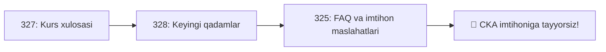

# 🎓 18-bo'lim — Kurs yakuni

CKA kursining so'nggi bo'limi: bosib o'tilgan yo'l sarhisobi, keyingi qadamlar va imtihon bo'yicha ko'p so'raladigan savollar.

## 📚 Darslar

| # | Fayl | Mavzu |
|---|---|---|
| 327 | [327_Kurs_xulosasi.md](327_Kurs_xulosasi.md) | Kurs davomida o'rganilganlar sarhisobi, qo'shimcha amaliyot manbalari |
| 328 | [328_Keyingi_qadamlar.md](328_Keyingi_qadamlar.md) | Imtihonga ro'yxatdan o'tish, keyingi o'rganish yo'llari |
| 325 | [325_FAQ_va_imtihon_maslahatlari.md](325_FAQ_va_imtihon_maslahatlari.md) | Ko'p so'raladigan savollar va rasmiy imtihon maslahatlari |

## 💡 Butun kursni yakunlash

Ushbu bo'limni o'qib bo'lgach, [17-bo'lim — Mock imtihonlar](../17_Mock_imtihonlar/README.md)ni ishlab chiqishni va so'ng haqiqiy CKA imtihoniga ro'yxatdan o'tishni tavsiya qilamiz.

## 🔗 Umumiy manbalar

- [CNCF — CKA sertifikati](https://www.cncf.io/training/certification/cka/)
- [Linux Foundation — ro'yxatdan o'tish](https://training.linuxfoundation.org/certification/certified-kubernetes-administrator-cka/)
- [CKA dastur mavzulari (Curriculum)](https://github.com/cncf/curriculum)

---
*Bu bo'lim KodeKloud CKA kursining 18-Course Conclusion bo'limi asosida o'zbek tilida tayyorlandi.*
