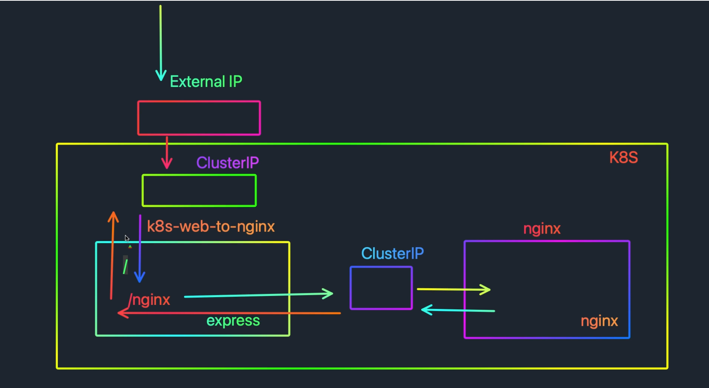

# Ikkita deployment yaratish plani
a
- bu rasmda bi 2 ta deployment yaratilganligini ko'rishimiz mumkin
1. deployment <k8s-web-to-ngnix>
2. deployment <nginx>
- shu bilan birgalikda 1 ta CluserIP servis 
- K8S clusterIP
- LoadBalancer
shu kabi xizmatlarni ishga tushirib ko'rib chiqamiz.
