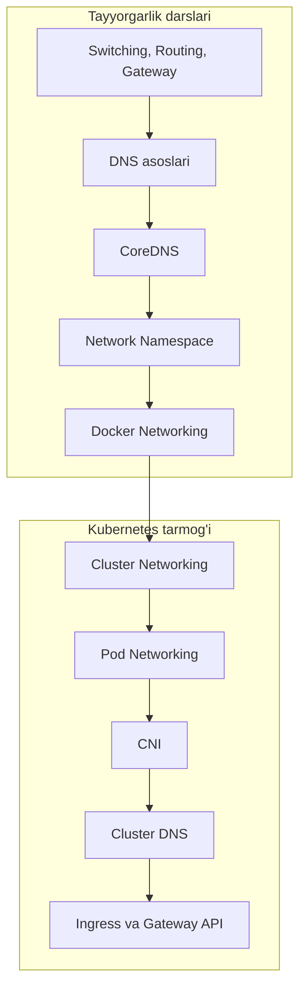

# Dars 217 — Tarmoq (Networking) bo'limiga kirish

> 🎯 **Bu darsda nimani o'rganamiz:**
> - Networking bo'limi qanday qismlardan iborat ekanini
> - Qaysi tayyorgarlik (prerequisite) darslari borligini va ular nima uchun kerakligini
> - Bo'limning to'liq yo'l xaritasini

Assalomu alaykum! Kubernetes'dagi eng qiziqarli va ayni paytda eng "qo'rqinchli" tuyuladigan mavzuga — tarmoq (networking) bo'limiga xush kelibsiz. Aslida qo'rqadigan hech narsa yo'q: biz hammasini noldan, oddiy misollar bilan boshlaymiz.

## 🏠 Oddiy o'xshatish

Kubernetes klasterini katta shaharga o'xshatsak: Pod'lar — uylar, Node'lar — mahallalar, Service'lar — ko'cha nomlari, DNS — shahar ma'lumotnoma xizmati, Ingress esa — shaharga kiraverishdagi bosh darvoza. Bu bo'limda biz ana shu shaharning "yo'llari va manzillari" qanday qurilishini o'rganamiz. Lekin shahar qurishdan oldin, avval oddiy yo'l qurishni bilish kerak — shuning uchun bo'lim Linux tarmog'i asoslaridan boshlanadi.

## Bu bo'limda nimalar bor?

Bo'lim ikki katta qismdan iborat:

**1-qism — Tayyorgarlik (prerequisite) darslari.** Kubernetes tarmog'ini tushunish uchun avval oddiy tarmoq asoslarini bilish kerak:

- Interfeys va IP manzillarni sozlash va tekshirish (`ip link`, `ip addr`)
- Gateway va route'larni sozlash (`ip route`)
- Name resolution (nom orqali manzil topish) asoslari
- Linux tizimlarida DNS sozlash (`/etc/hosts`, `/etc/resolv.conf`)
- CoreDNS bilan tanishish — DNS server'ni o'zimiz ko'taramiz
- Network namespace'lar — Docker va Kubernetes izolyatsiyani qanday qilishining zamiri
- Docker networking — Docker network namespace'lardan qanday foydalanadi

💡 Bu darslar boshlovchilar uchun mo'ljallangan va ixtiyoriy — agar Linux tarmog'ini yaxshi bilsangiz, faqat keraklilarini o'qishingiz mumkin. Lekin muallif **network namespace'lar** va **Docker networking** darslarini hammaga qat'iy tavsiya qiladi, chunki Kubernetes'dagi Pod tarmog'i aynan shu poydevor ustiga quriladi.

**2-qism — Kubernetes'dagi tarmoq.** Tayyorgarlikdan keyin asosiy mavzularga o'tamiz:

| Tartib | Mavzu | Qisqacha |
|---|---|---|
| 1 | Cluster Networking | Klaster (node'lar) darajasidagi tarmoq talablari, portlar |
| 2 | Pod Networking | Pod'lar bir-biri bilan qanday gaplashadi |
| 3 | CNI | Container Network Interface — Pod tarmog'i muammosini yechuvchi standart |
| 4 | Cluster DNS | Kubernetes DNS'ni ichida qanday amalga oshiradi (CoreDNS) |
| 5 | Ingress | Tashqi trafikni klaster ichiga kiritish |
| 6 | Gateway API | Ingress'ning zamonaviy davomchisi |

## 🗺️ Yo'l xaritasi

Diqqat qiling: mavzular bir-biriga zanjir kabi bog'langan. Network namespace'larni tushunmasangiz — Pod networking tushunarsiz bo'ladi; Pod networking'siz — CNI havoda qoladi. Shuning uchun ketma-ketlikni buzmaslikni tavsiya qilamiz.

## ❓ Savol-Javob

"Savol:" Tayyorgarlik darslarini o'tkazib yuborsam bo'ladimi?
"Javob:" Agar Linux'da IP, route, DNS sozlashni yaxshi bilsangiz — ha, to'g'ridan-to'g'ri Kubernetes qismiga o'ting. Lekin network namespace va Docker networking darslarini baribir ko'rib chiqing — Kubernetes Pod tarmog'i aynan shu tushunchalarga tayanadi.

"Savol:" Bu bo'lim uchun qanday bilimlar talab qilinadi?
"Javob:" Tizimda IP manzilni ko'rish/o'rnatish, gateway va route tushunchalari, DNS server sozlash asoslari. Bularning hammasi tayyorgarlik darslarida qisqacha berilgan.

## 📌 CKA imtihon uchun maslahat

Networking — CKA imtihonining eng katta og'irlikdagi mavzularidan biri (Services va Networking taxminan 20%). Imtihonda DNS'ni troubleshoot qilish, CNI konfiguratsiyasini topish, Service va Ingress yaratish kabi topshiriqlar keladi. Shuning uchun bu bo'limdagi buyruqlarni shunchaki o'qib emas, terminalda o'z qo'lingiz bilan bajarib mashq qiling.

## 📖 Asosiy atamalar

| Atama | Oddiy tushuntirish |
|---|---|
| Networking | Tarmoq — kompyuterlar bir-biri bilan aloqa qilish tizimi |
| Prerequisite | Tayyorgarlik darsi — asosiy mavzudan oldin bilinishi kerak bo'lgan asos |
| CNI | Container Network Interface — konteyner tarmog'i uchun standart interfeys |
| DNS | Domain Name System — nomlarni IP manzillarga aylantiruvchi xizmat |
| Ingress | Tashqi HTTP/HTTPS trafikni klaster ichiga yo'naltiruvchi obyekt |

## 🔗 Manbalar

- Kubernetes tarmoq modeli: https://kubernetes.io/docs/concepts/cluster-administration/networking/
- Services va Networking bo'limi: https://kubernetes.io/docs/concepts/services-networking/
- CKA imtihon dasturi (curriculum): https://github.com/cncf/curriculum

---
*Bu dars KodeKloud CKA kursining 217-videosi asosida tayyorlandi.*
