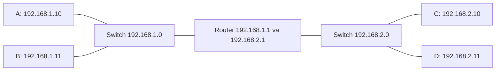
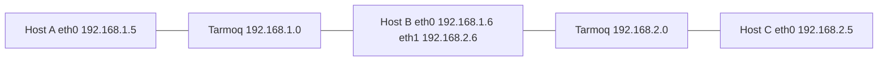

# Dars 219 — Switching, Routing va Gateway asoslari

> 🎯 **Bu darsda nimani o'rganamiz:**
> - Switch va router nima, ular qanday farq qiladi
> - `ip link`, `ip addr`, `ip route` buyruqlari bilan ishlashni
> - Default gateway nima va nima uchun kerak
> - Oddiy Linux host'ni router qilib sozlashni (`ip_forward`)

Bu dars — networking bo'limining poydevori. OSI modeli va tarmoq qatlamlari haqidagi zerikarli nazariyalarga kirmaymiz: bizga kursning qolgan qismini tushunish uchun yetarli amaliy bilim kerak, xolos. Hammasi Linux nuqtai nazaridan, ko'p buyruqlar bilan — tizim administratori va dasturchi ko'zi bilan qaraymiz, tarmoq muhandisi ko'zi bilan emas.

## 🏘️ Oddiy o'xshatish

Tasavvur qiling: **switch** — bu mahalla ichidagi ichki yo'l. Bitta mahalladagi (bitta tarmoqdagi) uylar shu yo'l orqali bemalol bir-biriga qatnaydi. **Router** esa — ikki mahallani bog'laydigan chorraha. **Gateway** — mahalladan tashqariga chiqadigan darvoza: uydan chiqib boshqa mahallaga bormoqchi bo'lsangiz, avval shu darvozadan o'tasiz.

## Switching — bitta tarmoq ichidagi aloqa

Ikkita kompyuterimiz bor: A va B (laptop, desktop yoki bulutdagi VM — farqi yo'q). A tizimi B ga qanday yetib boradi? Ikkalasini **switch**'ga ulaymiz — switch ikkala tizimni o'z ichiga olgan tarmoq hosil qiladi.

Switch'ga ulanish uchun har bir host'da **interfeys** (fizik yoki virtual) bo'lishi kerak. Host'dagi interfeyslarni ko'rish uchun `ip link` buyrug'i ishlatiladi:

```bash
ip link
```

Bizning misolda switch'ga ulanish uchun `eth0` interfeysi ishlatiladi. Tarmoq manzili `192.168.1.0` deylik. Endi ikkala tizimga shu tarmoqdan IP manzil beramiz:

```bash
# A tizimida
ip addr add 192.168.1.10/24 dev eth0

# B tizimida
ip addr add 192.168.1.11/24 dev eth0
```

Linklar ko'tarilib (up), IP manzillar berilgach, kompyuterlar switch orqali bir-biri bilan gaplasha oladi:

```bash
# A tizimidan
ping 192.168.1.11
Reply from 192.168.1.11: bytes=32 time=4ms
```

⚠️ Muhim: switch faqat **bitta tarmoq ichidagi** aloqani ta'minlaydi. U tarmoqdagi bir host'dan paket olib, xuddi shu tarmoqdagi boshqa host'ga yetkazadi — tashqariga chiqara olmaydi.

## Routing — tarmoqlarni bog'lash

Endi ikkinchi tarmoq bor deylik: `192.168.2.0` manzilida C va D tizimlari, IP'lari mos ravishda `192.168.2.10` va `192.168.2.11`. Bir tarmoqdagi tizim boshqa tarmoqdagi tizimga qanday yetib boradi? Masalan, B (`192.168.1.11`) C ga (`192.168.2.10`) qanday paket yuboradi?

Bu yerda **router** kerak bo'ladi. Router ikkita tarmoqni bir-biriga ulaydi. Uni ko'p tarmoq portlariga ega aqlli server deb tasavvur qiling. Ikkala tarmoqqa ulanganligi uchun unga ikkita IP beriladi — har bir tarmoqda bittadan:

- birinchi tarmoqda: `192.168.1.1`
- ikkinchi tarmoqda: `192.168.2.1`



## Gateway — tashqariga chiqadigan eshik

Router tarmoqda turibdi, lekin B tizimi paketni router orqali yuborish kerakligini qayerdan biladi? Axir tarmoqda boshqa qurilmalar ham ko'p bo'lishi mumkin. Buning uchun tizimlarga **gateway** (route) sozlanadi. Agar tarmoq xona bo'lsa, gateway — tashqi dunyoga, boshqa tarmoqlarga yoki internetga ochiladigan eshik.

Tizimning mavjud routing konfiguratsiyasini ko'rish:

```bash
route
Kernel IP routing table
Destination     Gateway     Genmask     Flags   Metric  Ref  Use  Iface
```

Hozircha jadval bo'sh — demak B tizimi faqat o'z tarmog'idagi (`192.168.1.0`) tizimlarga yeta oladi, C ga yeta olmaydi. B ga `192.168.2.0` tarmog'iga yo'l qo'shamiz — "u tarmoqqa `192.168.1.1` dagi eshik orqali borasan" deymiz:

```bash
ip route add 192.168.2.0/24 via 192.168.1.1
```

Endi `route` buyrug'i yangi yozuvni ko'rsatadi:

```bash
route
Kernel IP routing table
Destination     Gateway         Genmask         Flags   Iface
192.168.2.0     192.168.1.1     255.255.255.0   UG      eth0
```

⚠️ Bu sozlash **hamma tizimda** qilinishi kerak. C tizimi B ga javob qaytarishi uchun C ning routing jadvaliga ham yozuv qo'shiladi:

```bash
# C tizimida
ip route add 192.168.1.0/24 via 192.168.2.1
```

## Default gateway

Endi tizimlarga internet kerak deylik — masalan, `172.217.194.0` tarmog'idagi Google'ga. Router'ni internetga ulaymiz va routing jadvalga yangi yozuv qo'shamiz:

```bash
ip route add 172.217.194.0/24 via 192.168.1.1
```

Lekin internetda millionlab turli tarmoqlar bor. Har biriga alohida yozuv qo'shib bo'lmaydi-ku! Buning o'rniga shunday deymiz: "yo'lini bilmagan har qanday tarmoq uchun mana shu router'ni ishlatilsin" — bu **default gateway**:

```bash
ip route add default via 192.168.1.1
```

💡 `default` so'zi o'rniga `0.0.0.0` deb ham yozish mumkin — bu "har qanday IP manzil" degani, ikkalasi bir xil ma'noni beradi:

```bash
ip route add 0.0.0.0 via 192.168.1.1
```

Gateway ustunidagi `0.0.0.0` qiymati esa "gateway kerak emas" deganini bildiradi — masalan, C tizimi o'z tarmog'i `192.168.2.0` dagi qurilmalarga gateway'siz to'g'ridan-to'g'ri yetadi.

Agar tarmog'ingizda bir nechta router bo'lsa (biri internet uchun, biri ichki xususiy tarmoq uchun), har biriga alohida yozuv kerak bo'ladi:

| Destination | Gateway | Izoh |
|---|---|---|
| 192.168.2.0/24 | 192.168.1.1 | Ichki xususiy tarmoq — ichki router orqali |
| default (0.0.0.0) | 192.168.1.2 | Qolgan hamma narsa (internet) — internet router orqali |

💡 Tizimdan internetga chiqishda muammo bo'lsa — birinchi navbatda routing jadval va default gateway sozlamalarini tekshiring. Muammolarning ko'p qismi shu yerda bo'ladi.

## Linux host'ni router qilish

Endi eng qiziq qismi — oddiy Linux mashinani router sifatida sozlaymiz. Uchta host bor: A, B va C.

- A va B — `192.168.1.0` tarmog'ida
- B va C — `192.168.2.0` tarmog'ida
- B ikkala tarmoqqa ikkita interfeys bilan ulangan: `eth0` va `eth1`

IP manzillar: A — `192.168.1.5`, C — `192.168.2.5`, B esa ikkala tarmoqda — `192.168.1.6` va `192.168.2.6`.



A dan C ga ping qilsak:

```bash
# Host A da
ping 192.168.2.5
Connect: Network is unreachable
```

Sababi bizga endi tanish: A host `192.168.2.0` tarmog'iga qanday borishni bilmaydi. A ga aytamiz — "2-tarmoqqa eshik B host orqali":

```bash
# Host A da
ip route add 192.168.2.0/24 via 192.168.1.6
```

C ham A ga javob qaytara olishi uchun C ga ham xuddi shunday yozuv qo'shamiz:

```bash
# Host C da
ip route add 192.168.1.0/24 via 192.168.2.6
```

Endi ping qilsak, "network unreachable" xatosi yo'qoladi — demak route'lar to'g'ri. Lekin javob baribir kelmaydi. Nega?

### ip_forward — paketlarni o'tkazishga ruxsat

Linux'da paketlar **standart holatda bir interfeysdan boshqasiga o'tkazilmaydi** (forward qilinmaydi). Ya'ni B host'ning `eth0` iga kelgan paketlar `eth1` orqali uzatilmaydi. Bu xavfsizlik uchun shunday qilingan: masalan, `eth0` xususiy tarmoqqa, `eth1` ommaviy tarmoqqa ulangan bo'lsa, tashqaridan kimdir ichki tarmoqqa bemalol kirib kelishini xohlamaymiz.

Bizning holatda ikkala tarmoq ham xususiy, ular orasidagi aloqa xavfsiz — shuning uchun forward'ni yoqamiz. Bu sozlama quyidagi faylda turadi:

```bash
cat /proc/sys/net/ipv4/ip_forward
0
```

`0` — forward yo'q. `1` qilib qo'ysak, ping ishlaydi:

```bash
echo 1 > /proc/sys/net/ipv4/ip_forward
1
```

⚠️ **Diqqat:** bu o'zgarish reboot'dan keyin saqlanmaydi! Doimiy qilish uchun `/etc/sysctl.conf` faylida ham o'zgartiring:

```bash
# /etc/sysctl.conf faylida
net.ipv4.ip_forward = 1
```

## Darsning asosiy buyruqlari

| Buyruq | Vazifasi |
|---|---|
| `ip link` | Host'dagi interfeyslarni ko'rish va boshqarish |
| `ip addr` | Interfeyslarga berilgan IP manzillarni ko'rish |
| `ip addr add 192.168.1.10/24 dev eth0` | Interfeysga IP manzil berish |
| `ip route` yoki `route` | Routing jadvalini ko'rish |
| `ip route add 192.168.1.0/24 via 192.168.2.1` | Routing jadvaliga yozuv qo'shish |
| `cat /proc/sys/net/ipv4/ip_forward` | IP forwarding yoqilganini tekshirish |

⚠️ `ip` buyruqlari bilan qilingan o'zgarishlar faqat restart'gacha amal qiladi. Doimiy saqlash uchun ularni tarmoq interfeyslari konfiguratsiya fayliga (network interfaces file) yozish kerak.

## ❓ Savol-Javob

"Savol:" Switch bilan router'ning farqi nimada?
"Javob:" Switch bitta tarmoq ichidagi host'larni bog'laydi va faqat shu tarmoq ichida paket uzatadi. Router esa ikki yoki undan ortiq turli tarmoqlarni bir-biriga ulaydi va har bir tarmoqda o'z IP manziliga ega bo'ladi.

"Savol:" Default gateway nima va qachon ishlatiladi?
"Javob:" Routing jadvalda aniq yo'li ko'rsatilmagan har qanday manzilga trafik default gateway orqali yuboriladi. Oddiy tarmoqda bitta `default via <router-IP>` yozuvining o'zi yetarli.

"Savol:" Route'lar to'g'ri, lekin Linux router orqali ping o'tmayapti. Nima qilish kerak?
"Javob:" `/proc/sys/net/ipv4/ip_forward` faylini tekshiring — `0` bo'lsa, paketlar interfeyslar orasida uzatilmaydi. `1` qiling va doimiy bo'lishi uchun `/etc/sysctl.conf` ga yozing.

## 📌 CKA imtihon uchun maslahat

Imtihonda to'g'ridan-to'g'ri "router sozlang" degan topshiriq kelmaydi, lekin `ip link`, `ip addr`, `ip route` buyruqlari klaster tarmog'ini tekshirish (troubleshooting) savollarida doim ishlatiladi: node'ning interfeysini, Pod tarmog'i route'larini, default gateway'ni topish kabi. Bu uch buyruqni yoddan biling.

## 📖 Asosiy atamalar

| Atama | Oddiy tushuntirish |
|---|---|
| Switch | Bitta tarmoq ichidagi qurilmalarni bog'lovchi qurilma |
| Router | Turli tarmoqlarni bir-biriga ulovchi qurilma |
| Gateway | Tarmoqdan tashqariga chiqish "eshigi" — odatda router'ning IP manzili |
| Default gateway | Yo'li noma'lum barcha manzillar uchun ishlatiladigan gateway |
| Routing table | Kernel'ning "qaysi tarmoqqa qaysi eshik orqali borish" jadvali |
| Interface (interfeys) | Host'ning tarmoqqa ulanish nuqtasi (masalan eth0) |
| ip_forward | Linux'da paketlarni bir interfeysdan boshqasiga o'tkazish ruxsati |

## 🔗 Manbalar

- Kubernetes klaster tarmog'i: https://kubernetes.io/docs/concepts/cluster-administration/networking/
- `ip` buyrug'i qo'llanmasi (man page): https://man7.org/linux/man-pages/man8/ip.8.html
- `ip-route` qo'llanmasi: https://man7.org/linux/man-pages/man8/ip-route.8.html
- Linux kernel IP sysctl hujjati (ip_forward): https://www.kernel.org/doc/Documentation/networking/ip-sysctl.txt

---
*Bu dars KodeKloud CKA kursining 219-videosi asosida tayyorlandi.*
