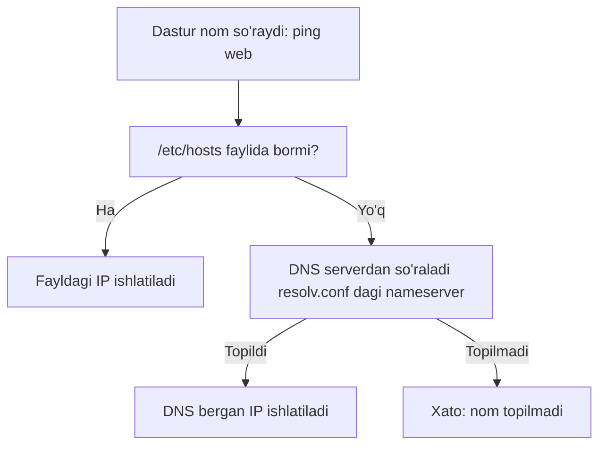
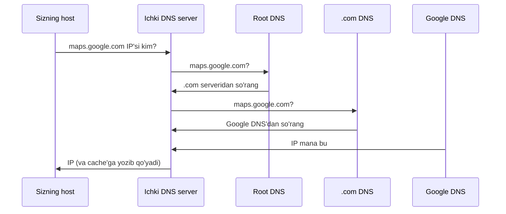

# Dars 220 — DNS asoslari (Linux'da name resolution)

> 🎯 **Bu darsda nimani o'rganamiz:**
> - `/etc/hosts` fayli va name resolution nima ekanini
> - `/etc/resolv.conf` orqali DNS server sozlashni
> - Search domain va domen nomlari tuzilishini
> - A, AAAA, CNAME record turlari hamda `nslookup` va `dig` vositalarini

Bu dars — Linux'da DNS bilan endi tanishayotganlar uchun. Asosiy tushunchalarni ko'ramiz va host'dagi DNS konfiguratsiyasini o'rganishga yordam beradigan buyruqlar bilan ishlaymiz.

## 📱 Oddiy o'xshatish

DNS — bu telefoningizdagi kontaktlar kitobi. Do'stingizga qo'ng'iroq qilish uchun uning raqamini yodlab yurmaysiz — ismini bosasiz, telefon raqamni o'zi topadi. Tarmoqda ham shunday: `db` yoki `google.com` deb yozasiz, tizim uning IP manzilini o'zi topib beradi. `/etc/hosts` — cho'ntagingizdagi shaxsiy kichik daftarcha, DNS server esa — butun tashkilot foydalanadigan markaziy ma'lumotnoma.

## /etc/hosts — eng oddiy yechim

Ikkita kompyuter bor: A va B, bitta tarmoqda, IP'lari `192.168.1.10` va `192.168.1.11`. IP orqali bir-birini ping qila oladi. B tizimida ma'lumotlar bazasi ishlaydi, shuning uchun uning IP'sini yodlab yurmasdan, unga `db` degan nom bermoqchimiz.

Hozir `ping db` desak, A tizimi bunday nomni tanimaydi. Buni tuzatish uchun A tizimidagi `/etc/hosts` fayliga yozuv qo'shamiz — "men `db` desam, `192.168.1.11` ni nazarda tutaman":

```bash
# Host A da: /etc/hosts
192.168.1.11    db
```

Endi ping ishlaydi:

```bash
ping db
PING db (192.168.1.11) 56(84) bytes of data.
64 bytes from db (192.168.1.11): icmp_seq=1 ttl=64 time=0.052 ms
```

⚠️ **Muhim nuqta:** A host `/etc/hosts` faylidagi yozuvga ko'r-ko'rona ishonadi — bu uning uchun haqiqat manbai. A tizimi B ning haqiqiy nomi `db` ekanini tekshirmaydi. Masalan, B tizimida `hostname` buyrug'ini bersak, uning asl nomi `host-2` ekani chiqadi — lekin A uchun bu ahamiyatsiz, u faylga qaraydi.

Hatto A ni "B tizimi — bu Google" deb aldash ham mumkin:

```bash
# Host A da: /etc/hosts
192.168.1.11    db
192.168.1.11    www.google.com
```

Endi `ping www.google.com` desangiz, javob B tizimidan keladi! Bitta tizimga istagancha nom berish mumkin, faylga istagancha server yozish mumkin.

Har safar A host'dan boshqa host'ga nom orqali murojaat qilganda — `ping`, `ssh` yoki istalgan dastur orqali — tizim `/etc/hosts` fayliga qarab IP manzilni topadi. Nomni IP manzilga aylantirish jarayoni **name resolution** deyiladi.

## DNS server — markaziy yechim

Bir nechta tizimli kichik tarmoqda `/etc/hosts` bilan bemalol yashash mumkin — ilgari shunday qilingan ham. Lekin muhit kattalashgach fayllar to'lib-toshadi va boshqarish og'irlashadi: bitta serverning IP'si o'zgarsa, **hamma** host'dagi faylni yangilash kerak!

Shuning uchun barcha yozuvlarni bitta markaziy serverga ko'chiramiz — bu **DNS server**. Endi hamma host nom so'raganda o'z faylidan emas, shu serverdan so'raydi.

DNS serverimiz `192.168.1.100` da deylik. Har bir host'da DNS sozlamalari `/etc/resolv.conf` faylida turadi. Unga DNS server manzilini yozamiz:

```bash
# /etc/resolv.conf
nameserver 192.168.1.100
```

Shu bilan tamom. Endi host o'zi bilmagan nomga duch kelsa, DNS serverdan so'raydi. Biror host'ning IP'si o'zgarsa — faqat DNS serverni yangilaysiz, hamma host darhol yangi manzilni oladi.

💡 DNS server bo'lsa ham `/etc/hosts` dan foydalanish mumkin. Masalan, faqat o'zingiz uchun test-server ko'targan bo'lsangiz, uni DNS serverga qo'shib o'tirmasdan, o'z host'ingizdagi `/etc/hosts` ga yozib qo'yasiz — siz uni nom bilan topasiz, boshqalar esa yo'q.

### Qaysi biri birinchi: /etc/hosts yoki DNS?

Ikkala joyda ham yozuv bo'lsa-chi? Masalan, lokal faylda `test` → `192.168.1.115`, DNS serverda esa `test` → `192.168.1.116`. Standart holatda host **avval lokal `/etc/hosts` faylga**, keyin DNS serverga qaraydi. Lokal faylda topilsa — o'sha ishlatiladi. Bizning misolda `test` `192.168.1.115` ga resolve bo'ladi.

Bu tartib `/etc/nsswitch.conf` faylidagi `hosts` qatorida belgilanadi:

```bash
cat /etc/nsswitch.conf
...
hosts:    files dns
...
```

`files` — `/etc/hosts` fayli, `dns` — DNS server. Tartibni shu qatorni o'zgartirib almashtirish mumkin.



### Tashqi nomlar va forwarding

Ikkala ro'yxatda ham yo'q nomni ping qilsak-chi? Masalan `facebook.com` — u na `/etc/hosts` da, na ichki DNS serverimizda bor. Natija — xato.

Yechimlardan biri: `resolv.conf` ga Facebook'ni biladigan yana bitta nameserver qo'shish. Masalan, `8.8.8.8` — Google'ning mashhur ommaviy DNS serveri, internetdagi barcha saytlarni biladi:

```bash
# /etc/resolv.conf
nameserver 192.168.1.100
nameserver 8.8.8.8
```

Lekin buni har bir host'da sozlash kerak bo'ladi. Undan ko'ra yaxshiroq yo'l: **ichki DNS serverning o'zini** noma'lum nomlarni ommaviy nameserver'ga forward qiladigan qilib sozlash. Shunda hamma host bitta ichki DNS server orqali `facebook.com` ga ham yeta oladi.

## Domen nomlari tuzilishi

Hozirgacha host'larni `web`, `db`, `nfs` kabi qisqa nomlar bilan chaqirdik. `www.facebook.com` esa — **domen nomi**. Nuqtalar bilan ajratilgan bu format o'xshash narsalarni guruhlash uchun ishlatiladi.

`www.google.com` misolida:

| Qism | Nomi | Izoh |
|---|---|---|
| `.` (oxirgi ko'rinmas nuqta) | Root | Hamma narsa shu yerdan boshlanadi |
| `.com` | Top Level Domain (TLD) | Sayt maqsadini bildiradi |
| `google` | Domen nomi | Google'ga berilgan nom |
| `www` | Subdomain | Google ichida yana bir guruhlash |

TLD'lar sayt maqsadini bildiradi: `.com` — tijorat/umumiy, `.net` — tarmoq, `.edu` — ta'lim, `.org` — notijorat tashkilotlar.

Subdomain'lar xizmatlarni guruhlaydi: `maps.google.com` — xaritalar, `drive.google.com` — fayl saqlash, `mail.google.com` — pochta. Har birini yana o'z ichida bo'laklash mumkin — daraxt tuzilishi hosil bo'ladi.

### So'rov qanday yo'l bosadi?

Tashkilot ichidan `maps.google.com` ga murojaat qilsangiz, so'rov avval **tashkilotingizning ichki DNS serveriga** boradi. U bu nomni bilmaydi va so'rovni internetga forward qiladi. Internetda IP bir nechta DNS server yordamida bosqichma-bosqich topiladi: root DNS → `.com` DNS → Google'ning DNS serveri, va oxirgisi `maps` ilovasining IP'sini beradi.



💡 Keyingi so'rovlar tez bo'lishi uchun ichki DNS server bu IP'ni ma'lum vaqtga (odatda bir necha soniyadan bir necha daqiqagacha) **cache**'da saqlaydi — har safar butun zanjirni yurib chiqmaydi.

Tashkilot ichida ham xuddi shunday tuzilish bo'lishi mumkin: `mycompany.com` va uning subdomain'lari — `www.mycompany.com` (tashqi sayt), `mail.mycompany.com` (pochta), `drive.mycompany.com` (fayllar), `pay.mycompany.com` (ish haqi), `hr.mycompany.com` (kadrlar). Bularning hammasi ichki DNS serverda sozlanadi.

## Search domain

Endi `resolv.conf` dagi yana bir muhim yozuvni tushunish mumkin. Ichki DNS'da server `web.mycompany.com` deb yozilgan bo'lsa, oddiy `ping web` ishlamay qoladi — serverda `web` degan yozuv yo'q, `web.mycompany.com` bor.

Tashqaridagilar to'liq nom ishlatishi to'g'ri, lekin kompaniya ichida o'z serverimizni qisqa nom bilan chaqirgimiz keladi — xuddi oila a'zolarini faqat ismi bilan chaqirganday. Buning uchun `resolv.conf` ga **search** yozuvi qo'shiladi:

```bash
# /etc/resolv.conf
nameserver 192.168.1.100
search mycompany.com
```

Endi `ping web` desangiz, tizim avtomatik `web.mycompany.com` ni sinab ko'radi:

```bash
ping web
PING web.mycompany.com (192.168.1.10) 56(84) bytes of data.
```

Host aqlli: agar so'rovda domenni o'zingiz to'liq yozsangiz (`ping web.mycompany.com`), search domain qayta qo'shilmaydi. Bir nechta search domain berish ham mumkin:

```bash
search mycompany.com prod.mycompany.com
```

Bu holda host nomni topguncha barcha domenlarni birma-bir sinab chiqadi.

## Record turlari

DNS serverda yozuvlar qanday saqlanadi? Asosiy turlar:

| Record turi | Nima saqlaydi | Misol |
|---|---|---|
| **A** | Nom → IPv4 manzil | `web-server` → `192.168.1.1` |
| **AAAA** (quad-A) | Nom → IPv6 manzil | `web-server` → `2001:0db8::...` |
| **CNAME** | Nom → boshqa nom (alias) | `eat.web-server`, `hungry.web-server` → `food.web-server` |

CNAME bitta ilovaga bir nechta taxallus (alias) berishda ishlatiladi: masalan, ovqat yetkazish xizmatiga `eat` yoki `hungry` nomlari bilan ham kirish mumkin bo'lsin desangiz. Record turlari bundan ko'p, lekin hozircha shulari yetarli.

## nslookup va dig

`ping` — DNS'ni tekshirish uchun har doim ham to'g'ri vosita emas. Maxsus vositalar bor.

**nslookup** — nomni DNS serverdan so'rab tekshiradi:

```bash
nslookup www.google.com
Server:         192.168.1.100
Address:        192.168.1.100#53

Non-authoritative answer:
Name:   www.google.com
Address: 172.217.194.99
```

⚠️ **Esda tuting:** `nslookup` lokal `/etc/hosts` faylini **hisobga olmaydi** — faqat DNS serverdan so'raydi. `/etc/hosts` ga yozib qo'ygan nomingizni `nslookup` topa olmaydi; yozuv DNS serverda bo'lishi shart.

**dig** — xuddi shunday, lekin ko'proq tafsilot beradi, javobni serverda saqlangandagi ko'rinishga yaqin formatda ko'rsatadi:

```bash
dig www.google.com

;; QUESTION SECTION:
;www.google.com.            IN      A

;; ANSWER SECTION:
www.google.com.     245     IN      A       172.217.194.99
```

`dig` ham `/etc/hosts` ni e'tiborga olmaydi — faqat DNS server bilan ishlaydi.

## ❓ Savol-Javob

"Savol:" Host nomni resolve qilishda avval qayerga qaraydi — `/etc/hosts` gami yoki DNS servergami?
"Javob:" Standart holatda avval `/etc/hosts` ga, topilmasa DNS serverga. Bu tartib `/etc/nsswitch.conf` faylidagi `hosts: files dns` qatorida belgilanadi va o'zgartirilishi mumkin.

"Savol:" `/etc/hosts` ga yozuv qo'shdim, lekin `nslookup` uni topmayapti. Nega?
"Javob:" `nslookup` (va `dig`) lokal `/etc/hosts` faylini o'qimaydi — ular faqat DNS serverga so'rov yuboradi. Lokal yozuvni tekshirish uchun `ping` yoki `getent hosts` ishlating.

"Savol:" Search domain nima beradi?
"Javob:" `/etc/resolv.conf` dagi `search mycompany.com` yozuvi tufayli `ping web` avtomatik `web.mycompany.com` ga aylanadi — qisqa nom bilan ishlash imkoni tug'iladi.

"Savol:" A record bilan CNAME record farqi nimada?
"Javob:" A record nomni IPv4 manzilga bog'laydi, CNAME esa nomni boshqa nomga (alias) bog'laydi. IPv6 uchun AAAA record ishlatiladi.

## 📌 CKA imtihon uchun maslahat

Kubernetes klasterida DNS muammolarini troubleshoot qilishda aynan shu bilimlar kerak bo'ladi: Pod ichidagi `/etc/resolv.conf` da nameserver (CoreDNS Service IP'si) va search domain'lar (`default.svc.cluster.local svc.cluster.local cluster.local`) turadi. `nslookup` — imtihonda Service DNS nomlarini tekshirishning asosiy vositasi. Shu darsdagi tushunchalarni puxta o'zlashtiring — Kubernetes DNS darsi shular ustiga quriladi.

## 📖 Asosiy atamalar

| Atama | Oddiy tushuntirish |
|---|---|
| Name resolution | Nomni IP manzilga aylantirish jarayoni |
| /etc/hosts | Host'dagi lokal nom → IP jadval fayli |
| /etc/resolv.conf | DNS server manzili (nameserver) va search domain sozlanadigan fayl |
| /etc/nsswitch.conf | Nom qidirish tartibini (files/dns) belgilaydigan fayl |
| Nameserver | Nomlarni IP'ga aylantirib beruvchi DNS server |
| Search domain | Qisqa nomga avtomatik qo'shiladigan domen qo'shimchasi |
| TLD | Top Level Domain — .com, .net, .edu, .org kabi yuqori daraja domenlar |
| A / AAAA / CNAME | Record turlari: IPv4 / IPv6 / alias |
| nslookup, dig | DNS'ni tekshirish vositalari (lokal hosts faylni o'qimaydi) |
| Cache | Tez-tez so'raladigan javoblarni vaqtincha saqlash |

## 🔗 Manbalar

- Kubernetes'da Service va Pod'lar uchun DNS: https://kubernetes.io/docs/concepts/services-networking/dns-pod-service/
- Kubernetes DNS debugging qo'llanmasi: https://kubernetes.io/docs/tasks/administer-cluster/dns-debugging-resolution/
- resolv.conf man page: https://man7.org/linux/man-pages/man5/resolv.conf.5.html
- nsswitch.conf man page: https://man7.org/linux/man-pages/man5/nsswitch.conf.5.html

---
*Bu dars KodeKloud CKA kursining 220-videosi asosida tayyorlandi.*
