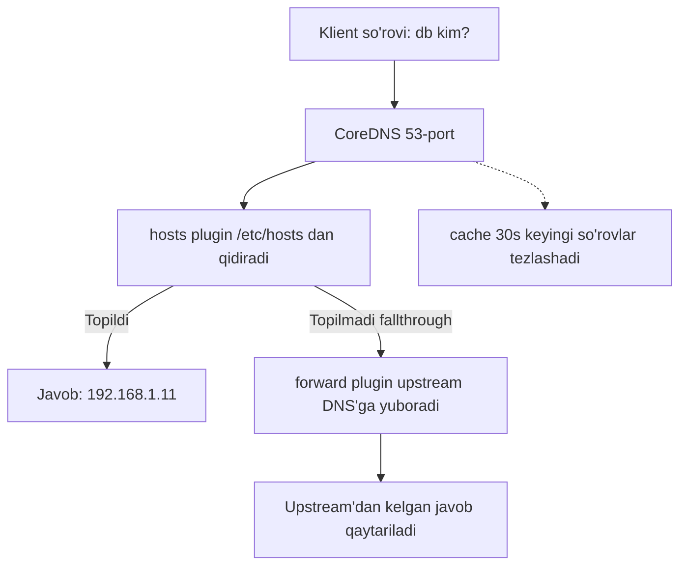

# Dars 221 — CoreDNS asoslari (DNS server ko'tarish)

> 🎯 **Bu darsda nimani o'rganamiz:**
> - Oddiy host'ni DNS server qilib sozlashni
> - CoreDNS'ni yuklab olish va ishga tushirishni
> - Corefile konfiguratsiyasi va hosts plugin'ini

Oldingi darsda DNS server nima uchun kerakligini ko'rdik: ko'p hostname va IP'li katta muhitlarda name resolution'ni markazlashtirib boshqarish va host'larni DNS serverga yo'naltirish. Endi masalaning ikkinchi tomoniga o'tamiz — **host'ning o'zini DNS server qilib sozlaymiz**.

## 📒 Oddiy o'xshatish

Oldingi darsda har bir kompyuter o'z cho'ntak daftarchasiga (`/etc/hosts`) manzillarni yozib yurardi. CoreDNS o'rnatish — bu mahallada bitta ma'lumotnoma idorasini ochish degani: hamma o'z daftarchasini tashlab, savolini shu idoraga beradi. Corefile esa — o'sha idora xodimining ish yo'riqnomasi: "manzillarni qaysi kitobdan qara, bilmaganingni kimdan so'ra".

## Vazifa

Bizga DNS server sifatida ajratilgan bitta server va unga kiritilishi kerak bo'lgan IP → hostname ro'yxati berilgan. DNS server yechimlari juda ko'p (BIND, dnsmasq, PowerDNS...), biz shulardan biri — **CoreDNS** bilan ishlaymiz. Nega aynan CoreDNS? Chunki keyinroq ko'ramiz: Kubernetes ham klaster ichidagi DNS uchun aynan CoreDNS'ni ishlatadi.

## CoreDNS'ni o'rnatish

CoreDNS binary'larini ularning GitHub releases sahifasidan yoki Docker image sifatida olish mumkin. Biz an'anaviy yo'ldan boramiz — binary'ni yuklab olamiz va arxivdan chiqaramiz:

```bash
curl -LO https://github.com/coredns/coredns/releases/download/v1.12.4/coredns_1.12.4_linux_amd64.tgz
tar -zxf coredns_1.12.4_linux_amd64.tgz
```

Natijada `coredns` nomli bajariladigan fayl (executable) paydo bo'ladi. Uni ishga tushiramiz:

```bash
./coredns
```

Shu bilan DNS server ishlay boshladi! CoreDNS standart holatda **53-portda** tinglaydi — bu DNS uchun standart port.

## Corefile — CoreDNS konfiguratsiyasi

Lekin hozircha serverimiz hech qanday IP → hostname mapping'ni bilmaydi — biz unga hali hech narsa bermadik. Buning uchun konfiguratsiya kerak. Bir necha usul bor, biz eng soddasini ko'ramiz:

1. Barcha yozuvlarni DNS serverning o'zidagi `/etc/hosts` fayliga yozamiz:

```bash
# DNS serverdagi /etc/hosts
192.168.1.10    web
192.168.1.11    db
192.168.1.15    web-1
192.168.1.16    db-1
```

2. CoreDNS'ga "shu fayldan foydalan" deymiz. CoreDNS o'z konfiguratsiyasini **Corefile** nomli fayldan yuklaydi:

```bash
# Corefile
.:53 {
    # Hostname'larni /etc/hosts orqali resolve qilish
    hosts /etc/hosts {
        reload 1m
        fallthrough
    }
    # Topilmagan so'rovlarni host'ning resolver'iga forward qilish
    forward . /etc/resolv.conf {
       max_concurrent 1000
    }
    cache 30
    log
    errors
}
```

Endi serverni qayta ishga tushirsak, u IP va nomlarni serverdagi `/etc/hosts` faylidan olib xizmat qiladi.

### Corefile'ni qatorma-qator tushunamiz

| Qator | Ma'nosi |
|---|---|
| `.:53` | Barcha domenlar (`.` — root) uchun 53-portda tinglash |
| `hosts /etc/hosts` | **hosts plugin**: yozuvlarni `/etc/hosts` faylidan olish |
| `reload 1m` | Faylni har 1 daqiqada qayta o'qish — yangi yozuvlar avtomatik ilinadi |
| `fallthrough` | Fayldan topilmasa, so'rovni keyingi plugin'ga (forward'ga) uzatish |
| `forward . /etc/resolv.conf` | Topilmagan so'rovlarni host'ning o'z resolver'iga (upstream DNS'ga) yuborish |
| `max_concurrent 1000` | Bir vaqtda ko'pi bilan 1000 ta parallel forward so'rovi |
| `cache 30` | Javoblarni 30 soniya cache'da saqlash |
| `log` | Har bir so'rovni log'ga yozish |
| `errors` | Xatolarni log'ga yozish |



💡 E'tibor bering: oldingi darsda aytilgan "ichki DNS server noma'lum nomlarni ommaviy DNS'ga forward qilsin" g'oyasi aynan shu `forward` plugin'i orqali amalga oshadi. `/etc/hosts` da yo'q nom (masalan `facebook.com`) upstream serverdan so'raladi.

## Plugin'lar — CoreDNS'ning kuchi

CoreDNS'ning butun arxitekturasi **plugin'lar** ustiga qurilgan: `hosts`, `forward`, `cache`, `log`, `errors` — bularning har biri alohida plugin. DNS yozuvlarini sozlashning boshqa yo'llari ham plugin'lar orqali ishlaydi.

💡 **Eng muhimi:** CoreDNS'ning `kubernetes` degan maxsus plugin'i bor — Kubernetes klasterida Service va Pod nomlarini resolve qilish aynan shu plugin orqali ishlaydi. Uni keyingi bo'limlarda, "DNS in Kubernetes" darslarida batafsil ko'ramiz. Hozir Corefile mantig'ini tushunib olganingiz — o'sha darslar uchun tayyor poydevor.

## 🧪 Mustaqil topshiriqlar

> Yechishdan oldin darsni yopib qo'ying. Taxminiy vaqt: 15 daqiqa.

**1-topshiriq · oson.** CoreDNS'ning Corefile konfiguratsiyasini klasteringizdan chiqaring.

<details><summary>O'zingizni tekshiring</summary>

```bash
kubectl -n kube-system get configmap coredns -o jsonpath='{.data.Corefile}'
```
</details>

**2-topshiriq · o'rta.** CoreDNS pod'larining loglarini ko'ring va DNS so'rovlari kelayotganini tekshiring.

<details><summary>O'zingizni tekshiring</summary>

```bash
kubectl -n kube-system logs -l k8s-app=kube-dns --tail=20
```
</details>

**3-topshiriq · qiyin.** Corefile'ga `log` plaginini qo'shing. **Avval ayting:** o'zgarish darrov
kuchga kiradimi?

<details><summary>O'zingizni tekshiring</summary>

```bash
kubectl -n kube-system edit configmap coredns
# Corefile ichiga `log` qatorini qo'shing
kubectl -n kube-system rollout restart deployment coredns
```

**Darrov emas.** ConfigMap o'zgarishi Pod ichidagi faylga bir necha
o'nlab soniyada yetib boradi, CoreDNS esa uni qayta o'qishi uchun
qayta ishga tushishi kerak.
</details>

## ❓ Savol-Javob

"Savol:" CoreDNS qaysi portda ishlaydi?
"Javob:" Standart holatda 53-portda — bu DNS xizmati uchun umumiy standart port. Corefile'dagi `.:53` yozuvi ham shuni bildiradi.

"Savol:" CoreDNS yozuvlarni qayerdan oladi?
"Javob:" Corefile'da qaysi plugin sozlangan bo'lsa, o'sha yerdan. Bizning misolda `hosts` plugin'i orqali serverdagi `/etc/hosts` faylidan. Kubernetes'da esa `kubernetes` plugin'i orqali klaster obyektlaridan.

"Savol:" `/etc/hosts` da bo'lmagan nom so'ralsa nima bo'ladi?
"Javob:" `fallthrough` tufayli so'rov `forward` plugin'iga o'tadi va u so'rovni `/etc/resolv.conf` dagi upstream DNS serverga yuboradi. Shunday qilib server ichki nomlarni o'zi, tashqi nomlarni upstream orqali resolve qiladi.

## 📌 CKA imtihon uchun maslahat

Imtihonda CoreDNS'ni qo'lda binary'dan o'rnatish so'ralmaydi — Kubernetes'da u Deployment sifatida allaqachon ishlab turadi. Lekin Corefile'ni o'qiy olish shart: klasterda u `kube-system` namespace'dagi ConfigMap'da saqlanadi (`kubectl get configmap coredns -n kube-system -o yaml`). DNS muammolarini troubleshoot qilishda Corefile'dagi `forward`, `kubernetes` plugin sozlamalarini tekshirish tez-tez kerak bo'ladi.

## 📖 Asosiy atamalar

| Atama | Oddiy tushuntirish |
|---|---|
| CoreDNS | Plugin'larga asoslangan zamonaviy DNS server; Kubernetes'ning standart DNS yechimi |
| Corefile | CoreDNS'ning konfiguratsiya fayli |
| Plugin | CoreDNS'ga muayyan qobiliyat qo'shuvchi modul (hosts, forward, cache...) |
| hosts plugin | Yozuvlarni /etc/hosts uslubidagi fayldan oluvchi plugin |
| forward | Topilmagan so'rovlarni boshqa (upstream) DNS serverga yuborish |
| fallthrough | Plugin javob topa olmasa, so'rovni keyingi plugin'ga o'tkazish |
| Upstream DNS | Yuqori turuvchi DNS server — bilmagan narsani undan so'raymiz |

## 🔗 Manbalar

- CoreDNS rasmiy sayti va plugin'lar ro'yxati: https://coredns.io/plugins/
- CoreDNS kubernetes plugin'i: https://coredns.io/plugins/kubernetes/
- Kubernetes DNS spetsifikatsiyasi: https://github.com/kubernetes/dns/blob/master/docs/specification.md
- Kubernetes'da CoreDNS'dan foydalanish: https://kubernetes.io/docs/tasks/administer-cluster/coredns/
- CoreDNS releases (yuklab olish): https://github.com/coredns/coredns/releases

---
*Bu dars KodeKloud CKA kursining 221-materiali asosida tayyorlandi.*
