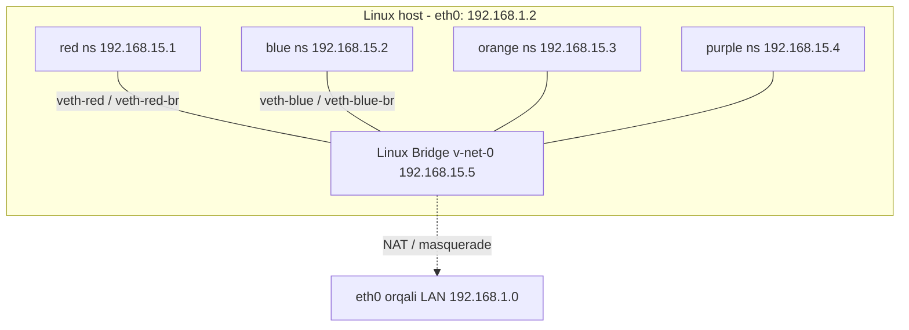
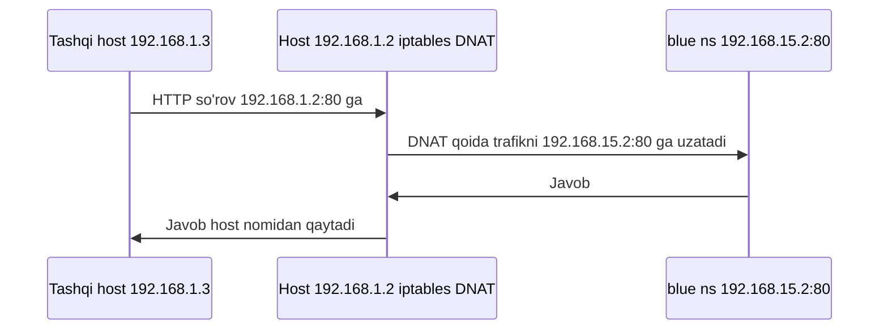

# Dars 222 — Network Namespace'lar

> 🎯 **Bu darsda nimani o'rganamiz:**
> - Namespace nima va konteynerlar undan qanday foydalanishini
> - `ip netns` bilan network namespace yaratish va boshqarishni
> - veth juftliklar va Linux bridge orqali namespace'larni ulashni
> - NAT va port forwarding orqali tashqi dunyo bilan bog'lanishni

Bu dars — butun bo'limning eng muhim tayyorgarlik darsi. Docker ham, Kubernetes'dagi Pod tarmog'i ham aynan shu yerda ko'radigan tushunchalar ustiga qurilgan. Linux'da network namespace'lar Docker kabi konteynerlar tomonidan tarmoq izolyatsiyasini amalga oshirish uchun ishlatiladi.

## 🏠 Oddiy o'xshatish

Host — bu sizning uyingiz, namespace'lar esa — har bir farzandga ajratilgan xonalar. Xona har bir bolaga shaxsiy makon beradi: bola faqat o'z xonasidagini ko'radi va o'zini uyda yolg'iz yashayapman deb o'ylaydi. Ota-ona esa uydagi barcha xonalarni ko'ra oladi va xohlasa, ikki xona orasida eshik ochib berishi ham mumkin. Konteyner yaratilganda unga ana shunday "alohida xona" — namespace ajratiladi.

## Namespace va konteynerlar

Konteyner yaratilganda uni izolyatsiya qilishni xohlaymiz: u host'dagi boshqa protsesslarni ham, boshqa konteynerlarni ham ko'rmasligi kerak. Buning uchun host'da unga namespace orqali "maxsus xona" yaratiladi. Konteyner faqat o'zi ishga tushirgan protsesslarni ko'radi va o'zini alohida host'da deb hisoblaydi. Host esa hamma narsani — jumladan konteyner ichidagi protsesslarni ham — ko'radi.

Buni amalda ko'rish mumkin: konteyner **ichida** protsesslarni listlasangiz, PID'i 1 bo'lgan bitta protsess ko'rinadi. Xuddi shu protsesslarni host'dan root sifatida listlasangiz, u boshqa protsesslar qatorida, lekin **boshqa PID bilan** ko'rinadi. Bir xil protsess ichkarida va tashqarida turli PID'larda ishlaydi — namespace shunday ishlaydi.

Tarmoqda ham xuddi shunday: host'ning LAN'ga ulanadigan o'z interfeyslari, o'z routing va ARP jadvallari bor. Bu tafsilotlarni konteynerdan yashirish uchun konteyner yaratilganda unga **network namespace** yaratiladi — o'z namespace'i ichida u host tarmog'i haqida hech narsa ko'rmaydi va o'zining virtual interfeyslari, routing hamda ARP jadvallariga ega bo'la oladi.

## Network namespace yaratish — ip netns

Yangi network namespace yaratish:

```bash
ip netns add red
ip netns add blue
```

Ro'yxatni ko'rish:

```bash
ip netns
red
blue
```

Host'dagi interfeyslar:

```bash
ip link
1: lo: <LOOPBACK,UP,LOWER_UP> ...
2: eth0: <BROADCAST,MULTICAST,UP,LOWER_UP> ...
```

Xuddi shu buyruqni namespace **ichida** bajarish uchun uni `ip netns exec <nom>` bilan prefikslaymiz:

```bash
ip netns exec red ip link
1: lo: <LOOPBACK> ...
```

Ikkinchi, qisqaroq usul — `ip` buyrug'iga `-n` opsiyasini qo'shish (faqat `ip` buyrug'ining o'zi uchun ishlaydi):

```bash
ip -n red link
1: lo: <LOOPBACK> ...
```

Ko'rib turganingizdek, namespace ichida faqat loopback interfeysi bor — host'ning `eth0` interfeysi ko'rinmaydi. Izolyatsiya ishladi! ARP va routing jadvallari ham shunday: host'da `arp` va `route` buyruqlari yozuvlar ko'rsatadi, namespace ichida esa bo'sh:

```bash
ip netns exec red arp
ip netns exec red route
```

## Ikkita namespace'ni ulash — veth juftlik

Hozircha namespace'larimizda hech qanday tarmoq aloqasi yo'q: o'z interfeyslari yo'q, host tarmog'ini ham ko'rmaydi. Avval namespace'larni **bir-biriga** ulaymiz.

Ikkita fizik mashinani kabel bilan ulaganday, ikki namespace'ni **virtual Ethernet juftlik** (veth pair) — ikki uchida ikkita interfeysi bo'lgan "virtual kabel" bilan ulash mumkin (uni pipe deb ham atashadi).

```bash
# Virtual kabel yaratamiz: ikki uchi veth-red va veth-blue
ip link add veth-red type veth peer name veth-blue

# Har bir uchni o'z namespace'iga biriktiramiz
ip link set veth-red netns red
ip link set veth-blue netns blue

# Har bir namespace ichida IP beramiz
ip -n red addr add 192.168.15.1/24 dev veth-red
ip -n blue addr add 192.168.15.2/24 dev veth-blue

# Interfeyslarni ko'taramiz
ip -n red link set veth-red up
ip -n blue link set veth-blue up
```

Endi namespace'lar bir-biriga yetadi:

```bash
ip netns exec red ping 192.168.15.2
64 bytes from 192.168.15.2: icmp_seq=1 ttl=64 time=0.05 ms
```

Red namespace'ning ARP jadvaliga qarasak, u blue qo'shnisini (`192.168.15.2`) MAC manzili bilan tanib olganini ko'ramiz; blue'da ham red haqidagi yozuv paydo bo'ladi. Host'ning ARP jadvali esa bu yangi namespace'lar va interfeyslar haqida **hech narsa bilmaydi**.

## Ko'p namespace'lar — Linux bridge

Ikkita namespace'da veth kabel yetarli edi. Ular ko'payib ketsa-chi? Hammasini bir-biri bilan gaplashtirish uchun — xuddi fizik dunyodagidek — host **ichida virtual tarmoq** quramiz. Tarmoq uchun switch kerak, virtual tarmoq uchun — **virtual switch**. Yechimlar bir nechta: Linux'ning o'zidagi **Linux Bridge**, Open vSwitch va boshqalar. Biz Linux Bridge'ni ishlatamiz.

```bash
# bridge turidagi yangi interfeys yaratamiz
ip link add v-net-0 type bridge

# ko'taramiz
ip link set dev v-net-0 up
```

Host uchun `v-net-0` — `eth0` kabi oddiy yana bitta interfeys (`ip link` ro'yxatida ko'rinadi). Namespace'lar uchun esa u — ulanish mumkin bo'lgan **switch**. Ya'ni: host uchun interfeys, namespace'lar uchun switch.

Avvalgi to'g'ridan-to'g'ri kabel endi kerak emas — o'chirib tashlaymiz (juftlikning bir uchini o'chirsangiz, ikkinchi uchi avtomatik o'chadi):

```bash
ip -n red link delete veth-red
```

Endi har bir namespace'ni bridge'ga ulaydigan yangi kabellar yaratamiz. Nomlash qulay bo'lishi uchun bridge tomonini `veth-red-br` deb ataymiz:

```bash
# Red uchun kabel
ip link add veth-red type veth peer name veth-red-br
# Blue uchun kabel
ip link add veth-blue type veth peer name veth-blue-br

# Bir uchini namespace'ga...
ip link set veth-red netns red
# ...ikkinchi uchini bridge'ga ulaymiz (master = v-net-0)
ip link set veth-red-br master v-net-0

# Blue uchun ham xuddi shunday
ip link set veth-blue netns blue
ip link set veth-blue-br master v-net-0

# IP'lar va up
ip -n red addr add 192.168.15.1/24 dev veth-red
ip -n blue addr add 192.168.15.2/24 dev veth-blue
ip -n red link set veth-red up
ip -n blue link set veth-blue up
ip link set dev veth-red-br up
ip link set dev veth-blue-br up
```

Xuddi shu tartibda yana ikkita namespace'ni (masalan orange va purple, IP'lari `192.168.15.3` va `192.168.15.4`) ulaymiz — to'rttala namespace bitta ichki bridge tarmog'ida bir-biri bilan bemalol gaplashadi.



## Host'dan namespace'ga yetish

Host'ning IP'si `192.168.1.2`. Host'dan namespace ichidagi `192.168.15.1` ni ping qilsak — ishlamaydi: host bir tarmoqda, namespace'lar boshqasida.

Lekin esingizda bo'lsa, bridge — host uchun **oddiy interfeys**. Demak unga IP berib qo'ysak, host `192.168.15.0` tarmog'iga chiqish nuqtasiga ega bo'ladi:

```bash
ip addr add 192.168.15.5/24 dev v-net-0
ping 192.168.15.1
64 bytes from 192.168.15.1: icmp_seq=1 ttl=64 time=0.05 ms
```

## Tashqi dunyoga chiqish — gateway va NAT

Bu butun tarmoq hali ham host ichidagi xususiy tarmoq: namespace'dan tashqariga chiqib bo'lmaydi, tashqaridan ham ichkaridagi xizmatlarga kirib bo'lmaydi. Tashqi dunyoga yagona eshik — host'ning Ethernet porti.

Deylik, LAN'da `192.168.1.3` manzilli boshqa host bor. Blue namespace'dan uni ping qilsak:

```bash
ip netns exec blue ping 192.168.1.3
Connect: Network is unreachable
```

Blue o'z routing jadvalidan `192.168.1.0` tarmog'iga yo'l topa olmadi. Gateway kerak. Gateway — lokal tarmoqda turib boshqa tarmoqqa ham ulangan tizim. Bizning holatda bu kim? **Host'ning o'zi!** U bridge orqali `192.168.15.0` tarmog'ida (`192.168.15.5`), `eth0` orqali esa tashqi LAN'da (`192.168.1.2`) turibdi.

```bash
ip netns exec blue ip route add 192.168.1.0/24 via 192.168.15.5
```

⚠️ Host'ning ikkita IP'si bor (`192.168.15.5` va `192.168.1.2`) — route'da qaysi birini yozamiz? Faqat `192.168.15.5` ni! Chunki gateway namespace'ning **o'z lokal tarmog'idan turib yetadigan** manzil bo'lishi shart; `192.168.1.2` ga blue hali yeta olmaydi.

Endi ping qilsak "network unreachable" yo'qoladi, lekin javob ham kelmaydi. Muammo nimada? Bu holatni oldin ham ko'rganmiz: uy tarmog'idan internetga router orqali chiqishda ichki xususiy IP'larni tashqi tarmoq tanimaydi — javob qaytara olmaydi. Yechim — gateway rolidagi host'da **NAT** yoqish: host xabarlarni tashqariga **o'z nomidan, o'z manzili bilan** yuboradi.

NAT'ni iptables bilan qo'shamiz — POSTROUTING zanjiriga masquerade qoidasi: `192.168.15.0` tarmog'idan chiqayotgan barcha paketlarning "from" manzili host manziliga almashtiriladi:

```bash
iptables -t nat -A POSTROUTING -s 192.168.15.0/24 -j MASQUERADE
```

Endi tashqaridagilar paketlarni namespace'dan emas, host'dan kelyapti deb o'ylaydi — va javobni host'ga qaytaradi. Ping ishlaydi:

```bash
ip netns exec blue ping 192.168.1.3
64 bytes from 192.168.1.3: icmp_seq=1 ttl=63 time=0.587 ms
```

### Internetga chiqish

LAN internetga ulangan bo'lsa va namespace'dan `8.8.8.8` ni ping qilsak — yana tanish "network unreachable": routing jadvalda faqat `192.168.1.0` ga yo'l bor. Host yeta oladigan har qanday tarmoqqa namespace'lar ham host orqali yeta oladi — shuning uchun default gateway qilib host'ni ko'rsatamiz:

```bash
ip netns exec blue ip route add default via 192.168.15.5
ip netns exec blue ping 8.8.8.8
64 bytes from 8.8.8.8: icmp_seq=1 ttl=113 time=24.5 ms
```

## Tashqaridan ichkariga — port forwarding

Endi teskarisi: blue namespace 80-portda veb-ilova ishlatyapti deylik. Namespace'lar xususiy ichki tarmoqda — tashqi dunyo ular haqida bilmaydi; boshqa host'dan namespace'ning xususiy IP'sini ping qilsangiz — yetib bo'lmaydi. Ikki yechim bor:

| Variant | Mohiyati | Kamchiligi |
|---|---|---|
| 1. Route qo'shish | Ikkinchi host'ga "`192.168.15.0` tarmog'i `192.168.1.2` orqali" deb route yozish | Xususiy tarmoq "oshkor" bo'ladi — odatda buni xohlamaymiz |
| 2. Port forwarding | Host'ning 80-portiga kelgan trafikni namespace'ning 80-portiga uzatish | Tavsiya etiladigan usul |

Port forwarding qoidasi iptables bilan:

```bash
iptables -t nat -A PREROUTING --dport 80 --to-destination 192.168.15.2:80 -j DNAT
```

Endi host'ning `192.168.1.2:80` manziliga kelgan har qanday trafik blue namespace'dagi `192.168.15.2:80` ga yo'naltiriladi.



💡 **Nega bu dars shunchalik muhim?** Docker konteyner uchun aynan shu ishlarni — namespace, veth juftlik, bridge (`docker0`), NAT, port forwarding — avtomatik bajaradi. Kubernetes'dagi CNI plugin'lar ham xuddi shu tamoyillar asosida Pod tarmog'ini quradi. Siz hozir qo'lda qilgan ishlar — keyingi darslardagi "sehr"ning ichki mexanizmi.

## 🧪 Mustaqil topshiriqlar

> Yechishdan oldin darsni yopib qo'ying. Taxminiy vaqt: 15 daqiqa.

**1-topshiriq · oson.** Mashinangizda yangi network namespace yarating va ro'yxatda ko'ring.

<details><summary>O'zingizni tekshiring</summary>

```bash
sudo ip netns add sinov
ip netns list
```
</details>

**2-topshiriq · o'rta.** Namespace ichida `ip addr` bajaring va tashqaridagidan farqini ko'ring.

<details><summary>O'zingizni tekshiring</summary>

```bash
sudo ip netns exec sinov ip addr
# faqat lo interfeysi, u ham DOWN holatda
```
</details>

**3-topshiriq · qiyin.** veth juftligi yarating va bir uchini namespace ichiga kiriting.
**Avval ayting:** juftlikning ikkinchi uchi qayerda qoladi?

<details><summary>O'zingizni tekshiring</summary>

```bash
sudo ip link add veth0 type veth peer name veth1
sudo ip link set veth1 netns sinov
ip link | grep veth      # veth0 host'da qoladi
sudo ip netns exec sinov ip link | grep veth1
```

veth — doim **juftlik**: bir uchiga kirgan paket ikkinchisidan chiqadi.
Kubernetes Pod'ni node'ga aynan shu mexanizm bilan ulaydi.

Tozalash: `sudo ip netns del sinov`
</details>

## ❓ Savol-Javob

"Savol:" Network namespace konteynerga nima beradi?
"Javob:" To'liq tarmoq izolyatsiyasi: konteyner host'ning interfeyslari, routing va ARP jadvallarini ko'rmaydi va o'zining virtual interfeyslari, routing hamda ARP jadvallariga ega bo'ladi.

"Savol:" veth juftlikning bir uchini o'chirsam ikkinchi uchi nima bo'ladi?
"Javob:" U ham avtomatik o'chadi — ular juftlik (pair), alohida yashay olmaydi.

"Savol:" Nega namespace'dagi route'da gateway sifatida host'ning `192.168.1.2` manzilini emas, `192.168.15.5` ni ko'rsatamiz?
"Javob:" Gateway namespace o'z lokal tarmog'idan turib yetadigan manzil bo'lishi shart. Namespace `192.168.15.0` tarmog'ida — u faqat shu tarmoqdagi `192.168.15.5` ni ko'radi.

"Savol:" Route to'g'ri, lekin namespace'dan tashqi host'ga ping javobsiz. Sabab?
"Javob:" NAT yo'q. Tashqi tarmoq namespace'ning xususiy IP'sini bilmaydi, javob qaytara olmaydi. Host'da `iptables -t nat -A POSTROUTING -s 192.168.15.0/24 -j MASQUERADE` qoidasini qo'shing.

## 📌 CKA imtihon uchun maslahat

Imtihonda `ip netns` bilan qo'lda namespace qurish so'ralmaydi, lekin bu tushunchalar Pod networking va CNI savollarining asosi. `ip link`, `ip addr`, `ip route`, `ip netns exec` buyruqlarini node'da Pod tarmog'ini tekshirishda ishlatishingiz mumkin. Ayniqsa bridge interfeyslarni (`ip link show type bridge`) va route'larni tez topa olish troubleshooting savollarida vaqt yutqazmaslikka yordam beradi.

## 📖 Asosiy atamalar

| Atama | Oddiy tushuntirish |
|---|---|
| Namespace | Protsesslarni izolyatsiya qiluvchi "xona" — har biri faqat o'zinikini ko'radi |
| Network namespace | Tarmoq resurslari (interfeys, route, ARP) uchun alohida izolyatsiya |
| ip netns | Network namespace'larni yaratish/boshqarish buyrug'i |
| veth pair | Ikki uchli virtual kabel — ikki namespace'ni yoki namespace'ni bridge'ga ulaydi |
| Linux Bridge | Host ichidagi virtual switch |
| ARP jadvali | IP manzil ↔ MAC manzil mosliklari jadvali |
| NAT / MASQUERADE | Chiquvchi paketlarning manba manzilini host manziliga almashtirish |
| DNAT / Port forwarding | Host portiga kelgan trafikni ichki manzilga yo'naltirish |
| iptables | Linux'da paket filtrlash va NAT qoidalarini boshqarish vositasi |

## 🔗 Manbalar

- Kubernetes tarmoq modeli: https://kubernetes.io/docs/concepts/cluster-administration/networking/
- Kubernetes network plugin'lari (CNI): https://kubernetes.io/docs/concepts/extend-kubernetes/compute-storage-net/network-plugins/
- ip-netns man page: https://man7.org/linux/man-pages/man8/ip-netns.8.html
- veth man page: https://man7.org/linux/man-pages/man4/veth.4.html
- Linux namespaces haqida umumiy: https://man7.org/linux/man-pages/man7/namespaces.7.html

---
*Bu dars KodeKloud CKA kursining 222-videosi asosida tayyorlandi.*
