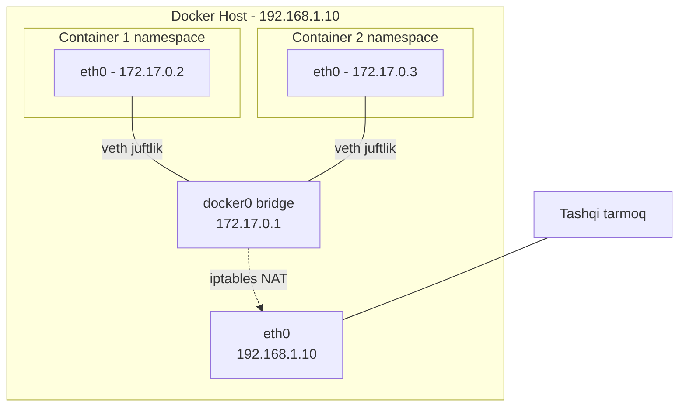
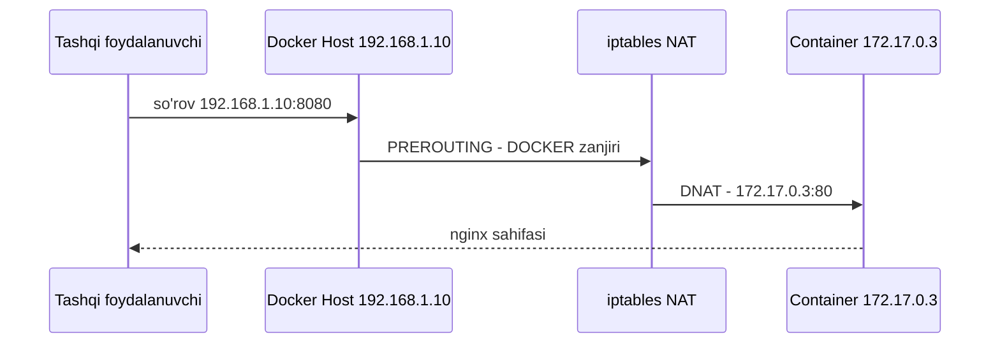

# Dars 224 — Docker tarmog'i (Prerequisite)

> 🎯 **Bu darsda nimani o'rganamiz:**
> - Docker'dagi uchta asosiy tarmoq turi: `none`, `host` va `bridge`
> - Docker `docker0` bridge'ni qanday yaratadi va container'larni unga qanday ulaydi (veth juftliklari)
> - Port mapping (port publishing) nima va u iptables NAT qoidalari orqali qanday ishlaydi

Bu dars — Kubernetes tarmog'ini tushunish uchun poydevor. Oldingi darsda network namespace'larni qo'lda yaratgan edik; endi Docker xuddi shu ishlarni avtomatik qanday bajarishini ko'ramiz.

💡 **Hayotiy o'xshatish:** Docker host'ni ko'p xonadonli bino deb tasavvur qiling. Har bir container — alohida xonadon. `none` tarmoq — eshigi ham, telefoni ham yo'q xonadon (hech kim bilan aloqa yo'q). `host` tarmoq — xonadon devorlari umuman yo'q, container binoning o'zi bilan bitta joyda yashaydi. `bridge` tarmoq esa — har bir xonadonning o'z eshigi bor va hammasi binoning ichki yo'lagi (`docker0`) orqali bir-biriga ulangan. Ko'chadan kelgan mehmon esa faqat qorovul (port mapping) ruxsati bilan kerakli xonadonga kiradi.

## Boshlang'ich holat

Bizda Docker o'rnatilgan bitta server (Docker host) bor. Uning `eth0` interfeysi lokal tarmoqqa ulangan va IP manzili `192.168.1.10` (darsdagi misolda host lokal tarmoqdagi 192.168.1.x seriyali manzilga ega). Container ishga tushirganda bir nechta tarmoq variantidan birini tanlashimiz mumkin.

## 1. `none` tarmoq — tarmoqsiz rejim

```bash
docker run --network none nginx
```

Bu rejimda container hech qanday tarmoqqa ulanmaydi:
- Container tashqi dunyoga chiqa olmaydi;
- Tashqaridan hech kim container'ga kira olmaydi;
- Bir nechta container yaratsangiz ham, ular bir-biri bilan gaplasha olmaydi.

Bu rejim to'liq izolyatsiya kerak bo'lgan maxsus holatlarda ishlatiladi.

## 2. `host` tarmoq — host bilan umumiy tarmoq

```bash
docker run --network host nginx
```

Bu rejimda container host'ning tarmog'iga to'g'ridan-to'g'ri ulanadi — host va container o'rtasida tarmoq izolyatsiyasi umuman yo'q:

- Container ichida 80-portda web-ilova ishga tushirsangiz, u darhol host'ning 80-portida ochiq bo'ladi — hech qanday qo'shimcha port mapping kerak emas;
- ⚠️ Lekin xuddi shu portni tinglaydigan ikkinchi container'ni ishga tushira olmaysiz — ikkala container host tarmog'ini bo'lishadi, bitta portni esa bir vaqtda ikkita jarayon tinglay olmaydi.

## 3. `bridge` tarmoq — ichki xususiy tarmoq (asosiy rejim)

Bu — bizni eng ko'p qiziqtiradigan va Docker'ning standart (default) rejimi. Docker host ichida ichki xususiy tarmoq yaratiladi, unga host ham, container'lar ham ulanadi. Bu tarmoq default holatda `172.17.0.0` manzilga ega bo'lib, unga ulangan har bir container o'zining ichki xususiy IP manzilini oladi.

### Docker bridge'ni qanday yaratadi?

Docker o'rnatilganda u avtomatik ravishda `bridge` nomli ichki tarmoq yaratadi. Buni ko'rish uchun:

```bash
docker network ls
```
```
NETWORK ID     NAME      DRIVER    SCOPE
7f8b3a2c1d4e   bridge    bridge    local
9a1b2c3d4e5f   host      host      local
1c2d3e4f5a6b   none      null      local
```

💡 **Muhim nozik jihat:** Docker bu tarmoqni `bridge` deb ataydi, lekin host'ning o'zida bu tarmoq **`docker0`** nomli interfeys sifatida yaratiladi. Buni `ip link` buyrug'ida ko'rasiz:

```bash
ip link
```
```
...
4: docker0: <NO-CARRIER,BROADCAST,MULTICAST,UP> mtu 1500 ... state DOWN
```

Docker buni ichkarida biz oldingi darsda ko'rgan usulga o'xshash texnika bilan — `ip link add` buyrug'iga `type bridge` berib yaratadi. Hozircha interfeys `DOWN` holatida ekaniga e'tibor bering — unga hali hech narsa ulanmagan.

`docker0` interfeysi host uchun oddiy interfeys, lekin container'lar (namespace'lar) uchun — switch vazifasini bajaradi. Unga IP ham beriladi:

```bash
ip addr
```
```
4: docker0: ...
    inet 172.17.0.1/16 scope global docker0
```

Ya'ni `docker0` — `172.17.0.1` manzilli, ichki tarmoqning "darvozasi" (gateway).

### Container yaratilganda nima bo'ladi?

Har safar container yaratilganda Docker:

1. **Network namespace yaratadi** — xuddi biz oldingi darsda qo'lda yaratganimizdek. Namespace'lar ro'yxatini ko'rish:

```bash
ip netns
```
```
b3165c10a92b
```

⚠️ Docker yaratgan namespace'larni `ip netns` bilan ko'rish uchun kichik "hack" kerak bo'ladi (Docker ularni standart joyga yozmaydi) — bu haqda dars resurslar bo'limida ma'lumot bor. Har bir container'ga qaysi namespace tegishli ekanini `docker inspect <container-id>` buyrug'i chiqarishida (SandboxKey/NetworkSettings qismida) ko'rish mumkin.

2. **Virtual kabel (veth juftligi) yaratadi** — ikki uchli virtual sim: bir uchi container namespace'iga, ikkinchi uchi `docker0` bridge'ga ulanadi.

Host'da `ip link` buyrug'ini ishlatsangiz, kabelning bridge'ga ulangan uchini ko'rasiz:

```bash
ip link
```
```
8: vethbb1c343@if7: ... master docker0 state UP
```

Xuddi shu buyruqni `-n` opsiyasi bilan container namespace'i ichida bajarsak, kabelning ikkinchi uchi ko'rinadi:

```bash
ip -n b3165c10a92b link
```
```
7: eth0@if8: ... state UP
```

3. **IP manzil beradi** — container ichidagi interfeys `172.17.0.0/16` tarmog'idan manzil oladi:

```bash
ip -n b3165c10a92b addr
```
```
7: eth0@if8: ...
    inet 172.17.0.3/16 scope global eth0
```

Container'ga `172.17.0.3` berilgan. Buni container ichiga kirib (`docker exec`) ham tekshirish mumkin.

💡 **Veth juftliklarini qanday tanish mumkin?** Interfeys raqamlariga qarang: toq va juft raqamlar juftlik hosil qiladi — 7 va 8 bitta kabel, 9 va 10 boshqa kabel, 11 va 12 yana biri. Shu tarzda qaysi host interfeysi qaysi container'ga tegishli ekanini topasiz.



Xuddi shu jarayon **har bir yangi container uchun takrorlanadi**: namespace yaratish → veth juftlik yaratish → bir uchini container'ga, ikkinchisini bridge'ga ulash → IP berish. Natijada barcha container'lar bitta ichki tarmoqda bo'ladi va bir-biri bilan bemalol gaplasha oladi.

## Port mapping (port publishing)

Aytaylik, biz nginx container yaratdik — u 80-portda web-sahifa beruvchi ilova. Container host ichidagi xususiy tarmoqda bo'lgani uchun:

- **Host ichidan** container IP'si orqali kirish mumkin:

```bash
curl http://172.17.0.3:80
```
```
Welcome to nginx!
```

- **Host tashqarisidan** esa bu sahifani ko'rib bo'lmaydi — `172.17.0.3` faqat host ichidagi xususiy manzil.

Tashqi foydalanuvchilar kirishi uchun Docker **port mapping** imkonini beradi:

```bash
docker run -p 8080:80 nginx
```

Bu Docker'ga: "host'ning 8080-portini container'ning 80-portiga bog'la" deydi. Endi istalgan tashqi foydalanuvchi Docker host IP'si va 8080-port orqali ilovaga kira oladi:

```bash
curl http://192.168.1.10:8080
```
```
Welcome to nginx!
```

Host'ning 8080-portiga kelgan har qanday trafik container'ning 80-portiga yo'naltiriladi.

### Docker buni qanday qiladi? — iptables NAT

Bir portga kelgan trafikni boshqa portga yo'naltirish — bu klassik NAT masalasi va u **iptables** bilan yechiladi. Docker'siz buni o'zimiz shunday qilgan bo'lardik:

```bash
iptables -t nat -A PREROUTING -j DNAT --dport 8080 --to-destination 80
```

Docker ham aynan shunday qiladi, faqat qoidani o'zining maxsus **DOCKER** zanjiriga qo'shadi va destination sifatida container IP'sini ham ko'rsatadi:

```bash
iptables -t nat -A DOCKER -j DNAT --dport 8080 --to-destination 172.17.0.3:80
```

Docker yaratgan qoidalarni ko'rish:

```bash
iptables -nvL -t nat
```
```
Chain DOCKER (2 references)
 target     prot opt source      destination
 DNAT       tcp  --  0.0.0.0/0   0.0.0.0/0    tcp dpt:8080 to:172.17.0.3:80
```



## Uch rejim taqqoslashi

| Xususiyat | `none` | `host` | `bridge` (default) |
|---|---|---|---|
| Container IP oladi | ❌ yo'q | host IP'sini ishlatadi | ✅ ha (172.17.0.x) |
| Izolyatsiya | to'liq | yo'q | bor (namespace) |
| Tashqi kirish | imkonsiz | to'g'ridan-to'g'ri host portida | faqat port mapping (`-p`) orqali |
| Bitta portda 2 ta container | — | ❌ mumkin emas | ✅ mumkin (har xil host portlariga map qilinadi) |
| Container'lar o'zaro aloqasi | ❌ | host orqali | ✅ docker0 orqali |

## ❓ Savol-Javob

**Savol:** `docker network ls` da `bridge` deb ko'rinadigan tarmoq host'da qanday nomlanadi?
**Javob:** Host'da u `docker0` nomli interfeys sifatida yaratiladi. Docker uni ichkarida `ip link add ... type bridge` uslubida yaratadi va `172.17.0.1` IP manzilini beradi.

**Savol:** `host` tarmoqda bitta portni tinglaydigan ikkita container'ni nega ishga tushirib bo'lmaydi?
**Javob:** Chunki `host` rejimida izolyatsiya yo'q — ikkala container ham host'ning tarmog'ini bevosita bo'lishadi, bitta portni esa bir vaqtda faqat bitta jarayon tinglay oladi.

**Savol:** Container'ga tashqaridan kirish uchun Docker trafikni qanday yo'naltiradi?
**Javob:** Port mapping (`-p 8080:80`) qilinganda Docker iptables'ning NAT jadvalidagi o'zining DOCKER zanjiriga DNAT qoidasi qo'shadi: host'ning 8080-portiga kelgan trafik destination sifatida container IP'si va 80-portiga o'zgartiriladi.

**Savol:** Qaysi veth interfeys qaysi container'ga tegishli ekanini qanday bilamiz?
**Javob:** Interfeys raqamlari juftlik hosil qiladi (masalan 7@if8 va 8@if7) — `ip link` chiqarishidagi `@ifN` qismiga qarab host'dagi veth uchi bilan container ichidagi `eth0` ni bog'lash mumkin.

## 📌 CKA imtihon uchun maslahat

CKA'da Docker'ning o'zi haqida to'g'ridan-to'g'ri savol kam, lekin bu tushunchalar — bridge, veth juftliklar, namespace, NAT — Kubernetes pod tarmog'i va CNI savollarining asosi. Klasterda `ip link`, `ip addr`, `ip netns` va `iptables -t nat -L` buyruqlari bilan tarmoqni tekshirishni mashq qilib oling: keyingi darslarda aynan shu ko'nikma kerak bo'ladi.

## 📖 Asosiy atamalar

| Atama | Oddiy tushuntirish |
|---|---|
| bridge | Bir necha tarmoq interfeyslarini bog'lovchi virtual switch; Docker'da `docker0` |
| docker0 | Docker o'rnatilganda host'da yaratiladigan default bridge interfeysi (172.17.0.1) |
| network namespace | Har bir container uchun alohida, izolyatsiyalangan tarmoq muhiti |
| veth pair | Ikki uchli virtual kabel: bir uchi container'da, ikkinchisi bridge'da |
| port mapping | Host portini container portiga bog'lash (`-p 8080:80`) |
| NAT / DNAT | Trafikning manzil IP/portini o'zgartirish texnikasi |
| iptables | Linux'da tarmoq trafigini filtrlash va NAT qilish vositasi |

## 🔗 Manbalar

- [Docker bridge network driver](https://docs.docker.com/engine/network/drivers/bridge/)
- [Docker networking overview](https://docs.docker.com/engine/network/)
- [Docker packet filtering and firewalls (iptables)](https://docs.docker.com/engine/network/packet-filtering-firewalls/)
- [Kubernetes klaster tarmog'i tushunchasi](https://kubernetes.io/docs/concepts/cluster-administration/networking/)

---
*Bu dars KodeKloud CKA kursining 224-videosi asosida tayyorlandi.*
