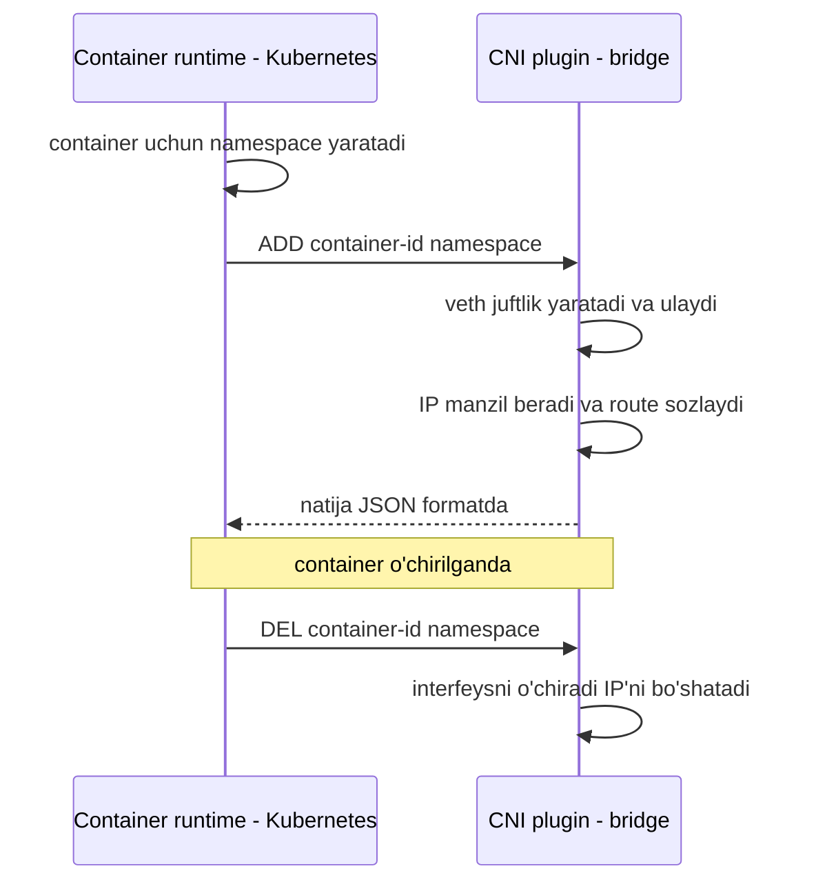
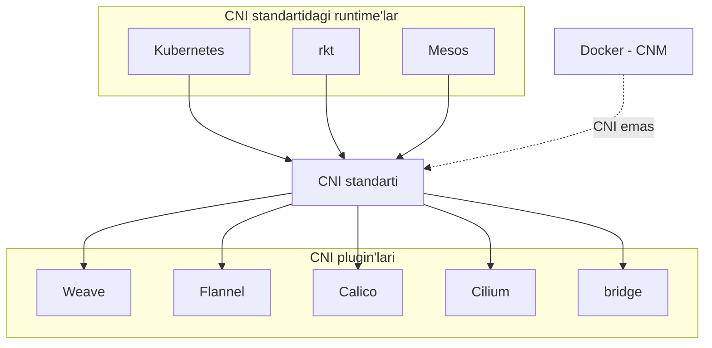

# Dars 225 — CNI asoslari (Container Network Interface)

> 🎯 **Bu darsda nimani o'rganamiz:**
> - Nima uchun container tarmog'i uchun yagona standart kerak bo'ldi
> - CNI spetsifikatsiyasi container runtime'ga va plugin'ga qanday mas'uliyatlar yuklaydi
> - CNI bilan birga keladigan tayyor plugin'lar va uchinchi tomon yechimlari
> - Nega Docker CNI ro'yxatida yo'q (CNM nima)

💡 **Hayotiy o'xshatish:** CNI — bu elektr rozetkasi standarti kabi. Dunyoda minglab elektr jihoz ishlab chiqaruvchi bor, lekin hammasi bitta vilka-rozetka standartiga amal qilgani uchun istalgan jihozni istalgan rozetkaga ulash mumkin. Xuddi shunday: CNI standartiga amal qilgan istalgan tarmoq plugin'i (weave, flannel, calico...) istalgan container runtime (Kubernetes, rkt...) bilan ishlay oladi. Docker esa o'zining "boshqa shakldagi rozetkasi" (CNM) bilan yuradi.

## Muammo: hamma bir xil ishni qayta-qayta yozmoqda

Oldingi darslarda biz quyidagilarni ko'rdik:

1. Network namespace yaratish — izolyatsiyalangan tarmoq muhiti;
2. Bir nechta namespace'ni bridge tarmoq orqali ulash;
3. Virtual kabel (veth juftlik) yaratib, bir uchini namespace'ga, ikkinchisini bridge'ga ulash;
4. IP manzil berish va interfeyslarni yoqish;
5. Tashqi aloqa uchun NAT (IP masquerade) sozlash.

Keyin Docker o'zining bridge tarmog'ida deyarli xuddi shu ishlarni qilishini ko'rdik — faqat nomlash uslubi boshqacha. rkt (Rocket), Mesos containerization va container'lar bilan ishlaydigan boshqa yechimlar, jumladan Kubernetes ham — hammasi aynan shu tarmoq muammolarini yechadi va yechimlar deyarli bir xil, faqat mayda farqlar bor.

Savol tug'iladi: **nega bitta yechimni har kim qayta-qayta yozishi kerak?** Kelinglar, barcha tarmoq qismini bitta dastur (skript)ga jamlaymiz. Bu bridge tarmoq uchun bo'lgani sababli dasturni `bridge` deb nomlaymiz.

Endi istalgan runtime container'ni tarmoqqa ulash uchun shunchaki shu dasturni chaqiradi:

```bash
bridge add 2e34dcf34 /var/run/netns/2e34dcf34
```

Ya'ni rkt yoki Kubernetes yangi container yaratganda `bridge` dasturini chaqirib, unga container ID va namespace'ni beradi — qolgan barcha tarmoq ishlarini dastur o'zi bajaradi.

## Standart nima uchun kerak?

Endi tasavvur qiling, siz o'zingiz yangi tarmoq turi uchun shunday dastur yozmoqchisiz. Savollar paydo bo'ladi:

- Dastur qanday argument va buyruqlarni qo'llab-quvvatlashi kerak?
- Kubernetes yoki rkt sizning dasturingizni to'g'ri chaqirishiga qanday ishonch hosil qilasiz?
- Dasturingiz barcha runtime'lar bilan ishlashini qanday kafolatlaysiz?

Buning uchun **hamma amal qiladigan yagona standart** kerak. Aynan shu yerda **CNI — Container Network Interface** paydo bo'ladi.

**CNI** — bu container runtime muhitlarida tarmoq muammolarini yechuvchi dasturlar qanday yozilishi kerakligini belgilovchi standartlar to'plami. Bunday dasturlar **plugin** deb ataladi. Biz yuqorida gapirgan `bridge` dasturi — CNI uchun plugin'dir.

## CNI mas'uliyatlarni qanday taqsimlaydi?

CNI ikki tomonga aniq mas'uliyat belgilaydi:

### Container runtime (masalan, Kubernetes) zimmasida:

- Har bir container uchun **network namespace yaratish**;
- Container qaysi tarmoq(lar)ga ulanishi kerakligini aniqlash;
- Container **yaratilganda** plugin'ni `ADD` buyrug'i bilan chaqirish;
- Container **o'chirilganda** plugin'ni `DEL` buyrug'i bilan chaqirish;
- Plugin konfiguratsiyasini **JSON fayl** orqali berish.

### Plugin zimmasida:

- `add`, `del`, `check` buyruq qatori argumentlarini qo'llab-quvvatlash;
- Container ID va network namespace kabi parametrlarni qabul qilish;
- Pod/container'ga **IP manzil berish**;
- Container'lar tarmoqdagi boshqa container'larga yeta olishi uchun kerakli **route'larni sozlash**;
- Natijani belgilangan formatda qaytarish.

Ikkala tomon ham shu standartlarga amal qilsa — ular "hamjihatlikda yashaydi": **istalgan runtime istalgan plugin bilan ishlay oladi**.



## Tayyor plugin'lar

CNI bir qator qo'llab-quvvatlanadigan plugin'lar bilan birga keladi:

| Turkum | Plugin'lar | Vazifasi |
|---|---|---|
| Asosiy (interface) plugin'lar | `bridge`, `vlan`, `ipvlan`, `macvlan`, Windows uchun plugin | Container'ni tarmoqqa ulash |
| IPAM plugin'lar | `host-local`, `dhcp` | IP manzillarni boshqarish |
| Uchinchi tomon yechimlari | Weave, Flannel, Cilium, VMware NSX, Calico, Infoblox va boshqalar | To'liq tarmoq yechimlari |

CNI standartini amalga oshirgan barcha container runtime'lar (Kubernetes, rkt va boshqalar) bu plugin'larning istalgani bilan ishlay oladi.



## Docker nega bu ro'yxatda yo'q?

Ro'yxatda bitta mashhur nom yo'q — **Docker**. Docker CNI'ni amalga oshirmaydi. Uning o'z standarti bor: **CNM — Container Network Model**. CNM ham container tarmog'i muammolarini yechishga qaratilgan, lekin CNI'dan ba'zi farqlari bor.

Shu farqlar tufayli CNI plugin'lari Docker bilan tabiiy (native) integratsiya qilmaydi. Ya'ni siz shunday qila olmaysiz:

```bash
# BU ISHLAMAYDI — Docker CNI'ni tushunmaydi
docker run --network=cni-bridge nginx
```

Lekin bu Docker'ni CNI bilan umuman ishlatib bo'lmaydi degani emas — shunchaki buni o'zingiz "aylanma yo'l" bilan qilishingiz kerak:

```bash
# 1. Container'ni tarmoqsiz yaratamiz
docker run --network=none nginx

# 2. CNI plugin'ni o'zimiz qo'lda chaqiramiz
bridge add 2e34dcf34 /var/run/netns/2e34dcf34
```

💡 **Aynan shunday qilardi Kubernetes ham** (Docker runtime ishlatilgan davrda): Kubernetes Docker container'larini `none` tarmoqda yaratadi, so'ng sozlangan CNI plugin'larni o'zi chaqiradi — qolgan barcha tarmoq sozlamalarini plugin bajaradi.

## CNI va CNM taqqoslashi

| Xususiyat | CNI | CNM |
|---|---|---|
| Kim ishlab chiqqan | CoreOS / CNCF (Kubernetes ekotizimi) | Docker |
| Kim ishlatadi | Kubernetes, rkt, Mesos va boshqalar | Docker |
| Plugin'lar | bridge, flannel, calico, weave, cilium... | Docker libnetwork driver'lari |
| O'zaro moslik | CNI plugin Docker'ga to'g'ridan-to'g'ri ulanmaydi | CNM driver CNI runtime'larda ishlamaydi |

## ❓ Savol-Javob

**Savol:** CNI nima va u nimani standartlashtiradi?
**Javob:** CNI (Container Network Interface) — container muhitlarida tarmoq masalalarini yechuvchi dasturlar (plugin'lar) qanday yozilishi va container runtime'lar ularni qanday chaqirishi kerakligini belgilovchi standartlar to'plami.

**Savol:** CNI bo'yicha container runtime'ning asosiy vazifalari nima?
**Javob:** Har bir container uchun network namespace yaratish, container qaysi tarmoqqa ulanishini aniqlash, container yaratilganda plugin'ni `ADD` bilan, o'chirilganda `DEL` bilan chaqirish va plugin konfiguratsiyasini JSON fayl orqali berish.

**Savol:** Plugin qaysi buyruqlarni qo'llab-quvvatlashi shart?
**Javob:** `add`, `del` va `check` — bularning har biri container ID va network namespace kabi parametrlarni qabul qilishi, IP berish va route'larni sozlashni bajarishi, natijani belgilangan formatda qaytarishi kerak.

**Savol:** Docker bilan CNI plugin'ni ishlatib bo'ladimi?
**Javob:** To'g'ridan-to'g'ri yo'q, chunki Docker o'z CNM standartidan foydalanadi. Lekin aylanma yo'l bor: container'ni `--network=none` bilan yaratib, keyin CNI plugin'ni qo'lda chaqirish mumkin — Kubernetes Docker bilan aynan shunday ishlagan.

## 📌 CKA imtihon uchun maslahat

Imtihonda CNI'ning ta'rifini yodlab aytish talab qilinmaydi, lekin CNI plugin'lar `/opt/cni/bin` da turishi va konfiguratsiyasi `/etc/cni/net.d` da bo'lishini (keyingi darslarda ko'ramiz) bilish, hamda klasterda qaysi tarmoq plugin ishlayotganini aniqlay olish — real imtihon savollarida uchraydi. runtime → `ADD`/`DEL` chaqiruvi mantig'ini tushunib oling.

## 📖 Asosiy atamalar

| Atama | Oddiy tushuntirish |
|---|---|
| CNI | Container tarmoq plugin'lari uchun yagona standart (Container Network Interface) |
| plugin | CNI standarti bo'yicha yozilgan, container'ni tarmoqqa ulovchi dastur |
| container runtime | Container'larni yaratuvchi dastur (Kubernetes'da containerd, CRI-O...) |
| ADD / DEL / CHECK | Plugin qo'llab-quvvatlashi shart bo'lgan buyruqlar |
| IPAM | IP Address Management — IP manzillarni taqsimlash va boshqarish |
| CNM | Container Network Model — Docker'ning o'z tarmoq standarti |
| IP masquerade | Ichki IP'ni tashqi aloqada host IP'siga "niqoblash" (NAT turi) |

## 🔗 Manbalar

- [Kubernetes tarmoq plugin'lari (CNI)](https://kubernetes.io/docs/concepts/extend-kubernetes/compute-storage-net/network-plugins/)
- [Kubernetes tarmoq modeli va uni amalga oshirish](https://kubernetes.io/docs/concepts/cluster-administration/networking/)
- [CNI rasmiy spetsifikatsiyasi](https://github.com/containernetworking/cni/blob/main/SPEC.md)
- [CNI standart plugin'lari](https://www.cni.dev/plugins/current/)
- [Klaster uchun tarmoq addon'lari ro'yxati](https://kubernetes.io/docs/concepts/cluster-administration/addons/)

---
*Bu dars KodeKloud CKA kursining 225-videosi asosida tayyorlandi.*
