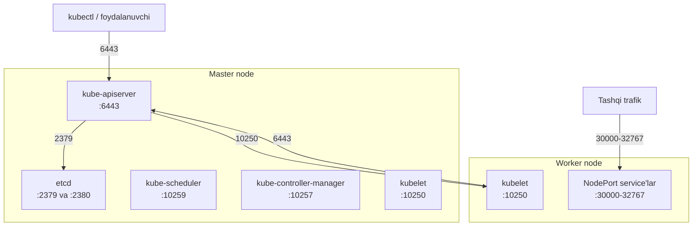
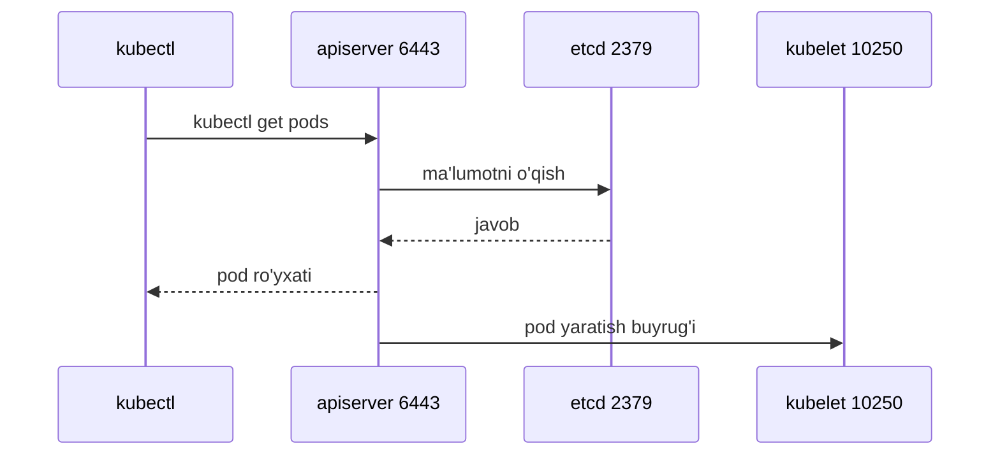

# Dars 226 — Klaster tarmog'i (Cluster Networking)

> 🎯 **Bu darsda nimani o'rganamiz:**
> - Master va worker node'larda qanday tarmoq sozlamalari bo'lishi shart
> - Kubernetes komponentlari uchun qaysi portlar ochiq bo'lishi kerak (6443, 10250, 2379 va h.k.)
> - Tarmoq muammolarini tekshirishda qayerdan boshlash

💡 **Hayotiy o'xshatish:** Kubernetes klasterini katta idora binosi deb tasavvur qiling. Har bir node — alohida bo'lim, har bir port — o'sha bo'limning qabulxona eshigi. API server 6443-eshikda hammani qabul qiladi, kubelet 10250-eshikda ichki topshiriqlar oladi, etcd esa 2379-eshikda arxiv xizmatini yuritadi. Agar biror eshik qulflangan (firewall yopgan) bo'lsa, o'sha xizmatga hech kim yeta olmaydi — va klaster "kasal" bo'lib qoladi.

## Node'larga qo'yiladigan asosiy talablar

Kubernetes klasteri master va worker node'lardan tashkil topadi. Tarmoq nuqtai nazaridan har bir node uchun quyidagilar shart:

- Har bir node'da **kamida bitta tarmoq interfeysi** bo'lishi va u tarmoqqa ulangan bo'lishi kerak;
- Har bir interfeysga **IP manzil** sozlangan bo'lishi kerak;
- Har bir host **noyob hostname**'ga ega bo'lishi kerak;
- Har bir host **noyob MAC manzil**ga ega bo'lishi kerak.

⚠️ Hostname va MAC manzil noyobligi ayniqsa **VM'larni mavjud mashinadan klonlab yaratganingizda** muhim — klonlashda ular takrorlanib qolishi mumkin va bu klasterda g'alati muammolarga olib keladi.

Tekshirish uchun foydali buyruqlar:

```bash
ip link            # interfeyslar va MAC manzillar
ip addr            # IP manzillar
hostname           # host nomi
cat /etc/hosts     # nomlar yozuvi
netstat -nplt      # qaysi portlar tinglanmoqda
```

## Ochiq bo'lishi kerak bo'lgan portlar

Control plane komponentlari bir-biri bilan aniq portlar orqali gaplashadi. Bu portlar firewall'da ochiq bo'lishi shart:

| Komponent | Port(lar) | Qaysi node'da | Kim murojaat qiladi |
|---|---|---|---|
| kube-apiserver | **6443** | master | worker node'lar, `kubectl`, tashqi foydalanuvchilar, barcha control plane komponentlari |
| kubelet | **10250** | master ham, worker ham | control plane (kubelet master node'da ham bo'lishi mumkin!) |
| kube-scheduler | **10259** | master | faqat o'zi (localhost) |
| kube-controller-manager | **10257** | master | faqat o'zi (localhost) |
| NodePort service'lar | **30000–32767** | worker node'lar | tashqi foydalanuvchilar |
| etcd server | **2379** | master | apiserver, etcd client'lar |
| etcd peer | **2380** | master (ko'p master bo'lsa) | etcd nusxalari bir-biri bilan |

⚠️ Agar klasteringizda **bir nechta master node** bo'lsa, yuqoridagi master portlari barchasida ochiq bo'lishi kerak, hamda etcd nusxalari o'zaro gaplashishi uchun qo'shimcha **2380**-port ham ochilishi shart.





## Muammo bo'lsa — qayerdan qarash kerak?

Portlar ro'yxati Kubernetes rasmiy hujjatlarida ham bor. Klaster tarmog'ini sozlaganda buni hisobga oling:

- **Firewall** qoidalarida (on-prem);
- **iptables** qoidalarida;
- Cloud muhitlarda (GCP, Azure, AWS) — **Network Security Group / firewall rules**'da.

Agar klasterda biror narsa ishlamayotgan bo'lsa (masalan, worker node `NotReady`, yoki `kubectl` ulana olmayapti) — birinchi tekshiriladigan joylardan biri aynan shu portlar:

```bash
# Master'da apiserver porti tinglanayaptimi?
netstat -nplt | grep 6443
```
```
tcp6   0   0 :::6443    :::*    LISTEN    3243/kube-apiserver
```

```bash
# etcd portlari
netstat -nplt | grep etcd
```
```
tcp    0   0 127.0.0.1:2379    0.0.0.0:*    LISTEN    3164/etcd
tcp    0   0 192.168.56.2:2379 0.0.0.0:*    LISTEN    3164/etcd
tcp    0   0 192.168.56.2:2380 0.0.0.0:*    LISTEN    3164/etcd
```

Amaliyot mashg'ulotida mavjud klasterning interfeyslari, IP'lari, hostname'lari va portlarini shu buyruqlar bilan o'rganib chiqasiz — bu keyingi murakkabroq bo'limlar uchun tayyorgarlik.

## ⚠️ CKA imtihoni va CNI haqida muhim eslatma (227-dars)

> ⚠️ **Network addon'larni o'rnatish bo'yicha muhim ogohlantirish:**
>
> Keyingi laboratoriyalarda klasterga tarmoq plugin (network addon) o'rnatamiz. Kursda misol sifatida **weave-net** ishlatilgan, lekin siz rasmiy hujjatlarda ko'rsatilgan istalgan yechimdan foydalanishingiz mumkin:
>
> - https://kubernetes.io/docs/concepts/cluster-administration/addons/
> - https://kubernetes.io/docs/concepts/cluster-administration/networking/#how-to-implement-the-kubernetes-networking-model
>
> CKA imtihonida, agar savolda aniq yechim ko'rsatilmagan bo'lsa, yuqoridagi sahifalarda tavsiflangan istalgan addon'dan foydalansa bo'ladi.
>
> **Lekin ehtiyot bo'ling:** Kubernetes hujjatlari vendor-neutral (biror vendorga bog'lanmagan) bo'lishi uchun ularda uchinchi tomon addon'ini o'rnatishning **aniq buyrug'i keltirilmagan** — havolalar vendor saytlariga va GitHub'ga olib boradi, imtihonda esa **bunday tashqi saytlarni ochib bo'lmaydi**.
>
> **Xulosa:** Rasmiy imtihonda CNI o'rnatish uchun kerakli barcha muhim ma'lumotlar (buyruq/manifest) savolning o'zida beriladi — tashqaridan qidirishga hojat qolmaydi.

## 🧪 Mustaqil topshiriqlar

> Yechishdan oldin darsni yopib qo'ying. Taxminiy vaqt: 15 daqiqa.

**1-topshiriq · oson.** Control plane node'da ochiq portlarni ro'yxatlang va 6443 ni toping.

<details><summary>O'zingizni tekshiring</summary>

```bash
sudo ss -tulnp | grep -E ':(6443|2379|2380|10250|10259|10257)'
```
</details>

**2-topshiriq · o'rta.** Worker node'da kubelet qaysi portda tinglayotganini aniqlang.

<details><summary>O'zingizni tekshiring</summary>

```bash
sudo ss -tulnp | grep 10250
```
</details>

**3-topshiriq · qiyin.** apiserver portini firewall'da yoping va `kubectl get nodes` bajaring.
**Avval ayting:** xato qanday bo'ladi?

<details><summary>O'zingizni tekshiring</summary>

```text
The connection to the server <IP>:6443 was refused - did you specify the right host or port?
```

Bu xato eng ko'p uchraydiganlaridan: apiserver ishlamayapti, port yopiq
yoki kubeconfig'da manzil xato. Uchalasini ketma-ket tekshiring.

⚠️ Sinov klasterida bajaring va qoidani qaytarishni unutmang.
</details>

## ❓ Savol-Javob

**Savol:** kube-apiserver qaysi portda ishlaydi va unga kimlar murojaat qiladi?
**Javob:** 6443-portda. Unga worker node'lar (kubelet), `kubectl` vositasi, tashqi foydalanuvchilar va barcha control plane komponentlari murojaat qiladi.

**Savol:** kubelet faqat worker node'larda bo'ladimi?
**Javob:** Yo'q — kubelet master node'da ham bo'lishi mumkin va u ham 10250-portda tinglaydi. Shuning uchun bu port master'da ham, worker'da ham ochiq bo'lishi kerak.

**Savol:** 2379 va 2380 portlarning farqi nima?
**Javob:** 2379 — etcd server porti, unga apiserver va boshqa client'lar ulanadi. 2380 — bir nechta master (HA) bo'lgan holatda etcd nusxalari bir-biri bilan gaplashishi uchun ishlatiladigan peer port.

**Savol:** VM'larni klonlab klaster qursam, nimaga e'tibor berishim kerak?
**Javob:** Har bir node'ning hostname'i va MAC manzili noyob bo'lishiga — klonlashda ular takrorlanib qolgan bo'lishi mumkin.

## 📌 CKA imtihon uchun maslahat

Portlar jadvalini yodlashga urinmang — u rasmiy hujjatlarning "Ports and Protocols" sahifasida bor, imtihonda kubernetes.io ochiq. Lekin eng muhim uchtasi baribir yodda tursin: **6443 (apiserver), 10250 (kubelet), 30000–32767 (NodePort)**. Tarmoq muammosini tekshirishda `ip link`, `ip addr`, `netstat -nplt` buyruqlarini tez ishlata olish katta vaqt yutqazadi.

## 📖 Asosiy atamalar

| Atama | Oddiy tushuntirish |
|---|---|
| control plane | Klasterni boshqaruvchi komponentlar to'plami (apiserver, etcd, scheduler...) |
| kube-apiserver | Klasterning "bosh eshigi" — barcha so'rovlar u orqali o'tadi (6443-port) |
| kubelet | Har bir node'da ishlaydigan, pod'larni ishga tushiruvchi agent (10250-port) |
| etcd | Klaster holatini saqlovchi kalit-qiymat ma'lumotlar bazasi (2379/2380) |
| NodePort | Service'ni node portlari (30000–32767) orqali tashqariga ochish usuli |
| Network Security Group | Cloud muhitida (AWS/Azure/GCP) portlarni ochib-yopuvchi firewall qoidalari |
| network addon (CNI plugin) | Pod tarmog'ini ta'minlovchi yechim (weave, flannel, calico...) |

## 🔗 Manbalar

- [Kubernetes portlari va protokollari](https://kubernetes.io/docs/reference/networking/ports-and-protocols/)
- [Klaster tarmog'i tushunchasi](https://kubernetes.io/docs/concepts/cluster-administration/networking/)
- [Tarmoq addon'larini o'rnatish](https://kubernetes.io/docs/concepts/cluster-administration/addons/)
- [kubeadm o'rnatishdan oldingi talablar](https://kubernetes.io/docs/setup/production-environment/tools/kubeadm/install-kubeadm/)

---
*Bu dars KodeKloud CKA kursining 226-videosi va 227-eslatmasi asosida tayyorlandi.*
