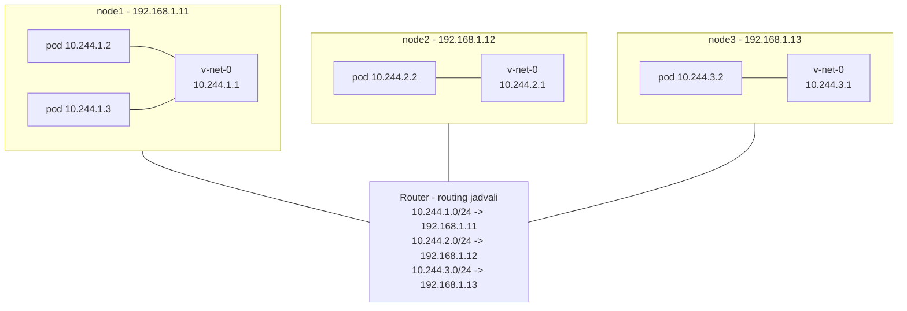
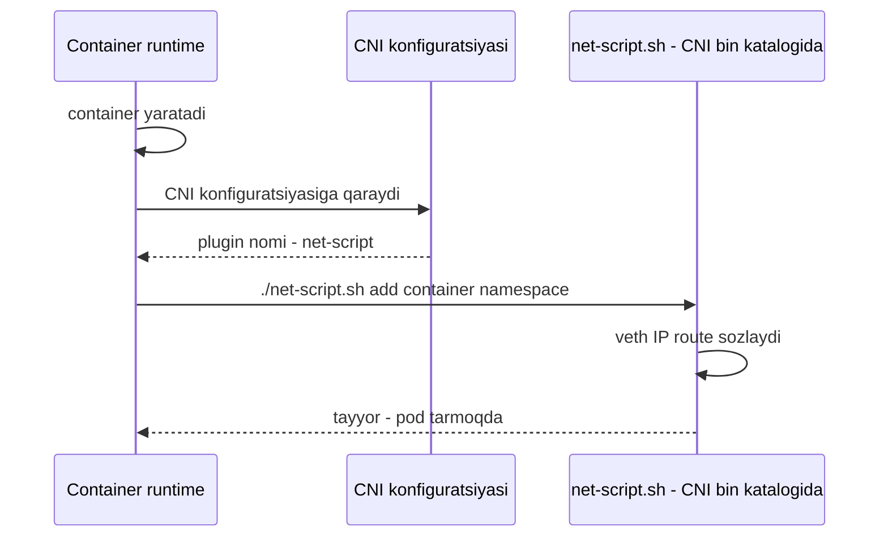

# Dars 230 — Pod tarmog'i (Pod Networking)

> 🎯 **Bu darsda nimani o'rganamiz:**
> - Kubernetes pod tarmog'iga qanday talablar qo'yadi (tarmoq modeli)
> - Node ichida va node'lar orasida pod'lar aloqasini o'zimiz "qo'lda" qanday qurgan bo'lardik
> - Node'lararo routing muammosi va uning yechimi
> - Yozgan skriptimizni CNI avtomatik qanday ishga tushiradi

💡 **Hayotiy o'xshatish:** Node'lar orasidagi tarmoq — shaharlarni bog'lovchi katta trassa. Lekin har shahar ichida yangi mahallalar (pod'lar) qurilyapti va har biriga uy raqami (IP) berish, mahallalar orasida yo'l ochish kerak. Kubernetes sizga: "trassa tayyor, lekin mahalla ichki yo'llarini o'zing qur — faqat mana bu qoidalarga amal qil" deydi. Shu ichki yo'llarni quruvchi "quruvchi tashkilot" — CNI plugin.

## Muammo qayerda?

Faraz qilaylik, biz bir nechta master va worker node o'rnatdik, ular orasidagi tarmoq ishlayapti, firewall/security group'lar to'g'ri sozlangan, control plane komponentlari (kube-apiserver, etcd, kubelet va h.k.) ishga tushgan. Endi ilova deploy qilamiz... lekin shoshmang.

Node'larni bog'laydigan tarmoq haqida gaplashdik, ammo yana bir muhim qatlam bor — **pod qatlamidagi tarmoq**. Klasterda tez orada minglab pod va service ishlaydi:

- Pod'lar qanday manzillanadi?
- Ular bir-biri bilan qanday gaplashadi?
- Pod'lardagi service'larga klaster ichidan va tashqaridan qanday kiriladi?

⚠️ **Kubernetes bu muammoni o'zi yechib bermaydi!** Bugungi kunda Kubernetes'da o'rnatilgan (built-in) tayyor yechim yo'q — u sizdan shu muammolarni yechuvchi tarmoq yechimini o'rnatishingizni kutadi. Lekin talablarni juda aniq belgilab qo'ygan.

## Kubernetes tarmoq modelining talablari

1. **Har bir pod o'zining noyob IP manziliga ega bo'lishi kerak;**
2. Har bir pod **shu node'dagi** boshqa barcha pod'larga o'sha IP orqali yeta olishi kerak;
3. Har bir pod **boshqa node'lardagi** pod'larga ham xuddi shu IP orqali, **NAT'siz** yeta olishi kerak.

Qaysi IP diapazon yoki subnet ishlatilishi Kubernetes uchun muhim emas — asosiysi IP'lar avtomatik berilsin va pod'lar o'zaro bog'lansin.

Bozorda buni qiladigan tayyor yechimlar ko'p (weave, flannel, calico...). Lekin biz avval routing, IP boshqaruvi, namespace va CNI haqidagi bilimlarimiz bilan bu masalani **o'zimiz yechib ko'ramiz** — shunda tayyor yechimlar qanday ishlashini chuqur tushunamiz.

## Qo'lda yechim: uch node'li klaster

Bizda uchta node bor (qaysi biri master, qaysi biri worker — tarmoq uchun farqi yo'q, hammasida pod ishlaydi). Ular tashqi tarmoqda `192.168.1.x` seriyasida:

| Node | Tashqi IP | Pod subnet (biz tanladik) | Bridge IP |
|---|---|---|---|
| node1 | 192.168.1.11 | 10.244.1.0/24 | 10.244.1.1 |
| node2 | 192.168.1.12 | 10.244.2.0/24 | 10.244.2.1 |
| node3 | 192.168.1.13 | 10.244.3.0/24 | 10.244.3.1 |

### 1-qadam: har bir node'da bridge tarmoq yaratamiz

Container yaratilganda Kubernetes ular uchun network namespace yaratadi. Ularni bog'lash uchun har bir node'da bridge yaratib, yoqamiz va IP beramiz:

```bash
# har bir node'da
ip link add v-net-0 type bridge
ip link set dev v-net-0 up
ip addr add 10.244.1.1/24 dev v-net-0   # node2'da 10.244.2.1, node3'da 10.244.3.1
```

Har bir node'ning pod tarmog'i o'z subnet'ida bo'ladi — istalgan xususiy diapazonni tanladik: `10.244.1.0/24`, `10.244.2.0/24`, `10.244.3.0/24`.

### 2-qadam: har bir container uchun skript

Poydevor tayyor. Qolgan qadamlar **har bir yangi container uchun** takrorlanadi, shuning uchun ularni skriptga yozamiz. Murakkab skripting bilim kerak emas — bu shunchaki buyruqlar to'plangan fayl:

```bash
# net-script.sh <container>

# 1) Virtual kabel (veth juftlik) yaratamiz
ip link add ...

# 2) Bir uchini container'ga, ikkinchisini bridge'ga ulaymiz
ip link set ...
ip link set ...

# 3) IP manzil beramiz
ip -n <namespace> addr add 10.244.1.2/24 ...

# 4) Default gateway'ga route qo'shamiz
ip -n <namespace> route add ...

# 5) Interfeysni yoqamiz
ip -n <namespace> link set ...
```

Qaysi IP'ni beramiz? Buni o'zimiz boshqaramiz yoki biror bazada saqlaymiz — hozircha subnet'dagi bo'sh IP `10.244.1.2` deb olamiz (IP boshqaruvi — IPAM — haqida alohida darsda gaplashamiz).

Ikkinchi container uchun ham xuddi shu skriptni uning ma'lumotlari bilan ishga tushiramiz — u `10.244.1.3` oladi. Endi bitta node ichidagi pod'lar bir-biri bilan gaplasha oladi. Skriptni qolgan node'larga ham nusxalab, ishga tushiramiz.

**Birinchi talab bajarildi:** har bir pod noyob IP oldi va o'z node'sida o'zaro aloqada.

## 3-qadam: node'lararo routing muammosi

Endi node1'dagi `10.244.1.2` pod node2'dagi `10.244.2.2` pod'ni ping qilmoqchi deylik:

- Birinchi pod `10.244.2.2` qayerdaligini bilmaydi — bu manzil uning tarmog'idan tashqarida. Shuning uchun so'rovni o'zining default gateway'i — node1'ga uzatadi;
- Node1 ham bilmaydi: `10.244.2.2` — node2 ichidagi **xususiy** tarmoq, tashqi tarmoqdan ko'rinmaydi.

Yechim — node1'ning routing jadvaliga qoida qo'shish: "`10.244.2.2` ga trafik node2'ning IP'si (`192.168.1.12`) orqali borsin":

```bash
# node1'da
ip route add 10.244.2.2 via 192.168.1.12
```

Route qo'shilgach ping ishlaydi. Xuddi shunday, **barcha host'larda barcha boshqa host'larning ichki tarmoqlariga** route sozlaymiz:

```bash
# node1'da
ip route add 10.244.2.0/24 via 192.168.1.12
ip route add 10.244.3.0/24 via 192.168.1.13

# node2'da
ip route add 10.244.1.0/24 via 192.168.1.11
ip route add 10.244.3.0/24 via 192.168.1.13

# node3'da
ip route add 10.244.1.0/24 via 192.168.1.11
ip route add 10.244.2.0/24 via 192.168.1.12
```

### Yaxshiroq yechim: markaziy router

Oddiy muhitda bu ishlaydi, lekin tarmoq arxitekturasi murakkablashsa har bir serverda route yozish og'irlashadi. Yaxshiroq usul — tarmog'ingizda router bo'lsa, barcha route'larni **bitta router'da** sozlab, host'larni o'sha router'ni default gateway qilib ko'rsatish. Shunda barcha tarmoq marshrutlari bitta joyda boshqariladi.

Natijada har node'dagi alohida `10.244.1.0/24`, `10.244.2.0/24`, `10.244.3.0/24` virtual tarmoqlari birlashib, bitta katta tarmoq — **`10.244.0.0/16`** — hosil qiladi.



## 4-qadam: skriptni avtomatlashtirish — CNI sahnaga chiqadi

Biz muhitni qo'lda tayyorladik va har container uchun skriptni **qo'lda** ishga tushirdik. Katta muhitda esa daqiqasiga minglab pod yaratiladi — qo'lda ishlatib bo'lmaydi. Pod yaratilishi bilan skript avtomatik ishlashi kerak. Buni **CNI** hal qiladi — u "vositachi" bo'lib:

- **Kubernetes'ga** aytadi: container yaratilishi bilan skriptni qanday chaqirish kerak;
- **Bizga** aytadi: skript qanday ko'rinishda bo'lishi kerak.

CNI standartiga moslash uchun skriptni ozgina o'zgartiramiz — unda ikkita bo'lim bo'lishi kerak:

```bash
# net-script.sh

ADD)
  # container'ni tarmoqqa ulash:
  # veth juftlik yaratish, uchlarini ulash,
  # IP berish, route qo'shish, interfeysni yoqish

DEL)
  # container interfeysini o'chirish
  # va IP manzilni bo'shatish
```

Endi jarayon shunday ishlaydi:



Har bir node'dagi **container runtime** container yaratishga mas'ul. U container yaratganida ishga tushirilganda berilgan CNI konfiguratsiyasiga qarab bizning skript nomini topadi, so'ng CNI bin katalogidan skriptni topib, `add` buyrug'i, container nomi va namespace ID'si bilan ishga tushiradi — qolganini skriptimiz bajaradi.

CNI Kubernetes'da qayerda va qanday sozlanishini keyingi darsda ko'ramiz.

## ❓ Savol-Javob

**Savol:** Kubernetes pod tarmog'i uchun tayyor yechim bilan keladimi?
**Javob:** Yo'q. Kubernetes faqat talablarni belgilaydi: har pod noyob IP olsin, bir node ichida va node'lar orasida pod'lar NAT'siz o'sha IP orqali bog'lansin. Yechimni (CNI plugin) siz o'rnatasiz.

**Savol:** Nega node1'dagi pod boshqa node'dagi pod'ga default holatda yeta olmaydi?
**Javob:** Chunki har node'ning pod subnet'i o'sha node ichidagi xususiy tarmoq — boshqa node'lar u haqda hech narsa bilmaydi. Yechim: routing jadvaliga "bu subnet'ga trafik o'sha node IP'si orqali borsin" degan route qo'shish (yoki hammasini markaziy router'da sozlash).

**Savol:** 10.244.0.0/16 tarmog'i qayerdan paydo bo'ldi?
**Javob:** Har bir node'dagi /24 subnet'lar (10.244.1.0/24, 10.244.2.0/24, 10.244.3.0/24) routing orqali birlashtirilganda ular yagona katta 10.244.0.0/16 pod tarmog'ini tashkil qiladi.

**Savol:** Yozgan skriptimiz pod yaratilganda avtomatik qanday ishlaydi?
**Javob:** CNI standarti orqali: skriptga ADD va DEL bo'limlarini qo'shamiz, container runtime esa har yangi container'da CNI konfiguratsiyasidan skript nomini topib, uni `add` buyrug'i, container nomi va namespace bilan avtomatik chaqiradi.

## 📌 CKA imtihon uchun maslahat

Imtihonda klasterdagi pod tarmog'ini tekshirish savollari uchraydi: pod'ning IP'sini (`kubectl get pods -o wide`), node'dagi bridge interfeysini (`ip link`, `ip addr`), va node'ning routing jadvalini (`ip route`) o'qiy olishingiz kerak. "Pod'lar node'lararo gaplashmayapti" turidagi muammoda birinchi bo'lib route'lar va CNI plugin holatini tekshiring.

## 📖 Asosiy atamalar

| Atama | Oddiy tushuntirish |
|---|---|
| pod network | Pod'larga IP berib, ularni o'zaro bog'laydigan virtual tarmoq qatlami |
| Kubernetes tarmoq modeli | "Har pod'ga noyob IP, hamma pod hamma pod'ga NAT'siz yetadi" degan talablar |
| bridge (v-net-0) | Node ichida pod namespace'larini ulovchi virtual switch |
| subnet | Tarmoqning kichik bo'lagi (masalan har node'ga alohida 10.244.x.0/24) |
| route | "Falon tarmoqqa trafik falon manzil orqali borsin" degan qoida |
| default gateway | Noma'lum manzillarga trafik yuboriladigan "chiqish eshigi" |
| CNI | Pod yaratilganda tarmoq skript/plugin'ini avtomatik chaqirish standarti |
| IPAM | Pod'larga IP taqsimlashni boshqarish (keyingi darslarda batafsil) |

## 🔗 Manbalar

- [Kubernetes tarmoq modeli](https://kubernetes.io/docs/concepts/services-networking/)
- [Klaster tarmog'i va tarmoq modelini amalga oshirish](https://kubernetes.io/docs/concepts/cluster-administration/networking/)
- [Tarmoq plugin'lari (CNI) haqida](https://kubernetes.io/docs/concepts/extend-kubernetes/compute-storage-net/network-plugins/)
- [CNI spetsifikatsiyasi](https://github.com/containernetworking/cni/blob/main/SPEC.md)

---
*Bu dars KodeKloud CKA kursining 230-videosi asosida tayyorlandi.*
