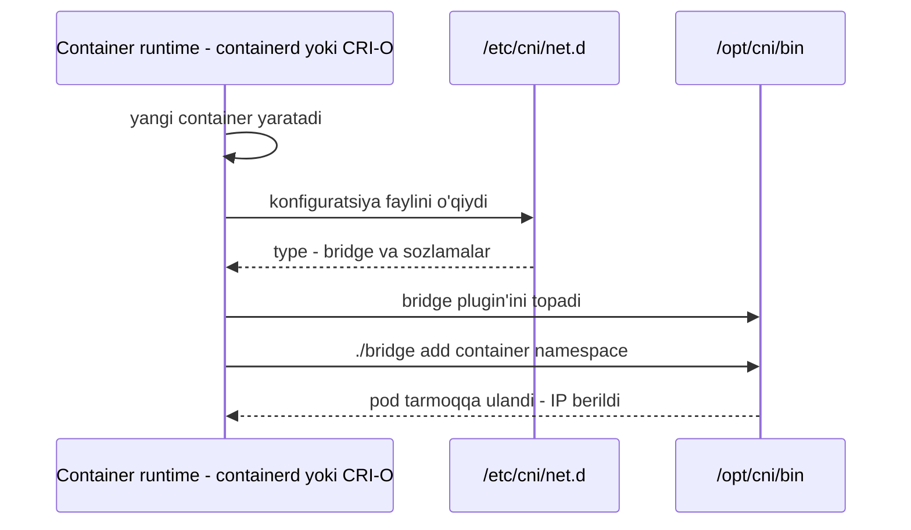
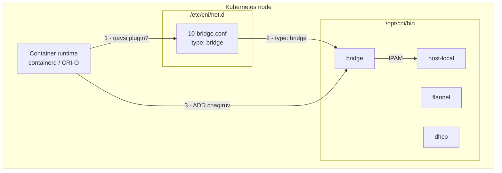

# Dars 231 — Kubernetes'da CNI

> 🎯 **Bu darsda nimani o'rganamiz:**
> - Kubernetes'da CNI plugin'ni kim va qachon chaqiradi (container runtime'ning roli)
> - Ikkita muhim katalog: `/opt/cni/bin` (plugin'lar) va `/etc/cni/net.d` (konfiguratsiya)
> - CNI konfiguratsiya faylining tuzilishi: `isGateway`, `ipMasq`, `ipam` va boshqalar
> - ⚠️ Weave Net o'rnatish havolasi haqidagi yangilanish (232-eslatma)

💡 **Hayotiy o'xshatish:** Container runtime — quruvchi brigada boshlig'i. `/opt/cni/bin` — asboblar ombori: unda har xil "asboblar" (bridge, flannel, dhcp...) tayyor turadi. `/etc/cni/net.d` — ish qog'ozi (loyiha hujjati): unda qaysi asbobni qanday sozlamalar bilan ishlatish yozilgan. Har yangi "xonadon" (container) qurilganda boshliq avval hujjatga qaraydi, keyin ombordan kerakli asbobni olib ishlatadi.

## Kim CNI plugin'ni chaqiradi?

Oldingi darslarda network namespace'lardan boshlab, Docker tarmog'i, CNI standarti va plugin'lar ro'yxatigacha yetib keldik. Endi Kubernetes bu plugin'larni ishlatishga qanday sozlanishini ko'ramiz.

CNI bo'yicha container runtime (bizning holatda — Kubernetes tarafi) quyidagilarga mas'ul:

- Container network namespace'larini yaratish;
- Namespace'larni to'g'ri tarmoqqa ulash uchun **to'g'ri plugin'ni chaqirish**.

CNI plugin'ni **container'larni yaratishga mas'ul komponent** chaqirishi kerak — chunki container yaratilgandan keyin aynan o'sha komponent tegishli tarmoq plugin'ini ishga tushirishi lozim. Bu komponent — **container runtime**. Bugungi kunda ikkita yaxshi misol: **containerd** va **CRI-O**.

💡 Eslatma: dastlab asosiy runtime Docker edi, keyinchalik uning o'rnini containerd degan abstraksiya egalladi (kursning boshida bu haqda gaplashganmiz).



## Ikkita muhim katalog

Runtime'ni qaysi plugin bilan ishlashga qanday sozlaymiz? Bu ikki katalog orqali:

| Katalog | Nima turadi | Runtime parametri |
|---|---|---|
| `/opt/cni/bin` | Barcha CNI plugin'larning **bajariluvchi fayllari** | `--cni-bin-dir` |
| `/etc/cni/net.d` | Qaysi plugin, qanday sozlamalar bilan ishlatilishini aytuvchi **konfiguratsiya fayllari** | `--cni-conf-dir` |

### `/opt/cni/bin` — plugin'lar ombori

Barcha tarmoq plugin'lari shu katalogga o'rnatiladi — runtime plugin'larni shu yerdan topadi:

```bash
ls /opt/cni/bin
```
```
bridge  dhcp  flannel  host-local  ipvlan  loopback  macvlan  ptp  sample  tuning  vlan
```

Ko'rib turganingizdek, bu yerda CNI qo'llab-quvvatlaydigan plugin'lar bajariluvchi fayl (executable) sifatida turadi: `bridge`, `dhcp`, `flannel` va hokazo.

### `/etc/cni/net.d` — qaysi plugin ishlatilishini aytadi

Runtime **qaysi** plugin'ni va **qanday** ishlatishni bilish uchun shu katalogga qaraydi:

```bash
ls /etc/cni/net.d
```
```
10-bridge.conf
```

Bu yerda bir nechta konfiguratsiya fayli bo'lishi mumkin — har biri o'z plugin'ini sozlaydi. ⚠️ Agar fayllar bir nechta bo'lsa, runtime ularni **alifbo tartibida birinchisini** tanlaydi (shuning uchun fayllar `10-`, `20-` kabi raqamlar bilan boshlanadi).

## CNI konfiguratsiya faylining tuzilishi

`10-bridge.conf` faylini ochib ko'ramiz — bu CNI standarti belgilagan plugin konfiguratsiya formati:

```bash
cat /etc/cni/net.d/10-bridge.conf
```
```json
{
    "cniVersion": "0.2.0",
    "name": "mynet",
    "type": "bridge",
    "bridge": "cni0",
    "isGateway": true,
    "ipMasq": true,
    "ipam": {
        "type": "host-local",
        "subnet": "10.22.0.0/16",
        "routes": [
            { "dst": "0.0.0.0/0" }
        ]
    }
}
```

Maydonlarni birma-bir tushunamiz — hammasi oldingi darslardagi bridging, routing va NAT (masquerading) tushunchalariga bog'lanadi:

| Maydon | Ma'nosi |
|---|---|
| `name` | Tarmoq nomi (`mynet`) |
| `type` | Ishlatiladigan plugin — `bridge` (`/opt/cni/bin/bridge` chaqiriladi) |
| `bridge` | Node'da yaratiladigan bridge interfeysi nomi (`cni0`) |
| `isGateway` | Bridge interfeysiga IP berilsinmi — shunda u pod'lar uchun **gateway** vazifasini bajaradi |
| `ipMasq` | Tashqi aloqa uchun **NAT (IP masquerade) qoidasi** qo'shilsinmi |
| `ipam` | IP manzillarni boshqarish (IP Address Management) bo'limi |
| `ipam.type` | `host-local` — IP'lar shu host'ning o'zida lokal boshqariladi (DHCP serverdek masofadan emas). `dhcp` qiymati bilan tashqi DHCP server ham sozlash mumkin |
| `ipam.subnet` | Pod'larga beriladigan IP diapazoni (`10.22.0.0/16`) |
| `ipam.routes` | Pod ichiga qo'shiladigan route'lar (`0.0.0.0/0` — default route) |



## ⚠️ 232-eslatma: Weave Net o'rnatish havolasi yangilandi

> ⚠️ **Muhim yangilanish (CNI Weave darsidan oldin):**
>
> Weaveworks kompaniyasi **Weave Cloud xizmatini to'xtatganini** e'lon qildi. Batafsil: https://www.weave.works/blog/weave-cloud-end-of-service
>
> Natijada Weave Net'ni o'rnatishning **eski havolasi endi ishlamaydi**:
>
> ```bash
> # ESKI — ENDI ISHLAMAYDI
> kubectl apply -f "https://cloud.weave.works/k8s/net?k8s-version=$(kubectl version | base64 | tr -d '\n')"
> ```
>
> Uning o'rniga **yangi havoladan** foydalaning:
>
> ```bash
> # YANGI — ishlaydigan havola
> kubectl apply -f https://github.com/weaveworks/weave/releases/download/v2.8.1/weave-daemonset-k8s.yaml
> ```
>
> Qo'shimcha ma'lumot:
> 1. https://www.weave.works/docs/net/latest/kubernetes/kube-addon/#-installation
> 2. https://github.com/weaveworks/weave/releases

## ❓ Savol-Javob

**Savol:** Kubernetes'da CNI plugin'ni qaysi komponent chaqiradi?
**Javob:** Container runtime (containerd yoki CRI-O) — chunki container'larni aynan u yaratadi va yaratilgandan so'ng tegishli tarmoq plugin'ini ham u ishga tushirishi kerak.

**Savol:** `/opt/cni/bin` va `/etc/cni/net.d` kataloglarining farqi nima?
**Javob:** `/opt/cni/bin` da plugin'larning bajariluvchi fayllari turadi ("nima bilan ulash mumkin"), `/etc/cni/net.d` da esa qaysi plugin qanday sozlamalar bilan ishlatilishini aytuvchi konfiguratsiya fayllari turadi ("aynan nimani va qanday ishlatish").

**Savol:** `/etc/cni/net.d` da bir nechta konfiguratsiya fayli bo'lsa nima bo'ladi?
**Javob:** Runtime alifbo tartibida birinchi keladigan faylni tanlaydi — shuning uchun fayl nomlari odatda `10-bridge.conf` kabi raqam bilan boshlanadi.

**Savol:** Konfiguratsiyadagi `ipam.type: host-local` nimani anglatadi?
**Javob:** Pod IP'lari shu host'ning o'zida lokal boshqarilishini — masofadagi DHCP server emas. Tashqi DHCP server ishlatish uchun type'ni `dhcp` qilib qo'yish mumkin.

## 📌 CKA imtihon uchun maslahat

Imtihonda "klasterda qaysi CNI plugin ishlatilgan?" turidagi savollar uchraydi. Javobni topish tartibi: `ls /etc/cni/net.d/` — konfiguratsiya faylini toping, `cat` bilan ochib `type` maydoniga qarang; `ls /opt/cni/bin/` — o'rnatilgan plugin'larni ko'ring. Bu ikki yo'l (`/etc/cni/net.d` va `/opt/cni/bin`) ni yoddan biling — ular imtihonda sekundlar ichida javob beradi.

## 📖 Asosiy atamalar

| Atama | Oddiy tushuntirish |
|---|---|
| container runtime | Container'larni yaratuvchi va CNI plugin'ni chaqiruvchi dastur (containerd, CRI-O) |
| /opt/cni/bin | CNI plugin'larning bajariluvchi fayllari turadigan katalog |
| /etc/cni/net.d | CNI konfiguratsiya fayllari turadigan katalog |
| isGateway | Bridge'ga IP berib, uni pod'lar gateway'iga aylantiruvchi sozlama |
| ipMasq | Tashqi aloqa uchun NAT qoidasi qo'shuvchi sozlama |
| IPAM | IP Address Management — pod'larga IP taqsimlash mexanizmi |
| host-local | IP'larni shu node'ning o'zida boshqaruvchi IPAM turi |
| Weave Net | CNI plugin'laridan biri (DaemonSet sifatida o'rnatiladi) |

## 🔗 Manbalar

- [Tarmoq plugin'lari (CNI) — rasmiy hujjat](https://kubernetes.io/docs/concepts/extend-kubernetes/compute-storage-net/network-plugins/)
- [Klaster tarmog'i va tarmoq modelini amalga oshirish](https://kubernetes.io/docs/concepts/cluster-administration/networking/)
- [Tarmoq addon'larini o'rnatish](https://kubernetes.io/docs/concepts/cluster-administration/addons/)
- [CNI spetsifikatsiyasi va konfiguratsiya formati](https://www.cni.dev/docs/spec/)
- [Weave Net relizlari (GitHub)](https://github.com/weaveworks/weave/releases)

---
*Bu dars KodeKloud CKA kursining 231-videosi va 232-eslatmasi asosida tayyorlandi.*
