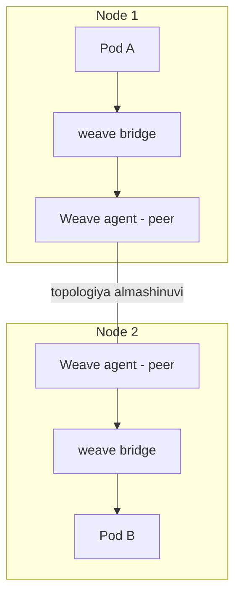
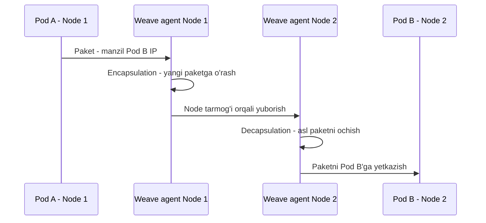

# Dars 233 — CNI Weave: Weave plugin qanday ishlaydi

> 🎯 **Bu darsda nimani o'rganamiz:**
> - Nega oddiy routing jadvali katta klasterlar uchun yetarli emas
> - Weave agent (peer) har bir node'da qanday ishlaydi
> - Paketni "o'rab yuborish" — encapsulation nima
> - Weave'ni klasterga DaemonSet sifatida qanday o'rnatamiz

## Oddiy hayotiy o'xshatish: pochta kompaniyasi

Tasavvur qiling, Kubernetes klasteri — bu bizning kompaniyamiz, node'lar esa turli shaharlardagi ofis binolari. Har binoda bo'limlar, har bo'limda xonalar bor (bular — pod'lar).

Boshida hammasi oddiy: 1-xonadagi xodim 3-xonaga xat yubormoqchi bo'lsa, kuryer bola xatni oladi, mashinasiga o'tirib, GPS'dan manzilni topadi va o'zi olib borib beradi. Kichkina kompaniya uchun bu ishlaydi.

Lekin kompaniya o'sib, boshqa viloyat va davlatlarga tarqalsa-chi? Bitta kuryer yuzlab manzilni yodda saqlay olmaydi va hamma joyga o'zi borib kela olmaydi. Shunda biz butun pochta ishini **professional pochta kompaniyasiga** topshiramiz. Bu kompaniya birinchi qiladigan ishi — **har bir ofisimizga o'z agentini joylashtiradi**. Agentlar doim bir-biri bilan gaplashib turadi: qaysi binoda qaysi bo'lim, qaysi xona borligini hammasi biladi. 10-xonadan 3-xonaga xat yuborilsa, mahalliy agent xatni ushlab qoladi, uni **o'zining yangi konvertiga solib**, ustiga maqsad binoning manzilini yozadi va jo'natadi. U yerdagi agent konvertni ochib, ichidagi asl xatni kerakli xonaga yetkazadi.

Weave xuddi shu pochta kompaniyasi kabi ishlaydi.

## Muammo: routing jadvali katta klasterda yetmaydi

Oldingi darslarda pod networking'ni qo'lda sozlaganimizda har node'da bridge yaratib, node'lar orasida **route** (marshrut) qo'shgan edik: "10.244.2.0/24 tarmog'i — 2-node'da" degan yozuvlar. Paket bir pod'dan boshqa node'dagi pod'ga ketganda router shu jadvalga qarab yo'lni topardi.

Kichik muhitda bu ishlaydi. Lekin yuzlab node va har node'da yuzlab pod bo'lgan katta klasterda routing jadvali bunchalik ko'p yozuvni ko'tara olmasligi mumkin. Shu yerda tayyor CNI yechimlar — masalan **Weaveworks'ning Weave** plugini — yordamga keladi. Kamida bitta yechimni yaxshi tushunib olsangiz, qolganlarini ham osongina anglaysiz.

## Weave qanday ishlaydi

Weave klasterga o'rnatilganda **har bir node'ga bitta agent (peer)** joylashtiradi:

- Agentlar bir-biri bilan doimiy aloqada bo'lib, node'lar, tarmoqlar va ulardagi pod'lar haqidagi ma'lumotni almashadi.
- Har bir agent **butun klaster topologiyasining nusxasini** o'zida saqlaydi — boshqa node'lardagi pod'lar va ularning IP manzillarini biladi.
- Weave har node'da **o'zining bridge'ini** yaratadi va uni `weave` deb nomlaydi, keyin har tarmoqqa IP manzil ajratadi.

💡 Bitta pod bir vaqtning o'zida **bir nechta bridge tarmog'iga** ulangan bo'lishi mumkin — masalan, ham Weave bridge'iga, ham Docker yaratgan docker bridge'iga. Paket qaysi yo'ldan ketishi konteynerda sozlangan route'ga bog'liq. Weave pod'larga to'g'ri route sozlanishini o'zi kafolatlaydi: pod'dan chiqqan trafik avval agentga boradi, qolganini agent hal qiladi.



## Encapsulation — paketni o'rab yuborish

Bir node'dagi pod boshqa node'dagi pod'ga paket yuborganda quyidagilar sodir bo'ladi:

1. Weave agent paketni **ushlab qoladi** (intercept) va bu manzil boshqa tarmoqda ekanini aniqlaydi.
2. Agent paketni **yangi paket ichiga o'raydi** (encapsulation) — yangi source va destination manzillar bilan (endi manzillar node'larniki).
3. Yangi paket oddiy tarmoq orqali maqsad node'ga uchib boradi.
4. U yerdagi Weave agent paketni qabul qilib, **ochadi** (decapsulation) va ichidagi asl paketni kerakli pod'ga yo'naltiradi.



| Bosqich | Kim bajaradi | Nima bo'ladi |
|---|---|---|
| Intercept | Yuboruvchi node'dagi agent | Boshqa tarmoqqa ketayotgan paketni ushlaydi |
| Encapsulation | Yuboruvchi node'dagi agent | Asl paketni yangi paket ichiga soladi |
| Transport | Node'lar tarmog'i | Paket maqsad node'ga yetib boradi |
| Decapsulation | Qabul qiluvchi agent | Konvertni ochib, asl paketni pod'ga beradi |

⚠️ Diagrammalardagi IP manzillar shunchaki misol. Amaliy mashg'ulotda har node'ga qaysi IP diapazoni berilganini o'zingiz aniqlaysiz. IP manzillar pod'larga qanday tarqatilishini (IPAM) keyingi darsda ko'ramiz.

## Weave'ni klasterga o'rnatish

Weave va uning peer'larini har node'da qo'lda service/daemon sifatida ishga tushirish mumkin. Lekin Kubernetes allaqachon tayyor bo'lsa, eng oson yo'l — Weave'ni **klaster ichida pod sifatida** deploy qilish. Buning uchun bitta buyruq yetarli:

```bash
kubectl apply -f "https://github.com/weaveworks/weave/releases/download/v2.8.1/weave-daemonset-k8s.yaml"
```

Bu buyruq Weave uchun kerakli barcha komponentlarni klasterga o'rnatadi. Eng muhimi — Weave peer'lar **DaemonSet** sifatida deploy qilinadi. DaemonSet klasterning **har bir node'sida shu turdagi bittadan pod** ishlashini kafolatlaydi — Weave uchun aynan shu kerak.

Agar klasteringiz kubeadm bilan qurilgan va Weave o'rnatilgan bo'lsa, peer'larni har node'da pod ko'rinishida ko'rishingiz mumkin:

```bash
kubectl get pods -n kube-system
NAME              READY   STATUS    RESTARTS   AGE
weave-net-5gcmb   2/2     Running   0          3d
weave-net-fr9n9   2/2     Running   0          3d
weave-net-mc6s2   2/2     Running   0          3d
```

Muammo bo'lsa, loglarni ko'rish uchun:

```bash
kubectl logs weave-net-5gcmb -n kube-system -c weave
```

## ❓ Savol-Javob

**Savol:** Nega Weave paketni to'g'ridan-to'g'ri yubormasdan, yangi paket ichiga o'rab yuboradi?

**Javob:** Chunki pod IP manzillari faqat klaster ichidagi virtual tarmoqda ma'noga ega — tashqi fizik tarmoq ularni tanimaydi. Weave asl paketni node'lar IP manzillari yozilgan yangi paketga o'raydi, shunda u oddiy tarmoq orqali bemalol yetib boradi. Bu overlay tarmoq deb ataladi.

**Savol:** Weave peer'lar nega aynan DaemonSet sifatida deploy qilinadi?

**Javob:** Weave agenti har bir node'da bittadan ishlashi shart — chunki har node o'z pod'larining trafigini o'zi boshqaradi. DaemonSet aynan shuni kafolatlaydi: klasterga yangi node qo'shilsa, unda avtomatik Weave pod'i ham paydo bo'ladi.

**Savol:** Bitta pod ikkita bridge'ga ulanishi mumkinmi?

**Javob:** Ha. Masalan pod ham weave bridge'ga, ham Docker'ning docker0 bridge'iga ulangan bo'lishi mumkin. Paket qaysi yo'ldan yurishi konteyner ichidagi routing jadvaliga bog'liq — Weave o'zi kerakli route'ni to'g'ri sozlab qo'yadi.

## 📌 CKA imtihon uchun maslahat

Imtihonda CNI plugin qaysi ekanini va sozlamalarini tekshirish so'ralishi mumkin. Quyidagi joylarni yodda tuting:

```bash
# CNI konfiguratsiya fayllari
ls /etc/cni/net.d/

# CNI plugin binarylari
ls /opt/cni/bin/

# Weave pod'larini topish
kubectl get pods -n kube-system | grep weave
```

Hozirgi CKA imtihonida CNI'ni noldan o'rnatish so'ralmaydi, lekin o'rnatilgan yechimni tekshirish va troubleshooting qilish uchun bu buyruqlar juda asqotadi.

## 📖 Asosiy atamalar

| Atama | Oddiy tushuntirish |
|---|---|
| CNI | Container Network Interface — konteyner tarmog'ini sozlash bo'yicha umumiy standart |
| Weave | CNI standartiga mos tayyor tarmoq yechimi (Weaveworks kompaniyasidan) |
| Agent / Peer | Har node'da ishlaydigan Weave xizmati; boshqa peer'lar bilan topologiya almashadi |
| Bridge | Node ichidagi virtual switch; Weave o'zinikini `weave` deb nomlaydi |
| Encapsulation | Asl paketni yangi paket ichiga o'rab yuborish |
| Decapsulation | Yetib kelgan paketni ochib, asl paketni ajratib olish |
| Overlay tarmoq | Fizik tarmoq ustiga qurilgan virtual tarmoq |
| DaemonSet | Har bir node'da bittadan pod ishlashini kafolatlaydigan Kubernetes obyekti |

## 🔗 Manbalar

- [Cluster Networking — kubernetes.io](https://kubernetes.io/docs/concepts/cluster-administration/networking/)
- [Network Plugins — kubernetes.io](https://kubernetes.io/docs/concepts/extend-kubernetes/compute-storage-net/network-plugins/)
- [DaemonSet — kubernetes.io](https://kubernetes.io/docs/concepts/workloads/controllers/daemonset/)
- [Installing Addons (CNI yechimlari ro'yxati) — kubernetes.io](https://kubernetes.io/docs/concepts/cluster-administration/addons/)
- [CNI spetsifikatsiyasi — cni.dev](https://www.cni.dev/docs/spec/)

---
*Bu dars KodeKloud CKA kursining 233-videosi asosida tayyorlandi.*
