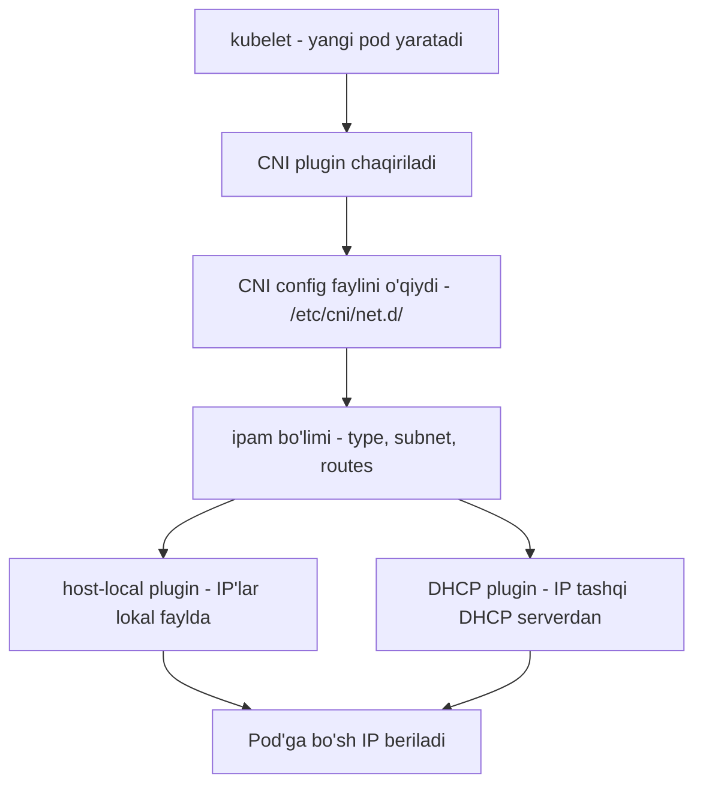
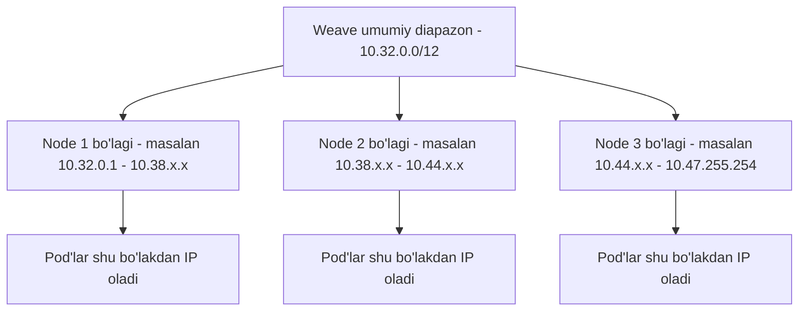

# Dars 236 — IPAM: Weave'da IP manzillarni boshqarish

> 🎯 **Bu darsda nimani o'rganamiz:**
> - Pod'larga IP manzilni KIM beradi — bu kimning vazifasi
> - host-local va DHCP IPAM pluginlari
> - CNI konfiguratsiya faylidagi `ipam` bo'limi
> - Weave'ning standart IP diapazoni — 10.32.0.0/12

## Oddiy hayotiy o'xshatish: yangi uylarga raqam berish

Tasavvur qiling, mahallada yangi uylar qurilmoqda. Har yangi uyga takrorlanmas raqam berish kerak — aks holda pochtachi adashadi. Kim beradi bu raqamni? Mahalla oqsoqoli daftar tutadi: qaysi raqamlar band, qaysilari bo'sh — hammasi yozilgan. Yangi uy bitganda daftardan bo'sh raqam olinadi, uy buzilganda raqam daftardan o'chiriladi va yana bo'shaydi.

Kubernetes'da ham xuddi shunday: har yangi pod'ga (yangi uy) takrorlanmas IP (uy raqami) kerak, va kimdir "daftar" yuritishi shart. Bu ish **IPAM — IP Address Management** deb ataladi.

## Bu dars nima HAQIDA emas

⚠️ Bu bo'lim **node'larning IP manzillari** haqida emas. Node'larga IP berish — sizning yoki tashqi IPAM yechimingizning ishi, Kubernetes bunga aralashmaydi.

Bu darsda gap quyidagilar haqida:

- node ichidagi virtual bridge tarmoqlariga IP subnet qanday ajratiladi;
- pod'larga IP manzil qanday beriladi;
- bu ma'lumot qayerda saqlanadi;
- takroriy (duplicate) IP berilmasligini kim kafolatlaydi.

## IP'ni kim beradi? CNI javob beradi

Standartlarni CNI belgilaydi, shuning uchun undan so'raymiz. CNI qoidasi aniq: **konteynerlarga IP berish — CNI pluginning (ya'ni tarmoq yechimi provayderining) mas'uliyati.**

Esingizda bo'lsa, oldingi darslarda o'zimiz oddiy CNI skript yozgan edik — unda konteyner network namespace'iga IP tayinlaydigan bo'lim bor edi. Kubernetes'ning o'zi buni QANDAY qilishimiz bilan qiziqmaydi. Talab bitta: takroriy IP bermaslik va hammasini tartibli boshqarish.

Eng oddiy usul — band IP'lar ro'yxatini **faylda** saqlash va skriptimizda shu faylni to'g'ri boshqaradigan kod yozish. Bunday fayl har bir host'da turadi va o'sha node'dagi pod'lar IP'larini boshqaradi.

## Tayyor IPAM pluginlar: host-local va DHCP

Bu ishni har safar o'zimiz kodlamasligimiz uchun CNI ikkita tayyor ichki plugin bilan keladi:

| Plugin | Qanday ishlaydi |
|---|---|
| **host-local** | IP'lar ro'yxatini har node'da lokal saqlaydi — yuqorida aytilgan "fayl" usulining tayyor ko'rinishi |
| **DHCP** | IP'larni tashqi DHCP server orqali oladi va boshqaradi |

host-local plugin biz qo'lda qilgan yondashuvning aynan o'zini amalga oshiradi. Lekin uni skriptimizdan **chaqirish baribir bizning zimmamizda**. Yaxshisi — skriptni moslashuvchan qilib, plugin turini konfiguratsiyadan o'qish.

## CNI konfiguratsiyasidagi `ipam` bo'limi

CNI konfiguratsiya faylida (`/etc/cni/net.d/` papkasida) maxsus `ipam` bo'limi bor. Unda plugin turi, subnet va route'lar ko'rsatiladi:

```bash
cat /etc/cni/net.d/net-script.conf
{
    "cniVersion": "0.2.0",
    "name": "mynet",
    "type": "net-script",
    "bridge": "cni0",
    "isGateway": true,
    "ipMasq": true,
    "ipam": {
        "type": "host-local",
        "subnet": "10.244.0.0/16",
        "routes": [
            { "dst": "0.0.0.0/0" }
        ]
    }
}
```

Skriptimiz shu bo'limni o'qib, mos pluginni chaqiradi — `host-local`ni qattiq kodlab qo'yish shart emas.



## Weave IP'larni qanday boshqaradi

Weave o'z IPAM'iga ega. U standart holda butun klaster uchun quyidagi diapazonni ajratadi:

```
10.32.0.0/12
```

Bu — **10.32.0.1 dan 10.47.255.254 gacha** bo'lgan manzillar, jami taxminan **1 048 574 ta IP**. Weave peer'lar shu katta diapazonni o'zaro kelishib, teng qismlarga bo'lib oladi: har node'ga o'z bo'lagi tegadi va o'sha node'da yaratilgan pod'lar shu bo'lakdan IP oladi.



💡 Bu diapazonni Weave'ni o'rnatishda o'zgartirish ham mumkin (masalan `IPALLOC_RANGE` opsiyasi orqali). Klasteringizdagi haqiqiy diapazonni tekshirish uchun:

```bash
kubectl logs -n kube-system weave-net-xxxxx -c weave | grep ipalloc
# yoki pod'lar IP'sini ko'rib taxmin qilish:
kubectl get pods -o wide
```

## 🧪 Mustaqil topshiriqlar

> Yechishdan oldin darsni yopib qo'ying. Taxminiy vaqt: 15 daqiqa.

**1-topshiriq · oson.** Klasterning umumiy Pod CIDR oralig'ini aniqlang.

<details><summary>O'zingizni tekshiring</summary>

```bash
kubectl cluster-info dump | grep -m1 cluster-cidr
```
</details>

**2-topshiriq · o'rta.** Har node'ga qaysi Pod CIDR bo'lagi tegganini chiqaring.

<details><summary>O'zingizni tekshiring</summary>

```bash
kubectl get nodes -o jsonpath='{range .items[*]}{.metadata.name}{"	"}{.spec.podCIDR}{"
"}{end}'
```
</details>

**3-topshiriq · qiyin.** Bitta node nechta Pod sig'dira olishini hisoblang. **Avval ayting:**
chegarani nima belgilaydi?

<details><summary>O'zingizni tekshiring</summary>

Ikki chegara bor va **kichigi** g'olib chiqadi:

1. **IP oralig'i:** `/24` bo'lak = 254 ta manzil.
2. **kubelet chegarasi:** `--max-pods`, standart **110**.

```bash
kubectl get node <nom> -o jsonpath='{.status.capacity.pods}{"
"}'
```
</details>

## ❓ Savol-Javob

**Savol:** Pod'larga IP berish kimning vazifasi — Kubernetes'nikimi yoki CNI pluginnikimi?

**Javob:** CNI pluginniki. CNI standarti bo'yicha tarmoq yechimi (Weave, Flannel, Calico va h.k.) konteynerlarga IP tayinlashga mas'ul. Kubernetes faqat natijani kutadi: takroriy IP bo'lmasin.

**Savol:** host-local va DHCP pluginlarning farqi nimada?

**Javob:** host-local IP'lar ro'yxatini har node'ning o'zida (lokal faylda) yuritadi; DHCP esa IP'larni tashqi DHCP serverdan so'rab oladi. Qaysi biri ishlatilishi CNI config faylidagi `ipam.type` maydonida belgilanadi.

**Savol:** Weave standart holda qaysi diapazondan IP beradi?

**Javob:** 10.32.0.0/12 — ya'ni 10.32.0.1 dan 10.47.255.254 gacha, taxminan bir million manzil. Peer'lar bu diapazonni node'lar orasida bo'lib olishadi.

**Savol:** Ikki node bir xil IP'ni berib yubormasligini kim kafolatlaydi?

**Javob:** IPAM mexanizmi. Weave'da har node umumiy diapazonning faqat o'ziga tegishli bo'lagidan IP beradi, shuning uchun to'qnashuv bo'lmaydi.

## 📌 CKA imtihon uchun maslahat

Imtihonda "pod'lar qaysi IP diapazonidan manzil oladi?" tipidagi savol uchrashi mumkin. Tekshirish yo'llari:

```bash
# CNI config'da ipam bo'limini ko'rish
cat /etc/cni/net.d/*.conf* 

# Weave ishlatilsa - loglardan diapazonni topish
kubectl logs -n kube-system -l name=weave-net -c weave | grep -i ipalloc

# Mavjud pod'lar IP'siga qarash
kubectl get pods -A -o wide
```

## 📖 Asosiy atamalar

| Atama | Oddiy tushuntirish |
|---|---|
| IPAM | IP Address Management — IP manzillarni tarqatish va hisobini yuritish |
| host-local | IP'lar hisobini har node'da lokal yuritadigan tayyor CNI plugin |
| DHCP plugin | IP'larni tashqi DHCP serverdan oladigan CNI plugin |
| Subnet | IP manzillar diapazoni, masalan 10.244.0.0/16 |
| CIDR | Diapazonni yozish usuli: manzil/prefiks (masalan /12, /16, /24) |
| 10.32.0.0/12 | Weave'ning standart pod IP diapazoni (~1 mln manzil) |
| Duplicate IP | Ikki obyektga bir xil IP berilishi — IPAM buni oldini oladi |

## 🔗 Manbalar

- [Network Plugins — kubernetes.io](https://kubernetes.io/docs/concepts/extend-kubernetes/compute-storage-net/network-plugins/)
- [Cluster Networking — kubernetes.io](https://kubernetes.io/docs/concepts/cluster-administration/networking/)
- [host-local IPAM plugin — cni.dev](https://www.cni.dev/plugins/current/ipam/host-local/)
- [DHCP IPAM plugin — cni.dev](https://www.cni.dev/plugins/current/ipam/dhcp/)
- [Weave Net IP allocation hujjatlari — GitHub](https://github.com/weaveworks/weave/blob/master/site/ipam.md)

---
*Bu dars KodeKloud CKA kursining 236-videosi asosida tayyorlandi.*
