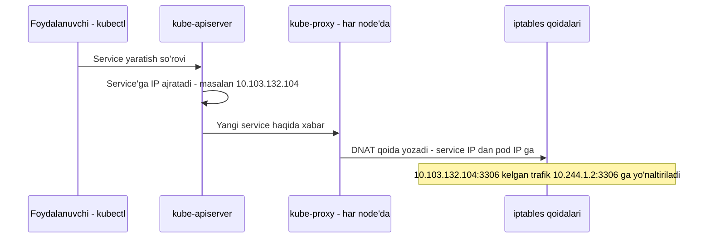
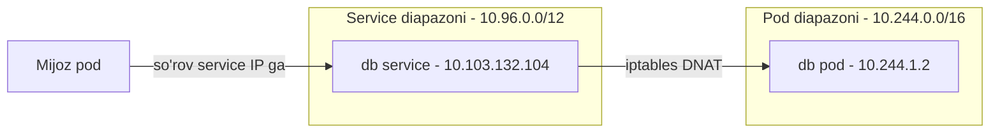

# Dars 238 — Service tarmog'i: kube-proxy va iptables

> 🎯 **Bu darsda nimani o'rganamiz:**
> - Service aslida nima ekanligi — nega u "virtual obyekt"
> - ClusterIP va NodePort qanday ishlaydi
> - kube-proxy servicelarga IP'ni qanday "tiriltiradi" — iptables qoidalari
> - `--service-cluster-ip-range` va proxy rejimlari (userspace, ipvs, iptables)

## Oddiy hayotiy o'xshatish: call-markaz raqami

Pod'ning IP'siga to'g'ridan-to'g'ri murojaat qilish — bu xodimning shaxsiy telefon raqamiga qo'ng'iroq qilishga o'xshaydi: xodim ishdan ketsa (pod o'chsa), raqam ham o'ladi. Service esa — kompaniyaning **call-markaz raqami**: raqam doim bitta, ammo bu raqamda hech qanday "jonli telefon" turmaydi — telefon stansiyasi (kube-proxy) qo'ng'iroqni hozir ishlayotgan xodimga avtomatik ulab beradi. Xodimlar almashaveradi, raqam o'zgarmaydi.

## Qisqa takror: pod networking'dan service'gacha

Oldingi darslarda ko'rdik: har node'da bridge tarmoq yaratiladi, pod'lar namespace va interfeys olib, node'ga ajratilgan subnet'dan IP oladi. Route yoki overlay usullari bilan turli node'lardagi pod'lar bir-biriga yetadi — katta virtual tarmoq hosil bo'ladi.

Lekin amalda pod'lar bir-biriga to'g'ridan-to'g'ri IP bilan murojaat qilmaydi — har doim **Service** ishlatiladi:

- **ClusterIP** — service'ga IP va nom beriladi, unga **faqat klaster ichidan** kirish mumkin. Pod qaysi node'da bo'lishidan qat'i nazar, klasterning istalgan pod'i bu service'ga yeta oladi. Ichki baza (database) uchun ayni muddao.
- **NodePort** — ClusterIP kabi ishlaydi, lekin qo'shimcha ravishda ilovani **barcha node'lardagi bitta portda** ochib beradi — tashqi foydalanuvchilar ham kira oladi.

| Xususiyat | ClusterIP | NodePort |
|---|---|---|
| Klaster ichidan kirish | ✅ | ✅ |
| Klaster tashqarisidan kirish | ❌ | ✅ (har node IP'sida port ochiladi) |
| Qayerda "yashaydi" | Butun klaster bo'ylab | Butun klaster bo'ylab + har node porti |
| Odatiy foydalanish | Ichki xizmatlar, DB | Tashqariga ochiladigan web ilova |

💡 Pod bitta node'da joylashadi, service esa **butun klasterga tegishli** — u hech bir node'ga bog'lanmagan.

## Service — aslida mavjud emas!

Eng qiziq joyi shu: service uchun **hech qanday jarayon, namespace yoki interfeys yaratilmaydi**. Pod'da konteyner bor, konteynerda namespace, interfeys, IP bor. Service'da esa bularning hech biri yo'q — service IP'sida hech kim "tinglab o'tirmaydi". Service — bu shunchaki **virtual obyekt**.

Unda u qanday ishlaydi? Javob — **kube-proxy**.

Har node'da ikkita muhim jarayon ishlaydi:

- **kubelet** — kube-apiserver orqali o'zgarishlarni kuzatadi, yangi pod yaratish kerak bo'lsa yaratadi va tarmog'ini sozlash uchun CNI pluginni chaqiradi;
- **kube-proxy** — ham apiserver'ni kuzatadi, lekin u **service'lar** paydo bo'lganda ishga tushadi.

Service yaratilganda unga oldindan belgilangan diapazondan IP beriladi. Keyin har node'dagi kube-proxy shu IP'ni olib, **har node'da forwarding qoidalarini** yozadi: "shu IP:port'ga kelgan har qanday trafik — pod'ning IP:port'iga yo'naltirilsin". Shundan keyin istalgan node'dagi istalgan pod service IP'siga murojaat qilsa, trafik pod'ga borib tushadi. Service yaratilsa yoki o'chirilsa, kube-proxy qoidalarni mos ravishda qo'shadi yoki o'chiradi.



## Proxy rejimlari

kube-proxy qoidalarni bir necha usulda yarata oladi:

| Rejim | Qanday ishlaydi |
|---|---|
| **userspace** | kube-proxy har service uchun portda o'zi tinglab, ulanishlarni pod'larga proksi qiladi (eski, sekin usul) |
| **ipvs** | Yadro darajasidagi IPVS qoidalarini yaratadi (katta klasterlar uchun samarali) |
| **iptables** | iptables NAT qoidalarini yozadi — **standart (default) rejim** |

Rejim kube-proxy'ni sozlashda `--proxy-mode` opsiyasi bilan tanlanadi:

```bash
kube-proxy --proxy-mode [userspace | ipvs | iptables] ...
```

Agar ko'rsatilmasa — **iptables** ishlatiladi. Quyida aynan shu rejimni ko'ramiz.

## Service IP diapazoni: --service-cluster-ip-range

Service'lar IP oladigan diapazon **kube-apiserver'ning** `--service-cluster-ip-range` opsiyasida belgilanadi (standart qiymati 10.0.0.0/24):

```bash
kube-apiserver --service-cluster-ip-range ipNet   # Default: 10.0.0.0/24
```

Amaldagi qiymatni tekshirib ko'ramiz:

```bash
ps aux | grep kube-apiserver
kube-apiserver --authorization-mode=Node,RBAC ... --service-cluster-ip-range=10.96.0.0/12 ...
```

Bizning klasterda `10.96.0.0/12` — demak service'lar **10.96.0.0 dan 10.111.255.255 gacha** IP oladi.

⚠️ **Muhim:** pod tarmog'i uchun esa `10.244.0.0/16` (pod-network-cidr) berilgan — bu **10.244.0.0 – 10.244.255.255**. Ikkala diapazon **hech qachon kesishmasligi (overlap qilmasligi) kerak** — bitta IP ham pod'ga, ham service'ga tegib qolishi mumkin emas. Bizning holatda kesishmaydi, hammasi joyida.



## iptables qoidalarini o'z ko'zimiz bilan ko'ramiz

Misol: node-1'da `db` nomli pod bor, IP'si `10.244.1.2`. Uni klaster ichida ochish uchun ClusterIP service yaratdik — Kubernetes unga `10.103.132.104` manzilini berdi:

```bash
kubectl get pods -o wide
NAME   READY   STATUS    RESTARTS   AGE   IP           NODE
db     1/1     Running   0          5m    10.244.1.2   node-1

kubectl get service
NAME         TYPE        CLUSTER-IP       EXTERNAL-IP   PORT(S)    AGE
db-service   ClusterIP   10.103.132.104   <none>        3306/TCP   1m
```

kube-proxy yaratgan qoidalarni iptables'ning **NAT jadvalidan** ko'rish mumkin. kube-proxy har qoidaga service nomini komment qilib yozadi, shuning uchun nom bo'yicha qidirish oson:

```bash
iptables -L -t nat | grep db-service
KUBE-SVC-XA5OGUC7YRHOS3PU  tcp  --  anywhere  10.103.132.104  /* default/db-service:3306 cluster IP */  tcp dpt:3306
DNAT                       tcp  --  anywhere  anywhere        /* default/db-service:3306 */             to:10.244.1.2:3306
```

Bu qoidalarning ma'nosi: **10.103.132.104:3306** (service IP:port) ga ketayotgan har qanday trafikning manzili **10.244.1.2:3306** (pod IP:port) ga almashtirilsin. Bu iptables'ga **DNAT** qoidasi qo'shish orqali qilinadi. Esda tuting — bu yerda faqat IP emas, **IP + port juftligi** muhim.

NodePort service yaratilganda ham kube-proxy xuddi shunday iptables qoidalarini yozadi — faqat endi **barcha node'lardagi portga** kelgan trafik ham backend pod'larga yo'naltiriladi.

kube-proxy bu yozuvlarni o'z logida ham qayd etadi — logda qaysi proxy rejimi ishlatilayotganini va yangi service qo'shilganini ko'rasiz:

```bash
cat /var/log/kube-proxy.log
Using iptables Proxier.
...
Adding new service "default/db-service:3306" at 10.103.132.104:3306/TCP
```

⚠️ Log faylning joylashuvi o'rnatish usulingizga qarab farq qilishi mumkin. Yozuvlar ko'rinmasa, jarayonning verbosity (batafsillik) darajasini ham tekshiring.

## ❓ Savol-Javob

**Savol:** Service IP'sida qaysi jarayon "tinglab" turadi?

**Javob:** Hech qaysi! Service — virtual obyekt: uning jarayoni ham, namespace'i ham, interfeysi ham yo'q. Har node'dagi kube-proxy yozgan iptables qoidalari service IP'ga kelgan trafikni pod IP'ga yo'naltiradi — shu tufayli service "ishlab turgandek" ko'rinadi.

**Savol:** Pod bilan service'ning farqi: qayerda "yashaydi"?

**Javob:** Pod aniq bitta node'da joylashadi. Service esa klaster bo'ylab mavjud — chunki uning qoidalari HAR BIR node'ga yoziladi, shuning uchun istalgan node'dagi pod unga yeta oladi.

**Savol:** Service va pod diapazonlari kesishsa nima bo'ladi?

**Javob:** Bitta IP ham pod'ga, ham service'ga tegishi mumkin — bu tarmoqni butunlay chalkashtiradi. Shuning uchun `--service-cluster-ip-range` (masalan 10.96.0.0/12) va pod CIDR (masalan 10.244.0.0/16) alohida, kesishmaydigan diapazonlar bo'lishi shart.

**Savol:** kube-proxy'ning standart rejimi qaysi?

**Javob:** iptables. `--proxy-mode` ko'rsatilmasa, kube-proxy iptables rejimida ishlaydi. Boshqa variantlar — userspace (eski) va ipvs (katta klasterlar uchun).

## 📌 CKA imtihon uchun maslahat

Service networking bo'yicha troubleshooting savollarida shu buyruqlar ketma-ketligi qo'l keladi:

```bash
# Service diapazonini topish
ps aux | grep kube-apiserver | grep service-cluster-ip-range
# yoki static pod manifestidan:
grep service-cluster-ip-range /etc/kubernetes/manifests/kube-apiserver.yaml

# kube-proxy rejimini aniqlash
kubectl logs -n kube-system kube-proxy-xxxxx | grep -i proxier
# yoki configmap orqali:
kubectl describe configmap kube-proxy -n kube-system | grep mode

# Service uchun iptables qoidalarini ko'rish
iptables -L -t nat | grep <service-nomi>
```

kube-proxy DaemonSet sifatida ishlashini va service'ga IP'ni apiserver berishini yodda tuting — imtihonda "service'ga IP'ni kim beradi?" degan savol tez-tez uchraydi.

## 📖 Asosiy atamalar

| Atama | Oddiy tushuntirish |
|---|---|
| Service | Pod'larga barqaror IP/nom beradigan virtual obyekt |
| ClusterIP | Faqat klaster ichidan kiriladigan service turi |
| NodePort | Har node'ning portida tashqariga ham ochiladigan service turi |
| kube-proxy | Har node'da ishlab, service qoidalarini (iptables/ipvs) yozadigan komponent |
| iptables | Linux yadrosining paket filtrlash/NAT mexanizmi — default proxy rejimi |
| DNAT | Destination NAT — paketning borar manzilini almashtirish |
| --service-cluster-ip-range | apiserver opsiyasi: service'lar IP oladigan diapazon |
| ipvs | Yadro darajasidagi yuk balanslash — muqobil proxy rejimi |
| userspace | Eski proxy rejimi — kube-proxy trafikni o'zi proksi qiladi |

## 🔗 Manbalar

- [Service — kubernetes.io](https://kubernetes.io/docs/concepts/services-networking/service/)
- [Virtual IPs and Service Proxies (proxy rejimlari) — kubernetes.io](https://kubernetes.io/docs/reference/networking/virtual-ips/)
- [kube-proxy reference — kubernetes.io](https://kubernetes.io/docs/reference/command-line-tools-reference/kube-proxy/)
- [kube-apiserver reference (--service-cluster-ip-range) — kubernetes.io](https://kubernetes.io/docs/reference/command-line-tools-reference/kube-apiserver/)
- [Debug Services — kubernetes.io](https://kubernetes.io/docs/tasks/debug/debug-application/debug-service/)

---
*Bu dars KodeKloud CKA kursining 238-videosi asosida tayyorlandi.*
