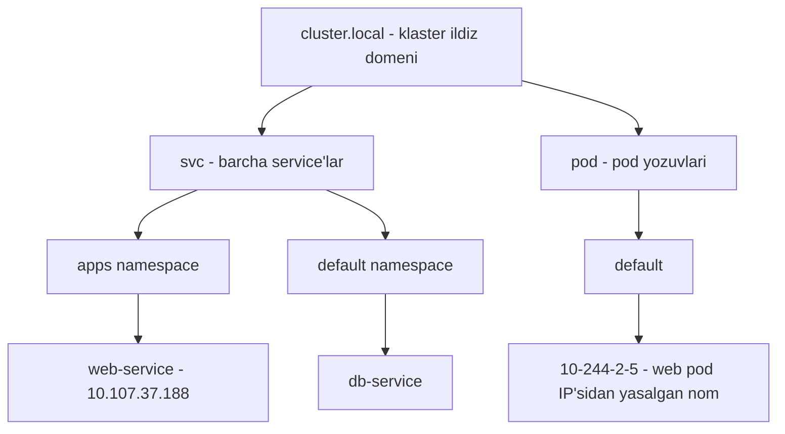
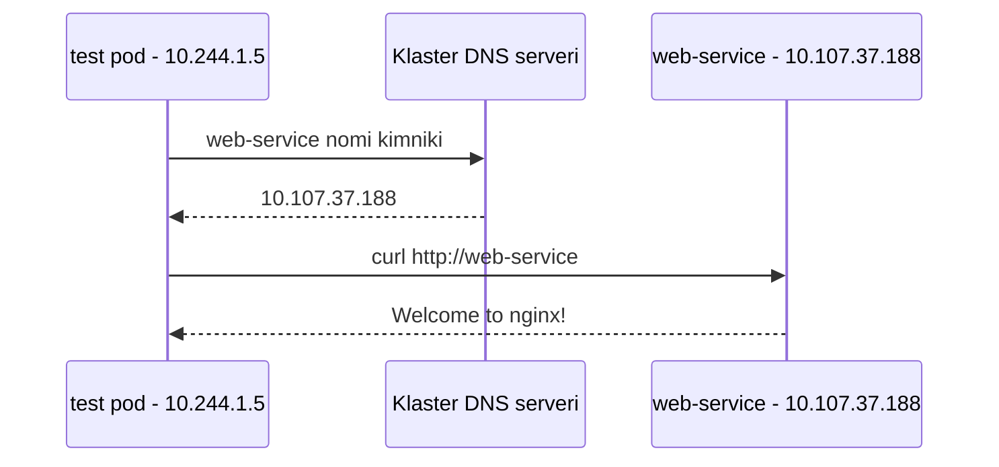

# Dars 241 — Kubernetes'da DNS: service va pod nomlari

> 🎯 **Bu darsda nimani o'rganamiz:**
> - Klaster ichida qaysi obyektga qanday DNS nom beriladi
> - Service'ning to'liq nomi: `service.namespace.svc.cluster.local`
> - Boshqa namespace'dagi service'ga qanday murojaat qilinadi
> - Pod'lar uchun DNS yozuvlari — IP'ni tire bilan yozish

## Oddiy hayotiy o'xshatish: ism, familiya va to'liq manzil

Bitta oilada odamlar bir-birini shunchaki ism bilan chaqiradi: "Aziz!". Qo'shni mahalladagi Azizni chaqirmoqchi bo'lsangiz, aniqlik kerak: "Yunusobod'dagi Aziz". Rasmiy hujjatda esa to'liq yoziladi: "Aziz, Yunusobod tumani, Toshkent shahri, O'zbekiston".

Kubernetes DNS ham xuddi shunday ishlaydi:

- o'z namespace'ingizdagi service — shunchaki **ism**: `web-service`
- boshqa namespace'dagi service — **ism + familiya**: `web-service.apps`
- to'liq rasmiy nom (FQDN): `web-service.apps.svc.cluster.local`

## Bu darsda nimaga e'tibor qaratamiz

Bizda 3 node'li klaster bor, unda pod va service'lar ishlaydi. Node'larning nomlari va IP'lari odatda tashkilotingizdagi tashqi DNS serverda ro'yxatga olingan — bu darsda ular bizni qiziqtirmaydi. Biz **klaster ichidagi** DNS'ga qaraymiz: pod'lar bir-birini va service'larni qanday nom bilan topadi.

💡 Kubernetes klaster o'rnatilganda **ichki DNS serverni avtomatik** deploy qiladi (qo'lda o'rnatgan bo'lsangiz — o'zingiz qilasiz). Uning ichki tuzilishini keyingi darsda ko'ramiz; hozircha shart bitta: tarmoq to'g'ri sozlangan, barcha pod va service'lar IP orqali bir-biriga yeta oladi.

## Service DNS yozuvlari

Ikkita pod va bitta service'dan boshlaymiz:

- chapda `test` pod'i — IP: `10.244.1.5`
- o'ngda `web` pod'i — IP: `10.244.2.5` (IP'lariga qarab, ular turli node'larda ekanini taxmin qilish mumkin — lekin DNS uchun buning ahamiyati yo'q)

Web serverni test pod'iga ochib berish uchun `web-service` nomli service yaratamiz. Service IP oladi: `10.107.37.188`. Service yaratilgan zahoti Kubernetes DNS xizmati u uchun **yozuv (record)** yaratadi — nomni IP'ga bog'laydi:

| Nom | IP |
|---|---|
| web-service | 10.107.37.188 |

Endi klasterdagi istalgan pod service'ga **nomi orqali** murojaat qila oladi:

```bash
curl http://web-service
Welcome to nginx!
```

### Boshqa namespace'dan murojaat

Yuqoridagi oddiy `web-service` nomi faqat **bir xil namespace ichida** ishlaydi (test pod va web-service ikkalasi `default`da bo'lgani uchun). Agar web-service `apps` nomli boshqa namespace'da bo'lsa, `default`dan turib unga "familiyasi" bilan murojaat qilamiz:

```bash
curl http://web-service.apps
```

Bu yerda `web-service` — service nomi, `apps` — namespace nomi. DNS server **har bir namespace uchun subdomain** yaratadi.

### To'liq nom (FQDN) qanday quriladi

Barcha service'lar yana bitta subdomain'ga — `svc` ga guruhlanadi. Va nihoyat, hammasi klasterning ildiz (root) domeni ostiga yig'iladi — standart holda bu `cluster.local`. Shunday qilib:

```bash
curl http://web-service.apps.svc.cluster.local
```

Bu — service'ning **to'liq malakali domen nomi (FQDN)**.



| Qism | Misol | Ma'nosi |
|---|---|---|
| hostname | web-service | Service nomi |
| namespace | apps | Namespace nomi |
| type | svc | Obyekt turi (service) |
| root | cluster.local | Klaster ildiz domeni |

Natija: `web-service.apps.svc.cluster.local`

## Pod DNS yozuvlari

Pod'lar uchun DNS yozuvlari **standart holda yaratilmaydi**, lekin buni maxsus yoqish mumkin (qanday yoqilishini keyingi darsda ko'ramiz). Yoqilganda pod'lar uchun ham yozuv yaratiladi, ammo **pod nomi ishlatilmaydi**. Buning o'rniga Kubernetes pod IP'sidagi **nuqtalarni tirega almashtirib** nom yasaydi:

- `web` pod (IP `10.244.2.5`, namespace `apps`) → `10-244-2-5.apps.pod.cluster.local`
- `test` pod (IP `10.244.1.5`, namespace `default`) → `10-244-1-5.default.pod.cluster.local`

Bu nom pod'ning IP manziliga resolve bo'ladi:

```bash
curl http://10-244-2-5.apps.pod.cluster.local
Welcome to nginx!
```

| Obyekt | IP | DNS nomi |
|---|---|---|
| web-service (apps ns) | 10.107.37.188 | web-service.apps.svc.cluster.local |
| web pod (apps ns) | 10.244.2.5 | 10-244-2-5.apps.pod.cluster.local |
| test pod (default ns) | 10.244.1.5 | 10-244-1-5.default.pod.cluster.local |



## 🧪 Mustaqil topshiriqlar

> Yechishdan oldin darsni yopib qo'ying. Taxminiy vaqt: 15 daqiqa.

**1-topshiriq · oson.** Vaqtinchalik Pod ochib, `kubernetes` servisining DNS nomini yechib ko'ring.

<details><summary>O'zingizni tekshiring</summary>

```bash
kubectl run t --rm -it --image=busybox:1.37 --restart=Never -- nslookup kubernetes
```
</details>

**2-topshiriq · o'rta.** Boshqa namespace'dagi servisga to'liq FQDN bilan murojaat qiling.

<details><summary>O'zingizni tekshiring</summary>

```bash
kubectl run t --rm -it --image=busybox:1.37 --restart=Never \
  -- nslookup kube-dns.kube-system.svc.cluster.local
```
</details>

**3-topshiriq · qiyin.** Pod ichidagi `/etc/resolv.conf` ni o'qing. **Avval ayting:** u yerda
nima yozilgan bo'ladi?

<details><summary>O'zingizni tekshiring</summary>

```bash
kubectl exec <pod> -- cat /etc/resolv.conf
```

```text
nameserver 10.96.0.10
search default.svc.cluster.local svc.cluster.local cluster.local
options ndots:5
```

`search` qatori tufayli qisqa nom (`web`) avtomatik to'liq nomga
kengaytiriladi. `ndots:5` esa nuqtasi 5 tadan kam bo'lgan har nomni
avval shu qo'shimchalar bilan sinashni bildiradi.
</details>

## ❓ Savol-Javob

**Savol:** Bir xil namespace'dagi service'ga to'liq nom bilan murojaat qilish shartmi?

**Javob:** Yo'q. Bir namespace ichida qisqa nom yetarli: `web-service`. To'liq nom (`web-service.default.svc.cluster.local`) ham ishlaydi, lekin shart emas. Boshqa namespace'ga esa kamida `service.namespace` ko'rinishida murojaat qilinadi.

**Savol:** Service'ning FQDN'i qanday tuziladi?

**Javob:** `<service-nomi>.<namespace>.svc.cluster.local` — masalan `web-service.apps.svc.cluster.local`. Bu yerda `svc` — service'lar subdomeni, `cluster.local` — klasterning standart ildiz domeni.

**Savol:** Pod uchun DNS nomi nega `10-244-2-5` ko'rinishida?

**Javob:** Pod yozuvlarida pod nomi ishlatilmaydi — Kubernetes pod IP'sidagi nuqtalarni tirega almashtirib nom yasaydi: 10.244.2.5 → 10-244-2-5. To'liq nomi: `10-244-2-5.apps.pod.cluster.local` (type qismi `svc` emas, `pod` bo'ladi).

**Savol:** Pod'lar uchun DNS yozuvlari doim bormi?

**Javob:** Yo'q, standart holda o'chirilgan. Uni CoreDNS konfiguratsiyasida (`pods` opsiyasi) alohida yoqish kerak — bu keyingi darsning mavzusi.

## 📌 CKA imtihon uchun maslahat

Imtihonda service nomini resolve qilishni tekshirish tez-tez uchraydi. Test pod ichidan tekshirish:

```bash
kubectl exec -it test -- nslookup web-service
kubectl exec -it test -- nslookup web-service.apps.svc.cluster.local
```

FQDN qolipini yodlab oling: `service.namespace.svc.cluster.local` va pod uchun `ip-tire-bilan.namespace.pod.cluster.local`. "Boshqa namespace'dagi service ishlamayapti" degan masalada birinchi navbatda nomga namespace qo'shilganini tekshiring.

## 📖 Asosiy atamalar

| Atama | Oddiy tushuntirish |
|---|---|
| DNS | Nomni IP manzilga aylantirib beruvchi "kontaktlar kitobi" |
| DNS record (yozuv) | Nom → IP bog'lamasi |
| FQDN | Fully Qualified Domain Name — obyektning to'liq domen nomi |
| Subdomain | Domen ichidagi bo'lim (masalan namespace nomi, svc, pod) |
| cluster.local | Kubernetes klasterining standart ildiz domeni |
| svc | DNS iyerarxiyasida barcha service'lar to'planadigan subdomain |
| Pod DNS yozuvi | IP nuqtalari tirega almashtirilgan nom: 10-244-2-5.default.pod.cluster.local |
| nslookup / host / dig | DNS'ni tekshirish uchun ishlatiladigan utilitalar |

## 🔗 Manbalar

- [DNS for Services and Pods — kubernetes.io](https://kubernetes.io/docs/concepts/services-networking/dns-pod-service/)
- [Service — kubernetes.io](https://kubernetes.io/docs/concepts/services-networking/service/)
- [Namespaces — kubernetes.io](https://kubernetes.io/docs/concepts/overview/working-with-objects/namespaces/)
- [Debugging DNS Resolution — kubernetes.io](https://kubernetes.io/docs/tasks/administer-cluster/dns-debugging-resolution/)

---
*Bu dars KodeKloud CKA kursining 241-videosi asosida tayyorlandi.*
