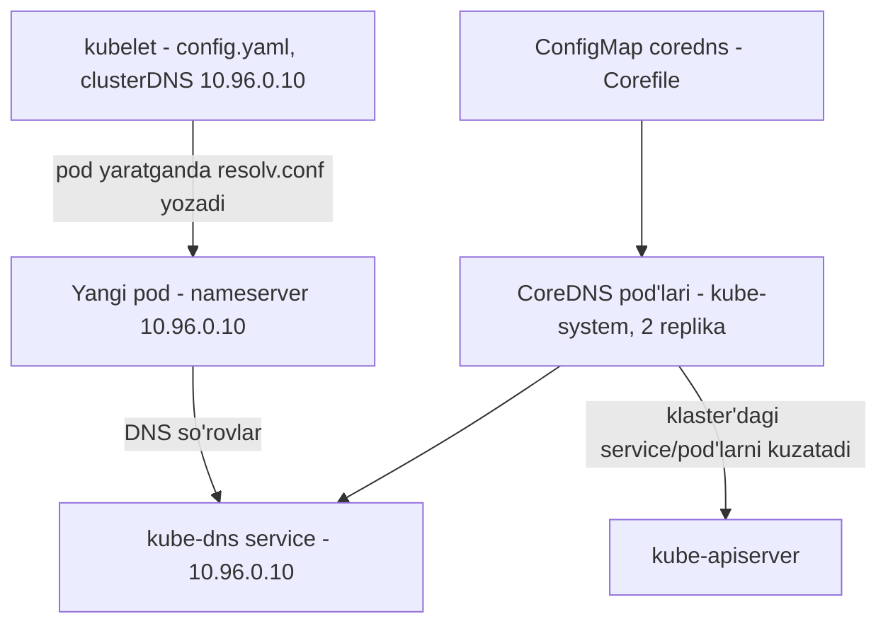
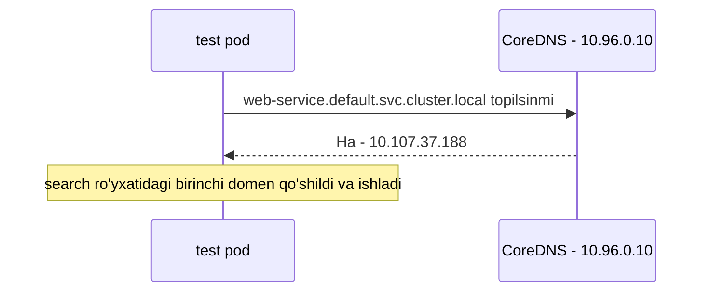

# Dars 242 — Kubernetes'da CoreDNS: klaster DNS'i qanday qurilgan

> 🎯 **Bu darsda nimani o'rganamiz:**
> - Kubernetes klaster ichida DNS'ni QANDAY amalga oshiradi
> - CoreDNS deployment va Corefile (ConfigMap sifatida)
> - kubelet pod'larga DNS sozlamasini (resolv.conf) qanday beradi
> - resolv.conf'dagi search domainlar qisqa nomlarni qanday ishlatishga imkon beradi

## Oddiy hayotiy o'xshatish: umumiy ma'lumotnoma xizmati

Har kim qo'shnilarining telefon raqamini o'z daftariga yozib yursa (`/etc/hosts`), mahallaga har kuni yangi odamlar ko'chib kelib-ketaverganda hamma daftarlar eskirib qoladi. Buning o'rniga mahallada bitta **ma'lumotnoma xizmati** ochiladi (CoreDNS) — ko'chib kelgan har bir odam ro'yxatga avtomatik qo'shiladi, va har bir uyga "savolingiz bo'lsa shu raqamga qo'ng'iroq qiling" degan yozuv beriladi (resolv.conf). Yozuvni har uyga tarqatadigan pochtachi — bu **kubelet**.

## Nega /etc/hosts yechim emas

Ikki pod bor deylik: `test` (10.244.1.5) va `web` (10.244.2.5). Ularni bir-birini nom bilan topadigan qilishning eng sodda yo'li — har birining `/etc/hosts` fayliga yozuv qo'shish:

```bash
# test pod ichida:
cat >> /etc/hosts
10.244.2.5    web

# web pod ichida:
cat >> /etc/hosts
10.244.1.5    test
```

Lekin klasterda minglab pod bo'lsa va har daqiqada yuzlab pod yaratilib-o'chirilsa, bu usul yaroqsiz. Shuning uchun yozuvlarni **markaziy DNS serverga** ko'chiramiz, pod'larni esa `/etc/resolv.conf` fayli orqali shu serverga yo'naltiramiz:

```bash
cat /etc/resolv.conf
nameserver    10.96.0.10
```

Endi yangi pod yaratilganda DNS serverga uning yozuvi qo'shiladi va pod'ning resolv.conf'i DNS serverga qaratiladi. Kubernetes taxminan shunday ishlaydi — bitta farq bilan: **pod nomi → IP** ko'rinishidagi yozuvlar yaratilmaydi (bu faqat service'lar uchun qilinadi). Pod'lar uchun, oldingi darsda ko'rganimizdek, IP'dagi nuqtalar tirega almashtirilib hostname yasaladi (10-244-2-5).

💡 Kubernetes 1.12 versiyasigacha ichki DNS server **kube-dns** deb atalgan; 1.12'dan boshlab tavsiya etilgan yechim — **CoreDNS**.

## CoreDNS klasterda qanday joylashgan

CoreDNS klasterda `kube-system` namespace'da **pod sifatida** deploy qilinadi — aniqrog'i, ishonchlilik uchun **2 ta replika** bilan (Deployment ichidagi ReplicaSet):

```bash
kubectl get pods -n kube-system
NAME                       READY   STATUS    RESTARTS   AGE
coredns-78fcdf6894-hlhjq   1/1     Running   0          10d
coredns-78fcdf6894-vqzjk   1/1     Running   0          10d

kubectl get deployment -n kube-system
NAME      READY   UP-TO-DATE   AVAILABLE   AGE
coredns   2/2     2            2           10d
```

Bu pod'lar `coredns` executable faylini ishga tushiradi — CoreDNS'ni o'zimiz alohida o'rnatganimizda ishlatgan aynan o'sha dastur.

## Corefile — CoreDNS konfiguratsiyasi

CoreDNS'ga konfiguratsiya fayli kerak — u `/etc/coredns/Corefile` da joylashgan:

```bash
cat /etc/coredns/Corefile
.:53 {
    errors
    health
    kubernetes cluster.local in-addr.arpa ip6.arpa {
       pods insecure
       upstream
       fallthrough in-addr.arpa ip6.arpa
    }
    prometheus :9153
    proxy . /etc/resolv.conf
    cache 30
    reload
}
```

Bu faylda bir nechta **plugin** sozlangan:

| Plugin | Vazifasi |
|---|---|
| errors | Xatolarni qayd etish |
| health | Sog'liq monitoringi |
| prometheus | Metrikalar |
| cache | Javoblarni keshlashtirish |
| reload | Config o'zgarganda qayta yuklash |
| **kubernetes** | CoreDNS'ni Kubernetes bilan ishlatadigan asosiy plugin |
| proxy | Klasterdan tashqaridagi nomlarni yuqori DNS'ga uzatish |

Eng muhimi — **kubernetes** plugini. Aynan shu yerda klasterning yuqori darajali domeni belgilanadi: `cluster.local`. DNS serverdagi har bir yozuv shu domen ostiga tushadi.

- `pods insecure` opsiyasi — pod'lar uchun yozuv yaratishga mas'ul (IP'ni tire formatiga aylantirish). Bu **standart holda o'chirilgan**, aynan shu yozuv bilan yoqiladi.
- DNS server hal qila olmagan nomlar (masalan pod `www.google.com`ga murojaat qilsa) `proxy . /etc/resolv.conf` qatori orqali **CoreDNS pod'ining o'z resolv.conf faylida** ko'rsatilgan nameserver'ga uzatiladi — u esa **Kubernetes node'ining nameserver'ini** ishlatadi.

⚠️ Corefile pod'ga **ConfigMap obyekti sifatida** uzatiladi. Ya'ni konfiguratsiyani o'zgartirish kerak bo'lsa, ConfigMap'ni tahrirlaysiz:

```bash
kubectl get configmap -n kube-system
NAME       DATA   AGE
coredns    1      10d

kubectl edit configmap coredns -n kube-system
```

CoreDNS ishga tushgach, u klasterni kuzatib turadi: yangi pod yoki service yaratilishi bilan o'z bazasiga yozuv qo'shadi.

## Pod'lar DNS serverni qanday topadi — kubelet'ning roli

CoreDNS deploy qilinganda u boshqa komponentlar unga murojaat qila olishi uchun **service ham yaratadi** — bu service tarixiy sabablarga ko'ra `kube-dns` deb nomlanadi:

```bash
kubectl get service -n kube-system
NAME       TYPE        CLUSTER-IP   EXTERNAL-IP   PORT(S)         AGE
kube-dns   ClusterIP   10.96.0.10   <none>        53/UDP,53/TCP   10d
```

Aynan shu service'ning IP'si (10.96.0.10) har pod'da nameserver sifatida sozlanadi. Buni qo'lda qilish shart emas — **pod yaratilayotganda DNS sozlamasini Kubernetes avtomatik qo'yadi**. Qaysi komponent qiladi deb o'ylaysiz? **kubelet!**

kubelet konfiguratsiya faylida DNS server IP'si va domeni yozilgan:

```bash
cat /var/lib/kubelet/config.yaml
...
clusterDNS:
- 10.96.0.10
clusterDomain: cluster.local
...
```

kubelet har yangi pod yaratganda shu qiymatlarni pod'ning `/etc/resolv.conf` fayliga yozib qo'yadi.



## Search domainlar — qisqa nom sehri

Pod to'g'ri nameserver bilan sozlangach, boshqa pod va service'larni resolve qila oladi. Masalan `web-service`ga bu nomlarning istalgani bilan murojaat qilish mumkin:

```bash
curl http://web-service
curl http://web-service.default
curl http://web-service.default.svc
curl http://web-service.default.svc.cluster.local
```

Qo'lda tekshirsak:

```bash
kubectl exec -it test -- nslookup web-service
Server:     10.96.0.10
Address:    10.96.0.10#53

Name:   web-service.default.svc.cluster.local
Address: 10.107.37.188
```

Qiziq: biz faqat `web-service` deb so'radik, javobda esa **to'liq FQDN** qaytdi. Qanday qilib? Sir — pod'ning resolv.conf faylidagi **search** qatorida:

```bash
cat /etc/resolv.conf
nameserver    10.96.0.10
search        default.svc.cluster.local svc.cluster.local cluster.local
```

Qisqa nom yozilganda tizim search ro'yxatidagi domenlarni navbat bilan qo'shib ko'radi:



⚠️ **Muhim:** search yozuvlari faqat **service'lar uchun** mos keladi (`svc.cluster.local` va h.k.). Shuning uchun pod'ga qisqa nom bilan yetib bo'lmaydi — pod uchun **to'liq FQDN** yozish shart:

```bash
kubectl exec -it test -- nslookup 10-244-2-5.default.pod.cluster.local
Name:   10-244-2-5.default.pod.cluster.local
Address: 10.244.2.5
```

| Murojaat | Ishlaydimi? |
|---|---|
| `web-service` | ✅ (search domen yordamida) |
| `web-service.default` | ✅ |
| `web-service.default.svc` | ✅ |
| `web-service.default.svc.cluster.local` | ✅ (to'liq FQDN) |
| `10-244-2-5` (pod, qisqa) | ❌ — search faqat service uchun |
| `10-244-2-5.default.pod.cluster.local` | ✅ (to'liq FQDN) |

## 🧪 Mustaqil topshiriqlar

> Yechishdan oldin darsni yopib qo'ying. Taxminiy vaqt: 15 daqiqa.

**1-topshiriq · oson.** CoreDNS Deployment'ida nechta replika ishlayotganini aniqlang.

<details><summary>O'zingizni tekshiring</summary>

```bash
kubectl get deployment coredns -n kube-system
```
</details>

**2-topshiriq · o'rta.** `kube-dns` servisining ClusterIP manzilini toping va u Pod'lardagi
`resolv.conf` bilan mos kelishini tekshiring.

<details><summary>O'zingizni tekshiring</summary>

```bash
kubectl get svc kube-dns -n kube-system
```
</details>

**3-topshiriq · qiyin.** CoreDNS'ni 0 replikaga tushiring va DNS so'rov yuboring. **Avval ayting:**
qanday xato chiqadi?

<details><summary>O'zingizni tekshiring</summary>

```bash
kubectl scale deployment coredns -n kube-system --replicas=0
kubectl run t --rm -it --image=busybox:1.37 --restart=Never -- nslookup kubernetes
```

```text
;; connection timed out; no servers could be reached
```

Diqqat: **IP manzillar baribir ishlaydi** — faqat nomlar yechilmaydi.
Shuning uchun "ilova ishlamayapti, lekin ping o'tadi" holatida birinchi
gumon — DNS.

Qaytarish: `kubectl scale deployment coredns -n kube-system --replicas=2`
</details>

## ❓ Savol-Javob

**Savol:** Pod'larning resolv.conf faylini kim sozlaydi?

**Javob:** kubelet. Uning konfiguratsiyasida (`/var/lib/kubelet/config.yaml`) clusterDNS (10.96.0.10) va clusterDomain (cluster.local) yozilgan — har yangi pod yaratilganda kubelet shu qiymatlarni pod'ning /etc/resolv.conf'iga yozadi.

**Savol:** CoreDNS konfiguratsiyasini qanday o'zgartiramiz?

**Javob:** Corefile pod'ga ConfigMap sifatida beriladi, shuning uchun `kubectl edit configmap coredns -n kube-system` bilan tahrirlanadi — pod ichiga kirib fayl o'zgartirish shart emas.

**Savol:** Nega `web-service` qisqa nomi ishlaydi-yu, pod'ning qisqa nomi ishlamaydi?

**Javob:** Pod'ning resolv.conf'idagi search ro'yxati faqat service subdomainlarini o'z ichiga oladi (default.svc.cluster.local, svc.cluster.local, cluster.local). Pod yozuvlari `pod.cluster.local` ostida — u search'da yo'q, shuning uchun pod'ga faqat to'liq FQDN bilan murojaat qilinadi.

**Savol:** DNS service nega kube-dns deb nomlanadi, pod'lar esa coredns?

**Javob:** 1.12'gacha DNS server kube-dns bo'lgan; CoreDNS'ga o'tilganda moslik (compatibility) saqlansin deb service nomi kube-dns ligicha qoldirilgan.

## 📌 CKA imtihon uchun maslahat

DNS bilan bog'liq troubleshooting'da tekshiruv tartibi:

```bash
# 1. CoreDNS pod'lari ishlayaptimi?
kubectl get pods -n kube-system -l k8s-app=kube-dns

# 2. kube-dns service va endpointlari joyidami?
kubectl get svc kube-dns -n kube-system
kubectl get endpoints kube-dns -n kube-system

# 3. Corefile'ni ko'rish
kubectl describe configmap coredns -n kube-system

# 4. kubelet'dagi DNS sozlamalari
grep -A2 clusterDNS /var/lib/kubelet/config.yaml

# 5. Pod ichidan tekshirish
kubectl exec -it test -- cat /etc/resolv.conf
kubectl exec -it test -- nslookup web-service
```

Imtihonda "pod service'ni resolve qila olmayapti" masalasida avval CoreDNS pod'lari va kube-dns endpointlarini, keyin pod'ning resolv.conf'ini tekshiring.

## 📖 Asosiy atamalar

| Atama | Oddiy tushuntirish |
|---|---|
| CoreDNS | Kubernetes'ning zamonaviy ichki DNS serveri (1.12'dan boshlab) |
| kube-dns | Eski DNS yechimi nomi; hozir DNS service'ning nomi sifatida saqlanib qolgan |
| Corefile | CoreDNS konfiguratsiya fayli (/etc/coredns/Corefile) |
| ConfigMap | Konfiguratsiyani pod'larga uzatuvchi Kubernetes obyekti |
| kubernetes plugini | CoreDNS'ni klaster obyektlari bilan bog'laydigan plugin |
| pods insecure | Pod'lar uchun DNS yozuvlarini yoqadigan Corefile opsiyasi |
| resolv.conf | Pod ichidagi DNS sozlama fayli — nameserver va search qatorlari |
| search domain | Qisqa nomga avtomatik qo'shib sinab ko'riladigan domenlar ro'yxati |
| clusterDNS / clusterDomain | kubelet config'idagi DNS IP (10.96.0.10) va domen (cluster.local) |

## 🔗 Manbalar

- [DNS for Services and Pods — kubernetes.io](https://kubernetes.io/docs/concepts/services-networking/dns-pod-service/)
- [Customizing DNS Service — kubernetes.io](https://kubernetes.io/docs/tasks/administer-cluster/dns-custom-nameservers/)
- [Using CoreDNS for Service Discovery — kubernetes.io](https://kubernetes.io/docs/tasks/administer-cluster/coredns/)
- [Debugging DNS Resolution — kubernetes.io](https://kubernetes.io/docs/tasks/administer-cluster/dns-debugging-resolution/)
- [CoreDNS kubernetes plugin hujjati — coredns.io](https://coredns.io/plugins/kubernetes/)

---
*Bu dars KodeKloud CKA kursining 242-videosi asosida tayyorlandi.*
