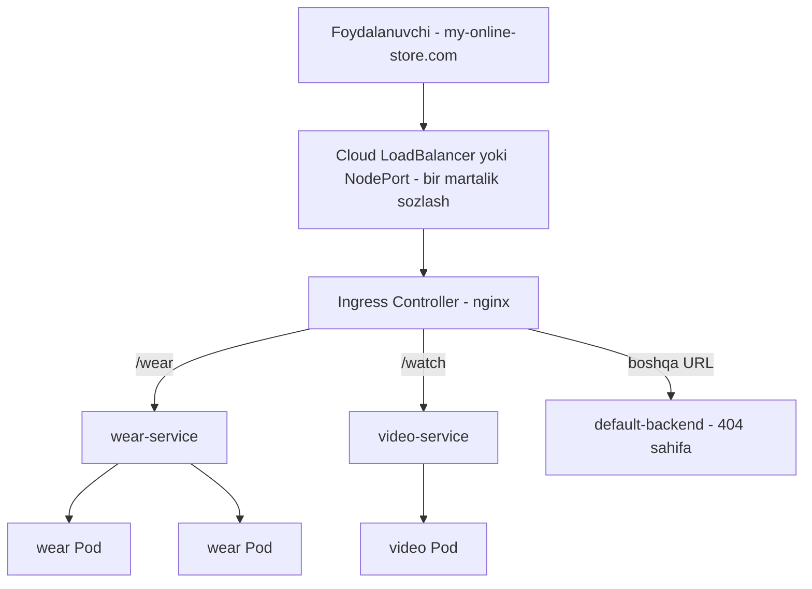
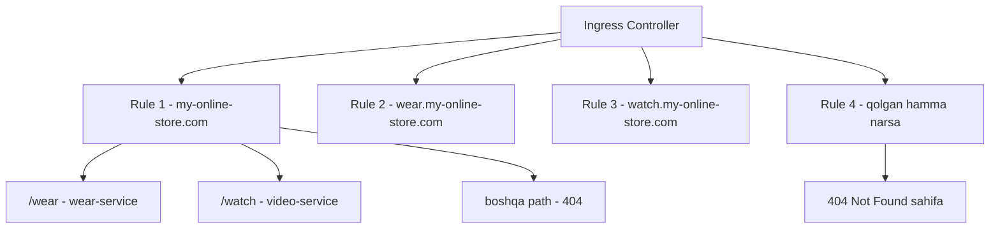

# Dars 245 — Ingress: klasterga kiruvchi trafikni boshqarish

> 🎯 **Bu darsda nimani o'rganamiz:**
> - Nima uchun Service (NodePort/LoadBalancer)ning o'zi yetmaydi — onlayn do'kon misolida
> - Ingress Controller va Ingress Resource nima, ular qanday farq qiladi
> - nginx Ingress Controller'ni qanday o'rnatish (Deployment, Service, ConfigMap, ServiceAccount)
> - Ingress qoidalari: bitta backend, path bo'yicha routing, host bo'yicha routing
> - Imperativ usul: `kubectl create ingress` buyrug'i
> - Annotations va `rewrite-target` — URL'ni qayta yozish

## 🏢 Oddiy hayotiy o'xshatish

Ingress'ni katta biznes markazining **bosh resepshni** deb tasavvur qiling. Binoda o'nlab firmalar (Service'lar) bor, lekin ko'chaga qaragan eshik — bitta. Mehmon kirib "menga do'kon kerak" desa, resepshn uni 2-qavatga, "video studiya kerak" desa 5-qavatga yo'naltiradi. Har bir firma uchun alohida ko'cha eshigi (alohida LoadBalancer) qurish qimmat va chalkash bo'lardi. Ingress ham xuddi shunday: **bitta kirish nuqtasi, ichkarida esa URL bo'yicha aqlli yo'naltirish**.

## 1. Muammo: onlayn do'kon misoli

Keling, hammasini boshidan, real stsenariy bilan ko'rib chiqamiz. Siz `my-online-store.com` degan onlayn do'kon uchun ilova yozdingiz va uni Kubernetes'ga joyladingiz:

1. Ilovani Docker image qilib qurdingiz va klasterda Pod (Deployment) sifatida ishga tushirdingiz.
2. Ilovaga ma'lumotlar bazasi kerak — MySQL'ni alohida Pod qilib joyladingiz va unga `mysql-service` nomli **ClusterIP** turidagi Service yaratdingiz (bu faqat klaster ichida ko'rinadi).
3. Ilovani tashqi dunyoga ochish uchun **NodePort** turidagi Service yaratdingiz — unga `30080` port ajratildi.

Endi foydalanuvchilar `http://<istalgan-node-IP>:30080` orqali do'konga kira oladi. Trafik oshsa, Pod replikalarini ko'paytirasiz — Service trafikni Pod'lar orasida o'zi bo'lib beradi. Ishlayapti-ku, muammo nimada?

### Muammolar birin-ketin chiqa boshlaydi

- **IP yodlash noqulay.** Foydalanuvchi IP manzil termasligi uchun DNS sozlaysiz — endi `my-online-store.com:30080` ishlaydi.
- **Port raqami ham noqulay.** NodePort faqat 30000 dan yuqori portlarni ajrata oladi, `80`ni bera olmaydi. Shuning uchun DNS bilan klaster orasiga qo'shimcha **proxy server** qo'yasiz: u 80-portga kelgan so'rovni node'lardagi 30080-portga uzatadi. Endi foydalanuvchi shunchaki `my-online-store.com` deb kiradi.
- **Cloud'da bo'lsangiz-chi?** Google Cloud (GCP) kabi bulutda NodePort o'rniga **LoadBalancer** turidagi Service ishlatasiz. Kubernetes baribir NodePort ajratadi, lekin qo'shimcha ravishda GCP'dan tarmoq load balancer'i so'raydi. GCP tashqi IP'li load balancer yaratib beradi, DNS'ni shu IP'ga qaratasiz — foydalanuvchilar `my-online-store.com` orqali kiradi. Zo'r!
- **Biznes o'sdi — yangi xizmat qo'shildi.** Endi video striming xizmati ham bor: foydalanuvchi `my-online-store.com/watch` ga kirsa video, `/wear` ga kirsa kiyimlar do'koni ochilishi kerak. Video ilova butunlay alohida Deployment sifatida shu klasterda turadi va unga `video-service` nomli LoadBalancer Service yaratasiz. Kubernetes unga yangi port (masalan, 38282) va **yana bitta yangi cloud load balancer** ajratadi — yangi IP bilan.

Va mana asosiy og'riqlar:

- ⚠️ **Har bir LoadBalancer uchun alohida pul to'laysiz** — xizmatlar ko'paygani sari cloud hisobingiz shishib boradi.
- URL path (`/watch`, `/wear`) bo'yicha trafikni bo'lish uchun load balancer'lar tepasiga **yana bitta** proxy/load balancer kerak. Har yangi xizmat qo'shilganda uni qayta sozlash kerak.
- **SSL (HTTPS) qayerda sozlanadi?** Ilova ichidami, load balancer'dami, proxy'dami? Har bir jamoa o'zicha qilsa — tartibsizlik. Buni bir joyda, minimal xarajat bilan sozlash kerak.
- Har yangi xizmat uchun firewall qoidalari, turli jamoalar ishtiroki... boshqarish qiyinlashadi.

Hamma shu konfiguratsiyani **Kubernetes'ning ichida**, boshqa manifest fayllar qatorida oddiy YAML fayl bilan boshqarsak qanday yaxshi bo'lardi, to'g'rimi? Aynan shu yerda **Ingress** yordamga keladi.

## 2. Ingress nima?

**Ingress** — foydalanuvchilarga bitta tashqi URL orqali kirish imkonini berib, trafikni URL path yoki domen nomiga qarab klaster ichidagi turli Service'larga yo'naltiruvchi va shu bilan birga SSL'ni ham amalga oshiruvchi Kubernetes obyekti.

💡 Ingress'ni **Kubernetes klasteri ichiga qurilgan Layer 7 (HTTP darajasidagi) load balancer** deb tushunish mumkin — u boshqa Kubernetes obyektlari kabi oddiy YAML definition fayllar bilan sozlanadi.

⚠️ **Muhim eslatma:** Ingress'ning o'zini ham baribir bir marta tashqariga ochish kerak — yo NodePort, yo cloud LoadBalancer orqali. Lekin bu **bir martalik** sozlash. Keyin barcha load balancing, SSL va URL routing ishlari faqat Ingress darajasida bajariladi.



## 3. Ingress Controller va Ingress Resource

Ingress'siz bu ishni qanday qilardingiz? nginx, HAProxy yoki Traefik kabi reverse proxy'ni klasterga o'zingiz o'rnatib, URL marshrutlari va SSL sertifikatlarini qo'lda sozlagan bo'lardingiz. Kubernetes ham Ingress'ni deyarli shu tarzda amalga oshiradi, faqat ikki qismga bo'lib:

| Tushuncha | Nima u? |
|---|---|
| **Ingress Controller** | Klasterga o'rnatiladigan yechim (nginx, HAProxy, Traefik...) — trafikni amalda yo'naltiruvchi "dvigatel" |
| **Ingress Resource** | Controller'ga beriladigan qoidalar to'plami — oddiy YAML definition fayl |

⚠️ **Kubernetes klasteri sukut bo'yicha Ingress Controller bilan kelmaydi!** Kursdagi demolar bo'yicha klaster qurgan bo'lsangiz, unda controller yo'q. Faqat Ingress resource yaratib, "ishlasin" deb kutsangiz — ishlamaydi.

Controller sifatida bir nechta yechim bor: **GCE** (Google'ning L7 HTTP load balancer'i), **nginx**, Contour, HAProxy, Traefik, Istio. Bulardan GCE va nginx hozirda Kubernetes loyihasi tomonidan qo'llab-quvvatlanadi. Biz misol sifatida **nginx**'ni ishlatamiz.

### Ingress Controller — bu shunchaki nginx emas

Ingress controller'lar oddiy load balancer'dan ko'proq narsa: ular klasterni **kuzatib turadi** — yangi Ingress resource paydo bo'lsa yoki o'zgarsa, nginx konfiguratsiyasini avtomatik yangilaydi.

## 4. nginx Ingress Controller'ni o'rnatish

nginx controller klasterda **oddiy Deployment** sifatida joylanadi. To'liq o'rnatish 4 ta obyektdan iborat:

### 4.1. Deployment

```yaml
apiVersion: apps/v1
kind: Deployment
metadata:
  name: nginx-ingress-controller
spec:
  replicas: 1
  selector:
    matchLabels:
      name: nginx-ingress
  template:
    metadata:
      labels:
        name: nginx-ingress
    spec:
      containers:
        - name: nginx-ingress-controller
          image: quay.io/kubernetes-ingress-controller/nginx-ingress-controller:0.21.0
      args:
        - /nginx-ingress-controller
        - --configmap=$(POD_NAMESPACE)/nginx-configuration
      env:
        - name: POD_NAME
          valueFrom:
            fieldRef:
              fieldPath: metadata.name
        - name: POD_NAMESPACE
          valueFrom:
            fieldRef:
              fieldPath: metadata.namespace
      ports:
        - name: http
          containerPort: 80
        - name: https
          containerPort: 443
```

Bu yerda nimalar muhim:

- **image** — bu Kubernetes'da ingress controller sifatida ishlash uchun maxsus qurilgan nginx build'i, oddiy nginx emas.
- **args** — image ichida nginx dasturi `/nginx-ingress-controller` yo'lida turadi, shuning uchun uni ishga tushirish buyrug'i sifatida beramiz.
- **env** — controller o'z konfiguratsiyasini o'qishi uchun Pod nomi va namespace'ini environment variable qilib berish **shart**.
- **ports** — controller 80 va 443 portlarda ishlaydi.

### 4.2. ConfigMap

nginx'ning odatiy sozlamalari (log yo'li, keep-alive, SSL sozlamalari, session timeout...) bor. Bu sozlamalarni image'dan ajratish uchun ConfigMap yaratib, controller'ga uzatamiz:

```yaml
apiVersion: v1
kind: ConfigMap
metadata:
  name: nginx-configuration
```

💡 Hozircha ConfigMap **bo'sh bo'lsa ham bo'ladi**. Lekin uni oldindan yaratib qo'yish kelajakda qulaylik beradi: biror nginx sozlamasini o'zgartirmoqchi bo'lsangiz, nginx konfiguratsiya fayllarini titkilamasdan, shunchaki shu ConfigMap'ga yozib qo'yasiz.

### 4.3. Service (tashqariga ochish)

Controller'ni tashqi dunyoga ochish uchun NodePort turidagi Service yaratamiz va uni label selector orqali Deployment'ga bog'laymiz:

```yaml
apiVersion: v1
kind: Service
metadata:
  name: nginx-ingress
spec:
  type: NodePort
  ports:
    - port: 80
      targetPort: 80
      protocol: TCP
      name: http
    - port: 443
      targetPort: 443
      protocol: TCP
      name: https
  selector:
    name: nginx-ingress
```

### 4.4. ServiceAccount (ruxsatlar)

Controller klasterdagi Ingress resource'larni kuzatishi va o'zgarish bo'lganda nginx'ni qayta sozlashi kerak, dedik. Buning uchun unga to'g'ri ruxsatlar berilgan **ServiceAccount** kerak — tegishli Role va RoleBinding'lar bilan:

```yaml
apiVersion: v1
kind: ServiceAccount
metadata:
  name: nginx-ingress-serviceaccount
```

📌 **Xulosa qilib:** Deployment (nginx-ingress image) + Service (tashqariga ochish) + ConfigMap (nginx sozlamalari) + ServiceAccount (ruxsatlar) = eng sodda ko'rinishdagi tayyor Ingress Controller.

## 5. Ingress Resource — qoidalarni yozamiz

Ingress resource — controller'ga qo'llanadigan qoidalar va sozlamalar to'plami. Qoidalar bilan siz:

- barcha kiruvchi trafikni **bitta ilovaga** yuborishingiz,
- **URL path bo'yicha** turli ilovalarga bo'lishingiz (`/wear` → do'kon, `/watch` → video),
- yoki **domen nomi bo'yicha** yo'naltirishingiz mumkin (`wear.my-online-store.com` → do'kon, `watch.my-online-store.com` → video).

### 5.1. Eng sodda hol: bitta backend

Trafik hech qachon to'g'ridan-to'g'ri Pod'larga emas, **Service orqali** yo'naltiriladi. Agar backend bitta bo'lsa, qoidalar shart emas — shunchaki service nomi va portini ko'rsatamiz:

```yaml
apiVersion: networking.k8s.io/v1
kind: Ingress
metadata:
  name: ingress-wear
spec:
  defaultBackend:
    service:
      name: wear-service
      port:
        number: 80
```

Yaratamiz va tekshiramiz:

```bash
kubectl apply -f ingress-wear.yaml
# ingress.networking.k8s.io/ingress-wear created

kubectl get ingress
# NAME           CLASS    HOSTS   ADDRESS   PORTS   AGE
# ingress-wear   <none>   *                 80      2s
```

Endi barcha kiruvchi trafik to'g'ridan-to'g'ri `wear-service`ga boradi.

### 5.2. Qoidalar (rules) qanday tuzilgan

Turli shartlar asosida yo'naltirish kerak bo'lganda **rules** ishlatiladi. Tuzilishi ikki qavatli:

- **Tepada — har bir host (domen) uchun bitta rule.** Masalan: 1-rule `my-online-store.com` uchun, 2-rule `wear.my-online-store.com` uchun, 3-rule `watch.my-online-store.com` uchun, 4-rule — qolgan hamma narsa uchun. (Bir nechta DNS yozuvini bitta ingress controller Service'iga qaratib, turli domenlar bilan klasterga kirish mumkin.)
- **Har bir rule ichida — turli path'lar.** Masalan 1-rule ichida: `/wear` → kiyimlar ilovasi, `/watch` → video ilovasi, qolgani → 404 sahifa. 2-rule ichida `/`, `/exchange`, `/support` kabi path'lar bo'lishi mumkin, 3-rule ichida `/movies`, `/tv` va hokazo.



### 5.3. Path bo'yicha routing

Talab: `my-online-store.com`ga kelgan barcha trafikni URL path bo'yicha bo'lish. Domen bitta bo'lgani uchun **bitta rule** yetadi, uning ichida ikkita path:

```yaml
apiVersion: networking.k8s.io/v1
kind: Ingress
metadata:
  name: ingress-wear-watch
spec:
  rules:
    - http:
        paths:
          - path: /wear
            pathType: Prefix
            backend:
              service:
                name: wear-service
                port:
                  number: 80
          - path: /watch
            pathType: Prefix
            backend:
              service:
                name: watch-service
                port:
                  number: 80
```

```bash
kubectl apply -f ingress-wear-watch.yaml

kubectl describe ingress ingress-wear-watch
# Name:             ingress-wear-watch
# Default backend:  default-http-backend:80
# Rules:
#   Host        Path  Backends
#   ----        ----  --------
#   *
#               /wear    wear-service:80
#               /watch   watch-service:80
```

`describe` chiqishida ikkala path va ular ko'rsatayotgan backend service'larni ko'rasiz.

💡 **Default backend nima?** `describe` natijasiga diqqat qiling — `Default backend: default-http-backend:80` degan qator bor. Foydalanuvchi qoidalarning hech biriga mos kelmaydigan URL'ga kirsa (masalan, `/listen` yoki `/eat` — sizda esa audio yoki ovqat yetkazish xizmati yo'q), so'rov shu default backend'ga yo'naltiriladi. Chiroyli **404 Not Found** sahifasini ko'rsatish uchun shu nomdagi service'ni **o'zingiz deploy qilishni unutmang**.

### 5.4. Host (domen) bo'yicha routing

Endi ikkita domen bor: `wear.my-online-store.com` va `watch.my-online-store.com`. Har biriga alohida rule yozamiz va `host` maydonidan foydalanamiz:

```yaml
apiVersion: networking.k8s.io/v1
kind: Ingress
metadata:
  name: ingress-wear-watch
spec:
  rules:
    - host: wear.my-online-store.com
      http:
        paths:
          - pathType: Prefix
            path: /
            backend:
              service:
                name: wear-service
                port:
                  number: 80
    - host: watch.my-online-store.com
      http:
        paths:
          - pathType: Prefix
            path: /
            backend:
              service:
                name: watch-service
                port:
                  number: 80
```

`host` maydoni so'rov URL'idagi domen nomi bilan solishtiriladi va trafik mos backend'ga boradi. Bu yerda har bir rule'da bitta path bor — bu domenning istalgan path'iga kelgan trafik shu backend'ga boradi degani. Xohlasangiz, har bir rule ichida yana bir nechta path ham yozishingiz mumkin.

### Ikki usulni taqqoslash

| | Path bo'yicha bo'lish | Host bo'yicha bo'lish |
|---|---|---|
| Rules soni | 1 ta | 2 ta (har domen uchun bittadan) |
| Path'lar | Har rule'da 2 ta (`/wear`, `/watch`) | Har rule'da 1 ta (`/`) |
| `host` maydoni | Yozilmaydi (`*` — istalgan domen) | Har rule'da yoziladi |
| Misol URL | `my-online-store.com/watch` | `watch.my-online-store.com` |

## 6. Imperativ usul: `kubectl create ingress` (246-maqoladan)

Kubernetes **1.20+** versiyalaridan boshlab Ingress'ni YAML yozmasdan, bitta buyruq bilan ham yaratish mumkin:

```bash
# Format:
kubectl create ingress <ingress-nomi> --rule="host/path=service:port"

# Misol:
kubectl create ingress ingress-test --rule="wear.my-online-store.com/wear*=wear-service:80"
```

📌 Bu CKA imtihonida vaqtni juda tejaydi! Qo'shimcha misollar: [kubectl create ingress hujjati](https://kubernetes.io/docs/reference/generated/kubectl/kubectl-commands#-em-ingress-em-).

💡 Shuni ham bilib qo'ying: eski Kubernetes versiyalarida Ingress `apiVersion: extensions/v1beta1` bilan yozilardi va backend `serviceName`/`servicePort` maydonlarini ishlatardi. Hozirgi barqaror versiya — `networking.k8s.io/v1`, unda backend `service.name` va `service.port.number` ko'rinishida yoziladi (yuqoridagi misollardagidek).

## 7. Annotations va rewrite-target (247-maqoladan)

Har bir ingress controller'ning o'ziga xos qo'shimcha sozlamalari bor va ular **annotations** orqali beriladi. nginx Ingress Controller'ning shunday muhim opsiyalaridan biri — **rewrite-target**. Bu bizga lablarda kerak bo'ladi.

### Muammo

Bizning ilovalar o'z sahifalarini ildiz (`/`) path'ida ko'rsatadi:

- watch ilova: `http://<watch-service>:<port>/`
- wear ilova: `http://<wear-service>:<port>/`

Biz esa Ingress'da `/watch` va `/wear` path'larini sozladik — bular faqat **ingress darajasidagi** yo'llar, ilovalarning o'zida bunday path yo'q. Bizga kerak:

```
http://<ingress-service>:<ingress-port>/watch  -->  http://<watch-service>:<port>/
http://<ingress-service>:<ingress-port>/wear   -->  http://<wear-service>:<port>/
```

Lekin rewrite-target'siz amalda bunday bo'ladi:

```
http://<ingress-service>:<ingress-port>/watch  -->  http://<watch-service>:<port>/watch
http://<ingress-service>:<ingress-port>/wear   -->  http://<wear-service>:<port>/wear
```

⚠️ E'tibor bering: backend URL oxirida `/watch` va `/wear` qolib ketyapti. Ilovalar bunday path'ni kutmaydi — natijada **404 Not Found** xatosi qaytadi.

### Yechim

So'rov backend'ga uzatilayotganda URL'ni **qayta yozamiz** (ReWrite). `rewrite-target` annotatsiyasi `rules -> http -> paths -> path`dagi qiymatni o'zi ko'rsatgan qiymatga almashtiradi — xuddi "topish va almashtirish" (search and replace) funksiyasi kabi:

```
replace(path, rewrite-target)
bizning holatda: replace("/pay", "/")
```

```yaml
apiVersion: extensions/v1beta1
kind: Ingress
metadata:
  name: test-ingress
  namespace: critical-space
  annotations:
    nginx.ingress.kubernetes.io/rewrite-target: /
spec:
  rules:
  - http:
      paths:
      - path: /pay
        backend:
          serviceName: pay-service
          servicePort: 8282
```

Endi `/pay`ga kelgan so'rov backend'ga `/` bo'lib boradi.

### Regex bilan murakkabroq misol

rewrite'ni regulyar ifodalar bilan ham yozish mumkin — `replace("/something(/|$)(.*)", "/$2")`:

```yaml
apiVersion: extensions/v1beta1
kind: Ingress
metadata:
  annotations:
    nginx.ingress.kubernetes.io/rewrite-target: /$2
  name: rewrite
  namespace: default
spec:
  rules:
  - host: rewrite.bar.com
    http:
      paths:
      - backend:
          serviceName: http-svc
          servicePort: 80
        path: /something(/|$)(.*)
```

Bu yerda `/something/foo/bar`ga kelgan so'rov backend'ga `/foo/bar` bo'lib boradi (`$2` — regexdagi ikkinchi guruh). nginx controller'ning boshqa ko'plab annotatsiyalarini [rasmiy ro'yxatdan](https://kubernetes.github.io/ingress-nginx/user-guide/nginx-configuration/annotations/) ko'rishingiz mumkin.

## ❓ Savol-Javob

"Savol:" Service (NodePort/LoadBalancer) bor-ku, Ingress nimaga kerak?
"Javob:" Service faqat trafikni Pod'largacha yetkazadi. URL path bo'yicha routing, bitta kirish nuqtasi, SSL — bularni Service qilmaydi. Ingress bularning hammasini bitta Kubernetes YAML fayli bilan hal qiladi va har bir xizmat uchun alohida (pullik) cloud LoadBalancer yaratish shart bo'lmaydi.

"Savol:" Ingress Controller bilan Ingress Resource'ning farqi nima?
"Javob:" Controller — klasterga o'rnatiladigan real dastur (masalan, nginx'ning maxsus build'i), trafikni amalda yo'naltiradi. Resource — controller'ga beriladigan qoidalar yozilgan YAML obyekt. Controller'siz resource'ning o'zi hech narsa qilmaydi.

"Savol:" Klasterda Ingress Controller sukut bo'yicha bormi?
"Javob:" Yo'q! Kubernetes klasteri controller'siz keladi. Uni o'zingiz o'rnatishingiz kerak (nginx, GCE, HAProxy, Traefik, Contour, Istio...). Faqat Ingress resource yaratsangiz — u ishlamaydi.

"Savol:" Foydalanuvchi hech bir qoidaga mos kelmaydigan URL'ga kirsa nima bo'ladi?
"Javob:" So'rov default backend'ga boradi (masalan, `default-http-backend` service). U yerda odatda 404 sahifa ko'rsatiladi — bunday service'ni o'zingiz deploy qilib qo'yishingiz kerak.

"Savol:" rewrite-target'siz nima uchun 404 xato chiqadi?
"Javob:" Chunki ingress path'i (masalan `/watch`) backend'ga o'zgarmasdan uzatiladi, ilova esa o'zida `/watch` degan path yo'qligi uchun 404 qaytaradi. `rewrite-target: /` annotatsiyasi path'ni `/`ga almashtirib yuboradi.

## 📌 CKA imtihon uchun maslahat

- Ingress'ni tez yaratish uchun imperativ buyruqni yodlab oling: `kubectl create ingress <nom> --rule="host/path=service:port"`. Vaqtni sezilarli tejaydi.
- `kubectl get ingress -A` bilan klasterdagi bor ingress'larni, `kubectl describe ingress <nom>` bilan rules va backend'larni tez ko'ring.
- Ingress **namespace'ga bog'liq** obyekt — uni backend Service qaysi namespace'da bo'lsa, o'sha yerda yarating.
- Lab masalalarida ilova 404 qaytarsa, birinchi bo'lib `rewrite-target` annotatsiyasi bor-yo'qligini tekshiring.
- apiVersion sifatida `networking.k8s.io/v1` ishlating va `pathType` (odatda `Prefix`) yozishni unutmang — v1'da bu majburiy maydon.

## 📖 Asosiy atamalar

| Atama | Oddiy tushuntirish |
|---|---|
| Ingress | Klasterga kiruvchi HTTP/HTTPS trafikni URL bo'yicha Service'larga yo'naltiruvchi Kubernetes obyekti |
| Ingress Controller | Ingress qoidalarini amalda bajaruvchi dastur (nginx, HAProxy, Traefik...) — alohida o'rnatiladi |
| Ingress Resource | Routing qoidalari yozilgan YAML definition fayl |
| Layer 7 load balancer | HTTP darajasida (URL, host, header'larni ko'rib) ishlaydigan load balancer |
| Rule | Bitta host (domen) uchun yo'naltirish qoidasi |
| Path | Rule ichidagi URL yo'li (`/wear`, `/watch`) — har biri o'z backend'iga ega |
| Default backend | Hech bir qoidaga tushmagan so'rovlar boradigan service (odatda 404 sahifa) |
| Annotation | Controller'ga xos qo'shimcha sozlamalarni beruvchi metadata yozuvi |
| rewrite-target | nginx annotatsiyasi — backend'ga uzatishdan oldin URL path'ni almashtiradi |
| NodePort | Service turi — ilovani node'larning yuqori portida (30000+) ochadi |
| LoadBalancer | Service turi — cloud provayderdan tashqi IP'li load balancer so'raydi |

## 🔗 Manbalar

- [Ingress — rasmiy hujjat](https://kubernetes.io/docs/concepts/services-networking/ingress/)
- [Ingress path turlari (pathType)](https://kubernetes.io/docs/concepts/services-networking/ingress/#path-types)
- [Ingress Controllers ro'yxati](https://kubernetes.io/docs/concepts/services-networking/ingress-controllers/)
- [kubectl create ingress — imperativ buyruq](https://kubernetes.io/docs/reference/generated/kubectl/kubectl-commands#-em-ingress-em-)
- [nginx Ingress Controller annotatsiyalari](https://kubernetes.github.io/ingress-nginx/user-guide/nginx-configuration/annotations/)

---
*Bu dars KodeKloud CKA kursining 245-videosi hamda 246- va 247-maqolalari asosida tayyorlandi.*
