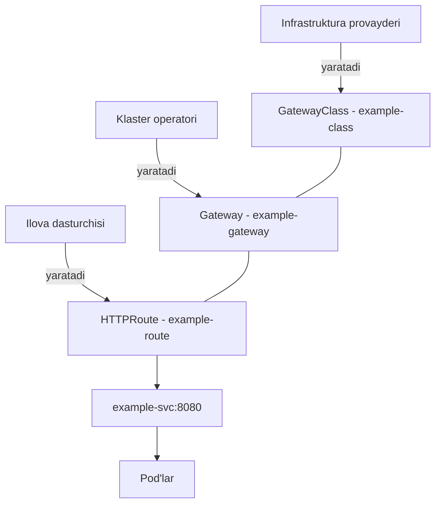
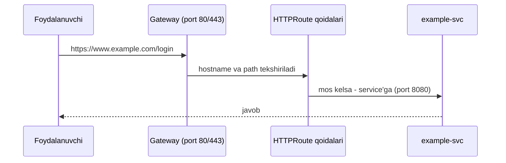

# Dars 252 — Gateway API bilan tanishuv (2025 yangilanishi)

> 🎯 **Bu darsda nimani o'rganamiz:**
> - Ingress'ning cheklovlari: multi-tenancy muammosi va annotatsiyalar "botqog'i"
> - Gateway API'ning uch qatlami: GatewayClass, Gateway, HTTPRoute — va uchta rol
> - HTTPS redirect, traffic splitting (canary), header'lar bilan ishlash — annotatsiyasiz
> - Amaliy qadamlar: nginx Gateway Fabric o'rnatish va asosiy YAML misollar (253-maqoladan)

## 🏬 Oddiy hayotiy o'xshatish

Katta savdo markazini tasavvur qiling. **Bino loyihasini me'mor chizadi** (GatewayClass — qanday texnologiya asosida qurilishi), **binoni ma'muriyat quradi va eshiklarini ochadi** (Gateway — qaysi port, qaysi protokol), **har bir do'kon egasi esa o'z peshtaxtasiga "menga keladigan mijozlarni shu yerga yo'naltiring" deb yozib qo'yadi** (HTTPRoute). Ingress'da esa hammasi bitta qog'ozga yozilardi — me'mor ham, ma'muriyat ham, do'konchilar ham bitta hujjatni talashib o'zgartirardi. Gateway API har kimga o'z hujjatini beradi.

## 1. Ingress'ning cheklovlari

Oldingi darsda bitta Ingress resource orqali ikkita service'ga (wear va video) trafik yo'naltirgan edik. Endi ikkita muammoni ko'rib chiqamiz.

### 1.1. Multi-tenancy (ko'p ijarachi) muammosi

Wear service'ni **A jamoa**, video service'ni **B jamoa** (yoki umuman boshqa tashkilot) boshqarsa-chi? Ingress resource baribir **bitta obyekt** — uni bir vaqtda faqat bitta jamoa boshqara oladi. Jamoalar bitta faylni o'zgartirishni kelishib olishlari kerak, bu esa nizolarga olib keladi. Ingress multi-tenant muhit uchun yetarli imkoniyat bermaydi.

### 1.2. Qoidalar imkoniyati cheklangan — annotatsiyalar "botqog'i"

Ingress faqat **HTTP asosidagi** qoidalarni biladi: host matching va path matching. TCP/UDP routing, traffic splitting (trafikni foizlab bo'lish), header manipulyatsiyasi, autentifikatsiya, rate limiting — bular Ingress spetsifikatsiyasida yo'q.

Bu imkoniyatlar controller'lar tomonidan amalga oshiriladi va ularga **annotations** orqali uzatiladi:

```yaml
metadata:
  annotations:
    nginx.ingress.kubernetes.io/ssl-redirect: "true"
    nginx.ingress.kubernetes.io/enable-cors: "true"
    nginx.ingress.kubernetes.io/cors-allow-methods: "PUT, GET, POST"
```

Bundagi muammolar:

- ⚠️ Bu sozlamalar **faqat nginx'ga xos**. Traefik ishlatsangiz — butunlay boshqa annotatsiyalar. Bitta maqsad uchun har controller'da har xil yozuv.
- ⚠️ **Kubernetes bu sozlamalarni tushunmaydi** — ular shunchaki matn sifatida controller'ga uzatiladi. Xato yozsangiz, Kubernetes validatsiya qilib bera olmaydi.
- Murakkab stsenariylarda (CORS, canary...) annotatsiyalar juda uzun va o'qib bo'lmas holga keladi.

Aynan shu muammolarni hal qilish uchun **Gateway API** yaratilgan.

## 2. Gateway API nima?

**Gateway API** — Layer 4 va Layer 7 routing'ga qaratilgan rasmiy Kubernetes loyihasi. U Kubernetes'dagi Ingress, load balancing va Service Mesh API'larining **keyingi avlodi** hisoblanadi.

### Uch obyekt — uch rol

Gateway API'ning asosiy g'oyasi: konfiguratsiyani **uchta alohida obyektga** bo'lish va har birini **alohida shaxs (persona)** boshqarishi:

| Obyekt | Kim boshqaradi | Nima qiladi |
|---|---|---|
| **GatewayClass** | Infrastruktura provayderi | Qaysi tarmoq infrastrukturasi (nginx, Traefik...) ishlatilishini belgilaydi — "shablon" |
| **Gateway** | Klaster operatori | GatewayClass'ning konkret nusxasi — qaysi port, qaysi protokolda tinglashini belgilaydi |
| **HTTPRoute** (TCPRoute, gRPCRoute...) | Ilova dasturchisi | Trafik qaysi service'ga qanday yo'naltirilishini belgilaydi |

💡 Ingress'da faqat HTTP marshrutlar bor edi. Gateway API'da esa **HTTPRoute** bilan birga **TLSRoute, TCPRoute, UDPRoute, gRPCRoute** kabi turlari ham bor.





## 3. Uchala obyektning YAML ko'rinishi

### 3.1. GatewayClass

```yaml
apiVersion: gateway.networking.k8s.io/v1
kind: GatewayClass
metadata:
  name: example-class
spec:
  controllerName: example.com/gateway-controller
```

⚠️ Xuddi Ingress kabi, Gateway API uchun ham **controller o'rnatish shart** — `controllerName` maydoniga o'sha controller kutayotgan nom yoziladi.

### 3.2. Gateway

```yaml
apiVersion: gateway.networking.k8s.io/v1
kind: Gateway
metadata:
  name: example-gateway
spec:
  gatewayClassName: example-class
  listeners:
    - name: http
      protocol: HTTP
      port: 80
```

Gateway yuqorida yaratilgan GatewayClass'ga ishora qiladi va HTTP listener'ni 80-portda sozlaydi.

### 3.3. HTTPRoute

```yaml
apiVersion: gateway.networking.k8s.io/v1
kind: HTTPRoute
metadata:
  name: example-httproute
spec:
  parentRefs:
    - name: example-gateway
  hostnames:
    - "www.example.com"
  rules:
    - matches:
        - path:
            type: PathPrefix
            value: /login
      backendRefs:
        - name: example-svc
          port: 8080
```

Bu misolda: `example-gateway` orqali kelgan, host header'i `www.example.com` va path'i `/login` bo'lgan HTTP trafik `example-svc` service'ining 8080-portiga yo'naltiriladi.

## 4. Ingress muammolari Gateway API'da qanday hal bo'ladi

### 4.1. HTTPS'ga majburiy yo'naltirish — annotatsiyasiz

Ingress'da TLS'ning o'zi `tls` bo'limida sozlanadi, lekin HTTP'ni HTTPS'ga redirect qilish uchun nginx'ga xos annotatsiya kerak edi — boshqa controller'larda u ishlamaydi. Gateway API'da hammasi **spec ichida, deklarativ**:

```yaml
apiVersion: gateway.networking.k8s.io/v1
kind: Gateway
metadata:
  name: my-gateway
spec:
  gatewayClassName: example-class
  listeners:
    - name: https
      protocol: HTTPS
      port: 443
      tls:
        mode: Terminate
        certificateRefs:
          - kind: Secret
            name: tls-secret
      allowedRoutes:
        kinds:
          - kind: HTTPRoute
```

- `listeners` — 443-portda HTTPS endpoint ochilayotgani aniq ko'rinib turibdi;
- `tls.mode: Terminate` — TLS gateway'da tugatiladi (shifr ochiladi);
- `certificateRefs` — TLS sertifikat saqlanadigan Secret'ga to'g'ridan-to'g'ri havola;
- `allowedRoutes` — bu listener'ga qaysi turdagi route'lar ulanishi mumkinligi.

### 4.2. Traffic splitting (canary deployment) — native imkoniyat

Ingress'da canary uchun nginx'ga xos annotatsiyalar kerak edi ("20% trafikni bu yerga yubor"), qolgan 80% boshqa — "asosiy" ingress'ga borishi konfiguratsiyadan umuman ko'rinmasdi. Gateway API'da butun manzara **bitta joyda**:

```yaml
apiVersion: gateway.networking.k8s.io/v1
kind: HTTPRoute
metadata:
  name: traffic-split
spec:
  parentRefs:
    - name: my-gateway
  rules:
    - backendRefs:
        - name: app-v1
          port: 80
          weight: 80
        - name: app-v2
          port: 80
          weight: 20
```

Ikkala service (`app-v1` va `app-v2`) `backendRefs`da ko'rinib turibdi, taqsimot aniq: 80% → v1, 20% → v2. Annotatsiya yo'q, bu **native funksiya** — istalgan Gateway API implementatsiyasida bir xil ishlaydi.

### 4.3. CORS va header'lar — markazlashgan sozlash

Ilgari CORS uchun uzun controller'ga xos annotatsiyalar kerak edi. Endi `ResponseHeaderModifier` filtri bilan header'lar spec ichida ochiq yoziladi — konfiguratsiya o'qish uchun qulay, o'zini o'zi hujjatlaydi va har qanday implementatsiyada bir xil ishlaydi.

### Ingress vs Gateway API taqqoslash

| Xususiyat | Ingress | Gateway API |
|---|---|---|
| Obyektlar | 1 ta (Ingress) | 3 ta (GatewayClass, Gateway, HTTPRoute...) |
| Rollarga bo'linish | Yo'q — hamma bitta resource'ni talashadi | Har qatlamni alohida persona boshqaradi |
| Protokollar | Faqat HTTP/HTTPS | HTTP, TLS, TCP, UDP, gRPC |
| Traffic splitting | Faqat controller annotatsiyasi orqali | Native (`weight` maydoni) |
| Header manipulyatsiyasi | Annotatsiya orqali | Native (filter'lar) |
| Kubernetes validatsiyasi | Annotatsiyalarni tekshirmaydi | Spec to'liq validatsiya qilinadi |
| Ko'chma-lik (portability) | Annotatsiyalar controller'ga bog'liq | Konfiguratsiya har implementatsiyada ishlaydi |
| Holati | Barqaror, lekin rivojlanishi to'xtagan | Keyingi avlod, faol rivojlanmoqda |

💡 **Kim implementatsiya qilgan?** Ko'pchilik controller'lar Gateway API'ni allaqachon qo'llab-quvvatlaydi yoki shu yo'lda: Amazon EKS, Azure Application Gateway for Containers, Contour, Envoy Gateway, Google Kubernetes Engine, HAProxy Kubernetes Ingress Controller, Istio, NGINX Gateway Fabric, Traefik Proxy — bular allaqachon GA (barqaror) darajasida.

## 5. Amaliy qadamlar: NGINX Gateway Fabric bilan (253-maqoladan)

Gateway API faqat custom resource'larni (CRD) belgilaydi — ularni bajaradigan controller kerak. Quyida NGINX Gateway Controller bilan asosiy qadamlar (kontseptsiyalar boshqa mos controller'larda ham bir xil).

### 5.1. O'rnatish

```bash
# Gateway API CRD'larini o'rnatamiz (standard + experimental)
kubectl kustomize "https://github.com/nginx/nginx-gateway-fabric/config/crd/gateway-api/standard?ref=v1.6.2" | kubectl apply -f -
kubectl kustomize "https://github.com/nginx/nginx-gateway-fabric/config/crd/gateway-api/experimental?ref=v1.6.2" | kubectl apply -f -

# NGINX Gateway Controller'ni helm bilan o'rnatamiz
helm install ngf oci://ghcr.io/nginx/charts/nginx-gateway-fabric --create-namespace -n nginx-gateway
```

### 5.2. GatewayClass, Gateway va HTTPRoute

```yaml
apiVersion: gateway.networking.k8s.io/v1
kind: GatewayClass
metadata:
  name: nginx
spec:
  controllerName: nginx.org/gateway-controller   # controller kutayotgan nom bilan bir xil bo'lishi shart
---
apiVersion: gateway.networking.k8s.io/v1
kind: Gateway
metadata:
  name: nginx-gateway
  namespace: default
spec:
  gatewayClassName: nginx
  listeners:
  - name: http
    protocol: HTTP
    port: 80
    allowedRoutes:
      namespaces:
        from: All        # barcha namespace'lardan route ulanishiga ruxsat
---
apiVersion: gateway.networking.k8s.io/v1
kind: HTTPRoute
metadata:
  name: basic-route
  namespace: default
spec:
  parentRefs:
  - name: nginx-gateway
  rules:
  - matches:
    - path:
        type: PathPrefix
        value: /app
    backendRefs:
    - name: my-app
      port: 80
```

Natija: `/app` bilan boshlangan barcha so'rovlar `my-app` service'ining 80-portiga boradi.

### 5.3. Foydali filter'lar (qisqacha)

**HTTP → HTTPS redirect:**

```yaml
  rules:
  - filters:
    - type: RequestRedirect
      requestRedirect:
        scheme: https
```

**Path rewrite** (`/old` → `/new` — Ingress'dagi rewrite-target'ning toza muqobili):

```yaml
  rules:
  - matches:
    - path:
        type: PathPrefix
        value: /old
    filters:
    - type: URLRewrite
      urlRewrite:
        path:
          replacePrefixMatch: /new
    backendRefs:
    - name: my-app
      port: 80
```

**Header qo'shish:**

```yaml
    filters:
    - type: RequestHeaderModifier
      requestHeaderModifier:
        add:
          x-env: staging
```

**Request mirroring** (so'rov nusxasini test service'ga yuborish, asosiy trafikka ta'sir qilmasdan):

```yaml
    filters:
    - type: RequestMirror
      requestMirror:
        backendRef:
          name: mirror-service
          port: 80
```

### 5.4. TCP, UDP va gRPC

Gateway API HTTP bilan cheklanmaydi — listener'da protokol va portni almashtirish kifoya:

```yaml
# TCP misol — masalan MySQL uchun
  listeners:
  - name: tcp
    protocol: TCP
    port: 3306
```

```yaml
# UDP misol — masalan DNS uchun
  listeners:
  - name: udp
    protocol: UDP
    port: 53
```

gRPC uchun esa HTTPRoute'da `method.service` va `method.method` bo'yicha matching qilinadi (masalan, `my.grpc.Service` / `GetData` → `grpc-service:50051`).

## ❓ Savol-Javob

"Savol:" Ingress bor-ku, nima uchun Gateway API kerak?
"Javob:" Ingress'da ikkita katta muammo bor: (1) bitta resource'ni bir nechta jamoa boshqara olmaydi (multi-tenancy yo'q), (2) HTTP host/path'dan boshqa hamma narsa (TLS redirect, canary, header'lar, TCP/UDP) controller'ga xos annotatsiyalar orqali qilinadi — Kubernetes ularni validatsiya qilmaydi va ular boshqa controller'da ishlamaydi. Gateway API bularni uch qatlamli, to'liq deklarativ model bilan hal qiladi.

"Savol:" GatewayClass, Gateway va HTTPRoute'ni kim yaratadi?
"Javob:" GatewayClass'ni infrastruktura provayderi (qaysi texnologiya), Gateway'ni klaster operatori (qaysi port/protokol), HTTPRoute'ni esa ilova dasturchisi (trafik qaysi service'ga) yaratadi. Har kim o'z qatlamiga javob beradi — nizo yo'q.

"Savol:" Gateway API bilan ham controller o'rnatish kerakmi?
"Javob:" Ha! Gateway API faqat CRD'larni (resource turlarini) belgilaydi. NGINX Gateway Fabric, Istio, Envoy Gateway kabi controller'lardan biri o'rnatilishi shart — GatewayClass'dagi `controllerName` aynan shu controller nomiga mos kelishi kerak.

"Savol:" HTTPRoute Gateway'ga qanday bog'lanadi?
"Javob:" HTTPRoute ichidagi `parentRefs` maydoni orqali — unda Gateway nomi ko'rsatiladi. Gateway tomonda esa `allowedRoutes` qaysi namespace va turdagi route'lar ulana olishini nazorat qiladi.

## 📌 CKA imtihon uchun maslahat

- 2025 yilgi yangilangan CKA dasturida Gateway API bor — uchala obyekt (`GatewayClass` → `Gateway` → `HTTPRoute`) zanjirini va ular bir-biriga qaysi maydonlar orqali bog'lanishini (`controllerName`, `gatewayClassName`, `parentRefs`) yoddan biling.
- `kubectl get gatewayclass,gateway,httproute -A` bilan mavjud obyektlarni tez ko'rib chiqing; muammo bo'lsa `kubectl describe` chiqishidagi `status` bo'limiga qarang.
- Traffic splitting so'ralsa — `backendRefs` ichida `weight` maydonini ishlating; hech qanday annotatsiya kerak emas.
- Route ishlamayotgan bo'lsa, ko'pincha sabab: `parentRefs` noto'g'ri nom, listener porti/protokoli mos emas, yoki Gateway'ning `allowedRoutes` sozlamasi route namespace'iga ruxsat bermagan.

## 📖 Asosiy atamalar

| Atama | Oddiy tushuntirish |
|---|---|
| Gateway API | Ingress'ning keyingi avlodi — L4/L7 routing uchun rasmiy Kubernetes loyihasi |
| GatewayClass | Gateway'lar shabloni — qaysi controller/infrastruktura ishlatilishini belgilaydi |
| Gateway | GatewayClass'ning konkret nusxasi — trafik klasterga qaysi port/protokolda kirishini belgilaydi |
| Listener | Gateway ichidagi "quloq" — bitta protokol + port juftligi (masalan HTTP:80, HTTPS:443) |
| HTTPRoute | HTTP trafikni qoidalar bo'yicha service'larga yo'naltiruvchi obyekt |
| parentRefs | HTTPRoute'ni Gateway'ga bog'laydigan maydon |
| backendRefs | Trafik boradigan service(lar) va portlar; `weight` bilan foizlab bo'lish mumkin |
| Filter | So'rovni backend'ga yetkazishdan oldin o'zgartiruvchi qadam (redirect, rewrite, header, mirror) |
| TLS Terminate | Shifrlangan trafikni Gateway'da ochish — backend'ga oddiy trafik boradi |
| Multi-tenancy | Bitta klasterdan bir nechta jamoa/tashkilot mustaqil foydalanishi |
| Canary deployment | Yangi versiyaga trafikning kichik qismini (masalan 20%) yuborib sinash |
| CRD | Custom Resource Definition — Kubernetes'ga yangi obyekt turlarini qo'shish mexanizmi |

## 🔗 Manbalar

- [Gateway API — kubernetes.io hujjati](https://kubernetes.io/docs/concepts/services-networking/gateway/)
- [Gateway API rasmiy sayti](https://gateway-api.sigs.k8s.io/)
- [Ingress'dan Gateway API'ga migratsiya](https://gateway-api.sigs.k8s.io/guides/migrating-from-ingress/)
- [HTTP routing qo'llanmasi](https://gateway-api.sigs.k8s.io/guides/http-routing/)
- [Traffic splitting qo'llanmasi](https://gateway-api.sigs.k8s.io/guides/traffic-splitting/)
- [TLS sozlash qo'llanmasi](https://gateway-api.sigs.k8s.io/guides/tls/)
- [NGINX Gateway Fabric](https://github.com/nginx/nginx-gateway-fabric)

---
*Bu dars KodeKloud CKA kursining 252-videosi hamda 253-maqolasi asosida tayyorlandi.*
