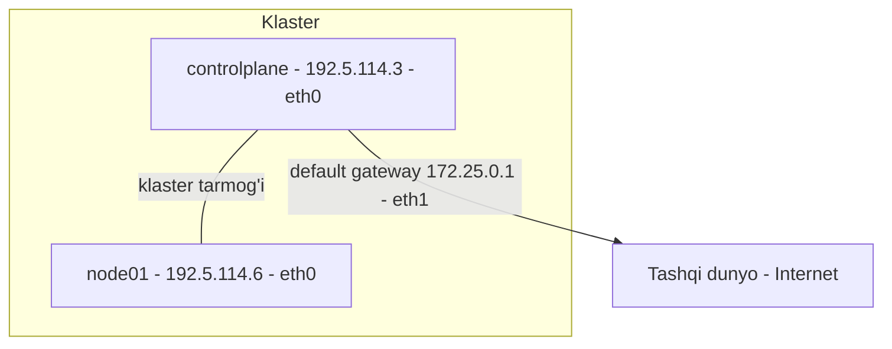

# Lab 229 — Klaster muhitini o'rganish (yechim)

> 🎯 **Bu labda nimani o'rganamiz:**
> - Klasterdagi node'lar sonini va ularning IP manzillarini topish
> - Tarmoq interfeyslari, MAC manzillar va bridge'larni aniqlash
> - Default gateway'ni `ip route` orqali topish
> - `netstat` yordamida qaysi jarayon qaysi portni tinglayotganini ko'rish

**Oddiy o'xshatish:** bu lab — yangi mahallaga ko'chib kelganingizda atrofni aylanib chiqishga o'xshaydi. Qaysi uylar bor (node'lar), har bir uyning manzili qanday (IP), eshik raqami qanday (MAC), asosiy katta yo'l qayerdan o'tadi (default gateway) — hammasini bir-bir ko'rib chiqamiz.

## Masala sharti

Bizga tayyor Kubernetes klasteri berilgan. Vazifa — hech narsani o'zgartirmasdan, faqat tekshiruv buyruqlari bilan klaster tarmog'ini o'rganish: node'lar soni, interfeyslar, MAC manzillar, bridge, default gateway va tinglanayotgan portlar.



## 1-qadam — Klasterda nechta node bor?

Eng oddiy buyruqdan boshlaymiz:

```bash
kubectl get nodes
```

```
NAME           STATUS   ROLES           AGE   VERSION
controlplane   Ready    control-plane   ..    ..
node01         Ready    <none>          ..    ..
```

Natijada ikkita qator ko'rinadi — demak klasterda **2 ta node** bor: `controlplane` va `node01`.

## 2-qadam — controlplane node'ning ichki IP manzili

Xuddi shu buyruqqa `-o wide` qo'shsak, qo'shimcha ustunlar, jumladan `INTERNAL-IP` chiqadi:

```bash
kubectl get nodes -o wide
```

`controlplane` qatoridagi `INTERNAL-IP` ustuniga qaraymiz — javob: **192.5.114.3**.

## 3-qadam — Klaster aloqasi uchun ishlatilayotgan interfeys

Endi bu IP qaysi tarmoq interfeysiga biriktirilganini topamiz. Buning uchun ikkita buyruqdan istalganini ishlatish mumkin — ikkalasi ham bir xil ma'lumot beradi:

```bash
ip address
# yoki
ip link
```

Chiqqan ro'yxatda 192.5.114.3 manzilini qidiramiz. Uni `eth0` interfeysida topamiz — demak, klaster ichidagi aloqa uchun **eth0** ishlatiladi.

## 4-qadam — eth0 interfeysining MAC manzili

`ip address` natijasida `eth0` qatorida `link/ether` yozuvi yonida MAC manzil turadi (labda u `72:03:...` bilan boshlanadi). Ekranni tozaroq ko'rish uchun faqat bitta interfeysni ko'rsatish ham mumkin:

```bash
ip address show eth0
```

Bu buyruq faqat `eth0` haqidagi ma'lumotni chiqaradi — boshqa interfeyslar xalaqit bermaydi.

## 5-qadam — node01 ning IP va MAC manzili

IP uchun yana `kubectl get nodes -o wide` yetarli — `node01` qatorida **192.5.114.6** ko'ramiz.

MAC manzilni bilish uchun esa o'sha node'ning ichiga kirishimiz kerak:

```bash
ssh node01
ip address
```

192.5.114.6 manzili node01 da ham `eth0` interfeysiga tegishli, uning MAC manzili `72:06:...` bilan boshlanadi.

## 6-qadam — Container runtime yaratgan bridge

Klasterda containerd ishlatiladi. U host'da qanday bridge (ko'prik) interfeys yaratganini topamiz. Agar qaysi interfeys bridge ekanini bilmasangiz, `ip address show` ga `type bridge` filtri qo'shing:

```bash
ip address show type bridge
```

Natijada faqat bridge turidagi interfeyslar chiqadi — bu yerda yagona bridge **cni0**. Xuddi shu natijaning o'ng tomonida `state UP` yozuvini ko'rasiz — demak, `cni0` interfeysining holati **UP** (yoqilgan).

## 7-qadam — Default gateway (Google'ga ping qanday yo'ldan boradi?)

Tashqariga (masalan google.com ga) yuborilgan trafik qaysi yo'ldan chiqib ketishini bilish uchun marshrutlar jadvalini ko'ramiz:

```bash
ip route
```

```
default via 172.25.0.1 dev eth1
...
```

Birinchi qator — `default` marshrut. Ya'ni, jadvalda alohida marshruti bo'lmagan har qanday manzilga trafik **172.25.0.1** (eth1 interfeysi orqali) yuboriladi. Bu bizning default gateway'imiz.

## 8-qadam — kube-scheduler qaysi portni tinglayapti?

Bu yerda `netstat` buyrug'i yordam beradi. Foydali flaglar:

| Flag | Ma'nosi |
|------|---------|
| `-l` | Faqat tinglayotgan (listening) socketlarni ko'rsatish |
| `-p` | Har socket qaysi dasturga tegishli ekanini ko'rsatish (grep qilish uchun kerak) |
| `-n` | Port/IP nomlarini "tarjima" qilmasdan, raqam ko'rinishida chiqarish |
| `-a` | Barcha socketlarni (established'larni ham) ko'rsatish |

```bash
netstat -npl | grep -i scheduler
```

`-i` flagi grep'da katta-kichik harfni farqlamaslik uchun. Natijada kube-scheduler **10259**-portni tinglayotganini ko'ramiz.

## 9-qadam — etcd portlari: qaysi birida ulanish ko'proq?

etcd ikkita portni tinglaydi. Avval buni tekshiramiz:

```bash
netstat -npl | grep -i etcd
```

Natijada **2379** va **2380** (hamda 2381) portlarini ko'ramiz. Endi qaysi portda o'rnatilgan (established) ulanishlar ko'proq ekanini sanaymiz. Bu safar `-l` o'rniga `-a` ishlatamiz, chunki bizni tinglash emas, faol ulanishlar qiziqtiradi:

```bash
netstat -npa | grep -i etcd | grep -i 2379 | wc -l
# natija: 67

netstat -npa | grep -i etcd | grep -i 2380 | wc -l
# natija: 1
```

`wc -l` qatorlar sonini sanaydi. Ko'rinib turibdiki, **2379**-portda ulanishlar ancha ko'p.

**Nega shunday?** 2379 — bu etcd'ning mijozlar porti: barcha control plane komponentlari (birinchi navbatda kube-apiserver) aynan shu portga ulanadi. 2380 esa faqat etcd'larning o'zaro (peer-to-peer) aloqasi uchun — u bir nechta control plane node bo'lgandagina faol ishlatiladi, bizda esa control plane bitta.

## ❓ Savol-Javob

"Savol:" Interfeysning bridge ekanligini qanday aniq bilsa bo'ladi?
"Javob:" `ip address show type bridge` buyrug'i faqat bridge turidagi interfeyslarni chiqaradi — taxmin qilish shart emas.

"Savol:" `netstat` da `-l` va `-a` flaglarining farqi nimada?
"Javob:" `-l` faqat tinglayotgan (kutayotgan) socketlarni ko'rsatadi, `-a` esa barchasini, jumladan o'rnatilgan (ESTABLISHED) ulanishlarni ham. Port tinglashni tekshirishda `-l`, faol ulanishlarni sanashda `-a` kerak.

## 📌 CKA imtihon uchun maslahat

Imtihonda "qaysi interfeys/port ishlatilyapti" tipidagi savollar tez-tez uchraydi. Uchta buyruqni yodda tuting: `ip address` (interfeys va MAC), `ip route` (default gateway), `netstat -npl | grep <jarayon>` (tinglanayotgan port). `kubectl get nodes -o wide` esa node IP'larini topishning eng tez yo'li.

## 📖 Asosiy atamalar

| Atama | Oddiy tushuntirish |
|-------|--------------------|
| INTERNAL-IP | Node'ning klaster ichidagi IP manzili |
| MAC manzil | Interfeysning "zavod raqami" — tarmoq kartasining fizik manzili |
| bridge | Bir host ichidagi virtual switch — konteynerlarni bir tarmoqqa ulaydi |
| default gateway | Marshruti noma'lum trafik yuboriladigan "asosiy chiqish eshigi" |
| netstat | Socketlar, portlar va ulanishlarni ko'rsatuvchi buyruq |

## 🔗 Manbalar

- https://kubernetes.io/docs/concepts/cluster-administration/networking/
- https://kubernetes.io/docs/reference/networking/ports-and-protocols/
- https://man7.org/linux/man-pages/man8/ip.8.html

## 💡 Xulosa

Klaster tarmog'ini o'rganish uchun murakkab vositalar shart emas: `kubectl get nodes -o wide` node'lar va IP'larni, `ip address` / `ip link` interfeys va MAC'larni, `ip route` default gateway'ni, `netstat -npl` esa tinglanayotgan portlarni ko'rsatadi. etcd'da 2379 — mijozlar porti (ulanishlar ko'p), 2380 — faqat etcd'larning o'zaro aloqasi uchun.

---
*Bu dars KodeKloud CKA kursining 229-videosi asosida tayyorlandi.*
