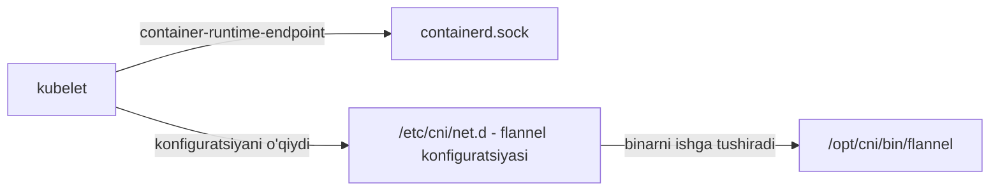

# Lab 235 — CNI ni o'rganish (yechim)

> 🎯 **Bu labda nimani o'rganamiz:**
> - kubelet'da container runtime endpoint qanday sozlanganini topish
> - CNI plugin binarlar qaysi papkada turishini ko'rish
> - Klasterda qaysi CNI plugin sozlanganini aniqlash

**Oddiy o'xshatish:** CNI plugin'lar — bu usta asboblar qutisidagi turli asboblar (`/opt/cni/bin`). Qaysi asbob ishlatilishi esa alohida yo'riqnoma qog'ozida yozib qo'yilgan (`/etc/cni/net.d`). Bu labda avval qutini ochib asboblarni ko'ramiz, keyin yo'riqnomani o'qib, aynan qaysi biri ishlatilayotganini bilib olamiz.

## Masala sharti

Klasterda tarmoq qanday sozlangan — kubelet qaysi container runtime bilan gaplashadi, CNI binarlar qayerda, konfiguratsiya qayerda va qaysi plugin tanlangan — shularni tekshiruv buyruqlari bilan aniqlashimiz kerak.



## 1-qadam — Container runtime endpoint

kubelet jarayonining flaglarini ko'ramiz. `ps -aux` barcha jarayonlarni chiqaradi, `grep` bilan kerakli qismini ajratamiz:

```bash
ps -aux | grep -i kubelet | grep -i container-runtime
```

Natijada quyidagi flagni topamiz:

```
--container-runtime-endpoint=unix:///var/run/containerd/containerd.sock
```

Demak, kubelet containerd bilan aynan shu Unix socket orqali gaplashadi.

## 2-qadam — CNI binarlar papkasi

Barcha CNI plugin'larning bajariladigan (binary) fayllari standart joyda saqlanadi — **/opt/cni/bin**:

```bash
ls /opt/cni/bin
```

```
bandwidth  bridge  dhcp  dummy  firewall  flannel  host-device
host-local  ipvlan  loopback  macvlan  portmap  ptp  sbr  static
tuning  vlan  vrf  ...
```

Bu — o'rnatilgan (mavjud) plugin'lar ro'yxati.

## 3-qadam — Qaysi plugin ro'yxatda YO'Q?

Savol variantlaridagi nomlarni yuqoridagi ro'yxat bilan solishtiramiz:

| Plugin | Ro'yxatda bormi? |
|--------|------------------|
| vlan | ✅ bor |
| bridge | ✅ bor |
| dhcp | ✅ bor |
| cisco | ❌ yo'q |

Javob: **cisco** — bunday plugin `/opt/cni/bin` da mavjud emas.

## 4-qadam — Klasterda qaysi CNI plugin sozlangan?

Binar bor bo'lishi — hali ishlatilyapti degani emas. Qaysi plugin haqiqatda sozlanganini bilish uchun konfiguratsiya papkasiga qaraymiz:

```bash
ls /etc/cni/net.d
```

Natijada flannel'ga oid konfiguratsiya faylini ko'ramiz — demak, bu klasterda **flannel** CNI plugin'i ishlatiladi.

## 5-qadam — Konteyner yaratilgach kubelet qaysi binarni ishga tushiradi?

Konfiguratsiya faylining ichini o'qiymiz:

```bash
cd /etc/cni/net.d
cat *
```

Fayldagi `plugins` ro'yxatida birinchi bo'lib `flannel`, undan keyin `portmap` turadi. Ya'ni, konteyner va uning namespace'lari yaratilgach, kubelet birinchi navbatda **flannel** binarini (`/opt/cni/bin/flannel`) ishga tushiradi — u pod'ga IP beradi va tarmoqqa ulaydi.

## ❓ Savol-Javob

"Savol:" `/opt/cni/bin` va `/etc/cni/net.d` papkalarining farqi nimada?
"Javob:" Birinchisida barcha CNI plugin'larning bajariladigan fayllari (asboblar qutisi), ikkinchisida esa qaysi plugin qanday sozlamalar bilan ishlatilishi yozilgan konfiguratsiya (yo'riqnoma) turadi.

"Savol:" kubelet qaysi container runtime bilan ishlashini qanday bilamiz?
"Javob:" kubelet jarayonining `--container-runtime-endpoint` flagiga qaraymiz: `ps -aux | grep kubelet` — bizda u `unix:///var/run/containerd/containerd.sock` ga ko'rsatib turibdi.

## 📌 CKA imtihon uchun maslahat

Ikki yo'lni yodlab oling: CNI binarlar — `/opt/cni/bin`, CNI konfiguratsiyasi — `/etc/cni/net.d`. Imtihonda "qaysi CNI ishlatilgan?" savoli chiqsa, to'g'ridan-to'g'ri `ls /etc/cni/net.d` qilib, konfiguratsiya faylini oching.

## 📖 Asosiy atamalar

| Atama | Oddiy tushuntirish |
|-------|--------------------|
| CNI | Container Network Interface — konteynerlarni tarmoqqa ulash standarti |
| container runtime | Konteynerlarni haqiqatda ishga tushiruvchi dastur (bizda containerd) |
| endpoint (socket) | kubelet va runtime gaplashadigan "eshik" — Unix socket fayli |
| flannel | Sodda va keng tarqalgan CNI plugin'laridan biri |
| portmap | Port'larni pod'ga yo'naltirish uchun yordamchi CNI plugin |

## 🔗 Manbalar

- https://kubernetes.io/docs/concepts/extend-kubernetes/compute-storage-net/network-plugins/
- https://github.com/containernetworking/cni
- https://github.com/flannel-io/flannel

## 💡 Xulosa

CNI bo'yicha hamma javob ikkita papkada: `/opt/cni/bin` — mavjud plugin binarlari, `/etc/cni/net.d` — qaysi biri sozlangani. Bizning klasterda kubelet containerd bilan `containerd.sock` orqali ishlaydi, tanlangan CNI plugin — flannel, va konteyner yaratilgach birinchi bo'lib aynan flannel binari ishga tushadi.

---
*Bu dars KodeKloud CKA kursining 235-videosi asosida tayyorlandi.*
