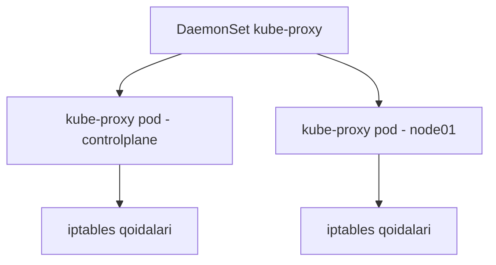

# Lab 240 — Service tarmog'i (yechim)

> 🎯 **Bu labda nimani o'rganamiz:**
> - Node, Pod va Service'lar uchun IP diapazonlarini (range) topish
> - kube-proxy qaysi rejimda ishlayotganini loglardan aniqlash
> - kube-proxy nima uchun har bir node'da mavjudligini tushunish

**Oddiy o'xshatish:** klasterda uchta alohida "mahalla" bor — node'lar mahallasi, pod'lar mahallasi va service'lar mahallasi. Har birining o'z manzillar diapazoni bor va ular bir-biri bilan aralashmasligi kerak. Bu labda har mahallaning "manzil kitobi" qayerda yozilganini topamiz.

## Masala sharti

Klasterda uch xil IP diapazoni sozlangan: node'lar, pod'lar va service'lar uchun. Vazifa — har birini qayerdan topishni bilish, hamda kube-proxy'ning turini va tarqatilish usulini aniqlash.

| Diapazon | Qayerdan topiladi | Bu labdagi qiymat |
|----------|-------------------|-------------------|
| Node'lar tarmog'i | `kubectl get nodes -o wide` + `ip a` | 192.6.10.0/24 |
| Pod'lar tarmog'i | CNI (weave) pod loglari, `ipalloc-range` | 10.244.0.0/16 |
| Service'lar tarmog'i | kube-apiserver manifestidagi `--service-cluster-ip-range` | 10.96.0.0/12 |

## 1-qadam — Node'lar qaysi tarmoq diapazonida?

Avval node'ning IP manzilini ko'ramiz:

```bash
kubectl get nodes -o wide
```

`INTERNAL-IP` ustunida controlplane uchun `192.6.10.10` (labda 192.x.10.10 ko'rinishida) turadi. Endi bu IP qaysi interfeysga va qanday maska bilan biriktirilganini tekshiramiz:

```bash
ip a
```

`eth0` interfeysida shu IP `/24` maska bilan turganini ko'ramiz. `/24` degani — oxirgi 8 bit (oxirgi oktet) host manzillari uchun ajratilgan. Demak, node'lar tarmog'i: **192.6.10.0/24**.

## 2-qadam — Pod'lar uchun IP diapazoni

Pod IP'larini CNI plugin tarqatadi. Avval klasterda qaysi CNI ishlayotganini ko'ramiz:

```bash
kubectl get all --all-namespaces
```

`kube-system` namespace'ida **weave** pod'larini ko'ramiz — demak, tarmoq uchun Weave ishlatilyapti. Endi uning loglaridan IP ajratish diapazonini qidiramiz:

```bash
kubectl logs -n kube-system <weave-pod-nomi>
```

Loglarning boshida `ipalloc-range` (IP allocation — IP ajratish) yozuvini topamiz:

```
ipalloc-range: 10.244.0.0/16
```

Demak, klasterdagi har qanday yangi pod **10.244.0.0/16** diapazonidan IP oladi.

## 3-qadam — Service'lar uchun IP diapazoni

Service IP'larini CNI emas, balki **kube-apiserver** ajratadi. Uning konfiguratsiyasi static pod manifestida turadi:

```bash
cat /etc/kubernetes/manifests/kube-apiserver.yaml | grep service-cluster-ip-range
```

```
--service-cluster-ip-range=10.96.0.0/12
```

Javob: service'lar diapazoni — **10.96.0.0/12**.

## 4-qadam — Klasterda nechta kube-proxy pod bor?

```bash
kubectl get pods -n kube-system
```

Ro'yxatda ikkita `kube-proxy-...` pod ko'ramiz — javob: **2 ta** (har bir node'ga bittadan).

## 5-qadam — kube-proxy qaysi proxy turida ishlayapti?

Buni ham loglardan bilib olamiz:

```bash
kubectl logs -n kube-system <kube-proxy-pod-nomi>
```

Loglar orasida quyidagiga o'xshash qator chiqadi:

```
Using iptables Proxier
```

Demak, kube-proxy **iptables** rejimida ishlayapti — ya'ni Service IP'ga kelgan trafikni pod'larga yo'naltirish uchun iptables qoidalari yoziladi.

## 6-qadam — kube-proxy qanday qilib HAR BIR node'da ishlaydi?

Klasterda biror narsani har bir node'da bittadan ishlatishning standart usuli — **DaemonSet**. Tekshirib ko'ramiz:

```bash
kubectl get all --all-namespaces | grep kube-proxy
```

Natijada `kube-proxy` Deployment yoki ReplicaSet ostida emas, aynan **daemonset.apps/kube-proxy** ostida turganini ko'ramiz. Demak, kube-proxy DaemonSet orqali tarqatilgan — yangi node qo'shilsa ham unda avtomatik kube-proxy pod paydo bo'ladi.



## ❓ Savol-Javob

"Savol:" Pod diapazoni bilan Service diapazoni nega ikki xil joydan topiladi?
"Javob:" Pod IP'larini CNI plugin (bizda weave) tarqatadi, shuning uchun uning sozlamasi/loglarida bo'ladi. Service IP'lari esa virtual bo'lib, ularni kube-apiserver `--service-cluster-ip-range` flagiga ko'ra ajratadi.

"Savol:" kube-proxy'ning iptables rejimi nima qiladi?
"Javob:" Har bir Service uchun node'da iptables qoidalari yozadi: Service IP'ga kelgan trafik shu qoidalar orqali mos pod'lardan biriga yo'naltiriladi.

## 📌 CKA imtihon uchun maslahat

Uch diapazonni topish yo'lini formula sifatida yodlang: node — `kubectl get nodes -o wide` + `ip a`; pod — CNI pod loglari yoki konfiguratsiyasi; service — `/etc/kubernetes/manifests/kube-apiserver.yaml` dagi `--service-cluster-ip-range`. "Har node'da bittadan" degan gapni ko'rsangiz — javob deyarli har doim DaemonSet.

## 📖 Asosiy atamalar

| Atama | Oddiy tushuntirish |
|-------|--------------------|
| CIDR (masalan /24, /16) | IP diapazonining maskasi — nechta bit tarmoqqa, nechtasi hostlarga ajratilgani |
| ipalloc-range | Weave'da pod'larga IP ajratish diapazoni |
| service-cluster-ip-range | Service'larga beriladigan virtual IP diapazoni (apiserver flagi) |
| kube-proxy | Service trafigini pod'larga yo'naltiruvchi komponent |
| DaemonSet | Har bir node'da aynan bittadan pod ishlashini kafolatlaydigan obyekt |

## 🔗 Manbalar

- https://kubernetes.io/docs/concepts/services-networking/service/
- https://kubernetes.io/docs/reference/command-line-tools-reference/kube-proxy/
- https://kubernetes.io/docs/concepts/workloads/controllers/daemonset/

## 💡 Xulosa

Klasterda uchta mustaqil IP olami bor: node'lar (fizik tarmoq, `ip a` bilan ko'riladi), pod'lar (CNI ajratadi — weave loglaridagi `ipalloc-range`) va service'lar (apiserver'ning `--service-cluster-ip-range` flagi). kube-proxy iptables rejimida ishlaydi va DaemonSet orqali har bir node'da bittadan joylashtiriladi.

---
*Bu dars KodeKloud CKA kursining 240-videosi asosida tayyorlandi.*
