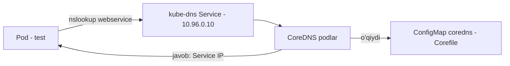

# Lab 244 — DNS ni o'rganish (yechim)

> 🎯 **Bu labda nimani o'rganamiz:**
> - Klasterdagi DNS yechimini (CoreDNS) va uning service'ini topish
> - Corefile qayerda turishini va ConfigMap orqali qanday uzatilishini ko'rish
> - Service nomlarini turli ko'rinishda (FQDN) sinab ko'rish
> - Boshqa namespace'dagi service'ga ulanish muammosini topib tuzatish

**Oddiy o'xshatish:** DNS — klasterning telefon kontaktlar kitobi. Pod "webservice" deb nom aytadi, CoreDNS esa uning IP raqamini topib beradi. Ammo kontakt boshqa "shahar kodi"da (namespace'da) bo'lsa, nomga shahar kodini ham qo'shish kerak: `webservice.payroll`.

## Masala sharti

Klasterda DNS qanday ishlayotganini o'rganamiz: CoreDNS pod va service'ini, konfiguratsiyani (Corefile), so'ng turli namespace'lardagi service'larga murojaat qilish qoidalarini tekshiramiz. Oxirida esa MySQL'ga ulanolmayotgan web-service muammosini topib tuzatamiz.

## 1-qadam — DNS yechimi va pod'lar soni

Avval qulaylik uchun alias o'rnatib olamiz, keyin kube-system'dagi pod'larni ko'ramiz:

```bash
alias k=kubectl
k get pods -n kube-system
```

Ro'yxatda ikkita `coredns-...` pod ko'rinadi. Demak: DNS yechimi — **CoreDNS**, pod'lar soni — **2 ta**.

## 2-qadam — CoreDNS service'i va uning IP'si

```bash
k get svc -n kube-system
```

```
NAME       TYPE        CLUSTER-IP   PORT(S)
kube-dns   ClusterIP   10.96.0.10   53/UDP,53/TCP,...
```

Service nomi tarixiy sabablarga ko'ra **kube-dns** deb ataladi (pod'lar CoreDNS bo'lsa ham). Barcha pod'larning `/etc/resolv.conf` fayliga DNS server sifatida yoziladigan IP — shu service'ning IP'si: **10.96.0.10**.

## 3-qadam — CoreDNS konfiguratsiya fayli qayerda?

CoreDNS pod'ini batafsil ko'ramiz:

```bash
k describe pod -n kube-system <coredns-pod-nomi>
```

Konteyner argumentlarida quyidagini topamiz:

```
Args:
  -conf
  /etc/coredns/Corefile
```

Demak, konfiguratsiya fayli — **/etc/coredns/Corefile**.

## 4-qadam — Corefile pod ichiga qanday kirib keladi?

O'sha `describe` natijasida (yoki `k get pod -n kube-system <pod> -o yaml` da) `Mounts` bo'limiga qaraymiz: `/etc/coredns` yo'li `config-volume` nomli volume'dan mount qilingan. YAML'da pastroqda `volumes` bo'limida esa:

```yaml
volumes:
- name: config-volume
  configMap:
    name: coredns
    items:
    - key: Corefile
      path: Corefile
```

Ya'ni, Corefile **ConfigMap obyekti** sifatida saqlanadi va pod'ga volume orqali uzatiladi. ConfigMap nomi — **coredns**.

## 5-qadam — Klasterning root domeni (zonasi)

ConfigMap ichini ko'ramiz:

```bash
k describe configmap coredns -n kube-system
```

Corefile ichidagi `kubernetes` plugin qatorida root zonani ko'ramiz:

```
kubernetes cluster.local in-addr.arpa ip6.arpa { ... }
```

Root domen — **cluster.local**.



## 6-qadam — HR web serveriga test app'dan qanday nom bilan murojaat qilinadi?

Klasterda default namespace'da `hr`, `simple-web-app`, `test` pod'lari, payroll namespace'ida esa `web` pod'i bor. HR ilovasi qaysi service ortida turganini aniqlaymiz:

```bash
k get svc
k describe svc web-service
```

`Selector: name=hr` — demak, **web-service** aynan HR ilovasiga trafik yuboradi, porti **80**. Test ilovasining UI'sida `web-service:80` ga so'rov yuborsak, "This is the HR service" javobini olamiz — tasdiqlandi.

## 7-qadam — Qaysi nom ISHLAMAYDI?

Service uchun to'liq DNS nomi shunday tuziladi: `<service>.<namespace>.svc.cluster.local`. Test pod default namespace'da bo'lgani uchun quyidagilarni sinaymiz:

| Nom | Ishlaydimi? | Sababi |
|-----|-------------|--------|
| `web-service` | ✅ | Bir xil namespace — qisqa nom yetadi |
| `web-service.default` | ✅ | namespace qo'shilgan to'g'ri shakl |
| `web-service.default.svc` | ✅ | `svc` — service'lar uchun subdomen |
| `web-service.default.pod` | ❌ | Service uchun `pod` subdomeni noto'g'ri |

## 8-qadam — payroll namespace'idagi service'ga murojaat

```bash
k get svc -n payroll
k describe svc web-service -n payroll
```

payroll'da ham `web-service` bor, selector'i `name=web-app`. Test app default namespace'da bo'lgani uchun oddiy `web-service` HR'ga ketadi. payroll'dagi service'ga borish uchun namespace qo'shamiz:

```
web-service.payroll        →  ✅ "This is payroll" javobi keladi
web-service.payroll.svc    →  ✅
web-service.payroll.svc.cluster.local  →  ✅ to'liq FQDN
web-service.payroll.svc.cluster       →  ❌ "cluster" yarim qolgan — root zona to'liq (cluster.local) yozilishi kerak yoki umuman yozilmasligi kerak
```

## 9-qadam — Buzilgan web-app'ni tuzatish (MySQL'ga ulanolmayapti)

Yangi `webapp` deployment MySQL bazasiga ulanolmay xatolik beryapti. Tekshiramiz:

```bash
k get deploy
k get pods --all-namespaces
```

`webapp` pod'i **default** namespace'da, `mysql` pod'i va service'i esa **payroll** namespace'da. Web server sahifasida xato: `name does not resolve` — ya'ni `DB_Host=mysql` nomi topilmayapti. Sabab aniq: `mysql` qisqa nomi faqat o'z namespace'ida ishlaydi.

Deployment'dagi environment o'zgaruvchini tuzatamiz:

```bash
k describe deploy webapp     # DB_Host=mysql ekanini ko'ramiz
k edit deploy webapp
```

`env` bo'limida qiymatni o'zgartiramiz:

```yaml
env:
- name: DB_Host
  value: mysql.payroll      # avval: mysql
```

⚠️ Labda parol ham environment o'zgaruvchida ochiq turibdi — bu faqat soddalik uchun; real hayotda parollar Secret orqali uzatilishi kerak.

Saqlagach eski pod terminating bo'lib, yangisi ko'tariladi. Web sahifani yangilasak — endi **success**, ulanish ishlayapti. `mysql.payroll` o'rniga `mysql.payroll.svc` yoki `mysql.payroll.svc.cluster.local` ham to'g'ri bo'lardi.

## 10-qadam — HR pod'idan nslookup va natijani faylga yozish

```bash
k exec hr -- nslookup mysql          # ishlamaydi: NXDOMAIN, chunki mysql payroll'da
k exec hr -- nslookup mysql.payroll > /root/CKA/nslookup.out
cat /root/CKA/nslookup.out
```

Natijada MySQL service'ining to'liq nomi va IP'sini ko'ramiz:

```
Name:   mysql.payroll.svc.cluster.local
Address: 10.96.x.x
```

## ❓ Savol-Javob

"Savol:" Pod'lar CoreDNS bo'lsa, service nega kube-dns deb ataladi?
"Javob:" Moslik (backward compatibility) uchun — ilgari DNS yechimi kube-dns edi, CoreDNS'ga o'tilganda service nomi o'zgartirilmagan, shuning uchun eski konfiguratsiyalar ishlashda davom etadi.

"Savol:" Qachon service nomiga namespace qo'shish shart?
"Javob:" Murojaat qiluvchi pod bilan service turli namespace'larda bo'lsa. Bir xil namespace'da qisqa nom (`web-service`) yetarli, boshqa namespace uchun kamida `<service>.<namespace>` kerak.

"Savol:" To'liq FQDN qanday tuziladi?
"Javob:" `<service>.<namespace>.svc.cluster.local` — bu yerda `cluster.local` root zona bo'lib, u Corefile'da (coredns ConfigMap'ida) belgilangan.

## 📌 CKA imtihon uchun maslahat

"Ilova boshqa namespace'dagi bazaga ulanolmayapti" — imtihonning klassik ssenariysi. Birinchi qiladigan ishingiz: `kubectl get pods,svc --all-namespaces` bilan kim qayerda ekanini aniqlang, so'ng ulanish nomiga namespace qo'shing (`mysql.payroll`). `kubectl exec <pod> -- nslookup <nom>` — DNS'ni tez tekshirishning eng qulay usuli.

## 📖 Asosiy atamalar

| Atama | Oddiy tushuntirish |
|-------|--------------------|
| CoreDNS | Kubernetes'ning standart DNS serveri |
| kube-dns | CoreDNS'ga kirish uchun service (IP: 10.96.0.10) |
| Corefile | CoreDNS konfiguratsiya fayli (/etc/coredns/Corefile) |
| ConfigMap | Konfiguratsiyani pod'ga uzatuvchi Kubernetes obyekti |
| FQDN | To'liq domen nomi: service.namespace.svc.cluster.local |
| nslookup | DNS nomni IP'ga aylantirishni tekshiruvchi buyruq |

## 🔗 Manbalar

- https://kubernetes.io/docs/concepts/services-networking/dns-pod-service/
- https://kubernetes.io/docs/tasks/administer-cluster/dns-custom-nameservers/
- https://coredns.io/plugins/kubernetes/

## 💡 Xulosa

Klaster DNS'i — bu 2 ta CoreDNS pod, ular oldidagi kube-dns service (10.96.0.10) va coredns ConfigMap'idan yuklanadigan Corefile (root zona: cluster.local). Asosiy qoida: o'z namespace'ingda qisqa nom yetadi, boshqa namespace uchun `<service>.<namespace>` yoz. Aynan shu qoida buzilgani uchun webapp MySQL'ni topolmadi — `mysql` ni `mysql.payroll` ga o'zgartirish muammoni hal qildi.

---
*Bu dars KodeKloud CKA kursining 244-videosi asosida tayyorlandi.*
