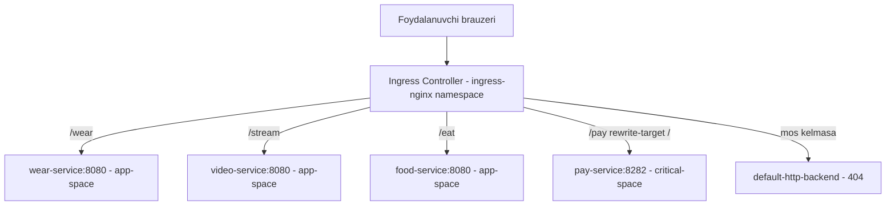

# Dars 249 — Lab yechimi: Ingress Networking 1

> 🎯 **Bu labda nimani o'rganamiz:**
> - Klasterda o'rnatilgan Ingress controller va Ingress resource'ni topish va o'rganish
> - Ingress'ga yangi path qo'shish va mavjud path'ni o'zgartirish (`kubectl edit`)
> - Boshqa namespace'dagi ilova uchun alohida Ingress resource yaratish (`kubectl create ingress`)
> - `rewrite-target` annotation bilan 404 xatosini tuzatish

**Oddiy o'xshatish:** Ingress controller — katta savdo markazining bosh kirish eshigidagi ma'lumot xizmati (resepshn). Mijoz "kiyim bo'limi qayerda?" deb so'rasa (`/wear`), resepshn uni kerakli do'konga (Service'ga) yo'naltiradi. Yangi do'kon ochilsa (masalan, oshxona — `/eat`), resepshn ro'yxatiga yangi qator qo'shish kifoya.

## Masala sharti (qisqacha)

Klasterda Ingress controller va bir nechta ilova oldindan o'rnatilgan. Bizning vazifamiz:

1. Muhitni o'rganish: controller qaysi namespace'da, Ingress resource qanday sozlangan?
2. Video ilovaning URL'ini `/watch` dan `/stream` ga o'zgartirish.
3. Yangi `food` ilovasi uchun `/eat` path qo'shish.
4. Alohida `critical-space` namespace'dagi to'lov ilovasini `/pay` path'da ochish va xatolarni tuzatish.

## 1-qadam — Muhitni o'rganamiz

Avval nodelarni va deploymentlarni ko'rib chiqamiz:

```bash
kubectl get nodes
# Bitta node bor (controlplane)

kubectl get deployments
# No resources found in default namespace.
```

`default` namespace bo'sh. Demak, hamma narsa boshqa namespace'larda — barcha namespace'larni tekshiramiz:

```bash
kubectl get deployments --all-namespaces
```

Natijada deploymentlar uchta joyda ko'rinadi: `app-space`, `ingress-nginx` va `kube-system` namespace'larida.

**Savol:** Ingress controller qaysi namespace'da joylashgan?
**Javob:** `kubectl get pods -A` qilsak, ingress controller pod'i `ingress-nginx` namespace'da ekanini ko'ramiz.

**Savol:** Ingress controller deployment'ining nomi nima?
**Javob:** Tekshiramiz:

```bash
kubectl get deploy -n ingress-nginx
NAME                       READY   UP-TO-DATE   AVAILABLE   AGE
ingress-nginx-controller   1/1     1            1           5m
```

Deployment nomi — `ingress-nginx-controller`.

**Savol:** Ilovalar qaysi namespace'da va nechta?
**Javob:** Ilovalar (`webapp-wear`, `webapp-video` va `default-backend`) `app-space` namespace'da. 3 ta pod = 3 ta ilova.

## 2-qadam — Ingress resource'ni o'rganamiz

```bash
kubectl get ingress --all-namespaces
NAMESPACE   NAME                 CLASS    HOSTS   ADDRESS   PORTS   AGE
app-space   ingress-wear-watch   <none>   *                 80      5m
```

- Ingress resource `app-space` namespace'da, nomi — `ingress-wear-watch`.
- `HOSTS` ustunida `*` turibdi — bu "har qanday host uchun amal qiladi" degani.

Batafsil ko'ramiz:

```bash
kubectl describe ingress ingress-wear-watch -n app-space
```

`Rules` bo'limida ikkita path ko'rinadi:

| Path | Backend Service | Port |
|---|---|---|
| `/wear` | `wear-service` | 8080 |
| `/watch` | `video-service` | 8080 |

**Savol:** So'rov hech qaysi path'ga mos kelmasa, qayerga boradi?
**Javob:** `default-http-backend` service'ga. Describe natijasida `Default backend: default-http-backend:80` qatorini ko'rish mumkin. Shuning uchun brauzerda Ingress service'ning ildiz (`/`) manzilini ochsak, **404 Not Found** sahifasi chiqadi — bu default backend'ning javobi. `/wear` ni ochsak kiyimlar ilovasi, `/watch` ni ochsak video-streaming ilovasi ko'rinadi.

## 3-qadam — `/watch` ni `/stream` ga o'zgartiramiz

Video ilovani `/stream` manzilida ochish so'ralgan. Ingress resource'ni to'g'ridan-to'g'ri tahrirlaymiz:

```bash
kubectl edit ingress ingress-wear-watch -n app-space
```

Ochilgan YAML'da `paths` bo'limidan `/watch` ni topib, `/stream` ga almashtiramiz:

```yaml
- path: /stream
  pathType: Prefix
  backend:
    service:
      name: video-service
      port:
        number: 8080
```

Saqlagach, o'zgarish darhol kuchga kiradi: endi `/watch` **404** qaytaradi, `/stream` esa video ilovasini ochadi.

⚠️ `kubectl edit` bilan qilingan o'zgarish saqlangan zahoti qo'llanadi — alohida `apply` shart emas.

**Savol:** Foydalanuvchi `/eat` manzilini ochsa nimani ko'radi?
**Javob:** Hozircha bunday path yo'q, shuning uchun **404** sahifasini ko'radi.

## 4-qadam — Yangi `/eat` path qo'shamiz

Biznes yangi yo'nalish ochdi: ovqat yetkazish ilovasi klasterga ko'chirilgan. Avval yangi deployment va uning service'ini topamiz:

```bash
kubectl get deploy -n app-space
# default-backend, webapp-food, webapp-video, webapp-wear

kubectl get svc -n app-space
# food-service ... 8080/TCP ...
```

Yangi ilova service'i — `food-service`, porti — `8080`. Endi Ingress'ni yana tahrirlaymiz va mavjud path'lardan birini nusxalab, yangisini qo'shamiz:

```bash
kubectl edit ingress ingress-wear-watch -n app-space
```

```yaml
- path: /eat
  pathType: Prefix
  backend:
    service:
      name: food-service
      port:
        number: 8080
```

Saqlaymiz — brauzerda `/eat` ni yangilasak, ovqat yetkazish ilovasi ochiladi. ✅

## 5-qadam — `critical-space` uchun alohida Ingress yaratamiz

Yangi to'lov xizmati muhim bo'lgani uchun o'zining alohida namespace'ida joylashtirilgan. Uni topamiz:

```bash
kubectl get pods -A
# Yangi namespace: critical-space

kubectl get deploy -n critical-space
NAME         READY   UP-TO-DATE   AVAILABLE   AGE
webapp-pay   1/1     1            1           3m

kubectl get svc -n critical-space
# pay-service ... 8282/TCP ...
```

Deployment — `webapp-pay`, service — `pay-service`, porti — `8282`.

💡 **Muhim qoida:** `app-space` dagi Ingress resource'da boshqa namespace'dagi service'ni ko'rsatib bo'lmaydi. **Best practice** — har bir jamoa o'z namespace'ida o'zining Ingress resource'ini yaratadi (chunki har bir jamoaga faqat o'z namespace'iga ruxsat berilgan bo'lishi mumkin). Ingress controller esa bitta bo'lib, hamma namespace'lardagi Ingress'larni kuzatib boradi.

Imperativ buyruq bilan yaratamiz (formatini eslash uchun `kubectl create ingress -h` qarash mumkin):

```bash
kubectl create ingress ingress-pay -n critical-space --rule="/pay=pay-service:8282"
```

Tekshiramiz:

```bash
kubectl get ingress -n critical-space
NAME          CLASS    HOSTS   ADDRESS   PORTS   AGE
ingress-pay   <none>   *                 80      10s

kubectl describe ingress ingress-pay -n critical-space
# /pay -> pay-service:8282
```

## 6-qadam — 404 xatosini `rewrite-target` bilan tuzatamiz

Brauzerda `/pay` ni ochamiz... lekin baribir **404** chiqyapti. Sababini topish uchun ilova loglarini ko'ramiz:

```bash
kubectl get pods -n critical-space
# webapp-pay-xxxxxxxxx-xxxxx

kubectl logs webapp-pay-xxxxxxxxx-xxxxx -n critical-space
```

Loglarda so'rovlar `/pay` path'i bilan kelayotgani ko'rinadi. Muammo shu yerda: **ilovaning o'zida `/pay` degan sahifa yo'q** — u faqat ildiz (`/`) manzilda ishlaydi. Ingress esa URL'ni o'zgartirmasdan, qanday bo'lsa shundayligicha (`/pay` bilan) ilovaga uzatyapti.

Yechim — `rewrite-target` annotation'i. U foydalanuvchi kiritgan `/pay` ni backend'ga yuborishdan oldin `/` ga almashtiradi:

```bash
kubectl edit ingress ingress-pay -n critical-space
```

`metadata` bo'limiga annotation qo'shamiz:

```yaml
apiVersion: networking.k8s.io/v1
kind: Ingress
metadata:
  name: ingress-pay
  namespace: critical-space
  annotations:
    nginx.ingress.kubernetes.io/rewrite-target: /
spec:
  rules:
  - http:
      paths:
      - path: /pay
        pathType: Prefix
        backend:
          service:
            name: pay-service
            port:
              number: 8282
```

Saqlab, brauzerni yangilaymiz — endi to'lov ilovasi ochildi. ✅

## Ingress trafik oqimi



## ❓ Savol-Javob

**Savol:** Nega `/pay` uchun `app-space` dagi mavjud Ingress'ni ishlatmadik?
**Javob:** Ingress resource faqat o'z namespace'idagi service'larga trafik yo'naltira oladi. `pay-service` `critical-space` da bo'lgani uchun Ingress ham o'sha yerda yaratilishi kerak.

**Savol:** `rewrite-target` annotation'i nima qiladi?
**Javob:** Foydalanuvchi so'ragan path'ni (masalan `/pay`) backend'ga yuborishdan oldin boshqa qiymatga (masalan `/`) almashtiradi. Bu ildiz manzilda ishlaydigan ilovalarni istalgan path ostida ochish imkonini beradi.

**Savol:** Ingress'da hech qaysi qoidaga mos kelmagan so'rov qayerga boradi?
**Javob:** Default backend'ga (`default-http-backend`) — u odatda 404 sahifasini qaytaradi.

## 📌 CKA imtihon uchun maslahat

- `kubectl create ingress <nom> -n <ns> --rule="/path=service:port"` — imtihonda YAML yozmasdan Ingress yaratishning eng tez usuli. Formatini unutsangiz: `kubectl create ingress -h`.
- Ingress ishlamasa tekshirish tartibi: 1) `kubectl describe ingress` (backend to'g'rimi?), 2) ilova pod loglari (so'rov yetib boryaptimi, qaysi path bilan?), 3) controller loglari.
- Service port raqamlarini taxmin qilmang — har doim `kubectl get svc -n <ns>` bilan aniqlab oling.

## 📖 Asosiy atamalar

| Atama | Oddiy tushuntirish |
|---|---|
| Ingress Controller | Klasterga kirayotgan HTTP trafikni qoidalarga qarab taqsimlab beruvchi dastur (bu labda NGINX) |
| Ingress Resource | "Qaysi path qaysi service'ga borsin" degan qoidalar to'plami (YAML obyekt) |
| Default backend | Hech bir qoidaga mos kelmagan so'rovlar boradigan service (404 qaytaradi) |
| rewrite-target | Backend'ga yuborishdan oldin URL path'ini almashtiruvchi annotation |
| Annotation | Obyektga qo'shimcha sozlama beruvchi metadata yozuvi |

## 💡 Xulosa

- Ingress controller **bitta** (odatda alohida namespace'da), Ingress resource'lar esa **ko'p** bo'lishi mumkin — har bir jamoa/namespace o'ziga yaratadi.
- Yangi ilovani Ingress orqali ochish: service nomi va portini aniqlab, mavjud Ingress'ga path qo'shish yoki (boshqa namespace bo'lsa) yangi Ingress yaratish.
- Ilova ildiz (`/`) manzilda ishlab, Ingress'da `/pay` kabi path ostida ochilgan bo'lsa, `nginx.ingress.kubernetes.io/rewrite-target: /` annotation'i shart — aks holda 404 olasiz.
- Xato qidirishda loglar eng yaqin do'stingiz: avval ilova logi, keyin controller logi.

## 🔗 Manbalar

- [Ingress — kubernetes.io](https://kubernetes.io/docs/concepts/services-networking/ingress/)
- [Ingress Controllers — kubernetes.io](https://kubernetes.io/docs/concepts/services-networking/ingress-controllers/)
- [NGINX Ingress rewrite annotation](https://kubernetes.github.io/ingress-nginx/examples/rewrite/)

---
*Bu dars KodeKloud CKA kursining 249-videosi asosida tayyorlandi.*
