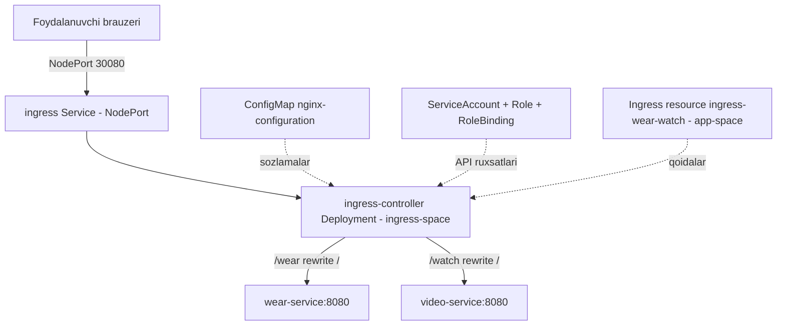

# Dars 251 — Lab yechimi: Ingress Networking 2 (controllerni noldan o'rnatish)

> 🎯 **Bu labda nimani o'rganamiz:**
> - NGINX Ingress controllerni noldan o'rnatish: namespace → ConfigMap → ServiceAccount → Deployment → Service
> - Deployment YAML faylidagi xatolarni (indentation, namespace) topish va tuzatish
> - `kubectl expose` bilan NodePort service yaratish va nodePort'ni qo'lda o'zgartirish
> - `rewrite-target` va `ssl-redirect` annotation'lari bilan "too many redirects" muammosini hal qilish

**Oddiy o'xshatish:** O'tgan labda tayyor resepshni bor binoga kirdik. Bu safar esa binoga resepshnni o'zimiz "yollaymiz": unga alohida xona ajratamiz (namespace), ish qoidalari daftarini beramiz (ConfigMap), xizmat guvohnomasi chiqaramiz (ServiceAccount + Role), o'zini ishga olamiz (Deployment) va eshigiga tashqaridan kiriladigan tabl o'rnatamiz (NodePort Service).

## Masala sharti (qisqacha)

Klasterda `app-space` namespace'da ikkita ilova (`wear` va `video`) ishlab turibdi, lekin Ingress controller yo'q. Vazifa — controllerning barcha qismlarini qadam-baqadam o'rnatib, ilovalarni `/wear` va `/watch` path'larida ochish.

Avval muhitni ko'rib olamiz:

```bash
kubectl get pods -A
# app-space namespace'da webapp-wear va webapp-video pod'lari ishlab turibdi
```

## 1-qadam — Namespace yaratamiz

Ingress controllerga alohida namespace ajratamiz:

```bash
kubectl create namespace ingress-space
namespace/ingress-space created
```

## 2-qadam — ConfigMap yaratamiz

NGINX Ingress controller o'z sozlamalarini ConfigMap'dan o'qiydi. Hozircha ichi bo'sh bo'lsa ham, obyektning o'zi mavjud bo'lishi shart:

```bash
kubectl create configmap nginx-configuration -n ingress-space
configmap/nginx-configuration created
```

💡 Bo'sh ConfigMap'ning foydasi shundaki — keyinchalik NGINX sozlamalarini (log format, timeout va h.k.) o'zgartirish kerak bo'lsa, controllerni qayta deploy qilmasdan shu ConfigMap'ga qiymat qo'shish kifoya.

## 3-qadam — ServiceAccount yaratamiz

Controller klasterdagi Ingress resource'larni kuzatib turishi uchun API server bilan gaplashadi — buning uchun unga ServiceAccount kerak:

```bash
kubectl create serviceaccount ingress-serviceaccount -n ingress-space
serviceaccount/ingress-serviceaccount created
```

## 4-qadam — Role va RoleBinding'ni ko'zdan kechiramiz

Bu labda Role va RoleBinding oldindan yaratib qo'yilgan. Ular ServiceAccount'ga qanday huquqlar berilganini belgilaydi:

```bash
kubectl get roles,rolebindings -n ingress-space
# ingress-role va ingress-role-binding

kubectl describe role ingress-role -n ingress-space
```

Describe natijasida controllerga qaysi resource'larga (configmaps, endpoints, namespaces, pods, secrets...) qanday amallar (get, watch, list...) uchun ruxsat berilgani ko'rinadi.

## 5-qadam — Ingress controller Deployment'ini yaratamiz (va xatolarni tuzatamiz)

Bizga tayyor `ingress-controller.yaml` fayli berilgan — unda eng qiyin qismlar (image, args, env, port) allaqachon yozilgan. Taxminiy ko'rinishi:

```yaml
apiVersion: apps/v1
kind: Deployment
metadata:
  name: ingress-controller
  namespace: ingress-space
spec:
  replicas: 1
  selector:
    matchLabels:
      name: nginx-ingress
  template:
    metadata:
      labels:
        name: nginx-ingress
    spec:
      serviceAccountName: ingress-serviceaccount
      containers:
        - name: nginx-ingress-controller
          image: quay.io/kubernetes-ingress-controller/nginx-ingress-controller:0.21.0
          args:
            - /nginx-ingress-controller
            - --configmap=$(POD_NAMESPACE)/nginx-configuration
            - --default-backend-service=app-space/default-backend-service
          env:
            - name: POD_NAME
              valueFrom:
                fieldRef:
                  fieldPath: metadata.name
            - name: POD_NAMESPACE
              valueFrom:
                fieldRef:
                  fieldPath: metadata.namespace
          ports:
            - name: http
              containerPort: 80
            - name: https
              containerPort: 443
```

Yaratishga urinamiz:

```bash
kubectl apply -f ingress-controller.yaml
# error: error parsing ingress-controller.yaml: error converting YAML to JSON:
# yaml: line 36: ...
```

**1-xato:** 36-qatorda YAML **indentation** (bo'sh joylar) xatosi bor. Faylni ochib (`vi ingress-controller.yaml`), o'sha qatordagi joylashuvni to'g'rilaymiz. Yana urinamiz:

```bash
kubectl apply -f ingress-controller.yaml
# Error from server (NotFound): namespaces "ingress-" not found
```

**2-xato:** `metadata.namespace` noto'g'ri yozilgan (`ingress-`). Uni `ingress-space` ga to'g'rilaymiz va qayta yaratamiz:

```bash
kubectl apply -f ingress-controller.yaml
deployment.apps/ingress-controller created

kubectl get deploy -n ingress-space
NAME                 READY   UP-TO-DATE   AVAILABLE   AGE
ingress-controller   1/1     1            1           40s
```

Avvaliga pod `ContainerCreating` holatida bo'ladi — biroz kutamiz, keyin `Running` bo'ladi. ✅

⚠️ **Imtihon darsi:** YAML xatolari ikki xil bo'ladi — sintaksis xatosi (parse bosqichida chiqadi) va mantiqiy xato (server rad etadi, masalan mavjud bo'lmagan namespace). Xato xabarini diqqat bilan o'qing: qaysi qator, qaysi obyekt.

## 6-qadam — Controllerni NodePort Service bilan ochamiz

Endi tashqi foydalanuvchilar controllerga yeta olishi uchun `ingress` nomli NodePort service kerak (nodePort: 30080). Eng tez yo'li — `kubectl expose`:

```bash
kubectl expose deploy ingress-controller -n ingress-space --name ingress --port 80 --target-port 80 --type NodePort
service/ingress exposed
```

💡 `expose` buyrug'i deployment'ning selector'ini avtomatik to'g'ri qo'yadi — YAML bilan ishlashning hojati yo'q. Bu imtihonda katta vaqt tejaydi.

Lekin `expose` buyrug'ida **nodePort'ni ko'rsatib bo'lmaydi** — Kubernetes o'zi tasodifiy port tanlaydi:

```bash
kubectl get svc -n ingress-space
NAME      TYPE       CLUSTER-IP     EXTERNAL-IP   PORT(S)        AGE
ingress   NodePort   10.101.45.12   <none>        80:32741/TCP   10s
```

`32741` — biz xohlagan port emas. Service'ni tahrirlab, `nodePort` ni `30080` ga o'zgartiramiz:

```bash
kubectl edit svc ingress -n ingress-space
```

```yaml
ports:
- nodePort: 30080   # 32741 ni shu qiymatga almashtiramiz
  port: 80
  protocol: TCP
  targetPort: 80
```

Saqlaymiz — endi controller `30080` portda tashqariga ochiq. ✅

## 7-qadam — Ingress resource yaratamiz

Endi qoidalarni yozamiz: `/wear` va `/watch` path'lari ilovalarga borsin. Avval service nomlari va portlarini **aniqlab olamiz** (taxmin qilmaymiz!):

```bash
kubectl get svc -n app-space
NAME            TYPE        CLUSTER-IP      EXTERNAL-IP   PORT(S)    AGE
video-service   ClusterIP   10.104.61.85    <none>        8080/TCP   30m
wear-service    ClusterIP   10.108.11.132   <none>        8080/TCP   30m
```

Diqqat: "watch" ilovasining service'i `watch-service` emas, **`video-service`** deb ataladi, portlar — `8080`. Ingress resource ilovalar turgan `app-space` namespace'da yaratiladi:

```bash
kubectl create ingress ingress-wear-watch -n app-space \
  --rule="/wear=wear-service:8080" \
  --rule="/watch=video-service:8080"
ingress.networking.k8s.io/ingress-wear-watch created
```

Tekshiramiz:

```bash
kubectl get ingress -n app-space
kubectl describe ingress ingress-wear-watch -n app-space
# /wear  -> wear-service:8080  (endpointlar topilgan)
# /watch -> video-service:8080 (endpointlar topilgan)
```

## 8-qadam — Test va "too many redirects" xatosini tuzatamiz

Brauzerda `/wear` va `/watch` ni ochamiz... ishlamayapti. Qadam-baqadam aniqlaymiz:

**1) Ilova loglarini ko'ramiz:**

```bash
kubectl logs <webapp-wear-pod> -n app-space
kubectl logs <webapp-video-pod> -n app-space
```

Loglar bo'sh — so'rovlar ilovalarga **umuman yetib bormayapti**.

**2) Controller loglarini ko'ramiz:**

```bash
kubectl logs <ingress-controller-pod> -n ingress-space
```

Bu yerda loglar ko'p — demak so'rovlar controllerga kelyapti, lekin javoblarda **308** status kodlari ko'rinadi. `308` — bu redirect. Brauzer ham "too many redirects" xatosini beryapti: controller HTTP so'rovni HTTPS'ga qayta yo'naltirishga urinib, cheksiz aylanib qolyapti (bizda TLS sertifikat sozlanmagan).

**3) Yechim — Ingress'ga ikkita annotation qo'shamiz:**

```bash
kubectl edit ingress ingress-wear-watch -n app-space
```

```yaml
apiVersion: networking.k8s.io/v1
kind: Ingress
metadata:
  name: ingress-wear-watch
  namespace: app-space
  annotations:
    nginx.ingress.kubernetes.io/rewrite-target: /
    nginx.ingress.kubernetes.io/ssl-redirect: "false"
spec:
  rules:
  - http:
      paths:
      - path: /wear
        pathType: Prefix
        backend:
          service:
            name: wear-service
            port:
              number: 8080
      - path: /watch
        pathType: Prefix
        backend:
          service:
            name: video-service
            port:
              number: 8080
```

- `rewrite-target: /` — ilovalar `/wear` yoki `/watch` path'ini bilmaydi, ular ildizda ishlaydi; bu annotation path'ni `/` ga almashtirib yuboradi (249-darsda ko'rganimizdek).
- `ssl-redirect: "false"` — HTTPS'ga majburiy yo'naltirishni o'chiradi va redirect halqasini to'xtatadi.

Saqlab, brauzerni yangilaymiz — `/wear` ham, `/watch` ham ishlayapti. ✅ Lab tugadi.

## Ingress trafik oqimi



## ❓ Savol-Javob

**Savol:** Ingress controller o'rnatish uchun qanday qismlar kerak?
**Javob:** Namespace, ConfigMap (NGINX sozlamalari uchun), ServiceAccount + Role + RoleBinding (API ruxsatlari uchun), Deployment (controllerning o'zi) va Service (tashqariga ochish uchun, odatda NodePort).

**Savol:** Nega `kubectl expose` dan keyin service'ni yana tahrirladik?
**Javob:** `expose` buyrug'ida `nodePort` qiymatini berib bo'lmaydi — Kubernetes tasodifiy port tanlaydi. Aniq port (30080) kerak bo'lsa, service yaratilgach `kubectl edit svc` bilan o'zgartiriladi.

**Savol:** "Too many redirects" xatosi nimadan kelib chiqdi?
**Javob:** NGINX Ingress controller sukut bo'yicha HTTP so'rovlarni HTTPS'ga yo'naltiradi (308 redirect). TLS sozlanmagan muhitda bu cheksiz halqaga aylanadi — `ssl-redirect: "false"` annotation'i bilan o'chiriladi.

**Savol:** Ingress resource qaysi namespace'da bo'lishi kerak edi?
**Javob:** Controller emas, **ilovalar** turgan namespace'da (`app-space`) — chunki Ingress faqat o'z namespace'idagi service'larga trafik yo'naltiradi.

## 📌 CKA imtihon uchun maslahat

- Zanjirni yodda tuting: **namespace → configmap → serviceaccount → (role/rolebinding) → deployment → service → ingress resource**. Imtihonda shu tartibda borsangiz adashmaysiz.
- `kubectl expose deploy <nom> -n <ns> --name <svc-nom> --port 80 --target-port 80 --type NodePort` + `kubectl edit svc` (nodePort uchun) — YAML yozmasdan service yaratishning eng tez kombinatsiyasi.
- Berilgan YAML fayl xato bersa, xabardagi qator raqamiga to'g'ri boring — ko'pincha indentation yoki nom xatosi bo'ladi.
- Diagnostika tartibi: ilova logi (so'rov yetyaptimi?) → controller logi (status kodlar: 308 = redirect, 404 = path topilmadi).

## 📖 Asosiy atamalar

| Atama | Oddiy tushuntirish |
|---|---|
| ConfigMap | Dastur sozlamalarini saqlash obyekti; NGINX controller o'z konfiguratsiyasini shundan o'qiydi |
| ServiceAccount | Pod'larning API server oldida "shaxsiy guvohnomasi" |
| Role / RoleBinding | Namespace ichida qaysi resource'larga qanday amal ruxsat etilganini belgilovchi obyektlar |
| NodePort | Service'ni node'ning tashqi portida (30000-32767) ochuvchi tur |
| 308 redirect | "Doimiy boshqa manzilga o'tish" HTTP javobi; SSL redirect'da ishlatiladi |
| ssl-redirect annotation | HTTP dan HTTPS ga majburiy yo'naltirishni yoquvchi/o'chiruvchi sozlama |

## 💡 Xulosa

- Ingress controller — oddiy pod emas, butun bir to'plam: namespace, ConfigMap, ServiceAccount, RBAC ruxsatlari, Deployment va NodePort Service birgalikda ishlaydi.
- `kubectl expose` + `kubectl edit` juftligi YAML yozmasdan aniq nodePort'li service yaratishning amaliy yo'li.
- YAML xatolarini xato xabaridagi qator raqami bo'yicha izlang: avval sintaksis (indentation), keyin mantiq (namespace nomi).
- TLS'siz muhitda NGINX Ingress ishlamasa, ikkita klassik annotation'ni eslang: `rewrite-target: /` va `ssl-redirect: "false"` — birinchisi 404'ni, ikkinchisi redirect halqasini davolaydi.

## 🔗 Manbalar

- [Ingress Controllers — kubernetes.io](https://kubernetes.io/docs/concepts/services-networking/ingress-controllers/)
- [Ingress — kubernetes.io](https://kubernetes.io/docs/concepts/services-networking/ingress/)
- [NGINX Ingress annotations ro'yxati](https://kubernetes.github.io/ingress-nginx/user-guide/nginx-configuration/annotations/)
- [RBAC — Role va RoleBinding](https://kubernetes.io/docs/reference/access-authn-authz/rbac/)

---
*Bu dars KodeKloud CKA kursining 251-videosi asosida tayyorlandi.*
