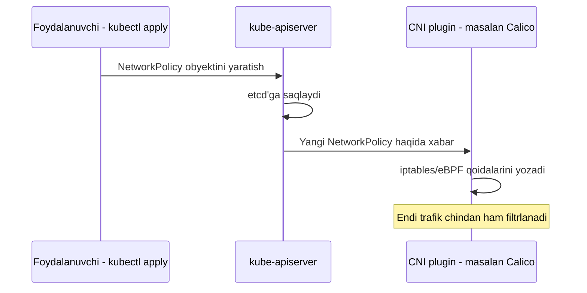
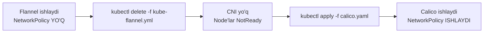

# Dars 246 — NetworkPolicy va CNI tanlash: nega Flannel yetarli emas

> 🎯 **Bu darsda nimani o'rganamiz:**
> - NetworkPolicy nima va u nima uchun kerak
> - Nega ba'zi CNI pluginlar (Flannel) NetworkPolicy'ni qo'llab-quvvatlamaydi
> - Amaliy CKA topshirig'i: **"The Flannel CNI does not support NetworkPolicies. Delete Flannel CNI."** — bu vazifani qadam-baqadam qanday bajarish kerak
> - Flannel'ni Calico (yoki boshqa NetworkPolicy'ni qo'llaydigan CNI) bilan almashtirish

## Oddiy hayotiy o'xshatish: turniketsiz metro va turniketli metro

Flannel — bu yo'lovchilarni bir stansiyadan ikkinchisiga eltib qo'yadigan poyezd. U o'z vazifasini a'lo bajaradi: pod'lar orasida paketlarni yetkazib beradi. Lekin unda **turniket yo'q** — kim kirsa ham, hech kim uni to'xtatmaydi. NetworkPolicy esa aynan shu turniket: "faqat X guruhidagi odamlar Y stansiyasiga kira oladi" degan qoida. Flannel'da bu turniketni o'rnatadigan mexanizm yo'q — shuning uchun NetworkPolicy yozsangiz ham, u hech kimni to'xtatmaydi, chunki uni **amalga oshiradigan hech kim yo'q**.

## NetworkPolicy nima va nega kerak?

Odatdagi holatda Kubernetes klasterida **har qanday pod har qanday boshqa pod bilan** erkin gaplasha oladi — hech qanday cheklov yo'q. Bu kichik loyihalar uchun qulay, lekin real ishlab chiqarishda xavfsizlik nuqtai nazaridan muammoli: masalan, frontend pod to'g'ridan-to'g'ri database pod'ga ulanmasligi kerak, faqat backend orqali borishi kerak.

**NetworkPolicy** — bu Kubernetes obyekti bo'lib, qaysi pod'lar qaysi pod'lar bilan (va qaysi portlarda) gaplasha olishini belgilaydi — xuddi firewall qoidasi kabi:

```yaml
apiVersion: networking.k8s.io/v1
kind: NetworkPolicy
metadata:
  name: db-policy
  namespace: default
spec:
  podSelector:
    matchLabels:
      role: database
  policyTypes:
    - Ingress
  ingress:
    - from:
        - podSelector:
            matchLabels:
              role: backend
      ports:
        - protocol: TCP
          port: 3306
```

Bu qoida shuni bildiradi: `role: database` yorlig'iga ega pod'larga faqat `role: backend` yorlig'iga ega pod'lardan, faqat 3306-portga kirish mumkin. Boshqa hamma trafik rad etiladi.

## Nega bu qoida o'z-o'zidan ishlamaydi?

Muhim narsa shuki, **NetworkPolicy obyektini yaratish — bu shunchaki "buyruq berish"**. Uni haqiqatda amalga oshiradigan, ya'ni iptables yoki IPVS qoidalariga aylantiradigan alohida komponent kerak. Bu vazifa **CNI pluginining zimmasida**.



Agar CNI plugin NetworkPolicy'ni "tushunmasa" — apiserver obyektni qabul qiladi, `kubectl get networkpolicy` buyrug'i uni ko'rsatadi, lekin **hech qanday amaliy cheklov ishlamaydi**. Bu juda xavfli holat: siz "xavfsizlik qoidasi qo'ydim" deb o'ylaysiz, aslida hech narsa himoyalanmagan.

## Qaysi CNI pluginlar NetworkPolicy'ni qo'llab-quvvatlaydi?

| CNI plugin | NetworkPolicy qo'llab-quvvatlanadimi? | Izoh |
|---|---|---|
| **Flannel** | ❌ Yo'q | Faqat oddiy overlay tarmoq yaratadi, filtrlash mexanizmi yo'q |
| **Calico** | ✅ Ha | NetworkPolicy uchun eng mashhur va to'liq yechim, hatto o'zining kengaytirilgan `GlobalNetworkPolicy`si ham bor |
| **Weave Net** | ✅ Ha | NetworkPolicy'ni qo'llab-quvvatlaydi |
| **Cilium** | ✅ Ha (va undan ko'proq) | eBPF asosida, L7 (HTTP) darajasida ham filtrlay oladi |
| **kube-router** | ✅ Ha | iptables asosida NetworkPolicy'ni amalga oshiradi |

💡 **Xulosa:** Flannel — juda yengil va sodda CNI, lekin u faqat pod'lar orasida tarmoq ulanishini ta'minlaydi, xavfsizlik qatlamini emas. Agar klasteringizda NetworkPolicy ishlatish kerak bo'lsa, Flannel **yetarli emas**.

## 🧪 Amaliy topshiriq: "Delete Flannel CNI"

CKA imtihonida (yoki mock testlarda) ko'pincha shunday vazifa uchraydi:

> **"The Flannel CNI does not support NetworkPolicies. Delete Flannel CNI."**
> (Flannel CNI NetworkPolicy'larni qo'llab-quvvatlamaydi. Flannel CNI'ni o'chiring.)

Bu topshiriq odatda kattaroq vazifaning bir qismi: keyingi qadamda Flannel o'rniga Calico kabi NetworkPolicy'ni qo'llaydigan CNI o'rnatiladi. Keling, buni qadam-baqadam bajaramiz.

### 1-qadam: Joriy holatni tekshirish

Avval qaysi CNI ishlab turganini va uning qanday resurslardan tashkil topganini ko'ramiz:

```bash
kubectl get pods -n kube-system | grep -i flannel
```

Odatda natija shunday ko'rinadi:

```
kube-flannel-ds-2xk9p   1/1   Running   0   10m
kube-flannel-ds-9j4lm   1/1   Running   0   10m
kube-flannel-ds-p7q3r   1/1   Running   0   10m
```

Flannel odatda **DaemonSet** sifatida ishlaydi — har node'da bittadan pod. Shuningdek quyidagilarni ham tekshiring:

```bash
kubectl get daemonset -n kube-system
kubectl get configmap -n kube-system | grep -i flannel
kubectl get clusterrole,clusterrolebinding | grep -i flannel
kubectl get serviceaccount -n kube-system | grep -i flannel
```

### 2-qadam: Flannel'ni o'rnatishda ishlatilgan manifestni topish

Eng toza yechim — Flannel qanday manifest bilan o'rnatilgan bo'lsa, aynan o'sha manifest bilan `kubectl delete -f` qilish, chunki bu Flannel yaratgan **barcha** resurslarni (DaemonSet, ConfigMap, ServiceAccount, ClusterRole, ClusterRoleBinding) toza o'chiradi:

```bash
kubectl delete -f https://github.com/flannel-io/flannel/releases/latest/download/kube-flannel.yml
```

Agar manifest fayli qo'lda saqlangan bo'lsa (masalan, `kube-flannel.yml`), xuddi shu faylni ishlatib o'chirish tavsiya etiladi:

```bash
kubectl delete -f kube-flannel.yml
```

### 3-qadam: Qo'lda o'chirish (agar original manifest topilmasa)

Agar original manifest fayli mavjud bo'lmasa, resurslarni birma-bir o'chirishga to'g'ri keladi:

```bash
# DaemonSet'ni o'chirish
kubectl delete daemonset kube-flannel-ds -n kube-system

# ConfigMap'ni o'chirish
kubectl delete configmap kube-flannel-cfg -n kube-system

# ServiceAccount'ni o'chirish
kubectl delete serviceaccount flannel -n kube-system

# ClusterRole va ClusterRoleBinding'ni o'chirish
kubectl delete clusterrole flannel
kubectl delete clusterrolebinding flannel

# Ba'zi versiyalarda alohida namespace ham yaratiladi
kubectl delete namespace kube-flannel --ignore-not-found
```

⚠️ **Muhim eslatma:** Faqat DaemonSet'ni o'chirish yetarli emas! Agar ConfigMap va RBAC resurslari qolib ketsa, ular klasterni "chalkashtirib" qo'yishi mumkin — keyinroq boshqa CNI o'rnatilganda nom to'qnashuvi (masalan, ikkalasi ham `10.244.0.0/16` diapazonini "egallab olgan" deb hisoblanishi) yuzaga kelishi mumkin.

### 4-qadam: Node interfeyslarini tekshirish (ixtiyoriy, ammo tavsiya etiladi)

Flannel har node'da `cni0` va `flannel.1` kabi virtual tarmoq interfeyslari yaratgan bo'ladi. CNI pluginini to'liq almashtirishdan oldin, ba'zi hollarda bu interfeyslarni ham tozalash kerak bo'ladi (ayniqsa amaliy klasterlarda — imtihon lablarida bu odatda talab qilinmaydi):

```bash
# Har bir node'da (SSH orqali kirib):
ip link show cni0
ip link delete cni0
ip link show flannel.1
ip link delete flannel.1
```

### 5-qadam: Node'lar holatini tekshirish

Flannel o'chirilgach, pod'lar orasidagi tarmoq vaqtincha ishlamay qolishi normal — chunki hozircha hech qanday CNI plugin yo'q:

```bash
kubectl get nodes
```

Node'lar `NotReady` holatiga o'tishi mumkin, chunki CNI plugin yo'qligi sababli kubelet tarmoqni sozlay olmayapti:

```
NAME           STATUS     ROLES           AGE   VERSION
controlplane   NotReady   control-plane   45m   v1.31.0
node01         NotReady   <none>          45m   v1.31.0
```

Bu — **kutilgan natija**. Vazifaning navbatdagi qismi odatda yangi CNI (masalan, Calico) o'rnatishni talab qiladi, va o'rnatilgach node'lar yana `Ready` holatiga qaytadi.

## Flannel o'rniga Calico o'rnatish (keyingi qadam sifatida)

Agar topshiriqda "Flannel'ni Calico bilan almashtiring" deyilgan bo'lsa:

```bash
kubectl apply -f https://raw.githubusercontent.com/projectcalico/calico/v3.28.0/manifests/calico.yaml
```

Bir necha daqiqadan so'ng tekshiring:

```bash
kubectl get pods -n kube-system | grep calico
kubectl get nodes
```

Endi barcha node'lar `Ready` holatiga qaytishi va NetworkPolicy obyektlari haqiqatan ham amalga oshirilishi kerak.



## ❓ Savol-Javob

**Savol:** Flannel'ni o'chirsam, mavjud pod'lar ishlashda davom etadimi?

**Javob:** Ishlab turgan pod'lar darhol o'chib qolmaydi, lekin ularning tarmoq interfeyslari Flannel tomonidan sozlangani uchun yangi pod'lar yaratilganda yoki mavjudlari qayta ishga tushganda muammo chiqishi mumkin. Shuning uchun CNI almashtirish jarayonini iloji boricha tezroq (Flannel'ni o'chirib, darhol yangi CNI'ni o'rnatib) yakunlash kerak.

**Savol:** NetworkPolicy yaratdim, lekin u ishlamayapti — sabab nima bo'lishi mumkin?

**Javob:** Eng ko'p uchraydigan sabab — CNI plugin NetworkPolicy'ni qo'llab-quvvatlamaydi (masalan, Flannel). Buni tekshirish uchun: `kubectl get pods -n kube-system` orqali qaysi CNI ishlab turganini ko'ring va uni yuqoridagi jadval bilan solishtiring.

**Savol:** Nega ayni Flannel keng tarqalgan, agar u NetworkPolicy'ni qo'llamasa?

**Javob:** Chunki Flannel juda sodda, yengil va o'rnatish oson — ko'plab o'quv va kichik loyihalarda xavfsizlik siyosati talab qilinmaydi, shu sabab tezlik va soddalik ustunlik qiladi. Ammo ishlab chiqarish (production) muhitida, ayniqsa ko'p ijarachili (multi-tenant) klasterlarda, NetworkPolicy zarur bo'lganda Calico yoki Cilium tanlanadi.

## 📌 CKA imtihon uchun maslahat

- Savolda **"does not support NetworkPolicies"** so'zlarini ko'rsangiz — bu deyarli har doim Flannel haqida va sizdan uni o'chirib, boshqa CNI o'rnatishni so'raydi.
- Flannel'ni o'chirishda **manifest faylidan** foydalaning (`kubectl delete -f <fayl>`) — bu barcha bog'liq resurslarni bitta buyruq bilan toza o'chiradi va RBAC/ConfigMap qoldiqlarini unutib qo'yish xavfini kamaytiradi.
- O'chirishdan keyin **darhol** `kubectl get nodes` bilan tekshiring — `NotReady` holati kutilgan, xavotir olmang, bu yangi CNI o'rnatilguncha davom etadi.
- Yangi CNI o'rnatgach, node'lar `Ready` bo'lishini va `kubectl get pods -n kube-system` orqali yangi CNI pod'lari `Running` holatida ekanini tasdiqlang.

## 📖 Asosiy atamalar

| Atama | Oddiy tushuntirish |
|---|---|
| NetworkPolicy | Pod'lar orasidagi tarmoq trafigini cheklaydigan Kubernetes obyekti (firewall qoidasi) |
| CNI plugin | Pod'larga tarmoq beradigan va (ba'zan) NetworkPolicy'ni amalga oshiradigan komponent |
| DaemonSet | Har node'da bittadan nusxasi ishlaydigan workload turi — CNI pluginlar odatda shu turda ishlaydi |
| podSelector | NetworkPolicy'da qaysi pod'larga qoida tegishli ekanini belgilovchi yorliq filtri |
| Ingress/Egress (policy) | Pod'ga kiruvchi (Ingress) yoki undan chiquvchi (Egress) trafikni nazorat qilish yo'nalishi |

## 🔗 Manbalar

- [Kubernetes rasmiy hujjatlari — Network Policies](https://kubernetes.io/docs/concepts/services-networking/network-policies/)
- [Flannel GitHub repozitoriyasi](https://github.com/flannel-io/flannel)
- [Calico — rasmiy o'rnatish qo'llanmasi](https://docs.tigera.io/calico/latest/getting-started/kubernetes/)
- [CNI pluginlarni taqqoslash — Kubernetes hujjatlari](https://kubernetes.io/docs/concepts/cluster-administration/networking/#how-to-implement-the-kubernetes-networking-model)

---
*Bu dars CKA kursi materiallari va amaliy CKA imtihon topshiriqlari asosida tayyorlandi.*
