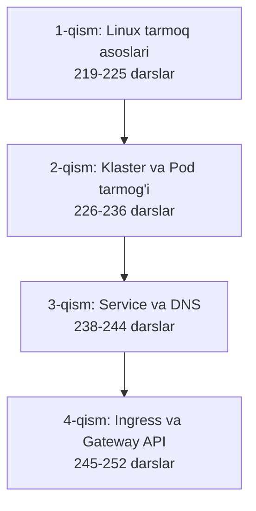

# 🌐 9-bo'lim — Kubernetes Networking (Tarmoq)

CKA kursining "9 - Networking" bo'limi asosida tayyorlangan o'zbekcha darsliklar. Darslar ketma-ket o'qish uchun mo'ljallangan: avval Linux tarmoq asoslari (prerequisite), keyin Kubernetes tarmog'i, oxirida Ingress va Gateway API.

## 📚 Darslar tartibi

### 1-qism — Tayyorgarlik: Linux tarmoq asoslari

| # | Fayl | Mavzu |
|---|---|---|
| 217 | [217_Tarmoq_bolimiga_kirish.md](217_Tarmoq_bolimiga_kirish.md) | Bo'limga kirish va yo'l xaritasi |
| 219 | [219_Switching_Routing_Gateway.md](219_Switching_Routing_Gateway.md) | Switching, Routing, Default Gateway |
| 220 | [220_DNS_asoslari.md](220_DNS_asoslari.md) | DNS asoslari: /etc/hosts, resolv.conf, record turlari |
| 221 | [221_CoreDNS_asoslari.md](221_CoreDNS_asoslari.md) | CoreDNS bilan tanishuv, Corefile |
| 222 | [222_Network_Namespace.md](222_Network_Namespace.md) | Network Namespace, veth, Linux bridge |
| 224 | [224_Docker_tarmogi.md](224_Docker_tarmogi.md) | Docker tarmoqlari: none, host, bridge |
| 225 | [225_CNI_asoslari.md](225_CNI_asoslari.md) | CNI — Container Network Interface standarti |

### 2-qism — Klaster va Pod tarmog'i

| # | Fayl | Mavzu |
|---|---|---|
| 226 | [226_Klaster_tarmogi.md](226_Klaster_tarmogi.md) | Klaster tarmog'i: node portlari (6443, 10250, ...) |
| 229 | [Lab_229_Muhitni_organish.md](Lab_229_Muhitni_organish.md) | 🧪 Lab: muhitni o'rganish |
| 230 | [230_Pod_tarmogi.md](230_Pod_tarmogi.md) | Pod tarmog'i: K8s tarmoq modeli |
| 231 | [231_Kubernetesda_CNI.md](231_Kubernetesda_CNI.md) | Kubernetesda CNI qanday chaqiriladi |
| 233 | [233_CNI_Weave.md](233_CNI_Weave.md) | Weave CNI: overlay tarmoq |
| 235 | [Lab_235_CNI_organish.md](Lab_235_CNI_organish.md) | 🧪 Lab: CNI ni o'rganish |
| 236 | [236_IPAM_Weave.md](236_IPAM_Weave.md) | IPAM — IP manzillarni boshqarish |

### 3-qism — Service tarmog'i va DNS

| # | Fayl | Mavzu |
|---|---|---|
| 238 | [238_Service_tarmogi.md](238_Service_tarmogi.md) | Service tarmog'i: kube-proxy, iptables |
| 240 | [Lab_240_Service_tarmogi.md](Lab_240_Service_tarmogi.md) | 🧪 Lab: Service networking |
| 241 | [241_Kubernetesda_DNS.md](241_Kubernetesda_DNS.md) | Kubernetesda DNS nomlari |
| 242 | [242_Kubernetesda_CoreDNS.md](242_Kubernetesda_CoreDNS.md) | Kubernetesda CoreDNS |
| 244 | [Lab_244_DNS_organish.md](Lab_244_DNS_organish.md) | 🧪 Lab: DNS ni o'rganish |

### 4-qism — Ingress va Gateway API

| # | Fayl | Mavzu |
|---|---|---|
| 245 | [245_Ingress.md](245_Ingress.md) | Ingress: Controller, Resource, annotations, rewrite-target |
| 249 | [Lab_249_Ingress_1.md](Lab_249_Ingress_1.md) | 🧪 Lab: Ingress 1 |
| 251 | [Lab_251_Ingress_2.md](Lab_251_Ingress_2.md) | 🧪 Lab: Ingress 2 — controllerni noldan o'rnatish |
| 252 | [252_Gateway_API.md](252_Gateway_API.md) | Gateway API (2025): GatewayClass, Gateway, HTTPRoute |

## 💡 Qanday o'qish kerak

1. Har darsni tartib bilan o'qing — keyingi dars oldingisiga tayanadi.
2. Buyruqlarni o'z klasteringizda (minikube yoki VPS) qaytarib ko'ring — o'qish emas, qilish esda qoldiradi.
3. Har dars oxiridagi ❓ Savol-Javob va 📌 CKA maslahatlarini takrorlang.
4. Mermaid diagrammalar GitHub va VS Code'da (Markdown Preview Mermaid Support kengaytmasi bilan) avtomatik chiziladi.

## 🔗 Umumiy manbalar

- [Kubernetes rasmiy hujjatlari — Cluster Networking](https://kubernetes.io/docs/concepts/cluster-administration/networking/)
- [Services, Load Balancing, and Networking](https://kubernetes.io/docs/concepts/services-networking/)
- [Ingress](https://kubernetes.io/docs/concepts/services-networking/ingress/)
- [Gateway API](https://gateway-api.sigs.k8s.io/)
- [CNI spetsifikatsiyasi](https://github.com/containernetworking/cni)

---
*Bu bo'lim KodeKloud CKA kursining 9-Networking bo'limi asosida o'zbek tilida tayyorlandi.*
