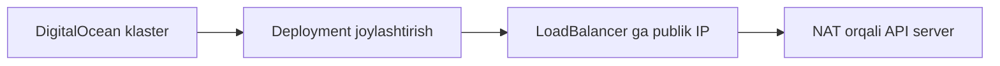

# ☁️ Bulutda klaster yaratish

minikube — o'rganish uchun. Haqiqiy ish uchun bulut kerak. DigitalOcean'da klaster, LoadBalancer'ga publik IP va NAT orqasidagi API server'ga ulanish.

## 📚 Darslar tartibi

| # | Fayl | Mavzu |
|---|---|---|
| 1 | [lesson1.md](lesson1.md) | DigitalOcean'da Kubernetes klaster yaratish |
| 2 | [lesson2.md](lesson2.md) | Klasterda deployment yaratish va boshqarish |
| 3 | [lesson3.md](lesson3.md) | LoadBalancer servisiga publik IP tayinlash |
| 4 | [k8s-public-ip-qollanma.md](k8s-public-ip-qollanma.md) | API Server'ga public IP (NAT) orqali ulanish — to'liq qo'llanma |

## 💡 Qanday o'qish kerak

1. Darslarni jadvaldagi tartibda o'qing — har biri oldingisiga tayanadi.
2. Buyruqlarni o'z klasteringizda qaytaring. O'qish emas, qilish esda qoladi.
3. `amaliyot/` papkasidagi tayyor fayllardan foydalaning — qo'lda ko'chirish shart emas.
4. Har dars oxiridagi `🧪 Mustaqil topshiriqlar` ni yechimni ochishdan oldin bajaring.

## 🔗 Manbalar

- [Kubernetes rasmiy hujjatlari](https://kubernetes.io/docs/home/)
- [kubectl Cheat Sheet](https://kubernetes.io/docs/reference/kubectl/quick-reference/)

➡️ **Keyingi bo'lim:** [10_Klaster_dizayni](../10_Klaster_dizayni/) — endi CKA dasturi bo'yicha chuqur qismga o'tamiz.

---
⬅️ [Kurs bosh sahifasi](../README.md) · 📖 [Uslub qo'llanmasi](../USLUB.md)
