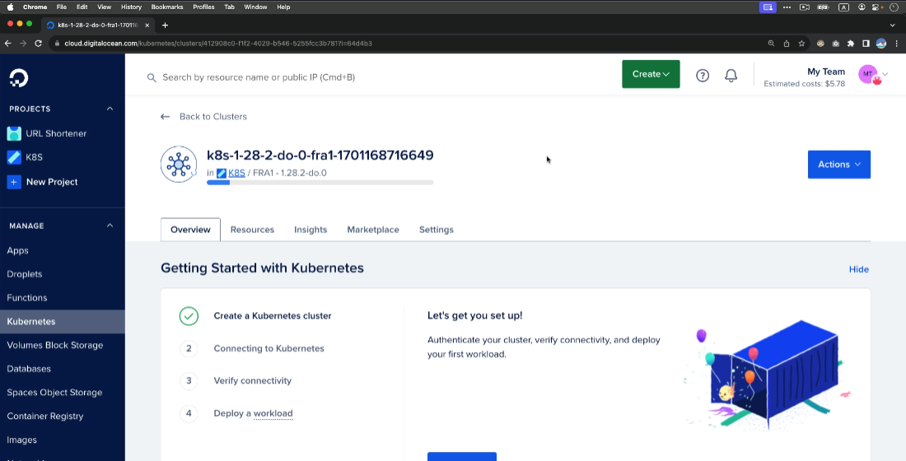

## DigitalOcean'da Kubernetes Klaster Yaratish
### 1. DigitalOcean'da hisob yaratish
Agar sizda DigitalOcean hisobingiz bo'lmasa, [DigitalOcean](https://www.digitalocean.com/) saytiga o'ting va ro'yxatdan o'ting. Hisob yaratish uchun elektron pochta manzilingiz va parol kerak bo'ladi.


Birinchi bo'lib, biz o'zimizning kompyuterimizda kubectl o'rnatishimiz kerak. Kubectl - bu Kubernetes klasterlarini boshqarish uchun ishlatiladigan komanda qatori vositasi. Kubectl'ni o'rnatish uchun quyidagi buyruqni terminalga kiriting:

```bash
curl -LO "https://dl.k8s.io/release/$(curl -L -s https://dl.k8s.io/release/stable.txt)/bin/linux/amd64/kubectl"
chmod +x kubectl
sudo mv kubectl /usr/local/bin/
```
Endi bo'lsa kibectl'ni tekshirish uchun quyidagi buyruqni kiriting:

```bash
kubectl version 
yoki 
kubectl version --client
``` 
Agar siz kubectl versiyasini ko'rsangiz, demak kubectl muvaffaqiyatli o'rnatilgan.

## biz DigitalOceandagi kubernetes klasteriga ulanishimiz uchun quyidagilarni bajarishimiz kerak:
1. DigitalOcean hisobingizga kiring.
2. "Kubernetes" bo'limiga o'ting.   
3. "Create Kubernetes Cluster" tugmasini bosing.
4. Klaster sozlamalarini tanlang
5. Klaster nomini kiriting va kerakli konfiguratsiyani tanlang (masalan, klaster o'lchami, mintaqa, va boshqalar).
6. "Create Cluster" tugmasini bosing va klaster yaratilishini kuting. Bu bir necha daqiqa davom etishi mumkin.
7. Klaster yaratilgandan so'ng, "Kubeconfig" faylini yuklab oling. Bu fayl sizning klasterga ulanish uchun kerak bo'ladi.
8. Terminalda quyidagi buyruqni kiriting va yuklab olingan kubeconfig faylini ko'rsating:

```bash
export KUBECONFIG=~/.kube/config
```
9. Endi siz kubectl yordamida klasterga ulanish va boshqarish imkoniyatiga egasiz. Masalan, klasterdagi tugunlarni ko'rish uchun quyidagi buyruqni kiriting:

```bash
kubectl get nodes
```
Tekshirish uchun:
```bash
C:\Users\admin>kubectl get nodes
NAME                STATUS   ROLES           AGE   VERSION
test-server-k8s-1   Ready    control-plane   25d   v1.35.4
test-server-k8s-2   Ready    control-plane   25d   v1.35.4
test-server-k8s-3   Ready    control-plane   25d   v1.35.4

C:\Users\admin>kubectl cluster-info
Kubernetes control plane is running at https://194.107.115.75:6443
CoreDNS is running at https://194.107.115.75:6443/api/v1/namespaces/kube-system/services/kube-dns:dns/proxy

To further debug and diagnose cluster problems, use 'kubectl cluster-info dump'.

C:\Users\admin>kubectl get deployment
NAME               READY   UP-TO-DATE   AVAILABLE   AGE
k8s-web-to-nginx   10/10   10           10          19h
nginx              5/5     5            5           19h

C:\Users\admin>kubectl get services
NAME               TYPE           CLUSTER-IP      EXTERNAL-IP   PORT(S)          AGE
k8s-web-to-nginx   LoadBalancer   10.96.157.129   <pending>     3333:30807/TCP   19h
kubernetes         ClusterIP      10.96.0.1       <none>        443/TCP          8d
nginx              ClusterIP      10.109.39.5     <none>        80/TCP           19h
```
Shunday qilibz biz o'zimiznug windows terminalimizda kubectl yordamida klasterimizga ulanish va boshqarish imkoniyatiga egamiz. Endi siz klasteringizda podlarni yaratish, xizmatlarni boshqarish va boshqa Kubernetes resurslarini boshqarish uchun kubectl'ni ishlatishingiz mumkin.
## DigitalOcean'da Kubernetes Klaster Yaratish va Public IP Qo'shish
### 1-bosqich: Klaster yaratish
DigitalOcean'da Kubernetes klaster yaratish uchun quyidagi amallarni bajaring:
1. DigitalOcean hisobingizga kiring.
2. "Kubernetes" bo'limiga o'ting.
3. "Create Kubernetes Cluster" tugmasini bosing.
4. Klaster sozlamalarini tanlang (masalan, klaster o'lchami, mintaqa, va boshqalar).
5. Klaster nomini kiriting.
6. "Create Cluster" tugmasini bosing va klaster yaratilishini kuting (bu bir necha daqiqa davom etishi mumkin).
### 2-bosqich: Kubeconfig faylini yuklab olish
Klaster yaratilgandan so'ng, "Kubeconfig" faylini yuklab oling. Bu fayl sizning klasterga ulanish uchun kerak bo'ladi.
### 3-bosqich: Klaster holatini tekshirish
Terminalda quyidagi buyruqni kiriting va yuklab olingan kubeconfig faylini ko'rsating:
```bash
export KUBECONFIG=~/.kube/config
```
Endi siz kubectl yordamida klasterga ulanish va boshqarish imkoniyatiga egasiz. Klaster holatini tekshirish uchun quyidagi buyruqni kiriting:
```bash
kubectl get nodes
kubectl get pods -A
``` 

Tekshirish uchun:
```bash
C:\Users\admin>kubectl get nodes
NAME                STATUS   ROLES           AGE   VERSION
test-server-k8s-1   Ready    control-plane   25d   v1.35.4
test-server-k8s-2   Ready    control-plane   25d   v1.35.4
test-server-k8s-3   Ready    control-plane   25d   v1.35.4

C:\Users\admin>kubectl get pods -A  
NAMESPACE     NAME                                      READY   STATUS    RESTARTS   AGE
kube-system   coredns-66bff467f8-5j6z                 1/1     Running   0          8d
kube-system   coredns-66bff467f8-6j5s                 1/1     Running   0          8d
kube-system   coredns-66bff467f8-7j5s              1/1     Running   0          8d  
kube-system   etcd-test-server-k8s-1                   1/1     Running   0          8d
kube-system   etcd-test-server-k8s-2                   1/1     Running   0          8d
kube-system   etcd-test-server-k8s-3                   1/1     Running   0          8d
kube-system   kube-apiserver-test-server-k8s-1         1/1     Running   0          8d
kube-system   kube-apiserver-test-server-k8s-2         1/1     Running   0          8d
kube-system   kube-apiserver-test-server-k8s-3         1/1     Running   0          8d  
kube-system   kube-controller-manager-test-server-k8s-1   1/1     Running   0          8d
kube-system   kube-controller-manager-test-server-k8s-2   1/1     Running   0          8d
kube-system   kube-controller-manager-test-server-k8s-3   1/1     Running   0          8d
kube-system   kube-proxy-test-server-k8s-1             1/1     Running   0          8d  
kube-system   kube-proxy-test-server-k8s-2             1/1     Running   0          8d
kube-system   kube-proxy-test-server-k8s-3             1/1     Running   0          8d  
kube-system   kube-scheduler-test-server-k8s-1         1/1     Running   0          8d
kube-system   kube-scheduler-test-server-k8s-2         1/1     Running   0          8d  
kube-system   kube-scheduler-test-server-k8s-3         1/1     Running   0          8d
``` 
### 3-bosqich: Public IP qo'shish
Agar siz klasteringizga Public IP qo'shmoqchi bo'lsangiz, quyidagi amallarni bajaring:
1. DigitalOcean'da klasteringizni tanlang.
2. "Network" bo'limiga o'ting.  
3. "Public IP" bo'limida "Add Public IP" tugmasini bosing.
4. Public IP manzilini tanlang va "Add" tugmasini bosing.
5. "Apply" tugmasini bosing.    
### 4-bosqich: API Server manzilini tekshirish
API Server manzilini tekshirish uchun quyidagi buyruqni terminalga kiriting:
```bash 
kubectl cluster-info
```
Yoki kubeadm konfiguratsiyasida API Server manzilini tekshirish uchun quyidagi buyruqni kiriting:
```bash
sudo cat /etc/kubernetes/manifests/kube-apiserver.yaml
```
Yoki kubeadm konfiguratsiyasida API Server manzilini tekshirish uchun quyidagi buyruqni kiriting:
```bash
sudo cat /etc/kubernetes/manifests/kube-apiserver.yaml | grep -A 10 "command:"
```
Yoki kubeadm konfiguratsiyasida API Server manzilini tekshirish uchun quyidagi buyruqni kiriting:
```bash
sudo kubectl --kubeconfig=/etc/kubernetes/admin.conf -n kube-system get cm kubeadm-config -o yaml | grep -A 10 apiServer
```
Yuqoridagi buyruqlardan birini bajarish orqali API Server manzilining Public IP bo'lishini tekshirishingiz mumkin. Agar manzil Public IP bo'lsa, demak siz muvaffaqiyatli klasteringizga Public IP qo'shganingizni anglatadi.

