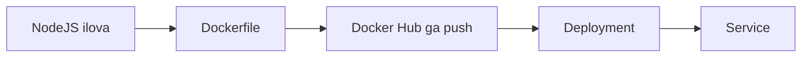

# 🐳 O'z image'ingizni yaratish

Endi tayyor `nginx` emas, o'z ilovangizni klasterga chiqaramiz: NodeJS ilovasi, uning Dockerfile'i, Docker Hub'ga yuklash va Deployment bilan ishga tushirish.

## 📚 Darslar tartibi

| # | Fayl | Mavzu |
|---|---|---|
| 1 | [lesson1_2.md](lesson1_2.md) | Web ilova yaratish: Express va `index.mjs` |
| 2 | [lesson3.md](lesson3.md) | NodeJS ilovasi uchun Dockerfile yozish |
| 3 | [lesson4.md](lesson4.md) | Image'ni Docker Hub'ga yuklash va Deployment yaratish |
| 4 | [lesson5.md](lesson5.md) | Deployment uchun Service yaratish va masshtablash |

## 💡 Qanday o'qish kerak

1. Darslarni jadvaldagi tartibda o'qing — har biri oldingisiga tayanadi.
2. Buyruqlarni o'z klasteringizda qaytaring. O'qish emas, qilish esda qoladi.
3. `amaliyot/` papkasidagi tayyor fayllardan foydalaning — qo'lda ko'chirish shart emas.
4. Har dars oxiridagi `🧪 Mustaqil topshiriqlar` ni yechimni ochishdan oldin bajaring.

## 🔗 Manbalar

- [Kubernetes rasmiy hujjatlari](https://kubernetes.io/docs/home/)
- [kubectl Cheat Sheet](https://kubernetes.io/docs/reference/kubectl/quick-reference/)

➡️ **Keyingi bo'lim:** [Dasturni_yangilash](../Dasturni_yangilash/)

---
⬅️ [Kurs bosh sahifasi](../README.md) · 📖 [Uslub qo'llanmasi](../USLUB.md)
