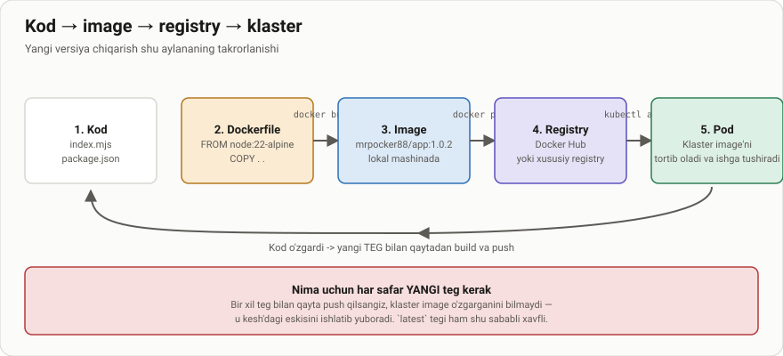

# Web dasturlar yaratish

> 🎯 **Bu darsda nimani o'rganamiz:**
> - Klasterga chiqariladigan eng oddiy NodeJS ilovasini yozish
> - Nima uchun ilova o'z Pod nomini javobga qo'shadi
> - `package.json` va `npm start` nima qiladi


## Kerakli bo'lgan dasturlarni o'rnatish
Hozir biz NodeJS dasturini o'rnatamiz. NodeJS bu JavaScript dasturlash tilida yozilgan server tomon dasturlarni yaratish uchun ishlatiladigan platformadir. 

### NodeJS dastur yordamida Web server yaratish va ishga tushurish

Serverimizda nodejs dasturini o'rnatib olamiz. Buning uchun terminalda quyidagi buyruqni bajarishimiz kerak:
```bash
sudo apt update
sudo apt install nodejs npm -y
```
Shu bilan birgalikda nodejs va npm larni versiyasini tekshirib ko'rishimiz mumkin:
```bash
root@test-server-k8s-1:~# node --version
v18.19.1
root@test-server-k8s-1:~# npm --version
9.2.0
```
Endi k8s-web-hello nomli papka yaratib olamiz. 
va cli da quyidagi komandani bajaramiz:
```bash
mkdir k8s-web-hello
cd k8s-web-hello
#va ushbu komandani bajarib, package.json faylini yaratamiz
npm init -y
```
Ushbu bajarganimizda bizning papkamizda package.json fayli yaratiladi. Endi biz server.js nomli fayl yaratamiz va unga quyidagi kodni yozamiz:
```javascript
{
  "name": "k8s-web-hello",
  "version": "1.0.1",
  "description": "",
  "main": "index.js",
  "scripts": {
    "start": "node index.mjs"
  },
  "keywords": [],
  "author": "",
  "license": "ISC",
  "dependencies": {
    "express": "^4.17.2"
  }
}
```
Bu kodda biz express kutubxonasini o'rnatamiz. Express bu NodeJS uchun eng mashhur web frameworklardan biridir. Endi biz express kutubxonasini o'rnatamiz:
```bash
npm install express
```
Shu bilan birgalikda biz joylahgan <k8s-web-hello> papkasida index.mjs nomli fayl yaratamiz va unga quyidagi kodni yozamiz:
```javascript
import express from 'express'
import os from 'os'

const app = express()
const PORT = 3000

app.get("/", (req, res) => {
  const helloMessage = `<h1>VERSION 2: Hello from the ${os.hostname()}</h1>`
  console.log(helloMessage)
  res.send(helloMessage)
})

app.listen(PORT, () => {
  console.log(`Web server is listening at port ${PORT}`)
})
```
Ushbu index.mjs faylida biz express kutubxonasini import qilamiz va web server yaratamiz. Bizning web serverimiz 3000 portda ishlaydi va serverga ulanngan xar bir foydalanuvchiga "Hello from the [hostname]"  haqida xabar yuboradi.

Endi biz serverni ishga tushiramiz:
```bash
root@test-server-k8s-1:~/k8s/k8s-web-hello# node index.mjs
Web server is listening at port 3000
## har bir serverga ulangan foydalanuvchi va serverning ekranida quyidagi xabar paydo bo'ladi:
VERSION 2: Hello from the test-server-k8s-1
VERSION 2: Hello from the test-server-k8s-1
```
Tekshirish uchun brauzerda http://localhost:3000 manziliga o'tamiz va quyidagi xabarni ko'ramiz:
VERSION 2: Hello from the test-server-k8s-1

agarda Windows operatsion tizimida ishlayotgan bo'lsangiz, curl orqali tekshirasiz:
```
C:\Users\admin>curl http://194.107.115.75:3000/
<h1>VERSION 2: Hello from the test-server-k8s-1</h1>
```

## 📁 Tayyor loyiha

Butun ilova `amaliyot/` papkasida turibdi — qo'lda yozish shart emas:

📂 [`amaliyot/k8s-web-hello/`](amaliyot/k8s-web-hello/)

```bash
cd Custom_obrazlar_yaratish/amaliyot/k8s-web-hello
npm ci
npm start                      # http://localhost:3000
```

## 🧪 Mustaqil topshiriqlar

> Taxminiy vaqt: 15 daqiqa.

**1-topshiriq · oson.** Ilovani lokal ishga tushiring va brauzerda oching.
Javobda qaysi nom ko'rinadi?

<details><summary>O'zingizni tekshiring</summary>

```bash
curl -s http://localhost:3000
# <h1>VERSION 3: Hello from the <sizning-kompyuteringiz-nomi></h1>
```
Klasterda esa bu nom Pod nomi bo'ladi.
</details>

**2-topshiriq · o'rta.** `APP_VERSION` muhit o'zgaruvchisini `4` qilib
ishga tushiring.

<details><summary>O'zingizni tekshiring</summary>

```bash
APP_VERSION=4 npm start
curl -s http://localhost:3000 | grep -o 'VERSION 4'
```
</details>

**3-topshiriq · qiyin.** `/healthz` yo'liga so'rov yuboring. **Avval
ayting:** u nima uchun kerak va oddiy `/` dan farqi nimada?

<details><summary>O'zingizni tekshiring</summary>

```bash
curl -s -o /dev/null -w '%{http_code}\n' http://localhost:3000/healthz
# 200. Bu yengil endpoint — livenessProbe uni har necha soniyada chaqiradi,
# shuning uchun u og'ir ish qilmasligi kerak.
```
</details>

## ❓ Savol-Javob

**Savol:** Nima uchun ilova `os.hostname()` ni javobga qo'shadi?
**Javob:** Klasterda konteynerning hostname'i — Pod nomi. Shuning uchun
sahifani bir necha marta yangilaganingizda javob har xil Pod'dan kelayotganini
ko'rasiz. Bu Service yukni taqsimlayotganini isbotlaydi.

**Savol:** `.mjs` kengaytmasi nima uchun?
**Javob:** U Node'ga faylni ES-modul (import/export) sifatida o'qishni
aytadi. `package.json` da `"type": "module"` yozilsa, oddiy `.js` ham
shunday o'qiladi.

## 📖 Asosiy atamalar

| Atama | Ma'nosi |
|---|---|
| **Image** | Ilova va uning muhitidan iborat o'zgarmas qolip |
| **Konteyner** | Ishga tushirilgan image nusxasi |
| **Dockerfile** | Image qanday qurilishini tasvirlovchi fayl |
| **Registry** | Image'lar saqlanadigan omborxona (Docker Hub, GHCR, ECR) |
| **Teg (tag)** | Image versiyasini bildiruvchi belgi: `:1.0.3` |
| **Qatlam (layer)** | Dockerfile'ning har bir buyrug'i hosil qiladigan bo'lak |

## 🔗 Manbalar

- [Dockerfile reference](https://docs.docker.com/reference/dockerfile/)
- [Images — kubernetes.io](https://kubernetes.io/docs/concepts/containers/images/)
- [Node.js Docker best practices](https://github.com/nodejs/docker-node/blob/main/docs/BestPractices.md)

---
⬅️ [Bo'lim indeksi](README.md) · ➡️ [lesson3.md](lesson3.md)
