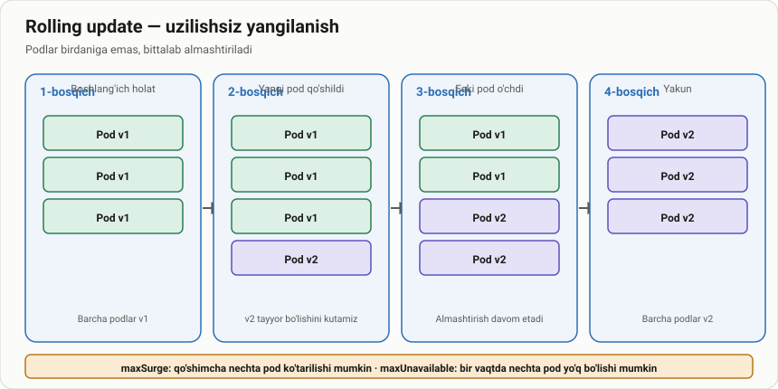

# NodeJS dasturini docker imigini yaratish va uni yangilash

> 🎯 **Bu darsda nimani o'rganamiz:**
> - Ilovaning yangi versiyasini qurish va teglash
> - Nima uchun har yangilanishda YANGI teg kerak


endi bo'lsa biz NodeJS dasturini index.jms fayliga o'zgartirish kiritamiz va uni yangilaymiz. index.js faylini ochamiz va uni ichidagi VERSION 1: matinini VERSION 2: ga o'zgartiramiz va saqlaymiz. 
```bash
docker tag k8s-web-hello:1.0.2 <dockerhub_username>/k8s-web-hello:1.0.2 # imige yaratish uchun
manda dokcer desktop bo'lgani uchun komandasidan foydalandim
docker buildx build --platform linux/amd64,linux/arm64 -t <dockerhub_username>/k8s-web-hello:1.0.2 .
va 
docker push <dockerhub_username>/k8s-web-hello:1.0.0 # DockerHub ga yuklash uchun
yoki 
docker push <dockerhub_username>/k8s-web-hello --all-tags  
```

ketma ketlikda o'zimni proyektimda:
```bash
docker build -t k8s-web-hello:1.0.2 .
docker tag k8s-web-hello:1.0.2 mrpocker88/k8s-web-hello:1.0.2
docker push mrpocker88/k8s-web-hello:1.0.2 
```

## ⚠️ Har yangilanishda yangi teg

Bir xil teg bilan qayta `docker push` qilsangiz, Kubernetes image
o'zgarganini **bilmaydi** — u node'dagi kesh'dagi eskisini ishlatib
yuboradi. `latest` tegi ham shu sababli xavfli.

```bash
docker build -t <user>/k8s-web-hello:1.0.3 .    # ✅ yangi teg
docker push <user>/k8s-web-hello:1.0.3
```

## 🧪 Mustaqil topshiriqlar

> Taxminiy vaqt: 15 daqiqa.

**1-topshiriq · oson.** Ilovadagi matnni o'zgartiring va yangi teg bilan
image quring.

<details><summary>O'zingizni tekshiring</summary>

```bash
docker images | grep k8s-web-hello
# Ikki xil teg ko'rinishi kerak
```
</details>

**2-topshiriq · o'rta.** Ikkala image'ni lokal ishga tushirib, javob
farq qilishini tekshiring.

<details><summary>O'zingizni tekshiring</summary>

```bash
docker run --rm -d -p 3001:3000 <user>/k8s-web-hello:1.0.2
docker run --rm -d -p 3002:3000 <user>/k8s-web-hello:1.0.3
curl -s localhost:3001; curl -s localhost:3002
```
</details>

**3-topshiriq · qiyin.** Bir xil teg bilan ikki marta push qiling.
**Avval ayting:** klaster yangi kodni oladimi?

<details><summary>O'zingizni tekshiring</summary>

`imagePullPolicy: IfNotPresent` (standart) bo'lsa — **olmaydi**.
Node'da o'sha tegdagi image bor, shuning uchun u qayta tortilmaydi.
</details>

## ❓ Savol-Javob

**Savol:** Semantik versiyalash nima?
**Javob:** `MAJOR.MINOR.PATCH` — masalan `2.1.4`. PATCH xato tuzatish,
MINOR yangi imkoniyat, MAJOR esa mos kelmaydigan o'zgarish.

**Savol:** Teg o'rniga digest ishlatsam bo'ladimi?
**Javob:** Ha va bu eng ishonchli usul:
`image: nginx@sha256:abc123...`. Digest hech qachon boshqa image'ga
ishora qilmaydi.

## 📖 Asosiy atamalar

| Atama | Ma'nosi |
|---|---|
| **Rolling update** | Pod'larni bittalab almashtirib, uzilishsiz yangilash |
| **`kubectl set image`** | Deployment'dagi image'ni almashtiruvchi buyruq |
| **`kubectl rollout status`** | Yangilanish tugadimi yoki qotib qoldimi |
| **`kubectl rollout undo`** | Oldingi revizyaga qaytish |
| **Revision** | Deployment shablonining versiya raqami |
| **`maxSurge` / `maxUnavailable`** | Yangilanish paytidagi qo'shimcha va yo'q Pod'lar chegarasi |

## 🔗 Manbalar

- [Updating a Deployment](https://kubernetes.io/docs/concepts/workloads/controllers/deployment/#updating-a-deployment)
- [kubectl rollout](https://kubernetes.io/docs/reference/generated/kubectl/kubectl-commands#rollout)
- [Rolling Back a Deployment](https://kubernetes.io/docs/concepts/workloads/controllers/deployment/#rolling-back-a-deployment)

---
⬅️ [Bo'lim indeksi](README.md) · ➡️ [lesson2.md](lesson2.md)
