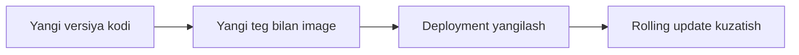

# ♻️ Ilovani yangilash

Ilovaning yangi versiyasini chiqarish. Image'ning yangi tegi, rolling update va yangilanishni kuzatish.

## 📚 Darslar tartibi

| # | Fayl | Mavzu |
|---|---|---|
| 1 | [Lesson1.md](Lesson1.md) | NodeJS ilovasining Docker image'ini yaratish |
| 2 | [lesson2.md](lesson2.md) | Yangi versiyani chiqarish va deployment'ni yangilash |
| 3 | [lesson3.md](lesson3.md) | Yangilangan deployment'ni tahlil qilish |
| 4 | [lesson4.md](lesson4.md) | Servis va Deployment'larni o'chirish |

## 💡 Qanday o'qish kerak

1. Darslarni jadvaldagi tartibda o'qing — har biri oldingisiga tayanadi.
2. Buyruqlarni o'z klasteringizda qaytaring. O'qish emas, qilish esda qoladi.
3. `amaliyot/` papkasidagi tayyor fayllardan foydalaning — qo'lda ko'chirish shart emas.
4. Har dars oxiridagi `🧪 Mustaqil topshiriqlar` ni yechimni ochishdan oldin bajaring.

## 🔗 Manbalar

- [Kubernetes rasmiy hujjatlari](https://kubernetes.io/docs/home/)
- [kubectl Cheat Sheet](https://kubernetes.io/docs/reference/kubectl/quick-reference/)

➡️ **Keyingi bo'lim:** [Ikkita_deployment_YAML](../Ikkita_deployment_YAML/)

---
⬅️ [Kurs bosh sahifasi](../README.md) · 📖 [Uslub qo'llanmasi](../USLUB.md)
