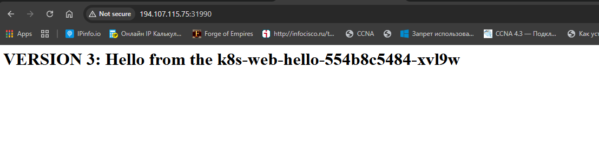
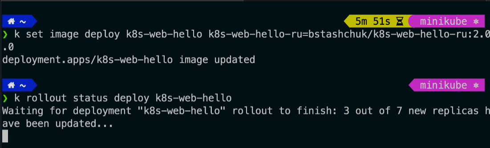
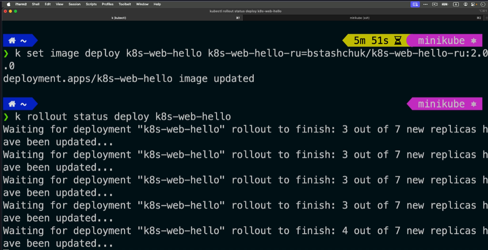
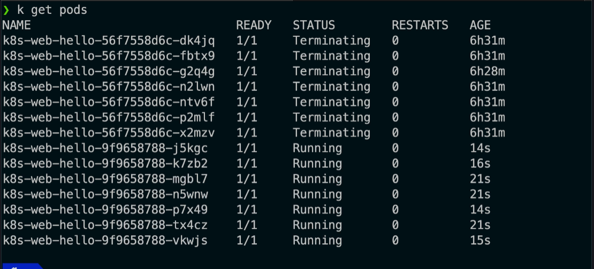

# NodeJS dasturini yangilaymiz
NodeJS dasturini obnavleniya qilishdan oldin yangilanish protsesini ko'rib tursih uchun quyidagi komandalarni kiritib olamiz:
```bash
kubectl rollout status deployment/k8s-web-hello
```
NodeJS dasturini yangilash uchun quyidagi komandani kirgizamiz:
```bash
kubectl set image deployment k8s-web-hello k8s=mrpocker88/k8s:ver2
misol uchun
kubectl set image deployment k8s-web-hello k8s=mrpocker88/k8s-web-hello:1.0.2
```
shundan keyin Web_brauzerga kirib tekshirildi:


```
C:\Users\admin>curl http://194.107.115.75:31990/
<h1>VERSION 3: Hello from the k8s-web-hello-554b8c5484-fnz8n</h1>
```
Agar biz quyidagi komandani ishga tushirilsa bizning repligalarimiz yangisiga o'zgarishini ko'rishimiz mumkin:
```
kubectl rollout status deployment/k8s-web-hello
```



Quida bizning podlarimiz yangi NodeJS dasturida ishlayotganini ko'rishimiz mumkin.


