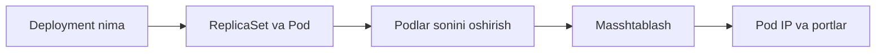

# 🚀 Deploymentlar

Pod'ni to'g'ridan-to'g'ri yaratish amaliyotda ishlatilmaydi. Deployment — Pod'larni yaratadigan, sanog'ini saqlaydigan va yangilaydigan asosiy obyekt.

## 📚 Darslar tartibi

| # | Fayl | Mavzu |
|---|---|---|
| 1 | [create_deployment.md](create_deployment.md) | Deployment nima, qanday yaratiladi va nimadan iborat |
| 2 | [podlarni_sonini_oshirish.md](podlarni_sonini_oshirish.md) | `kubectl scale` bilan Pod sonini o'zgartirish |
| 3 | [depl_mashtablash.md](depl_mashtablash.md) | Masshtablash bo'yicha yakuniy qo'llanma |
| 4 | [deploymant3.md](deploymant3.md) | Pod'larning IP manzillari va portlarini ko'rish |

## 💡 Qanday o'qish kerak

1. Darslarni jadvaldagi tartibda o'qing — har biri oldingisiga tayanadi.
2. Buyruqlarni o'z klasteringizda qaytaring. O'qish emas, qilish esda qoladi.
3. `amaliyot/` papkasidagi tayyor fayllardan foydalaning — qo'lda ko'chirish shart emas.
4. Har dars oxiridagi `🧪 Mustaqil topshiriqlar` ni yechimni ochishdan oldin bajaring.

## 🔗 Manbalar

- [Kubernetes rasmiy hujjatlari](https://kubernetes.io/docs/home/)
- [kubectl Cheat Sheet](https://kubernetes.io/docs/reference/kubectl/quick-reference/)

➡️ **Keyingi bo'lim:** [Servislar](../Servislar/)

---
⬅️ [Kurs bosh sahifasi](../README.md) · 📖 [Uslub qo'llanmasi](../USLUB.md)
