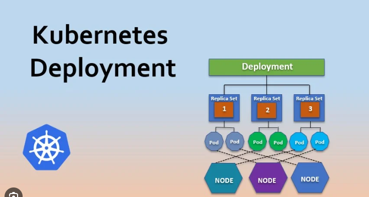
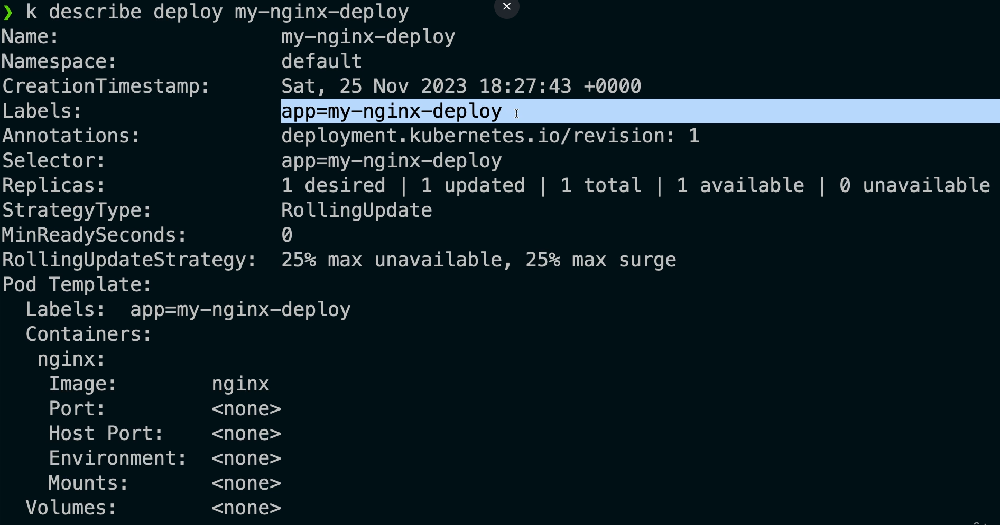
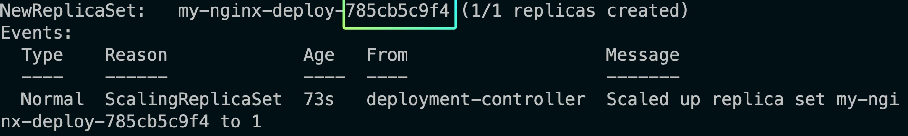
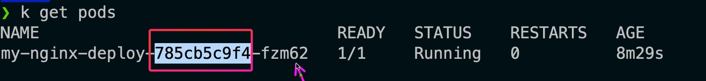

## Deploymant bu nima?
Deploymant - bu Kubernetes resursi bo'lib, u sizga ilovalarni boshqarish va ularni yangilash imkonini beradi. Deploymant yordamida siz ilovalaringizni avtomatik ravishda ko'paytirishingiz, yangilashingiz va kerak bo'lganda tiklashingiz mumkin. Deploymantlar, odatda, podlarni yaratish va boshqarish uchun ishlatiladi, shuning uchun ular ilovalarni ishga tushirish va ularni yangilash uchun qulay vositadir. 

### Deploymant yaratish uchun quyidagi buyruqni ishlatamiz:
```
kubectl apply -f <deploymant-definition.yaml>
```
yoki 
``` 
kubectl create deployment <deploymant-name> --image=<image-name> -n <namespace>
```
Bu buyruqlar yordamida siz yangi deploymantlarni yaratishingiz mumkin. Bu, masalan, yangi ilovani sinash yoki mavjud ilovaning yangi versiyasini ishga tushirish uchun foydalidir.
### Deploymantni ko'rish uchun quyidagi buyruqlarni ishlatishingiz mumkin:
```
kubectl get deployments -n <namespace>
kubectl get deployments -A
```
### deploymantni qo'lda kirish uchun quyidagi buyruqlarni ishlatishingiz mumkin:
```
server001:> kubectl create deployment nginx-deploy --image=nginx
```
Bu buyruq yordamida siz `nginx` imidjidan foydalanib, `nginx-deploy` nomli yangi deploymant yaratishingiz mumkin. Bu, masalan, nginx serverini sinash yoki o'rganish uchun foydalidir.
### yaratilgan deploymantni ko'rish uchun quyidagi buyruqlarni ishlatishingiz mumkin:
```
server001:> kubectl get deployments -o wide 
```
## deploymantni dettalarini ko'rish uchun quyidagi buyruqlarni ishlatishingiz mumkin:
``` 
server001:> kubectl describe deployment <deploymant-name> -n <namespace>
```
misol uchun:
```
server001:> kubectl describe deployment nginx-deploy -n default
```
Bu buyruq yordamida siz deploymantning detallarini ko'rishingiz mumkin. Bu, masalan, deploymantning hozirgi holatini tekshirish yoki uning konfiguratsiyasini ko'rish uchun foydalidir.

"kubectl describe deployment " komandasini quidagi ma'lumotlarni ko'rsatadi:
- Deploymantning nomi va namespace
- Deploymantning hozirgi holati (masalan, nechta podlar ishga tushgan, nechta podlar kerakli holatda)
- Deploymantning strategiyasi (masalan, RollingUpdate yoki Recreate)    
- Deploymantning imidji va uning versiyasi
- Deploymantning resurs talablari (masalan, CPU va xotira)
- Deploymantning yangilanish tarixi va uning hozirgi versiyasi  
- Deploymantning hozirgi va kerakli holati (masalan, nechta podlar ishga tushgan, nechta podlar kerakli holatda)



NewReplicaSet: nginx-deploy-5c689d4b9f bu yangi yaratilgan ReplicaSet nomi bo'lib, u deploymant tomonidan boshqariladi. Bu ReplicaSet, deploymantning hozirgi versiyasini ifodalaydi va uning ichida nechta podlar ishga tushganligini ko'rsatadi. Agar siz deploymantni yangilagan bo'lsangiz, yangi ReplicaSet yaratiladi va eski ReplicaSet arxivlanadi. Bu, masalan, deploymantning yangilanish tarixini ko'rish yoki uning hozirgi holatini tekshirish uchun foydalidir.

Agar siz kubectl get pods -n default komandasini ishlatsangiz, siz deploymant tomonidan boshqarilayotgan podlarni ko'rishingiz mumkin. Bu, masalan, deploymantning hozirgi holatini tekshirish yoki uning ichida nechta podlar ishga tushganligini ko'rish uchun foydalidir.

bu yerda:
```NAME                                READY   STATUS    RESTARTS   AGE
nginx-deploy-5c689d4b9f-5l6j8   1/1     Running   0          2m
nginx-deploy-5c689d4b9f-6h8j9   1/1     Running   0          2m
nginx-deploy-5c689d4b9f-7k9l0   1/1     Running   0          2m
```
Bu yerda `nginx-deploy-5c689d4b9f-5l6j8`, `nginx-deploy-5c689d4b9f-6h8j9` va `nginx-deploy-5c689d4b9f-7k9l0` 
nomli uchta po'dni ko'rib turibsiz, ularning 'nginx-deploy-5c689d4b9f' qismi deploymant nomidan kelib chiqqan va '-5l6j8', '-6h8j9' va '-7k9l0' qismlari esa podning noyob identifikatorlari. Har bir podning holati 'Running' bo'lib, bu ularning muvaffaqiyatli ishga tushganligini ko'rsatadi. 'READY' ustuni 1/1 bo'lib, bu har bir podda bitta konteyner borligini va u konteynerning hammasi ishga tushganligini bildiradi. 'RESTARTS' ustuni 0 bo'lib, bu podlarda hech qanday qayta ishga tushirishlar sodir bo'lmaganligini ko'rsatadi. 'AGE' ustuni 2m bo'lib, bu podlarning 2 daqiqadan beri ishga tushganligini bildiradi.

