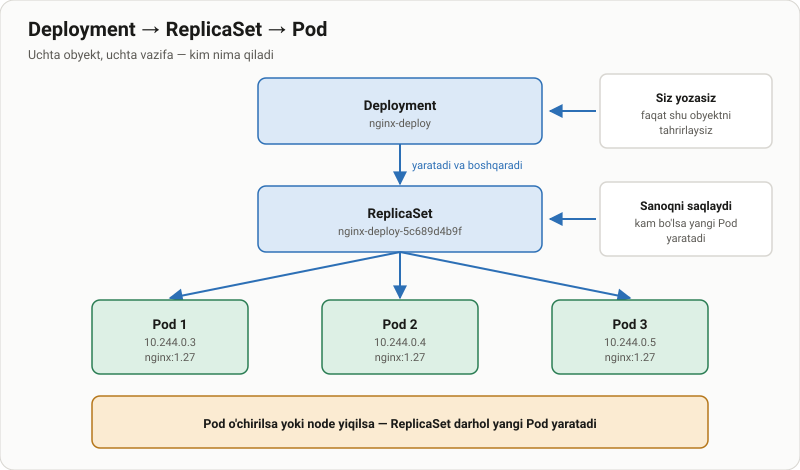
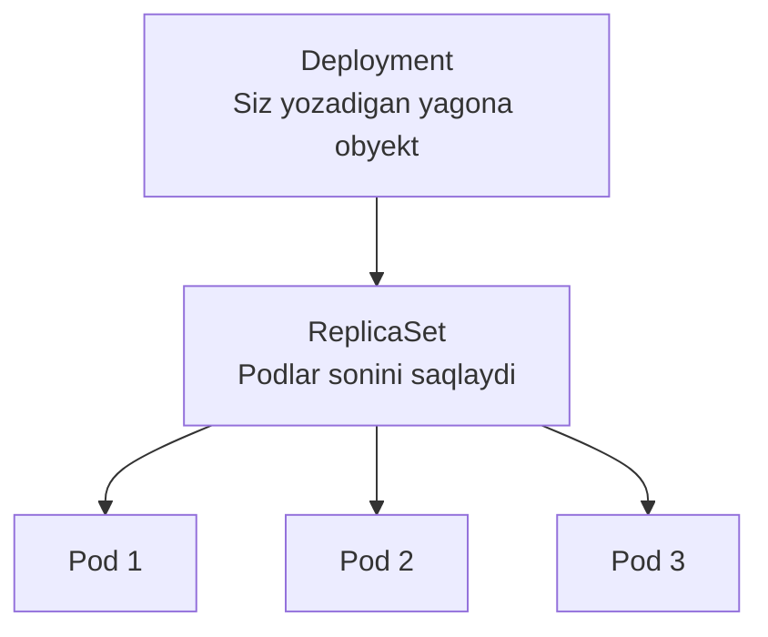

# Deployment nima va qanday yaratiladi

> 🎯 **Bu darsda nimani o'rganamiz:**
> - Deployment nima uchun kerak va Pod'dan farqi nimada
> - Deployment → ReplicaSet → Pod zanjiri qanday ishlaydi
> - Deployment yaratish: buyruq bilan va manifest bilan
> - `describe` chiqishidagi eng muhim maydonlar
> - Pod nomidagi `pod-template-hash` nimani bildiradi



## 💡 Hayotiy o'xshatish: restoran menejeri

Restoranda har smenaga **5 ta ofitsiant** kerak deylik. Siz ofitsiantlarni
o'zingiz chaqirib yurmaysiz — **menejerga** "smenada doim 5 kishi bo'lsin"
deysiz.

Kimdir kasal bo'lib qolsa, menejer o'zi zaxiradagi odamni chaqiradi.
Yangi forma kiritilsa, u hammani birdan uyiga jo'natmaydi — bittalab
almashtiradi, shunda restoran ishlab turaveradi.

Deployment — o'sha menejer. Pod — ofitsiant.

## Deployment nima uchun kerak

Pod'ni bevosita yaratganingizda u **himoyasiz** qoladi:

| Nima bo'ldi | Yolg'iz Pod | Deployment ostidagi Pod |
|---|---|---|
| Pod o'chirildi | Yo'qoladi | Yangisi darrov paydo bo'ladi |
| Node yiqildi | Yo'qoladi | Boshqa node'da qayta ko'tariladi |
| Ko'proq nusxa kerak | Qo'lda nusxalash | `kubectl scale` bitta buyruq |
| Yangi versiya | Qo'lda o'chirib qayta yaratish | Rolling update, uzilishsiz |
| Yangilanish buzildi | Qo'lda tiklash | `kubectl rollout undo` |

Shu sababli **amalda Pod hech qachon bevosita yaratilmaydi.**

## Uchta obyekt, uchta vazifa




| Obyekt | Vazifasi | Siz tegasizmi |
|---|---|---|
| **Deployment** | Versiyalarni boshqaradi, yangilanish strategiyasini biladi | ✅ Faqat shuni tahrirlaysiz |
| **ReplicaSet** | Belgilangan sondagi Pod'ni saqlaydi | ❌ Deployment o'zi yaratadi |
| **Pod** | Konteynerni ishga tushiradi | ❌ ReplicaSet o'zi yaratadi |

## Deployment yaratish

> 📁 **Tayyor fayl:** [`amaliyot/create_deployment/01-nginx-deployment.yaml`](amaliyot/create_deployment/01-nginx-deployment.yaml)

**Manifest bilan** — ishlab chiqarish uchun:

```yaml
apiVersion: apps/v1
kind: Deployment
metadata:
  name: nginx-deploy
spec:
  replicas: 3
  selector:
    matchLabels:
      app: nginx-namuna
  template:
    metadata:
      labels:
        app: nginx-namuna
    spec:
      containers:
        - name: nginx
          image: nginx:1.27-alpine
```

```bash
kubectl apply -f amaliyot/create_deployment/01-nginx-deployment.yaml
```

**Buyruq bilan** — tez sinash uchun:

```bash
kubectl create deployment nginx-deploy --image=nginx:1.27-alpine --replicas=3
```

⚠️ **`selector.matchLabels` va `template.metadata.labels` bir xil bo'lishi
shart.** Aks holda `kubectl apply` xato beradi: Deployment o'zi yaratgan
Pod'larni topa olmaydi.

## Deployment'ni ko'rish

```bash
kubectl get deployments
kubectl get deployments -A            # barcha namespace'lar
kubectl get deploy,rs,pods            # uchala qatlamni birdan
```

```text
NAME           READY   UP-TO-DATE   AVAILABLE   AGE
nginx-deploy   3/3     3            3           2m
```

| Ustun | Nimani bildiradi |
|---|---|
| **READY** | `tayyor / kerakli` Pod'lar |
| **UP-TO-DATE** | Nechtasi eng oxirgi shablonga mos |
| **AVAILABLE** | Nechtasi trafik qabul qilishga tayyor |

`READY 3/3` va `AVAILABLE 2` birga bo'lishi mumkin: uchinchi Pod ishga
tushgan, lekin `minReadySeconds` hali o'tmagan.

## `describe` — nimaga e'tibor berish kerak

```bash
kubectl describe deployment nginx-deploy
```


Chiqishdagi muhim maydonlar:

| Maydon | Nimani bildiradi |
|---|---|
| `Replicas:` | `desired / updated / total / available / unavailable` |
| `StrategyType:` | `RollingUpdate` (standart) yoki `Recreate` |
| `RollingUpdateStrategy:` | `25% max unavailable, 25% max surge` |
| `Pod Template:` → `Image:` | Hozir qaysi image ishlatilyapti |
| `NewReplicaSet:` | Joriy ReplicaSet nomi |
| `OldReplicaSets:` | Yangilanishdan qolgan eski ReplicaSet'lar |
| `Events:` | Nima bo'lganining jurnali |


Yuqoridagi skrinshotda `NewReplicaSet: my-nginx-deploy-785cb5c9f4` ko'rinadi.
`785cb5c9f4` — Pod shablonining **xesh yig'indisi**. Shablon o'zgarsa (masalan
image tegi), xesh ham o'zgaradi va Deployment **yangi** ReplicaSet yaratadi.

⚠️ Shuning uchun `OldReplicaSet` va `NewReplicaSet` da bir xil xesh turishi
**mumkin emas** — agar shunday ko'rsangiz, hech qanday yangilanish bo'lmagan.

## Pod'lar va ularning nomi

```bash
kubectl get pods -l app=nginx-namuna
```


```text
NAME                            READY   STATUS    RESTARTS   AGE
nginx-deploy-5c689d4b9f-2xk8w   1/1     Running   0          2m
nginx-deploy-5c689d4b9f-mqp4z   1/1     Running   0          2m
nginx-deploy-5c689d4b9f-vt9nc   1/1     Running   0          2m
```

Pod nomi uch qismdan tuziladi:

```
nginx-deploy  -  5c689d4b9f  -  2xk8w
     ↑              ↑              ↑
Deployment    pod-template-hash   tasodifiy qism
   nomi       (ReplicaSet ID)     (har Pod uchun)
```

## Label'lar bo'yicha filtrlash

Deployment o'z Pod'lariga ikkita label qo'yadi:

```bash
kubectl describe pod nginx-deploy-5c689d4b9f-2xk8w | head -20
```

```text
Labels:         app=nginx-namuna
                pod-template-hash=5c689d4b9f
Controlled By:  ReplicaSet/nginx-deploy-5c689d4b9f
```

- `app=nginx-namuna` — sizning label'ingiz, Service ham shu bo'yicha topadi;
- `pod-template-hash` — Kubernetes qo'shadi, qaysi ReplicaSet'ga tegishliligini
  bildiradi;
- `Controlled By` — Pod'ning "egasi". Shu sababli Pod o'chirilsa, egasi
  yangisini yaratadi.

Filtrlash:

```bash
kubectl get pods -l app=nginx-namuna
kubectl get pods -l 'app in (nginx-namuna, web)'
kubectl get pods --show-labels
```

## 🧪 Mustaqil topshiriqlar

> Taxminiy vaqt: 15 daqiqa.

**1-topshiriq · oson.** `mashq-deploy` nomli Deployment yarating:
`nginx:1.27-alpine`, 2 replika. Uning ReplicaSet'i nomini toping.

<details><summary>O'zingizni tekshiring</summary>

```bash
kubectl get rs -l app=mashq-deploy
# DESIRED 2, CURRENT 2, READY 2
```
</details>

**2-topshiriq · o'rta.** Shu Deployment'ning Pod'laridan birini o'chiring va
nima bo'lishini kuzating. Nechta Pod qoladi va nomi o'zgardimi?

<details><summary>O'zingizni tekshiring</summary>

```bash
kubectl get pods -l app=mashq-deploy
# Yana 2 ta — lekin bittasining AGE ustuni juda kichik
```
</details>

**3-topshiriq · qiyin.** Manifestda `selector.matchLabels` ni
`app: boshqa-nom` ga o'zgartiring va `kubectl apply` qiling. **Avval ayting:**
nima bo'ladi? Keyin tekshiring va xato xabarini tushuntiring.

<details><summary>O'zingizni tekshiring</summary>

```bash
# Xato: `selector` does not match template `labels`
# Mavjud Deployment uchun esa: field is immutable
```
</details>

📁 To'liq yechimlar: [`amaliyot/create_deployment/YECHIM.md`](amaliyot/create_deployment/YECHIM.md)

## ❓ Savol-Javob

**Savol:** ReplicaSet'ni bevosita yaratsam bo'ladimi?
**Javob:** Texnik jihatdan ha, lekin kerak emas. ReplicaSet yangilanishni
(rolling update, rollback) bilmaydi — buni faqat Deployment qiladi.

**Savol:** Nima uchun eski ReplicaSet'lar o'chirilmaydi?
**Javob:** Ular `rollout undo` uchun saqlanadi. Nechtasi saqlanishini
`spec.revisionHistoryLimit` belgilaydi (standart 10).

**Savol:** `selector` ni keyinroq o'zgartira olamanmi?
**Javob:** Yo'q. `spec.selector` — **o'zgarmas (immutable)** maydon.
Uni o'zgartirish uchun Deployment'ni o'chirib qayta yaratish kerak.

**Savol:** `kubectl create deployment` va `apply -f` orasida farq bormi?
**Javob:** Natija bir xil. `create` tez sinash uchun; `apply -f` esa
manifestni git'da saqlash va qayta qo'llash imkonini beradi.

**Savol:** Deployment o'chirilsa, Pod'lar qoladimi?
**Javob:** Yo'q, ular ham o'chadi (cascade delete). Faqat Pod'larni qoldirish
uchun: `kubectl delete deployment <nom> --cascade=orphan`.

## 📌 CKA imtihon uchun maslahat

Manifest qolipini qo'lda yozmang:

```bash
kubectl create deployment web --image=nginx:1.27-alpine --replicas=3 \
  --dry-run=client -o yaml > deploy.yaml
```

Tez tekshirish uchun uchala qatlamni birdan ko'ring:

```bash
kubectl get deploy,rs,pods -l app=web
```

Deployment kutilganidek ishlamayotgan bo'lsa, tartib shu:
`describe deployment` → `describe rs` → `describe pod`. Sabab pastga tushgan
sari aniqlashadi.

## 📖 Asosiy atamalar

| Atama | Ma'nosi |
|---|---|
| **Deployment** | Pod'larning versiyasi va sonini boshqaruvchi obyekt |
| **ReplicaSet** | Belgilangan sondagi Pod'ni saqlovchi obyekt |
| **`selector`** | Deployment qaysi Pod'larni "o'ziniki" deb bilishini belgilaydi |
| **`template`** | Yangi Pod qanday yaratilishi kerakligi — Pod'ning qolipi |
| **`pod-template-hash`** | Pod shablonining xeshi; ReplicaSet'ni ajratib turadi |
| **`Controlled By`** | Pod'ning egasi; Pod o'chsa, egasi yangisini yaratadi |
| **Immutable** | Yaratilgandan keyin o'zgartirib bo'lmaydigan maydon |

## 🔗 Manbalar

- [Deployments — kubernetes.io](https://kubernetes.io/docs/concepts/workloads/controllers/deployment/)
- [ReplicaSet — kubernetes.io](https://kubernetes.io/docs/concepts/workloads/controllers/replicaset/)
- [Labels and Selectors](https://kubernetes.io/docs/concepts/overview/working-with-objects/labels/)

---
⬅️ [Bo'lim indeksi](README.md) · ➡️ Keyingi dars: [podlarni_sonini_oshirish.md](podlarni_sonini_oshirish.md)
