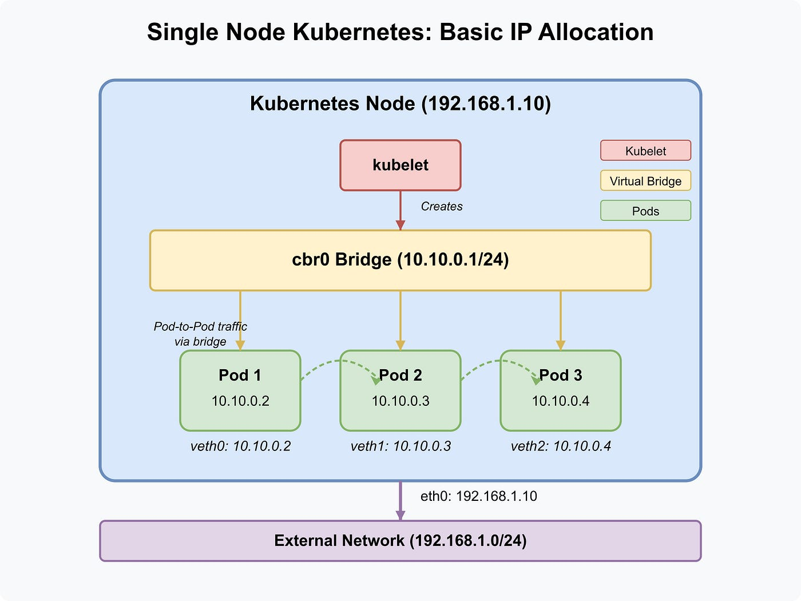

# Pod IP manzillari va ularga murojaat qilish

> 🎯 **Bu darsda nimani o'rganamiz:**
> - `-o wide` bilan Pod IP va node ustunlarini ko'rish
> - Pod IP manzili qayerdan olinadi va kim beradi
> - Nima uchun Pod IP'siga klaster tashqarisidan kirib bo'lmaydi
> - Klaster ichidan Pod'ni to'g'ridan-to'g'ri sinash

## 💡 Hayotiy o'xshatish: ofis ichki telefoni

Katta ofisda har xodimning **ichki raqami** bor: 101, 102, 103. Ular ofis
ichida ajoyib ishlaydi. Lekin ko'chadan turib 102 raqamini tersangiz — hech
kim javob bermaydi. Tashqaridan bog'lanish uchun **umumiy shahar raqami**
kerak, u sizni ichkariga ulaydi.

Pod IP — ichki raqam. Service — umumiy shahar raqami.

## Pod IP manzillarini ko'rish

```bash
kubectl get pods -o wide
kubectl get pods -n default -o wide
```

```text
NAME                            READY   STATUS    RESTARTS   AGE     IP               NODE                NOMINATED NODE   READINESS GATES
nginx-deploy-75c8b7c74b-5ckvw   1/1     Running   0          2d17h   172.16.91.66     test-server-k8s-3   <none>           <none>
nginx-deploy-75c8b7c74b-9svsz   1/1     Running   0          2d17h   172.16.78.129    test-server-k8s-2   <none>           <none>
nginx-deploy-75c8b7c74b-db9j9   1/1     Running   0          2d17h   172.16.91.65     test-server-k8s-3   <none>           <none>
nginx-deploy-75c8b7c74b-kf7zk   1/1     Running   0          2d17h   172.16.138.221   test-server-k8s-1   <none>           <none>
nginx-deploy-75c8b7c74b-srbxn   1/1     Running   0          2d17h   172.16.78.130    test-server-k8s-2   <none>           <none>
```



Bu jadvalda bir qonuniyat bor. Diqqat bilan qarang:

| Node | Pod IP'lari |
|---|---|
| `test-server-k8s-1` | `172.16.138.221` |
| `test-server-k8s-2` | `172.16.78.129`, `172.16.78.130` |
| `test-server-k8s-3` | `172.16.91.65`, `172.16.91.66` |

**Har node o'z IP oralig'idan tarqatadi.** Klaster yaratilganda umumiy
Pod tarmog'i (masalan `172.16.0.0/16`) node'lar orasida bo'lib beriladi:
har biriga o'z bo'lagi (`/24` yoki `/25`) tegadi. Shu sababli IP manzilga
qarab Pod qaysi node'da ekanini taxmin qilish mumkin.

Bu ishni **CNI plagini** (Calico, Flannel, Weave, Cilium) bajaradi.

Faqat IP'larni olish:

```bash
kubectl get pods -o jsonpath='{range .items[*]}{.metadata.name}{"\t"}{.status.podIP}{"\n"}{end}'
```

## Nima uchun Pod IP'siga tashqaridan kirib bo'lmaydi

`172.16.78.129` — bu **virtual tarmoq** manzili. U CNI plagini node'lar
ustida qurgan overlay tarmog'iga tegishli va:

- sizning kompyuteringizning marshrutlash jadvalida **yo'q**;
- router uni bilmaydi;
- shuning uchun `ping 172.16.78.129` javob bermaydi.

Bu **nosozlik emas**, ataylab shunday. Pod IP'lari doim o'zgarib turadi —
agar ular tashqariga ochilganda edi, hech qanday mijoz ularga tayana olmasdi.

Tashqariga chiqarish uchun **Service** kerak — buni
[Servislar](../Servislar/) bo'limida ko'ramiz.

## Klaster ichidan sinash

Node'ning o'zida turib `curl` ishlaydi (node Pod tarmog'ini biladi):

```bash
curl 172.16.78.129
```

```text
<!DOCTYPE html>
<html>
<head>
<title>Welcome to nginx!</title>
...
```

Node'ga kira olmasangiz, vaqtinchalik Pod ochish eng oson yo'l:

```bash
kubectl run sinov --rm -it --image=curlimages/curl:8.10.1 --restart=Never \
  -- curl -s 172.16.78.129
```

Yoki mavjud Pod ichidan:

```bash
kubectl exec -it nginx-deploy-75c8b7c74b-5ckvw -- sh
# ichida: wget -qO- http://172.16.78.129
```

⚠️ `nginx:alpine` image'ida `bash` yo'q — `sh` ishlating. `curl` ham
bo'lmasligi mumkin, o'rniga `wget` bor.

## Konteyner porti — `containerPort` nima qiladi

Manifestdagi `containerPort` **hech narsani ochmaydi**. U faqat hujjat:
"bu konteyner shu portda tinglaydi" degan izoh.

```yaml
ports:
  - containerPort: 80
```

Uni butunlay yozmasangiz ham nginx baribir 80-portda ishlaydi va unga
Pod IP orqali murojaat qilish mumkin. Lekin uni yozish tavsiya etiladi:
Service yozayotganingizda `targetPort` ni shundan bilasiz.

## 🧪 Mustaqil topshiriqlar

> Taxminiy vaqt: 15 daqiqa.

**1-topshiriq · oson.** Deployment'ingizning barcha Pod'lari nomi va IP'sini
bitta ro'yxat qilib chiqaring.

<details><summary>O'zingizni tekshiring</summary>

```bash
kubectl get pods -o wide -l app=nginx-namuna
# IP ustuni to'ldirilgan bo'lishi kerak
```
</details>

**2-topshiriq · o'rta.** Vaqtinchalik Pod ochib, `nginx` Pod'laridan biriga
so'rov yuboring va "Welcome to nginx!" javobini oling.

<details><summary>O'zingizni tekshiring</summary>

```bash
kubectl run sinov --rm -it --image=curlimages/curl:8.10.1 --restart=Never \
  -- curl -s http://<POD-IP> | grep -o '<title>.*</title>'
```
</details>

**3-topshiriq · qiyin.** Pod'ni o'chiring va yangisi ko'tarilgach IP'sini
qayta oling. **Avval ayting:** IP o'zgaradimi? Nima uchun bu Service
kerakligini isbotlaydi?

<details><summary>O'zingizni tekshiring</summary>

```bash
kubectl get pods -o wide -l app=nginx-namuna
# Yangi Pod'ning IP'si boshqacha — eski IP'ga tayangan mijoz uziladi
```
</details>

📁 To'liq yechimlar: [`amaliyot/create_deployment/YECHIM.md`](amaliyot/create_deployment/YECHIM.md)

## ❓ Savol-Javob

**Savol:** Pod IP'sini qat'iy belgilab qo'ysam bo'ladimi?
**Javob:** Yo'q. Pod IP'sini CNI plagini beradi va uni tanlab bo'lmaydi.
Barqaror manzil kerak bo'lsa — Service (ClusterIP) yoki StatefulSet uchun
headless Service.

**Savol:** Ikki Pod bir xil IP olishi mumkinmi?
**Javob:** Bir vaqtda — yo'q. Lekin Pod o'chgandan keyin uning IP'si
qayta ishlatilishi mumkin. Shuning uchun IP'ni kesh qilish xavfli.

**Savol:** `NOMINATED NODE` ustuni nima?
**Javob:** Pod preemption (siqib chiqarish) jarayonida scheduler unga node
tanlagan, lekin joy hali bo'shamagan bo'lsa shu ustun to'ladi. Odatda
`<none>`.

**Savol:** Pod tarmog'i oralig'ini qayerdan bilaman?
**Javob:** `kubectl cluster-info dump | grep -m1 cluster-cidr` yoki
kubeadm klasterida `/etc/kubernetes/manifests/kube-controller-manager.yaml`
faylidagi `--cluster-cidr`.

## 📌 CKA imtihon uchun maslahat

Tarmoq masalalarida `-o wide` — birinchi buyruq. U bir qarashda ko'rsatadi:
Pod qaysi node'da, IP oldimi, node to'g'ri taqsimlanganmi.

Foydali filtrlash:

```bash
kubectl get pods -o wide --field-selector spec.nodeName=node01
kubectl get pods -A -o wide --field-selector=status.phase!=Running
```

Pod IP'siga so'rov yuborish kerak bo'lsa, imtihonda eng tez yo'l:

```bash
kubectl run tmp --rm -it --image=busybox:1.37 --restart=Never -- wget -qO- <POD-IP>
```

## 📖 Asosiy atamalar

| Atama | Ma'nosi |
|---|---|
| **Pod IP** | CNI plagini bergan, klaster ichidagi virtual IP manzil |
| **CNI** | Container Network Interface — Pod tarmog'ini quruvchi plagin |
| **Overlay tarmoq** | Mavjud tarmoq ustiga qurilgan virtual tarmoq |
| **`cluster-cidr`** | Butun klaster uchun ajratilgan Pod IP oralig'i |
| **`containerPort`** | Konteyner qaysi portda tinglashini bildiruvchi izoh |
| **`-o wide`** | Chiqishga IP va NODE ustunlarini qo'shadi |

## 🔗 Manbalar

- [Cluster Networking — kubernetes.io](https://kubernetes.io/docs/concepts/cluster-administration/networking/)
- [Pod Networking](https://kubernetes.io/docs/concepts/workloads/pods/#pod-networking)
- [Debug Services](https://kubernetes.io/docs/tasks/debug/debug-application/debug-service/)

---
⬅️ [Oldingi dars](depl_mashtablash.md) · [Bo'lim indeksi](README.md) · ➡️ Keyingi bo'lim: [Servislar](../Servislar/)
