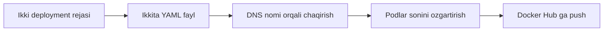

# 🔗 Ikki ilovaning o'zaro aloqasi

Haqiqiy ilovalar bir-biri bilan gaplashadi. Bu bo'limda ikkita Deployment yaratamiz va biri ikkinchisiga Service'ning DNS nomi orqali murojaat qiladi.

## 📚 Darslar tartibi

| # | Fayl | Mavzu |
|---|---|---|
| 1 | [lesson1.md](lesson1.md) | Ikkita deployment yaratish rejasi |
| 2 | [lesson2.md](lesson2.md) | Ilova kodi: `/nginx` yo'li orqali ikkinchi servisga so'rov |
| 3 | [lesson4.md](lesson4.md) | Ikkita YAML fayl va ularning bog'lanishi |
| 4 | [lesson5.md](lesson5.md) | Service'ga DNS nomi orqali murojaat qilish |
| 5 | [lesson6.md](lesson6.md) | Deployment'dagi Pod sonini o'zgartirish |
| 6 | [lesson7.md](lesson7.md) | YAML yaratish bo'yicha yakuniy dars |
| 7 | [lesson8.md](lesson8.md) | Yangilangan image'ni Docker Hub'ga push qilish |

## 💡 Qanday o'qish kerak

1. Darslarni jadvaldagi tartibda o'qing — har biri oldingisiga tayanadi.
2. Buyruqlarni o'z klasteringizda qaytaring. O'qish emas, qilish esda qoladi.
3. `amaliyot/` papkasidagi tayyor fayllardan foydalaning — qo'lda ko'chirish shart emas.
4. Har dars oxiridagi `🧪 Mustaqil topshiriqlar` ni yechimni ochishdan oldin bajaring.

## 🔗 Manbalar

- [Kubernetes rasmiy hujjatlari](https://kubernetes.io/docs/home/)
- [kubectl Cheat Sheet](https://kubernetes.io/docs/reference/kubectl/quick-reference/)

➡️ **Keyingi bo'lim:** [Bulutda_klaster_yaratish](../Bulutda_klaster_yaratish/)

---
⬅️ [Kurs bosh sahifasi](../README.md) · 📖 [Uslub qo'llanmasi](../USLUB.md)
