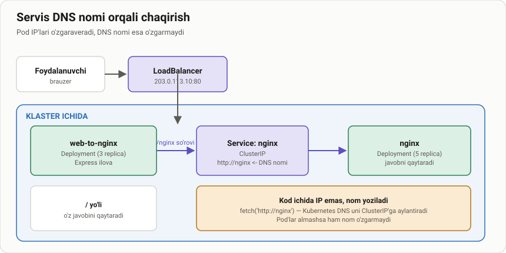

# Ikkita deployment rejasi

> 🎯 **Bu darsda nimani o'rganamiz:**
> - Ikki ilova bir-biri bilan qanday gaplashadi
> - Qaysi servis tashqariga chiqadi, qaysisi ichkarida qoladi
> - Trafikning to'liq yo'li



- bu rasmda bi 2 ta deployment yaratilganligini ko'rishimiz mumkin
1. deployment <k8s-web-to-ngnix>
-- bu yerda bizda 2 ta derektoriya bo'ladi 
        1. / #root direktoriyasi
        2. /nginx #nginx app direktoriyasi
2. deployment <nginx>
- shu bilan birgalikda 1 ta CluserIP servis 
- K8S clusterIP
- LoadBalancer
shu kabi xizmatlarni ishga tushirib ko'rib chiqamiz.

## Trafik yo'li

```
Foydalanuvchi
   ↓  tashqi IP:3333
LoadBalancer Service (k8s-web-to-nginx)
   ↓  Pod:3000
k8s-web-to-nginx ilovasi
   ↓  http://nginx   ← DNS nomi, IP emas
ClusterIP Service (nginx)
   ↓  Pod:80
nginx
```

Eng muhim joy — o'rtadagi `http://nginx`. Ilova kodida IP emas, **nom**
yozilgan. Shuning uchun nginx Pod'lari o'chib-yonsa ham, kodni
o'zgartirish kerak bo'lmaydi.

## 🧪 Mustaqil topshiriqlar

> Taxminiy vaqt: 10 daqiqa.

**1-topshiriq · oson.** Sxemaga qarab ayting: qaysi Service turi tashqariga
chiqadi va nima uchun ikkinchisi ClusterIP?

<details><summary>O'zingizni tekshiring</summary>

`k8s-web-to-nginx` — LoadBalancer, chunki foydalanuvchi unga murojaat qiladi.
`nginx` — ClusterIP, chunki unga faqat birinchi ilova murojaat qiladi.
Uni tashqariga chiqarish keraksiz xavf bo'lardi.
</details>

**2-topshiriq · o'rta.** nginx servisini ham LoadBalancer qilsak, nima
o'zgaradi? Yaxshi g'oyami?

<details><summary>O'zingizni tekshiring</summary>

Ishlaydi, lekin: bulutda qo'shimcha pul turadi va ichki xizmat internetga
ochiladi. Eng kam huquq tamoyili — kerak bo'lmasa ochmaslik.
</details>

**3-topshiriq · qiyin.** Ilova kodida `http://nginx` o'rniga Pod IP'si
yozilgan bo'lsa, birinchi qayta ishga tushishda nima bo'ladi?

<details><summary>O'zingizni tekshiring</summary>

Pod yangi IP oladi, eski IP javob bermaydi — ilova buziladi. Aynan shu
sababli Service kerak.
</details>

## ❓ Savol-Javob

**Savol:** Ikkala ilova bitta Pod'da bo'lsa bo'lmaydimi?
**Javob:** Texnik jihatdan bo'ladi, lekin ularni alohida masshtablab
bo'lmaydi va biri yiqilsa ikkinchisi ham qayta ishga tushadi.

## 📖 Asosiy atamalar

| Atama | Ma'nosi |
|---|---|
| **Service DNS nomi** | Klaster ichida servisga murojaat qilish uchun nom |
| **ClusterIP** | Faqat klaster ichidan ko'rinadigan Service turi |
| **CoreDNS** | Service nomlarini IP'ga aylantiruvchi klaster DNS serveri |
| **FQDN** | `<servis>.<namespace>.svc.cluster.local` — to'liq nom |
| **Ko'p hujjatli YAML** | Bitta faylda `---` bilan ajratilgan bir necha obyekt |

## 🔗 Manbalar

- [DNS for Services and Pods](https://kubernetes.io/docs/concepts/services-networking/dns-pod-service/)
- [Connecting Applications with Services](https://kubernetes.io/docs/tutorials/services/connect-applications-service/)
- [Service — kubernetes.io](https://kubernetes.io/docs/concepts/services-networking/service/)

---
⬅️ [Bo'lim indeksi](README.md) · ➡️ [lesson2.md](lesson2.md)
