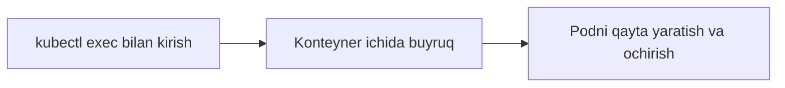

# 📦 Konteynerlar bilan ishlash

Pod ichidagi konteynerga kirish, buyruq bajarish va Pod'ni qayta yaratish. Debug qilishning asosiy vositalari.

## 📚 Darslar tartibi

| # | Fayl | Mavzu |
|---|---|---|
| 1 | [lesson21.md](lesson21.md) | Konteynerga tashqaridan kirish: `-o wide`, Pod IP va `kubectl exec` |
| 2 | [lesson22.md](lesson22.md) | Podlarni qayta yaratish va o'chirish |

## 💡 Qanday o'qish kerak

1. Darslarni jadvaldagi tartibda o'qing — har biri oldingisiga tayanadi.
2. Buyruqlarni o'z klasteringizda qaytaring. O'qish emas, qilish esda qoladi.
3. `amaliyot/` papkasidagi tayyor fayllardan foydalaning — qo'lda ko'chirish shart emas.
4. Har dars oxiridagi `🧪 Mustaqil topshiriqlar` ni yechimni ochishdan oldin bajaring.

## 🔗 Manbalar

- [Kubernetes rasmiy hujjatlari](https://kubernetes.io/docs/home/)
- [kubectl Cheat Sheet](https://kubernetes.io/docs/reference/kubectl/quick-reference/)

➡️ **Keyingi bo'lim:** [Serverga_va_podga_ulanish](../Serverga_va_podga_ulanish/)

---
⬅️ [Kurs bosh sahifasi](../README.md) · 📖 [Uslub qo'llanmasi](../USLUB.md)
