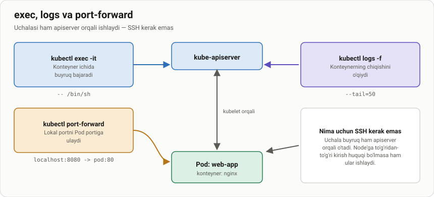

# Ishlab turgan Pod bilan ishlash — exec, logs va port-forward

> 🎯 **Bu darsda nimani o'rganamiz:**
> - `kubectl exec` bilan konteyner ichiga kirish
> - `kubectl logs` bilan konteyner chiqishini o'qish
> - `kubectl port-forward` bilan lokal portni Pod'ga ulash
> - `-o wide` nima qo'shimcha ma'lumot beradi
> - Nima uchun bularning hech biriga node'ga SSH kerak emas



## 💡 Hayotiy o'xshatish: mehmonxona xonasi

Siz mehmonxona xonasiga ikki yo'l bilan kirishingiz mumkin: **binoning
orqa eshigidan** o'tib, koridorlar bo'ylab yurib borish (node'ga SSH) yoki
**qabulxonaga aytish** — ular sizni o'zi olib boradi (apiserver).

Kubernetes'da doim ikkinchi yo'l ishlatiladi. Sababi: siz node'ning IP'sini
bilmasligingiz mumkin, node'ga SSH kaliti bo'lmasligi mumkin, va Pod bir
node'dan boshqasiga ko'chib ketishi mumkin. Qabulxona esa Pod'ni qayerda
bo'lsa ham topib beradi.

## Pod qayerda ishlayapti — `-o wide`

Oddiy `kubectl get pods` faqat nom, holat va yoshni ko'rsatadi. `-o wide`
esa **IP manzil va node** ustunlarini qo'shadi:

```bash
kubectl get pods -o wide
```

```text
NAME          READY   STATUS    RESTARTS   AGE   IP           NODE      NOMINATED NODE   READINESS GATES
sinov-nginx   1/1     Running   0          2m    10.244.0.7   node-01   <none>           <none>
web-abc-x9k   1/1     Running   0          10d   10.244.1.3   node-02   <none>           <none>
```

Bu ikki ustun nosozlik qidirishda juda ko'p ish beradi: barcha muammoli
Pod'lar bitta node'da bo'lsa — muammo o'sha node'da.

> 📁 **Tayyor fayl:** [`amaliyot/lesson21/01-sinov-pod.yaml`](amaliyot/lesson21/01-sinov-pod.yaml)
>
> ```bash
> kubectl apply -f amaliyot/lesson21/01-sinov-pod.yaml
> ```

## `kubectl exec` — konteyner ichida buyruq bajarish

Bitta buyruq bajarish:

```bash
kubectl exec sinov-nginx -- ls /usr/share/nginx/html
```

Interaktiv shell ochish:

```bash
kubectl exec -it sinov-nginx -- /bin/sh
```

Boshqa namespace'dagi Pod uchun `-n` qo'shiladi:

```bash
kubectl exec -it -n <namespace> <pod-nomi> -- /bin/sh
```

⚠️ **`/bin/bash` har doim ham bo'lmaydi.** Alpine asosidagi image'larda
(`nginx:alpine`, `busybox`) faqat `/bin/sh` bor. `bash` topilmasa
`OCI runtime exec failed ... executable file not found` xatosi chiqadi —
shunda `sh` ni sinang.

⚠️ **Ko'p konteynerli Pod'da `-c` majburiy:**

```bash
kubectl exec -it sidecar-namuna -c kuzatuvchi -- sh
```

`-c` berilmasa, Kubernetes birinchi konteynerni tanlaydi va sizni
ogohlantiradi.

## `kubectl logs` — konteyner chiqishini o'qish

```bash
kubectl logs sinov-nginx              # butun log
kubectl logs sinov-nginx -f           # jonli kuzatish (follow)
kubectl logs sinov-nginx --tail=50    # oxirgi 50 qator
kubectl logs sinov-nginx --previous   # YIQILGAN oldingi konteynerning logi
```

`--previous` — eng qimmatli bayroq. `CrashLoopBackOff` holatidagi Pod'ning
joriy konteyneri hali ko'tarilmagan bo'ladi, sabab esa **oldingisining**
logida qoladi.

## `kubectl port-forward` — lokal portni Pod'ga ulash

```bash
kubectl port-forward pod/sinov-nginx 8080:80
```

Endi brauzerda `http://localhost:8080` ochsangiz, o'sha Pod'ning nginx'i
javob beradi.

Bu buyruq **terminal ochiq turganda** ishlaydi; terminalni yopsangiz
ulanish uziladi. Service ham, tashqi IP ham kerak emas — shuning uchun
u nosozlik qidirishda juda qulay: Service noto'g'ri sozlangan bo'lsa ham,
Pod'ning o'zi ishlayotganini shu bilan tekshirish mumkin.

## Kubernetes'dagi uchta tarmoq

| Tarmoq | Kim ishlatadi | Manzil namunasi |
|---|---|---|
| **Pod tarmog'i** | Pod'lar o'zaro gaplashadi | `10.244.0.0/16` |
| **Service tarmog'i** | Service'larning barqaror IP'lari | `10.96.0.0/12` |
| **Node tarmog'i** | Node'larning o'z IP manzillari | `192.168.16.0/24` |

Bu uchta oraliq bir-biri bilan kesishmasligi kerak — aks holda paketlar
qayerga ketishini kube-proxy hal qila olmaydi.

## 🧪 Mustaqil topshiriqlar

> Yechimni ochishdan oldin o'zingiz bajarib ko'ring. Taxminiy vaqt: 10 daqiqa.

**1-topshiriq · oson.** `sinov-nginx` Pod'ining ichiga kirib, nginx qaysi
versiyada ishlayotganini aniqlang.

<details><summary>O'zingizni tekshiring</summary>

```bash
kubectl exec sinov-nginx -- nginx -v
# nginx version: nginx/1.27.x chiqishi kerak
```
</details>

**2-topshiriq · o'rta.** `port-forward` bilan Pod'ni `localhost:8080` ga
ulang va brauzerdan bir marta so'rov yuboring. Keyin `kubectl logs` da o'sha
so'rovni toping.

<details><summary>O'zingizni tekshiring</summary>

```bash
kubectl logs sinov-nginx --tail=5
# "GET / HTTP/1.1" 200 qatori ko'rinishi kerak
```
</details>

**3-topshiriq · qiyin.** `kubectl exec -it sinov-nginx -- /bin/bash` ni bajaring.
**Avval ayting:** ishlaydimi yoki xato beradimi? Nima uchun? Keyin tekshiring
va ishlaydigan variantini toping.

<details><summary>O'zingizni tekshiring</summary>

```bash
kubectl exec sinov-nginx -- which sh bash
# faqat /bin/sh topiladi — alpine image'ida bash yo'q
```
</details>

📁 To'liq yechimlar: [`amaliyot/lesson21/YECHIM.md`](amaliyot/lesson21/YECHIM.md)

## ❓ Savol-Javob

**Savol:** `kubectl exec` bilan qilgan o'zgarishlarim saqlanadimi?
**Javob:** Yo'q. Konteyner qayta ishga tushsa, u image'dagi holatga qaytadi.
`exec` — faqat tekshirish va nosozlik qidirish uchun. Doimiy o'zgarish
image'ga yoki ConfigMap'ga yoziladi.

**Savol:** Pod ichida `curl` yoki `ping` yo'q. Nima qilay?
**Javob:** Ularni o'rnatmang — konteyner minimal bo'lishi kerak. O'rniga
vaqtinchalik yordamchi Pod oching:

```bash
kubectl run sinov --rm -it --image=nicolaka/netshoot:latest --restart=Never -- bash
```

**Savol:** `kubectl logs` bo'sh chiqyapti, lekin ilova ishlayapti.
**Javob:** Ilova logni faylga yozayotgan bo'lishi mumkin. Kubernetes faqat
`stdout` va `stderr` ni yig'adi. Ilovani logni ekranga chiqaradigan qilib
sozlang.

**Savol:** `port-forward` va `Service` orasida farq nima?
**Javob:** `port-forward` — faqat sizning kompyuteringiz uchun, vaqtinchalik,
terminal ochiq turganda. Service — klasterdagi barcha uchun, doimiy.

## 📌 CKA imtihon uchun maslahat

Imtihonda Pod ishlamayotgan bo'lsa, shu tartibda tekshiring:

```bash
kubectl describe pod <nom>      # 1. Events bo'limi — sabab shu yerda
kubectl logs <nom>              # 2. ilovaning o'z xabari
kubectl logs <nom> --previous   # 3. yiqilgan oldingi konteyner logi
kubectl exec -it <nom> -- sh    # 4. faqat oxirgi chora
```

`--previous` ni yod oling — `CrashLoopBackOff` masalalarida yechim aynan
o'sha buyruqdan chiqadi.

## 📖 Asosiy atamalar

| Atama | Ma'nosi |
|---|---|
| **`-o wide`** | Chiqishga IP va NODE ustunlarini qo'shadigan bayroq |
| **`exec`** | Ishlab turgan konteyner ichida buyruq bajarish |
| **`port-forward`** | Lokal portni Pod portiga vaqtincha ulash |
| **`stdout` / `stderr`** | Konteynerning standart chiqishi; `kubectl logs` aynan shuni o'qiydi |
| **`--previous`** | Yiqilgan oldingi konteynerning logini ko'rsatadi |

## 🔗 Manbalar

- [kubectl exec — kubernetes.io](https://kubernetes.io/docs/reference/generated/kubectl/kubectl-commands#exec)
- [Debug Running Pods — kubernetes.io](https://kubernetes.io/docs/tasks/debug/debug-application/debug-running-pod/)
- [Port Forward to Access Applications](https://kubernetes.io/docs/tasks/access-application-cluster/port-forward-access-application-cluster/)

---
⬅️ [Bo'lim indeksi](README.md) · ➡️ Keyingi dars: [lesson22.md](lesson22.md)
