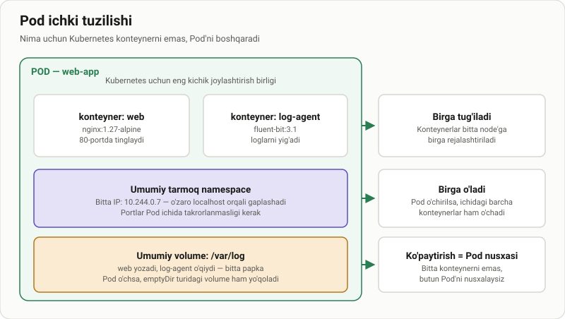
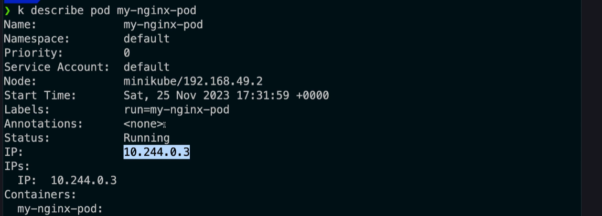

# Pod asoslari — Kubernetes'ning eng kichik birligi

> 🎯 **Bu darsda nimani o'rganamiz:**
> - Pod nima va nima uchun Kubernetes konteynerni emas, Pod'ni boshqaradi
> - Pod ichidagi konteynerlar nimani bo'lishadi (IP, portlar, volume)
> - Pod'ning hayot sikli: Pending, Running, Succeeded, Failed
> - Birinchi Pod'ni yaratish va uni tekshirish
> - Nima uchun amalda Pod bevosita yaratilmaydi



## 💡 Hayotiy o'xshatish: bitta kvartira

Konteyner — bu bitta xona. Pod esa — kvartira.

Bitta kvartirada bir necha xona bo'lishi mumkin, lekin ularning **manzili
bitta**, **kirish eshigi bitta** va **oshxonasi umumiy**. Xonalar bir-biriga
koridordan o'tadi, ko'chaga chiqish shart emas.

Uy-joy idorasi ham alohida xonani emas, **kvartirani** ijaraga beradi yoki
bo'shatadi. Kubernetes ham xuddi shunday: u konteynerni emas, **Pod'ni**
rejalashtiradi, ko'chiradi va o'chiradi.

## Pod nima

**Pod** — Kubernetes yaratadigan va boshqaradigan eng kichik birlik. Uning
ichida bir yoki bir nechta konteyner bo'ladi.

Pod ichidagi konteynerlar quyidagilarni **bo'lishadi**:

| Nimani bo'lishadi | Ma'nosi |
|---|---|
| **Tarmoq namespace** | Bitta IP manzil. Konteynerlar bir-birini `localhost` orqali ko'radi |
| **Port maydoni** | Bitta port ikki konteynerda takrorlanmasligi kerak |
| **Volume'lar** | Bir xil papkani ikkalasi ham ulab olishi mumkin |
| **Hayot sikli** | Birga rejalashtiriladi, birga o'chiriladi |

Nimani **bo'lishmaydi**: fayl tizimi (har konteynerning o'z image'i),
jarayonlar ro'yxati (odatda), CPU va xotira limitlari.

## Pod'ning asosiy xususiyatlari

- **Vaqtinchalik (ephemeral).** Pod tuzatilmaydi — o'chiriladi va o'rniga
  yangisi yaratiladi. Shuning uchun Pod IP'siga tayanib ish qurish xato.
- **Ko'paytirish = Pod nusxasi.** Bitta konteynerni emas, butun Pod'ni
  nusxalaysiz.
- **Nomi noyob.** Bitta namespace ichida bir xil nomli ikkita Pod bo'lmaydi.

## Birinchi Pod'ni yaratish

> 📁 **Tayyor fayl:** [`amaliyot/lesson/01-oddiy-pod.yaml`](amaliyot/lesson/01-oddiy-pod.yaml)

```yaml
apiVersion: v1
kind: Pod
metadata:
  name: oddiy-nginx
  labels:
    app: nginx-namuna
spec:
  containers:
    - name: nginx
      image: nginx:1.27-alpine
      ports:
        - containerPort: 80
```

Qo'llash:

```bash
kubectl apply -f amaliyot/lesson/01-oddiy-pod.yaml
```

Tez sinash uchun YAML yozmasdan ham bo'ladi:

```bash
kubectl run oddiy-nginx --image=nginx:1.27-alpine
```

⚠️ **Image'ni doim versiya tegi bilan yozing.** Tegsiz `nginx` bugun bir
versiyani, ertaga boshqasini tortadi — dars ham, ishlab chiqarish ham
takrorlanmaydigan bo'lib qoladi.

## Pod'ni tekshirish

```bash
kubectl get pods                       # umumiy ro'yxat
kubectl get pod oddiy-nginx -o wide    # IP va node ham ko'rinadi
kubectl describe pod oddiy-nginx       # batafsil: hodisalar, sabablar
kubectl logs oddiy-nginx               # konteyner chiqishi
kubectl delete pod oddiy-nginx         # o'chirish
```

`describe` chiqishida eng qimmatli qism — eng pastdagi **Events**. Pod
ko'tarilmayotgan bo'lsa, sababi deyarli har doim o'sha yerda yozilgan.



## Pod'ning hayot sikli

| Holat | Ma'nosi | Odatdagi sabab |
|---|---|---|
| **Pending** | Pod qabul qilingan, lekin hali ishga tushmagan | Node topilmadi, image yuklanyapti, resurs yetmadi |
| **Running** | Kamida bitta konteyner ishlayapti | Normal holat |
| **Succeeded** | Barcha konteynerlar muvaffaqiyat bilan tugadi | Job va bir martalik vazifalar |
| **Failed** | Kamida bitta konteyner xato bilan tugadi | Ilova yiqildi, `exit code` noldan farqli |
| **Unknown** | Node bilan aloqa yo'q | Node yiqilgan yoki tarmoq uzilgan |

Bulardan tashqari `STATUS` ustunida `CrashLoopBackOff` va `ImagePullBackOff`
ham uchraydi — bular holat emas, **sabab**: birinchisida konteyner qayta-qayta
yiqilyapti, ikkinchisida image yuklab bo'lmayapti.

## Ko'p konteynerli Pod

> 📁 **Tayyor fayl:** [`amaliyot/lesson/02-ikki-konteynerli-pod.yaml`](amaliyot/lesson/02-ikki-konteynerli-pod.yaml)

Ikki konteynerni bitta Pod'ga faqat ular **haqiqatan ajralmas** bo'lganda
qo'yiladi:

- **Sidecar** — asosiy konteyner yoniga yordamchi: log yig'uvchi, proxy,
  metrika eksporteri.
- **Init konteyner** — asosiy konteynerdan **oldin** ishlab, tugab ketadi:
  bazani tayyorlash, konfiguratsiyani yuklab olish.

```yaml
spec:
  volumes:
    - name: umumiy
      emptyDir: {}
  containers:
    - name: yozuvchi
      image: busybox:1.37
      volumeMounts:
        - name: umumiy
          mountPath: /umumiy
    - name: kuzatuvchi
      image: busybox:1.37
      volumeMounts:
        - name: umumiy
          mountPath: /umumiy
```

Ko'p konteynerli Pod bilan ishlaganda `-c` bayrog'i kerak bo'ladi:

```bash
kubectl logs sidecar-namuna -c kuzatuvchi
kubectl exec -it sidecar-namuna -c yozuvchi -- sh
```

## ⚠️ Amalda Pod bevosita yaratilmaydi

Yuqoridagi misollar Pod nimadan iboratligini ko'rsatish uchun. Haqiqiy ishda
Pod'ni **Deployment** yaratadi.

Sababi oddiy: `kubectl run` bilan yaratilgan Pod o'chirilsa yoki node yiqilsa,
uni **hech kim tiklamaydi**. Deployment esa Pod'lar sonini doim kuzatib turadi
va kami bo'lsa yangisini yaratadi.

Buni [Deploymentlar](../Deploymentlar/) bo'limida ko'ramiz.

## 🧪 Mustaqil topshiriqlar

> Yechimni ochishdan oldin o'zingiz bajarib ko'ring. Taxminiy vaqt: 15 daqiqa.

**1-topshiriq · oson.** `mashq-pod` nomli Pod yarating: image
`nginx:1.27-alpine`, label `daraja=oson`.

<details><summary>O'zingizni tekshiring</summary>

```bash
kubectl get pod mashq-pod --show-labels
# LABELS ustunida daraja=oson ko'rinishi kerak
```
</details>

**2-topshiriq · o'rta.** Shu Pod'ning IP manzilini toping va **boshqa Pod'dan**
unga `curl` bilan murojaat qilib, nginx javob berayotganini isbotlang.

<details><summary>O'zingizni tekshiring</summary>

```bash
kubectl get pod mashq-pod -o jsonpath='{.status.podIP}{"\n"}'
# Javobda "Welcome to nginx!" bo'lishi kerak
```
</details>

**3-topshiriq · qiyin.** `02-ikki-konteynerli-pod.yaml` ni qo'llang.
`kuzatuvchi` konteyner `yozuvchi` yozgan qatorlarni ko'radimi? **Avval javobni
ayting**, keyin tekshiring va nima uchun shundayligini tushuntiring.

<details><summary>O'zingizni tekshiring</summary>

```bash
kubectl logs sidecar-namuna -c kuzatuvchi --tail=3
# "... - salom" qatorlari oqib turishi kerak
```
</details>

📁 To'liq yechimlar: [`amaliyot/lesson/YECHIM.md`](amaliyot/lesson/YECHIM.md)

## ❓ Savol-Javob

**Savol:** Bitta Pod'ga nechta konteyner qo'ysam bo'ladi?
**Javob:** Texnik cheklov yo'q, lekin amalda **bitta** bo'ladi. Ikkinchisini
faqat u asosiy konteynerdan ajralmas bo'lgandagina qo'shing (sidecar, init).
"Ikkita ilova bir Pod'da" — deyarli har doim xato: ularni alohida
masshtablab bo'lmaydi.

**Savol:** Pod IP manzilini ilovamda yozib qo'ysam bo'ladimi?
**Javob:** Yo'q. Pod har qayta yaratilganda yangi IP oladi. Barqaror manzil
uchun **Service** ishlatiladi — [Servislar](../Servislar/) bo'limiga qarang.

**Savol:** `kubectl run` va `kubectl apply -f pod.yaml` orasida farq bormi?
**Javob:** Natija bir xil — ikkalasi ham Pod yaratadi. Farqi: `run` tez sinash
uchun qulay, `apply -f` esa manifestni git'da saqlash imkonini beradi.
Ishlab chiqarishda doim ikkinchisi.

**Savol:** Pod o'chirilsa, ichidagi ma'lumot nima bo'ladi?
**Javob:** `emptyDir` turidagi volume Pod bilan birga o'chadi. Ma'lumot
saqlanishi kerak bo'lsa — PersistentVolume kerak.

**Savol:** `Pending` holatida qotib qolgan Pod'ni qanday tekshiraman?
**Javob:** `kubectl describe pod <nom>` va chiqishning eng pastidagi
**Events** bo'limini o'qing. Odatda sabab o'sha yerda: `Insufficient cpu`,
`node(s) had taint`, `ImagePullBackOff`.

## 📌 CKA imtihon uchun maslahat

Imtihonda YAML'ni noldan yozishga vaqt yo'q. Qolipni `kubectl` ning o'ziga
generatsiya qildiring:

```bash
kubectl run nom --image=nginx:1.27-alpine --dry-run=client -o yaml > pod.yaml
```

`--dry-run=client -o yaml` — imtihondagi eng ko'p ishlatiladigan kombinatsiya.
Uni yod oling.

Yana bir tez usul — mavjud Pod'dan qolip olish:

```bash
kubectl get pod oddiy-nginx -o yaml > namuna.yaml
```

## 📖 Asosiy atamalar

| Atama | Ma'nosi |
|---|---|
| **Pod** | Kubernetes yaratadigan eng kichik birlik; bir yoki bir necha konteynerni o'raydi |
| **Sidecar** | Asosiy konteyner yoniga qo'yiladigan yordamchi konteyner |
| **Init konteyner** | Asosiy konteynerdan oldin ishlab tugaydigan tayyorlov konteyneri |
| **emptyDir** | Pod bilan birga tug'ilib, Pod bilan birga o'chadigan bo'sh volume |
| **Ephemeral** | Vaqtinchalik; tuzatilmaydi, o'rniga yangisi yaratiladi |
| **CrashLoopBackOff** | Konteyner qayta-qayta yiqilyapti; Kubernetes qayta urinishlar oralig'ini uzaytiryapti |
| **ImagePullBackOff** | Image'ni yuklab bo'lmayapti: nomi xato yoki registry'ga kirish yo'q |

## 🔗 Manbalar

- [Pods — kubernetes.io](https://kubernetes.io/docs/concepts/workloads/pods/)
- [Pod Lifecycle — kubernetes.io](https://kubernetes.io/docs/concepts/workloads/pods/pod-lifecycle/)
- [Init Containers — kubernetes.io](https://kubernetes.io/docs/concepts/workloads/pods/init-containers/)
- [kubectl Cheat Sheet](https://kubernetes.io/docs/reference/kubectl/quick-reference/)

---
⬅️ [Bo'lim indeksi](README.md) · ➡️ Keyingi bo'lim: [Podlarni_tekshirish](../Podlarni_tekshirish/)
