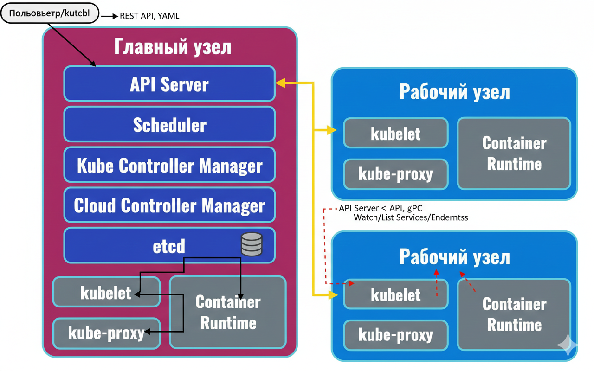

# ☸️ Архитектура Kubernetes (K8s) — Учебное пособие

Этот репозиторий содержит описание базовой архитектуры Kubernetes, основанное на схеме компонентов кластера. Данный материал поможет разобраться, как взаимодействуют управляющие и рабочие узлы.

---

## 🏗 Обзор архитектуры

Кластер Kubernetes состоит из двух основных зон ответственности:
1. **Главный узел (Control Plane)** — «Мозг» системы.
2. **Рабочие узлы (Worker Nodes)** — «Руки» системы, где исполняются приложения.


*Примечание: Если вы клонируете репозиторий, убедитесь, что файл изображения находится в той же папке.*

---

## 🧠 1. Главный узел (Control Plane)

Главный узел отвечает за принятие глобальных решений по кластеру (например, планирование) и обнаружение/реагирование на события.

### Компоненты управления

| Компонент | Роль | Описание |
| :--- | :--- | :--- |
| **API Server** | **Front-end** | Единственный компонент, с которым можно общаться напрямую. Все запросы проходят через него. |
| **etcd** | **Хранилище** | Высокодоступная база данных «ключ-значение». Хранит всё состояние кластера. |
| **Scheduler** | **Диспетчер** | Следит за новыми Pod'ами и выбирает для них наиболее подходящий рабочий узел. |
| **Kube Controller Manager** | **Контролер** | Запускает процессы, которые следят за состоянием кластера (узлы, реплики, токены). |
| **Cloud Controller Manager**| **Облако** | Позволяет связать ваш кластер с API облачного провайдера (AWS, GCP, Azure). |

> **Интересный факт:** На схеме видно, что на главном узле также есть `kubelet` и `proxy`. Это нужно для того, чтобы сам мастер-узел мог запускать служебные контейнеры (например, DNS или метрики).

---

## ⚙️ 2. Рабочие узлы (Worker Nodes)

Рабочие узлы поддерживают работу запущенных контейнеров (Pod) и обеспечивают им сетевую связность.

### Компоненты узла

* **`kubelet`**: Агент, который гарантирует, что контейнеры запущены в Pod'ах. Он не управляет контейнерами, которые не были созданы Kubernetes.
* **`kube-proxy`**: Сетевой мост. Он поддерживает сетевые правила на узлах, позволяя подам общаться друг с другом.
* **`Container Runtime`**: Программная среда (например, **Docker**, **containerd**), которая непосредственно запускает контейнеры.

---

## 🔄 Жизненный цикл запроса (Как это работает?)

1.  **Пользователь** отправляет команду: `kubectl apply -f deployment.yaml`.
2.  **API Server** проверяет подлинность и сохраняет план в **etcd**.
3.  **Scheduler** видит, что появились новые задачи, и выбирает свободный **Рабочий узел**.
4.  **Kubelet** на выбранном узле получает команду и просит **Container Runtime** скачать образ и запустить контейнер.
5.  **Kube-proxy** прописывает маршруты, чтобы вы могли открыть приложение в браузере.

---

## 🛠 Полезные команды для проверки

```bash
# Проверить статус всех узлов в кластере
kubectl get nodes

# Посмотреть запущенные системные компоненты
kubectl get pods -n kube-system

# Подробная информация о конкретном узле
kubectl describe node <имя_узла>
