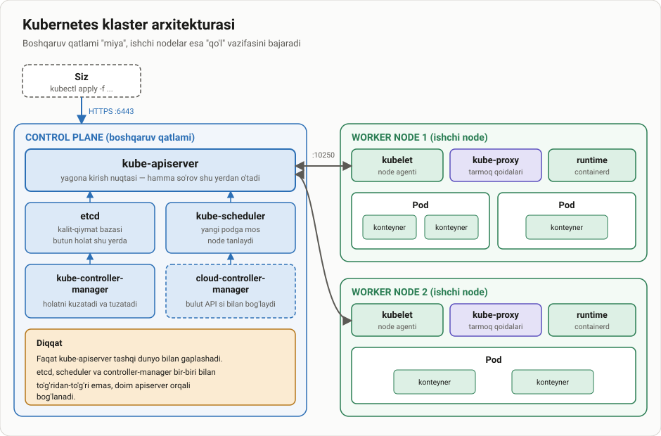
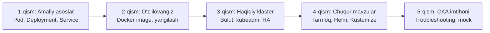

# ☸️ Kubernetes — o'zbek tilidagi to'liq darslik

Noldan boshlab Kubernetes'ni o'rganish va **CKA** (Certified Kubernetes
Administrator) imtihoniga tayyorlanish uchun amaliy kurs. Har bir dars
o'zbek tilida, ishlaydigan misollar va mustaqil topshiriqlar bilan.



---

## 🎯 Bu kurs kimga mo'ljallangan

| Siz | Bu kurs sizga |
|---|---|
| Docker'ni bilasiz, Kubernetes'ni bilmaysiz | ✅ Aynan mos — 1-qismdan boshlang |
| Kubernetes'ni ozgina bilasiz, chuqurlashtirmoqchisiz | ✅ 9-bo'limdan (Networking) boshlang |
| CKA imtihoniga tayyorlanyapsiz | ✅ 9–18 bo'limlar to'g'ridan-to'g'ri imtihon dasturi bo'yicha |
| Dasturlashni umuman bilmaysiz | ⚠️ Avval Linux terminal va Docker asoslarini o'rganing |

**Talab qilinadi:** Linux terminalida ishlash, Docker haqida boshlang'ich
tushuncha, YAML sintaksisi bilan tanishlik.

---

## 🗺️ Kurs qanday qurilgan


```mermaid
graph LR
    A["1-qism: Amaliy asoslar<br/>Pod, Deployment, Service"] --> B["2-qism: O'z ilovangiz<br/>Docker image, yangilash"]
    B --> C["3-qism: Haqiqiy klaster<br/>Bulut, kubeadm, HA"]
    C --> D["4-qism: Chuqur mavzular<br/>Tarmoq, Helm, Kustomize"]
    D --> E["5-qism: CKA imtihoni<br/>Troubleshooting, mock"]
```

Kurs ikki qatlamdan iborat:

- **Amaliy qism** (nomlangan papkalar) — minikube'da qo'lingiz bilan qilib
  ko'radigan darslar. Bu yerdan boshlang.
- **Nazariy/CKA qism** (`9_` – `18_` raqamli papkalar) — CKA imtihon dasturi
  bo'yicha chuqur darslar, laboratoriyalar va mock imtihonlar.

---

## 📚 1-qism — Amaliy asoslar

| # | Bo'lim | Nimani o'rganasiz |
|---|---|---|
| 1 | [Podlar_asoslari](Podlar_asoslari/) | Pod nima, nima uchun konteyner emas, hayot sikli |
| 2 | [Podlarni_tekshirish](Podlarni_tekshirish/) | `get`, `describe`, `logs` — pod holatini o'qish |
| 3 | [Konteynerlar_bilan_ishlash](Konteynerlar_bilan_ishlash/) | `exec` bilan konteyner ichiga kirish, qayta yaratish |
| 4 | [Serverga_va_podga_ulanish](Serverga_va_podga_ulanish/) | Node va podga ulanish usullari |
| 5 | [YAML_yaratish](YAML_yaratish/) | Manifest anatomiyasi, `apply`, Dashboard |
| 6 | [Deploymentlar](Deploymentlar/) | Deployment, ReplicaSet, masshtablash |
| 7 | [Servislar](Servislar/) | ClusterIP, NodePort, LoadBalancer |

## 📚 2-qism — O'z ilovangizni klasterga chiqarish

| # | Bo'lim | Nimani o'rganasiz |
|---|---|---|
| 8 | [Custom_obrazlar_yaratish](Custom_obrazlar_yaratish/) | NodeJS ilovasi uchun Dockerfile va image yaratish |
| 9 | [Dasturni_yangilash](Dasturni_yangilash/) | Yangi versiyani chiqarish, rolling update |
| 10 | [Ikkita_deployment_YAML](Ikkita_deployment_YAML/) | Ikki ilovaning o'zaro aloqasi, servis orqali chaqirish |

## 📚 3-qism — Haqiqiy klaster

| # | Bo'lim | Nimani o'rganasiz |
|---|---|---|
| 11 | [Bulutda_klaster_yaratish](Bulutda_klaster_yaratish/) | DigitalOcean'da klaster, public IP, NAT orqali ulanish |
| 12 | [10_Klaster_dizayni](10_Klaster_dizayni/) | Klasterni loyihalash, HA, etcd quorum |
| 13 | [11_Kubeadm_ornatish](11_Kubeadm_ornatish/) | kubeadm bilan klasterni noldan ko'tarish |

## 📚 4-qism — Chuqur mavzular

| # | Bo'lim | Darslar | Nimani o'rganasiz |
|---|---|---|---|
| 14 | [9_Networking](9_Networking/) | 24 | CNI, Pod tarmog'i, CoreDNS, Ingress, Gateway API |
| 15 | [12_Helm_asoslari](12_Helm_asoslari/) | 10 | Chart, release, upgrade va rollback |
| 16 | [13_Kustomize_asoslari](13_Kustomize_asoslari/) | 16 | Base, overlay, transformer, patch, komponent |
| 17 | [15_Boshqa_mavzular](15_Boshqa_mavzular/) | 1 | JSONPath bilan `kubectl` chiqishini filtrlash |

## 📚 5-qism — CKA imtihoniga tayyorgarlik

| # | Bo'lim | Nimani o'rganasiz |
|---|---|---|
| 18 | [14_Troubleshooting](14_Troubleshooting/) | Ilova, control plane, node va tarmoq nosozliklari |
| 19 | [17_Mock_imtihonlar](17_Mock_imtihonlar/) | 3 ta to'liq mock imtihon va ularning yechimlari |
| 20 | [18_Kurs_yakuni](18_Kurs_yakuni/) | Imtihon kuni maslahatlari, keyingi qadamlar |

> ℹ️ Raqamli papkalar 9 dan boshlanadi, chunki ular CKA kursining
> videolar tartibiga mos keladi. 1–8 va 16-bo'limlarning mavzulari
> yuqoridagi 1–2-qismlarda amaliy ko'rinishda berilgan.

---

## 🚀 Boshlash

### 1. Klasterni ko'taring

Eng oson yo'l — o'z kompyuteringizda **minikube**:

```bash
minikube start
kubectl get nodes
```

Batafsil: [start-minikube.md](start-minikube.md)

### 2. Repozitoriyani yuklab oling

```bash
git clone https://github.com/Ilhom88-0407/k8s-education.git
cd k8s-education
```

### 3. Birinchi darsdan boshlang

```bash
cd Podlar_asoslari
```

Har bo'limning `README.md` fayli — o'sha bo'lim bo'yicha yo'l xaritasi.

---

## 📁 Amaliy fayllar qayerda

Darsda ishlatilgan har bir manifest, skript va loyiha shu bo'limning
`amaliyot/` papkasida **ishlaydigan fayl** sifatida turadi — nusxa
ko'chirish shart emas:

```bash
cd Deploymentlar
kubectl apply -f amaliyot/create_deployment/01-nginx-deployment.yaml
```

Papka nomi dars faylining nomiga mos keladi, shuning uchun qaysi fayl qaysi
darsga tegishli ekani darrov ko'rinadi.

---

## 💡 Qanday o'qish kerak

1. **Tartib bilan o'qing.** Har dars oldingisiga tayanadi.
2. **Buyruqlarni o'zingiz yozing.** Nusxa ko'chirish emas — qo'l bilan yozish
   esda qoldiradi.
3. **`🧪 Mustaqil topshiriqlar` ni tashlab ketmang.** Yechimni ochishdan
   oldin albatta o'zingiz urinib ko'ring — kurs shu bo'limlar uchun yozilgan.
4. **Sxemalarni tushunmasdan o'tmang.** Mermaid diagrammalari GitHub'da va
   VS Code'da (*Markdown Preview Mermaid Support* kengaytmasi bilan) o'zi
   chiziladi.
5. **CKA'ga tayyorlanayotgan bo'lsangiz** `📌 CKA imtihon uchun maslahat`
   bloklarini alohida daftarga ko'chirib boring.

---

## 🤝 Hissa qo'shish

Xato topdingizmi yoki darsni yaxshilash taklifingiz bormi — issue oching
yoki pull request yuboring.

Yozishdan oldin **[USLUB.md](USLUB.md)** ni o'qing — u darslikning yozuv
qoidalarini (dars shabloni, atamalar lug'ati, sxema qoidalari) belgilaydi.

Avtomatik tekshiruv:

```bash
python3 skriptlar/tekshir.py
```

---

## 🔗 Foydali havolalar

- [Kubernetes rasmiy hujjatlari](https://kubernetes.io/docs/home/)
- [kubectl Cheat Sheet](https://kubernetes.io/docs/reference/kubectl/quick-reference/)
- [CKA imtihon dasturi (CNCF)](https://www.cncf.io/certification/cka/)
- [Killer.sh — CKA simulyatori](https://killer.sh/)

---

## 📖 Manbalar

Bu darslik KodeKloud CKA kursi va Bogdan Stashchuk'ning Kubernetes kursi
asosida tayyorlangan. Batafsil: **[MANBA.md](MANBA.md)**.
