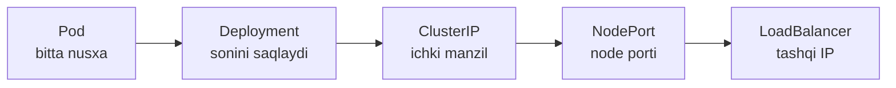
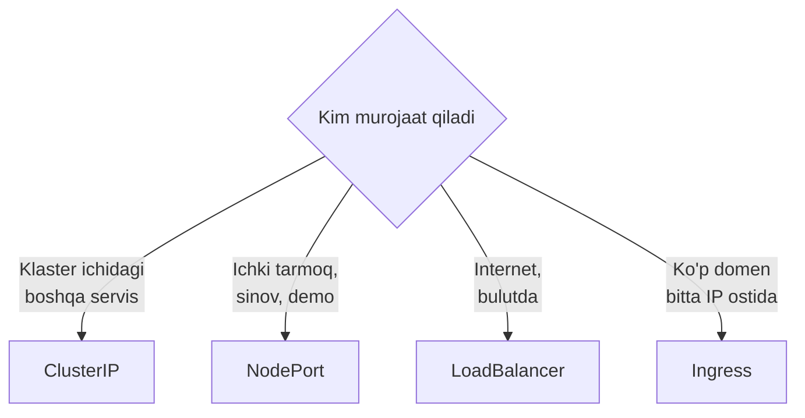

# Birinchi bosqich yakuni — nimalarni o'rgandik

> 🎯 **Bu darsda nimani o'rganamiz:**
> - Pod'dan Service'gacha bo'lgan yo'lni bir joyga yig'ish
> - Qaysi Service turini qachon tanlash
> - Yaratilgan barcha obyektlarni to'g'ri tartibda o'chirish

## Yo'l xaritasi — nimalarni qildik



| Bosqich | Nimani hal qildi |
|---|---|
| **Pod** | Konteynerni klasterda ishga tushirdi |
| **Deployment** | Pod'ni himoyaladi: o'chsa tiklaydi, ko'paytiradi, yangilaydi |
| **ClusterIP** | Pod'lar oldiga barqaror ichki manzil qo'ydi |
| **NodePort** | Klaster tashqarisidan kirish imkonini berdi |
| **LoadBalancer** | Bulutdan haqiqiy tashqi IP oldi |

Har bir keyingi qadam oldingisining **muammosini** hal qiladi. Shu sababli
tartib aynan shunday.

## Qaysi turni tanlash



Amaliy qoida: **ClusterIP dan boshlang.** Tashqariga chiqarish kerak
bo'lgandagina turini o'zgartiring.

## Obyektlarni o'chirish

O'chirish tartibi muhim: avval Service, keyin Deployment.

```bash
kubectl delete service nginx-deploy
kubectl delete deployment nginx-deploy
```

```text
service "nginx-deploy" deleted
deployment.apps "nginx-deploy" deleted
```

Manifestlar orqali:

```bash
bash amaliyot/servis_yaratish/tozalash.sh
```

Yoki bitta buyruqda:

```bash
kubectl delete -f amaliyot/servis_yaratish/
```

Tekshirish:

```bash
kubectl get all
```

```text
NAME                 TYPE        CLUSTER-IP   EXTERNAL-IP   PORT(S)   AGE
service/kubernetes   ClusterIP   10.96.0.1    <none>        443/TCP   3h
```

Faqat `kubernetes` servisi qolishi kerak — u apiserver'ning o'zi va
o'chirilmaydi.

⚠️ Deployment o'chirilganda uning ReplicaSet'lari va Pod'lari ham o'chadi
(cascade delete). Service esa alohida obyekt — u Deployment bilan birga
o'chmaydi, uni qo'lda o'chirish kerak.

## 🧪 Mustaqil topshiriqlar

> Taxminiy vaqt: 10 daqiqa.

**1-topshiriq · oson.** Deployment va ClusterIP Service yarating, keyin
faqat **Deployment**ni o'chiring. Service qoladimi?

<details><summary>O'zingizni tekshiring</summary>

```bash
kubectl get svc
# Service qoladi, lekin Endpoints bo'sh bo'ladi
kubectl get endpoints
```
</details>

**2-topshiriq · o'rta.** `kubectl get all` bilan klasterdagi barcha
obyektlarni ko'ring va har birining nima ekanini ayting.

<details><summary>O'zingizni tekshiring</summary>

```bash
kubectl get all
# pod/, service/, deployment.apps/, replicaset.apps/ prefikslariga qarang
```
</details>

**3-topshiriq · qiyin.** `kubectl delete deployment web --cascade=orphan`
ni bajaring. **Avval ayting:** Pod'lar nima bo'ladi?

<details><summary>O'zingizni tekshiring</summary>

```bash
kubectl get pods
# Podlar QOLADI, lekin endi ularning egasi yo'q —
# o'chirilsa hech kim tiklamaydi
```
</details>

📁 To'liq yechimlar: [`amaliyot/servis_yaratish/YECHIM.md`](amaliyot/servis_yaratish/YECHIM.md)

## ❓ Savol-Javob

**Savol:** `kubectl get all` haqiqatan hammani ko'rsatadimi?
**Javob:** Yo'q, nomiga qaramay. U faqat asosiy turlarni ko'rsatadi:
Pod, Service, Deployment, ReplicaSet, StatefulSet, DaemonSet, Job, CronJob.
ConfigMap, Secret, Ingress, PVC — ko'rinmaydi.

**Savol:** Service'ni o'chirmasdan turini o'zgartira olamanmi?
**Javob:** Ha: `kubectl patch svc <nom> -p '{"spec":{"type":"NodePort"}}'`
yoki `kubectl edit svc <nom>`. Faqat ClusterIP'ga qaytishda NodePort
maydonini olib tashlash kerak bo'ladi.

**Savol:** Bir namespace'dagi hamma narsani birdan o'chirish mumkinmi?
**Javob:** `kubectl delete all --all -n <namespace>` — lekin bu ConfigMap
va Secret'larni qoldiradi. Butunlay tozalash uchun namespace'ning o'zini
o'chiring.

## 📌 CKA imtihon uchun maslahat

Tozalash buyruqlari:

```bash
kubectl delete deploy,svc -l app=web         # label bo'yicha
kubectl delete -f manifest.yaml              # manifestdagi hammasi
kubectl delete all --all -n sinov            # namespace'dagi asosiy turlar
```

⚠️ `kubectl delete all --all` ni `default` namespace'da ehtiyot bo'lib
ishlating — imtihonda boshqa masalalarning obyektlarini ham o'chirib
yuborishingiz mumkin.

## 📖 Asosiy atamalar

| Atama | Ma'nosi |
|---|---|
| **Cascade delete** | Egasi o'chirilganda unga bog'liq obyektlar ham o'chishi |
| **`--cascade=orphan`** | Bog'liq obyektlarni egasiz qoldirib o'chirish |
| **`kubectl get all`** | Asosiy resurs turlarini bir buyruqda ko'rsatish |
| **`kubernetes` servisi** | Har klasterda bo'ladigan apiserver servisi |

## 🔗 Manbalar

- [Service — kubernetes.io](https://kubernetes.io/docs/concepts/services-networking/service/)
- [Garbage Collection](https://kubernetes.io/docs/concepts/architecture/garbage-collection/)
- [Ingress — keyingi qadam](https://kubernetes.io/docs/concepts/services-networking/ingress/)

---
⬅️ [Oldingi dars](lesson31.md) · [Bo'lim indeksi](README.md) · ➡️ Keyingi bo'lim: [Custom_obrazlar_yaratish](../Custom_obrazlar_yaratish/)
