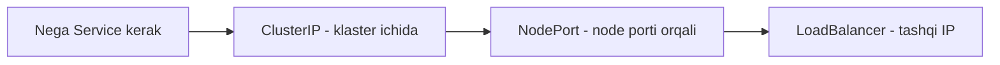

# 🌐 Servislar

Pod'lar o'ladi va qayta tug'iladi — IP manzillari har safar o'zgaradi. Service ularning oldiga barqaror manzil qo'yadi. Uch turi: ClusterIP, NodePort, LoadBalancer.

## 📚 Darslar tartibi

| # | Fayl | Mavzu |
|---|---|---|
| 1 | [servis_yaratish.md](servis_yaratish.md) | Service nima uchun kerak va `kubectl expose` |
| 2 | [service_ClusterIP.md](service_ClusterIP.md) | ClusterIP — klaster ichidagi barqaror manzil |
| 3 | [lesson30.md](lesson30.md) | NodePort turidagi servis yaratish |
| 4 | [lesson31.md](lesson31.md) | LoadBalancer turidagi servis va `minikube tunnel` |
| 5 | [Lesson32.md](Lesson32.md) | Birinchi deployment bo'yicha xulosa |

## 💡 Qanday o'qish kerak

1. Darslarni jadvaldagi tartibda o'qing — har biri oldingisiga tayanadi.
2. Buyruqlarni o'z klasteringizda qaytaring. O'qish emas, qilish esda qoladi.
3. `amaliyot/` papkasidagi tayyor fayllardan foydalaning — qo'lda ko'chirish shart emas.
4. Har dars oxiridagi `🧪 Mustaqil topshiriqlar` ni yechimni ochishdan oldin bajaring.

## 🔗 Manbalar

- [Kubernetes rasmiy hujjatlari](https://kubernetes.io/docs/home/)
- [kubectl Cheat Sheet](https://kubernetes.io/docs/reference/kubectl/quick-reference/)

➡️ **Keyingi bo'lim:** [Custom_obrazlar_yaratish](../Custom_obrazlar_yaratish/)

---
⬅️ [Kurs bosh sahifasi](../README.md) · 📖 [Uslub qo'llanmasi](../USLUB.md)
