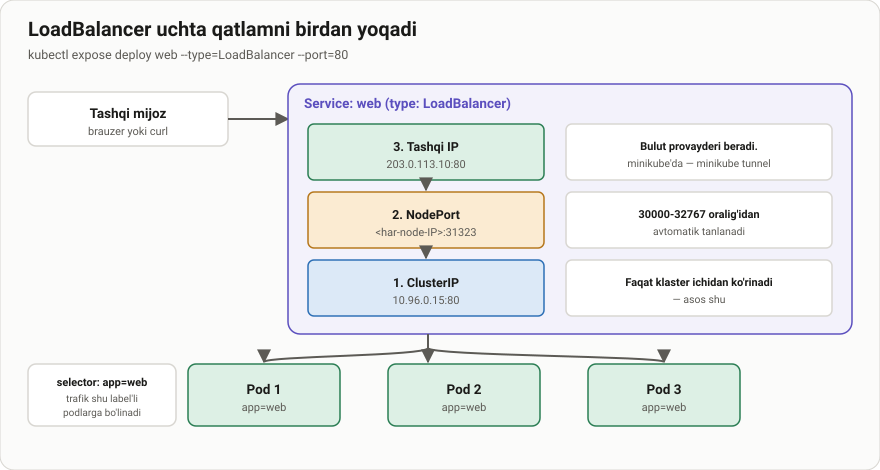
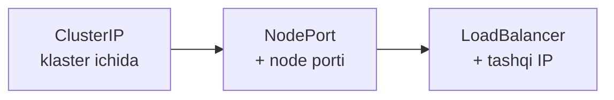

# LoadBalancer — haqiqiy tashqi IP

> 🎯 **Bu darsda nimani o'rganamiz:**
> - LoadBalancer Service yaratish va u nimani o'z ichiga olishi
> - `EXTERNAL-IP: <pending>` nima uchun chiqadi va nima qilish kerak
> - `kubectl expose` buyrug'i ichkarida qanday ishlaydi — 6 qadam
> - `minikube tunnel` va MetalLB
> - To'rt xil Service turining taqqoslanishi



## 💡 Hayotiy o'xshatish: qabulxona xodimi

NodePort — bino yon eshigi: kirishingiz mumkin, lekin qaysi eshik ochiqligini
va raqamini o'zingiz bilishingiz kerak.

LoadBalancer — **ko'chada turgan qabulxona xodimi**: mehmonlarni kutib
oladi, kim bo'shligini biladi va o'zi olib kiradi. Siz faqat bitta manzilni
bilasiz.

Farqi shundaki, bunday xodimni **bino egasi yollaydi** — Kubernetes uni o'zi
yarata olmaydi. Bulutda bu ishni provayder qiladi.

## LoadBalancer uchta qatlamni o'z ichiga oladi

Bu Service turlari **bir-birining ustiga qo'yiladi**:



LoadBalancer yaratganingizda **uchalasi ham** paydo bo'ladi: ClusterIP,
NodePort va tashqi IP. Shuning uchun `PORT(S)` ustunida `8080:31377/TCP`
ko'rinadi — NodePort ham o'sha yerda.

## Yaratish

```bash
kubectl delete service nginx-deploy
kubectl expose deployment nginx-deploy --type=LoadBalancer --port=8080 --target-port=80
```

```text
service/nginx-deploy exposed
```

```bash
kubectl get service
```

```text
NAME           TYPE           CLUSTER-IP      EXTERNAL-IP   PORT(S)          AGE
kubernetes     ClusterIP      10.96.0.1       <none>        443/TCP          132m
nginx-deploy   LoadBalancer   10.104.145.96   <pending>     8080:31377/TCP   2s
```

> 📁 **Tayyor fayl:** [`amaliyot/servis_yaratish/04-loadbalancer.yaml`](amaliyot/servis_yaratish/04-loadbalancer.yaml)

## ⚠️ `EXTERNAL-IP: <pending>` — nima uchun

Bu **eng ko'p beriladigan savol**. Sababi oddiy: Kubernetes'ning o'zi
balanslovchi qura olmaydi. U faqat bulut provayderidan **so'raydi**.

| Muhit | Natija |
|---|---|
| AWS, GCP, Azure, DigitalOcean | Provayder haqiqiy IP beradi |
| Bare-metal (o'z serveringiz) | `<pending>` — hech kim javob bermaydi |
| minikube | `<pending>`, `minikube tunnel` ochilmaguncha |

### Uchta yechim

**1. Node IP + NodePort orqali kirish** — hech narsa o'rnatmasdan:

LoadBalancer NodePort'ni ham yaratadi, u yuqoridagi chiqishda `31377`:

```bash
curl http://192.168.16.197:31377
```

**2. minikube tunnel** — lokal ishlab chiqish uchun:

```bash
minikube tunnel
```


⚠️ Bu buyruq **alohida terminalda ochiq turishi kerak**. Yopsangiz,
`EXTERNAL-IP` yana `<pending>` ga qaytadi.

Tunnel ishga tushgach `EXTERNAL-IP` to'ladi:


**3. MetalLB o'rnatish** — bare-metal ishlab chiqarish uchun:

MetalLB — bare-metal klaster uchun LoadBalancer amalga oshiruvchisi. U siz
bergan IP pool'dan manzil ajratadi va uni ARP yoki BGP orqali tarmoqqa
e'lon qiladi.

## `kubectl expose` ichkarida nima qiladi — 6 qadam

**1-qadam — kubectl mijoz dasturi.** U sizning kompyuteringizda ishlaydi.
`~/.kube/config` faylini o'qib apiserver manzilini topadi va u yerga HTTPS
REST so'rov yuboradi.

**2-qadam — apiserver so'rovni qabul qiladi.** 6443-portda tinglaydi,
autentifikatsiya va avtorizatsiyadan o'tkazadi, Service obyektini tekshiradi.

**3-qadam — etcd'ga yoziladi.** Yangi Service obyekti bazaga saqlanadi.
Aynan shu daqiqada Service "yaratilgan" hisoblanadi.

**4-qadam — controller-manager LoadBalancer mantiqini bajaradi.**
`service controller` `type: LoadBalancer` ni ko'radi va bulut provayderidan
(yoki MetalLB'dan) tashqi IP so'raydi. Shu bilan birga NodePort ham
avtomatik ajratiladi.

**5-qadam — barcha node'lardagi kube-proxy yangilanadi.** apiserver
o'zgarish haqida har node'dagi kube-proxy'ga xabar beradi. Har biri
iptables (yoki IPVS) qoidalarini yangilaydi — endi NodePort'ga kelgan
trafik nginx Pod'lariga yo'naltiriladi.

**6-qadam — Pod'lar trafik qabul qiladi.** kube-proxy so'rovlarni Pod'lar
orasida navbat bilan (round-robin) taqsimlaydi.

## To'rt xil Service turi


| Tur | Kim ko'radi | Qachon ishlatiladi |
|---|---|---|
| **ClusterIP** | Faqat klaster ichi | Bir servis ikkinchisini chaqirganda. Standart tur |
| **NodePort** | Node IP + 30000–32767 port | Sinov, demo, ichki tarmoq |
| **LoadBalancer** | Haqiqiy tashqi IP | Bulutda ishlab chiqarish |
| **ExternalName** | — | Klaster tashqarisidagi xizmatga DNS taxallusi |

**ExternalName** boshqalardan farq qiladi: u proxy qilmaydi, IP ham bermaydi.
U shunchaki DNS CNAME yozuvi yaratadi:

```yaml
apiVersion: v1
kind: Service
metadata:
  name: tashqi-baza
spec:
  type: ExternalName
  externalName: db.example.com
```

Endi klaster ichidan `tashqi-baza` deb murojaat qilsangiz, DNS sizni
`db.example.com` ga yuboradi.

## 🧪 Mustaqil topshiriqlar

> Taxminiy vaqt: 20 daqiqa.

**1-topshiriq · oson.** LoadBalancer Service yarating va `EXTERNAL-IP`
ustunini kuzating. Nima ko'rinadi?

<details><summary>O'zingizni tekshiring</summary>

```bash
kubectl get svc web-lb
# minikube'da tunnel ochilmaguncha <pending>
```
</details>

**2-topshiriq · o'rta.** `minikube tunnel` ni alohida terminalda ishga
tushiring va `EXTERNAL-IP` to'lganini ko'ring, keyin unga so'rov yuboring.

<details><summary>O'zingizni tekshiring</summary>

```bash
kubectl get svc web-lb -o jsonpath='{.status.loadBalancer.ingress[0].ip}{"\n"}'
curl -s http://<shu-IP> | grep -o '<title>.*</title>'
```
</details>

**3-topshiriq · qiyin.** `minikube tunnel` ni to'xtatmasdan turib,
LoadBalancer Service'ining **NodePort** i orqali ham kirib ko'ring.
**Avval ayting:** NodePort mavjudmi? Nima uchun?

<details><summary>O'zingizni tekshiring</summary>

```bash
kubectl get svc web-lb -o jsonpath='{.spec.ports[0].nodePort}{"\n"}'
# NodePort BOR — LoadBalancer uni o'z ichiga oladi
```
</details>

📁 To'liq yechimlar: [`amaliyot/servis_yaratish/YECHIM.md`](amaliyot/servis_yaratish/YECHIM.md)

## ❓ Savol-Javob

**Savol:** LoadBalancer Service qaysi node'larda yaratiladi?
**Javob:** Service — klaster darajasidagi obyekt, u "node'da yaratilmaydi".
Lekin uning NodePort qismi **har bir node'da** ochiladi, tashqi balanslovchi
esa barcha node'larga trafik taqsimlaydi.

**Savol:** Har Service uchun alohida LoadBalancer kerakmi?
**Javob:** Ha — va bulutda har biri alohida pul turadi. Ko'p sayt uchun
bitta **Ingress** ishlatish ancha arzon: bitta LoadBalancer ostida
o'nlab domen bo'lishi mumkin.

**Savol:** `minikube tunnel` sudo so'rayapti. Nima uchun?
**Javob:** U mahalliy marshrutlash jadvaliga yozuv qo'shadi va past
raqamli portlarni ochadi — bunga administrator huquqi kerak.

**Savol:** Bare-metal'da MetalLB'dan boshqa yo'l bormi?
**Javob:** Ha: NodePort + tashqi HAProxy/nginx, yoki `hostNetwork` bilan
Ingress controller, yoki kube-vip.

## 📌 CKA imtihon uchun maslahat

```bash
kubectl expose deploy web --type=LoadBalancer --port=80
```

Imtihon muhitida bulut provayderi **yo'q**, shuning uchun `EXTERNAL-IP`
doim `<pending>` bo'ladi — bu **xato emas**. Vazifa Service to'g'ri
yaratilganini talab qiladi, tashqi IP kelishini emas.

Tekshirish uchun NodePort'dan foydalaning:

```bash
kubectl get svc web -o jsonpath='{.spec.ports[0].nodePort}{"\n"}'
curl http://localhost:<nodePort>
```

## 📖 Asosiy atamalar

| Atama | Ma'nosi |
|---|---|
| **LoadBalancer** | Bulut provayderidan tashqi IP so'raydigan Service turi |
| **`<pending>`** | Tashqi IP hali berilmagan; bare-metal'da doimiy holat |
| **MetalLB** | Bare-metal klaster uchun LoadBalancer amalga oshiruvchisi |
| **`minikube tunnel`** | minikube'da LoadBalancer'ga tashqi IP taqlid qiluvchi buyruq |
| **ExternalName** | Tashqi domenga DNS taxallusi yaratuvchi Service turi |
| **Round-robin** | So'rovlarni navbat bilan taqsimlash usuli |

## 🔗 Manbalar

- [Service Type LoadBalancer](https://kubernetes.io/docs/concepts/services-networking/service/#loadbalancer)
- [MetalLB](https://metallb.universe.tf/)
- [minikube tunnel](https://minikube.sigs.k8s.io/docs/handbook/accessing/#loadbalancer-access)
- [ExternalName Services](https://kubernetes.io/docs/concepts/services-networking/service/#externalname)

---
⬅️ [Oldingi dars](lesson30.md) · [Bo'lim indeksi](README.md) · ➡️ [Lesson32.md](Lesson32.md)
