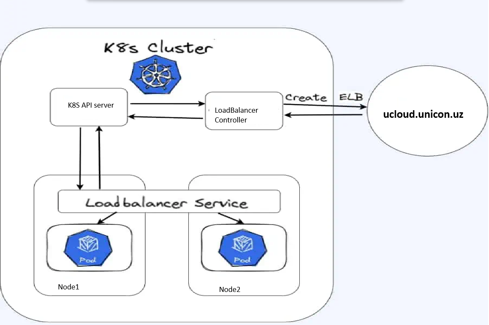
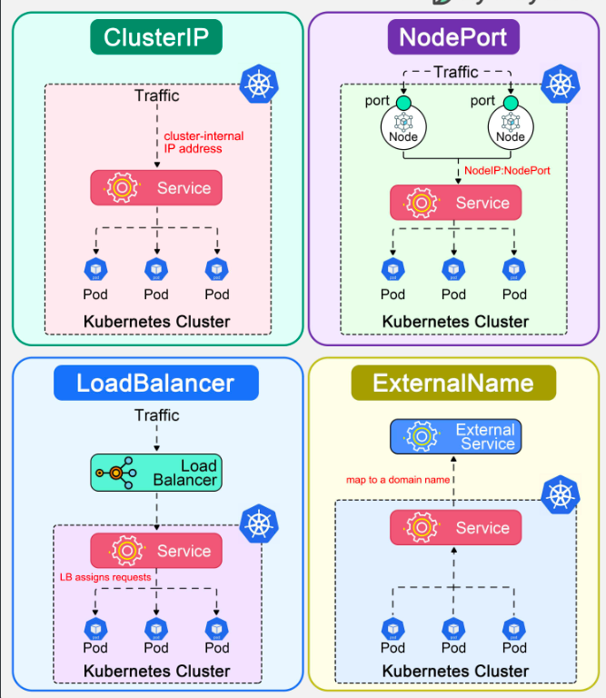
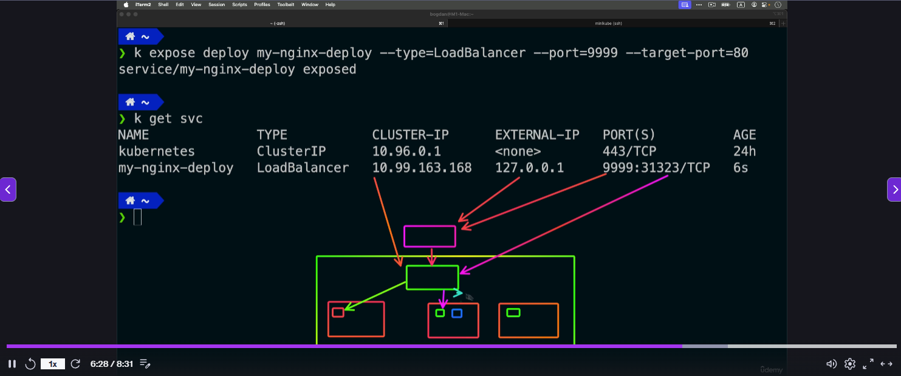
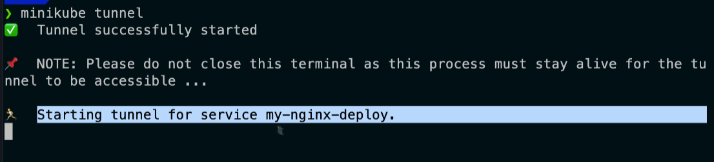

## LoadBalancer turidagi servis yaratish
NodePort turidagi servis yaratganimizdan so'ng, endi LoadBalancer turidagi servis yaratamiz. LoadBalancer turidagi servis, klaster ichidagi podlarga tashqi dunyo orqali kirish imkonini beradi va yuk balanslashni amalga oshiradi.
"Savol:" LoadBalancer turidagi servis qaysi nodelarda yaratiladi?
"Javob:" LoadBalancer turidagi servis, klaster ichidagi barcha nodelarda yaratiladi.



## servislarning 4 turdagi ko'rinishi
Kubernetesda servislarning 4 turi mavjud: ClusterIP, NodePort, LoadBalancer va ExternalName. Har bir servis turi o'ziga xos xususiyatlarga ega va turli vazifalar uchun ishlatiladi.
- ClusterIP: Bu servis turi, klaster ichidagi podlarga kirish imkonini beradi, lekin tashqi dunyo bilan aloqa qilish imkonini bermaydi. Bu servis turi, klaster ichidagi xizmatlarni bir-biri bilan aloqa qilish uchun ishlatiladi.
- NodePort: Bu servis turi, klaster ichidagi podlarga tashqi dunyo orqali   kirish imkonini beradi. NodePort turidagi servis, klaster ichidagi barcha nodelarda yaratiladi va tashqi dunyo orqali kirish uchun port raqamini belgilaydi.
- LoadBalancer: Bu servis turi, klaster ichidagi podlarga tashqi dunyo orqali   kirish imkonini beradi va yuk balanslashni amalga oshiradi. LoadBalancer turidagi servis, klaster ichidagi barcha nodelarda yaratiladi va tashqi dunyo orqali kirish uchun port raqamini belgilaydi.
- ExternalName: Bu servis turi, klaster ichidagi podlarga tashqi dunyo orqali   kirish imkonini beradi, lekin bu servis turi, klaster ichidagi podlarga tashqi dunyo orqali kirish uchun DNS nomini belgilaydi. Bu servis turi, klaster ichidagi podlarga tashqi dunyo orqali kirish uchun DNS nomini belgilaydi va bu DNS nomi, klaster ichidagi podlarga tashqi dunyo orqali kirish uchun ishlatiladi.
Bu yerda har bir servis turining ko'rinishini ko'rishingiz mumkin:



LoadBalancer turdagi servisni yaratishdan oldin, NodePort turidagi servisni o'chirib tashlaymiz va yangi servis yaratamiz. Buning uchun quyidagi buyruqni ishlatamiz:
```
root@test-server-k8s-1:~# kubectl delete service nginx-deploy -n default
service "nginx-deploy" deleted from default namespace
```
tekshirish uchun quyidagi buyruqni ishlatamiz:
```
root@test-server-k8s-1:~# kubectl get service
NAME         TYPE        CLUSTER-IP   EXTERNAL-IP   PORT(S)   AGE
kubernetes   ClusterIP   10.96.0.1    <none>        443/TCP   131m
```
Endi bo'lsa LoadBalancer turidagi servis yaratamiz. LoadBalancer turidagi servis yaratish uchun quyidagi buyruqni ishlatamiz:
```
kubectl expose deployment nginx-deploy --type=LoadBalancer --port=8080 --target-port=80 -n default
misol uchun: 
root@test-server-k8s-1:~# kubectl expose deployment nginx-deploy --type=LoadBalancer --port=8080 --target-port=80 -n default
service/nginx-deploy exposed
tekshirib olamiz:
root@test-server-k8s-1:~# kubectl get service
NAME           TYPE           CLUSTER-IP      EXTERNAL-IP   PORT(S)          AGE
kubernetes     ClusterIP      10.96.0.1       <none>        443/TCP          132m
nginx-deploy   LoadBalancer   10.104.145.96   <pending>     8080:31377/TCP   2s
```
Bu yerda `nginx-deploy` servisi LoadBalancer turida yaratilganligini va tashqi dunyo orqali 8080 porti orqali kirish mumkinligini ko'rishingiz mumkin. Masalan, nginx serverini tashqi dunyo bilan aloqa qilish uchun ishlatamiz.
`nginx-deploy` xaqida to'liqroq ma'lumotlarni ko'rish uchun quyidagi buyruqni ishlatishingiz mumkin:
```
root@test-server-k8s-1:~# kubectl get service
NAME           TYPE           CLUSTER-IP      EXTERNAL-IP   PORT(S)          AGE
kubernetes     ClusterIP      10.96.0.1       <none>        443/TCP          3h2m
nginx-deploy   LoadBalancer   10.104.145.96   <pending>     8080:31377/TCP   49m

```
bu yesda siz <nginx-deploy> ning EXTERNAL-IP si <pending> ekanlogini ko'rishingiz mumkin. Buning sababi, odatiy Kubernetes bare-metal LoadBalancer'ni qo'llab-quvvatlamaydi. EXTERNAL-IP IP o'rniga tashqi IP manzili turishi kerak edi. Buning sababi, odatiy Kubernetes bare-metal LoadBalancer'ni qo'llab-quvvatlamaydi. Ikki yechim bor:
- MetalLB o'rnating — u IP pool'dan tashqi IP ajratib beradi va ARP/BGP orqali e'lon qiladi
- Yoki <HAR-QANDAY-NODE-IP>:<NODE-PORT> orqali kiring — NodePort har holda yaratiladi (kubectl get svc nginx-deploy da NodePort qiymatini ko'rishingiz mumkin, masalan 31377)
Agar bizda EXTERNAL-IP bo'ganida brouzer orqali 45.71.15.25:8080 manziliga kirganimizda nginx serverining xush kelibsiz sahifasini ko'rishimiz mumkin bo'lardi. 




Endi qadamma-qadam tushuntirib beraman:
1-qadam — kubectl komandasining o'zi: kubectl bu shunchaki client dasturi. U sizning kompyuteringizda (yoki master nodaga SSH orqali kirgan bo'lsangiz, master nodada) ishga tushadi. Komanda ~/.kube/config faylini o'qib, master node manzilini topadi va o'sha yerga HTTPS REST so'rov yuboradi.

2-qadam — Master node so'rovni qabul qiladi: kube-apiserver (master nodada port 6443'da ishlaydi) so'rovni qabul qiladi, autentifikatsiya/avtorizatsiyadan o'tkazadi va Service obyektini yaratadi.

3-qadam — Service etcdga saqlanadi: Yangi Service obyekti master nodadagi etcd ma'lumotlar bazasiga yoziladi. Aynan shu daqiqada Service "yaratilgan" hisoblanadi.

4-qadam — Controller manager LoadBalancer logikasini bajaradi: kube-controller-managerdagi service controller type: LoadBalancer ni ko'radi va cloud provider (yoki MetalLB) dan tashqi IP so'raydi. Shuningdek NodePort ham avtomatik ajratiladi.

5-qadam — Hamma nodelarda kube-proxy yangilanadi: apiserver Service haqida xabarni hamma nodelardagi (1 ta master + 3 ta worker) kube-proxy'larga jo'natadi. Har bir kube-proxy iptables/ipvs qoidalarini yangilaydi — endi har qanday node IP'ga <NodePort>'ga kelgan trafik nginx pod'larga yo'naltiriladi.

6-qadam — nginx pod'lar trafik qabul qiladi: Pod'lar worker nodelarda (Deployment scheduler joylashtirgan joyda) ishlaydi. kube-proxy trafikni shu pod'larga round-robin tarzida yuboradi.

Muhim eslatma sizning klasteringiz uchun: Siz bare-metal serverda (cloud provider yo'q) klaster ishlatayotgan bo'lsangiz, kubectl get svc qilganda EXTERNAL-IP ustuni <pending> bo'lib turadi. Buning sababi — odatiy Kubernetes bare-metal LoadBalancer'ni qo'llab-quvvatlamaydi. Ikki yechim bor:

MetalLB o'rnating — u IP pool'dan tashqi IP ajratib beradi va ARP/BGP orqali e'lon qiladi
Yoki <HAR-QANDAY-NODE-IP>:<NODE-PORT> orqali kiring — NodePort har holda yaratiladi (kubectl get svc nginx-deploy da NodePort qiymatini ko'rishingiz mumkin, masalan 30080)

### Dicker Desktop Mac/Windows foydalanuvchilari uchun tunel qilish tavfsiya etiladi.

```
minikube tunnel  ### ushbu komanda ishga tushiriladi local kompyuterdan tekshirish uchun
```

