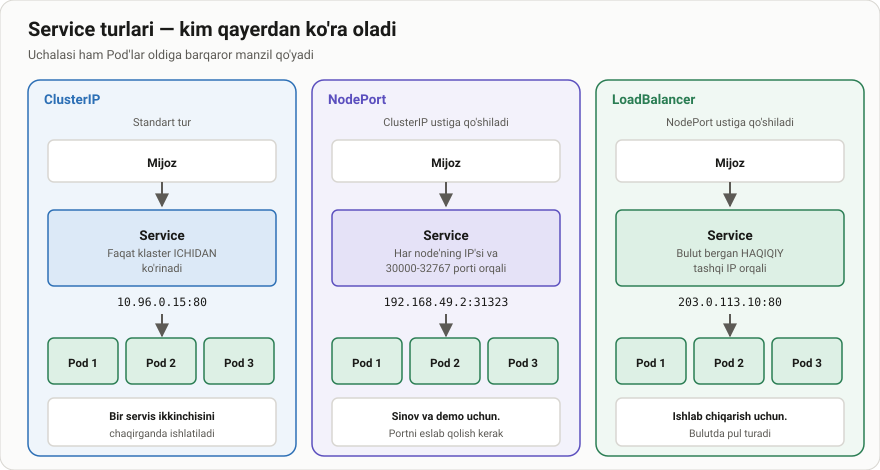
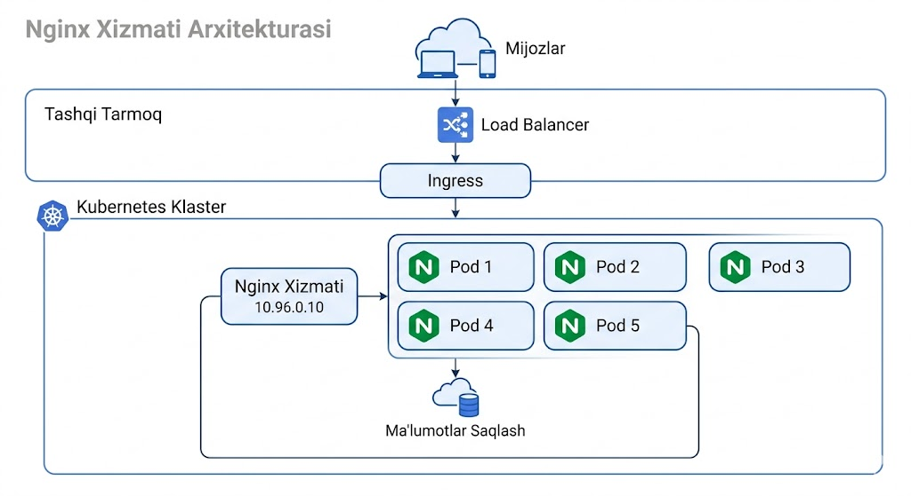
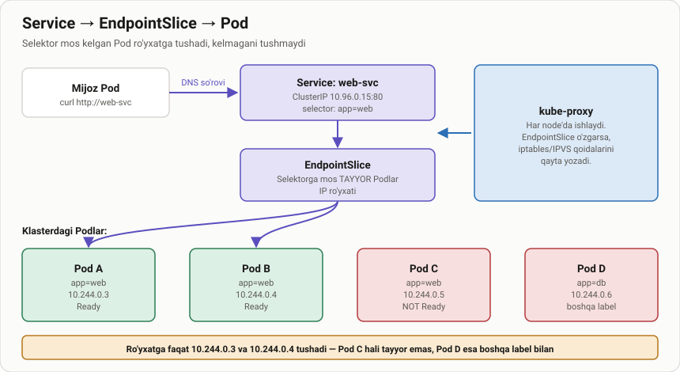
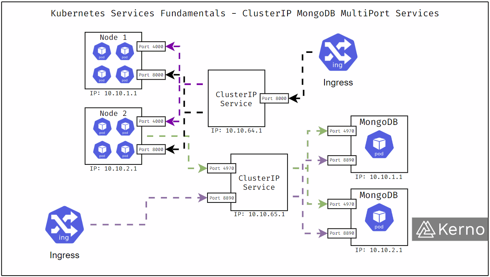

# Service nima uchun kerak

> 🎯 **Bu darsda nimani o'rganamiz:**
> - Nima uchun Pod IP'siga tayanib bo'lmaydi
> - Service Pod'larni qanday topadi — label selektori
> - `kubectl expose` bilan tez Service yaratish
> - `describe service` chiqishidagi `Endpoints` — eng muhim maydon



## 💡 Hayotiy o'xshatish: taksi buyurtma raqami

Taksi chaqirganingizda haydovchining shaxsiy telefonini bilmaysiz — **yagona
buyurtma raqamiga** qo'ng'iroq qilasiz. Ular sizga bo'sh haydovchini
biriktiradi. Haydovchi almashsa, ishdan ketsa yoki yangisi kelsa — sizning
raqamingiz o'zgarmaydi.

Pod — haydovchi (kelib-ketadi, raqami o'zgaradi). Service — buyurtma raqami
(hech qachon o'zgarmaydi).

## Muammo: Pod IP'lari o'zgaraveradi

Pod har qayta yaratilganda **yangi IP** oladi. Deployment 3 Pod'ni ushlab
tursa ham, ularning IP'lari doim boshqa bo'ladi.

Agar ilovangizda `http://172.16.78.129` deb yozib qo'ysangiz, birinchi
qayta ishga tushishda hammasi buziladi.

**Service** bu muammoni hal qiladi: u Pod'lar oldiga **hech qachon
o'zgarmaydigan** IP va DNS nom qo'yadi.




## Service Pod'larni qanday topadi

Service Pod'ni **nomi bilan emas, label selektori** bilan topadi:

```yaml
spec:
  selector:
    app: web        # shu label'li HAR QANDAY Pod ro'yxatga tushadi
```



Ro'yxatga tushish uchun Pod ikkita shartni bajarishi kerak:

1. Label'i selektorga **mos kelishi**;
2. **Tayyor (Ready)** bo'lishi — readiness probe o'tgan bo'lishi.

Shu ro'yxat **EndpointSlice** obyektida saqlanadi va Pod'lar o'zgarganda
avtomatik yangilanadi.

## Service yaratish — eng tez yo'l

```bash
kubectl expose deployment <deployment-nomi> --port=<port> --target-port=<port>
```

Misol:

```bash
kubectl expose deployment nginx-deploy --port=80 --target-port=80
```

`expose` selektorni Deployment'dan **o'zi ko'chirib oladi** — shuning uchun
u tez.

> 📁 **Tayyor fayllar:** [`amaliyot/servis_yaratish/`](amaliyot/servis_yaratish/)
>
> ```bash
> kubectl apply -f amaliyot/servis_yaratish/01-deployment.yaml
> kubectl apply -f amaliyot/servis_yaratish/02-clusterip.yaml
> ```

Manifest bilan:

```yaml
apiVersion: v1
kind: Service
metadata:
  name: web-clusterip
spec:
  type: ClusterIP
  selector:
    app: web
  ports:
    - port: 80          # Service'ning porti
      targetPort: 80    # Pod ichidagi konteyner porti
```

⚠️ **`port` va `targetPort` chalkashtirmang:**
- `port` — Service'ga **kelgan** so'rov qaysi portga tushadi;
- `targetPort` — Service so'rovni Pod'ning **qaysi portiga** uzatadi.

Ular boshqa-boshqa bo'lishi mumkin: `--port=8080 --target-port=80`.

## Service'larni ko'rish

```bash
kubectl get services
kubectl get svc -A
```

```text
NAME           TYPE        CLUSTER-IP     EXTERNAL-IP   PORT(S)   AGE
kubernetes     ClusterIP   10.96.0.1      <none>        443/TCP   17d
nginx-deploy   ClusterIP   10.105.45.44   <none>        80/TCP    2m51s
```

`kubernetes` servisi har klasterda bor — u apiserver'ning o'zi. Uni
o'chirmang.

## `describe service` — `Endpoints` eng muhimi

```bash
kubectl describe service nginx-deploy
```

```text
Name:                     nginx-deploy
Namespace:                default
Labels:                   app=nginx-deploy
Selector:                 app=nginx-deploy
Type:                     ClusterIP
IP:                       10.105.45.44
Port:                     <unset>  80/TCP
TargetPort:               80/TCP
Endpoints:                172.16.78.130:80,172.16.78.129:80,172.16.91.66:80 + 2 more...
Session Affinity:         None
Internal Traffic Policy:  Cluster
Events:                   <none>
```

| Maydon | Nimani bildiradi |
|---|---|
| `Selector` | Qaysi label bo'yicha Pod qidirilyapti |
| `IP` | Service'ning barqaror ClusterIP manzili |
| `Port` / `TargetPort` | Service porti va Pod porti |
| **`Endpoints`** | **Topilgan Pod IP'lari** |

🔴 **`Endpoints: <none>` — eng ko'p uchraydigan nosozlik.** Sabablari:

1. Selektor Pod label'lariga **mos kelmayapti** (eng ko'p uchraydigani);
2. Pod'lar **tayyor emas** (readiness probe o'tmagan);
3. Namespace boshqa — Service faqat o'z namespace'idagi Pod'ni ko'radi.

Tekshirish:

```bash
kubectl get endpoints nginx-deploy
kubectl get pods --show-labels          # label'lar mos keladimi?
kubectl describe service nginx-deploy | grep Selector
```



## 🧪 Mustaqil topshiriqlar

> Taxminiy vaqt: 20 daqiqa.

**1-topshiriq · oson.** `01-deployment.yaml` va `02-clusterip.yaml` ni
qo'llang, keyin Service'ning ClusterIP manzilini toping.

<details><summary>O'zingizni tekshiring</summary>

```bash
kubectl get svc web-clusterip -o jsonpath='{.spec.clusterIP}{"\n"}'
# 10.x.x.x ko'rinishidagi manzil chiqadi
```
</details>

**2-topshiriq · o'rta.** Vaqtinchalik Pod ochib, Service'ga **DNS nomi
orqali** (IP emas) so'rov yuboring.

<details><summary>O'zingizni tekshiring</summary>

```bash
kubectl run t --rm -it --image=curlimages/curl:8.10.1 --restart=Never \
  -- curl -s http://web-clusterip | grep -o '<title>.*</title>'
```
</details>

**3-topshiriq · qiyin.** Service'ning `selector` ini `app: yoq-bunday`
ga o'zgartiring. **Avval ayting:** `describe` chiqishida qaysi maydon
o'zgaradi? Keyin tekshiring va tuzating.

<details><summary>O'zingizni tekshiring</summary>

```bash
kubectl describe svc web-clusterip | grep -i endpoints
# Endpoints: <none> bo'lishi kerak edi
```
</details>

📁 To'liq yechimlar: [`amaliyot/servis_yaratish/YECHIM.md`](amaliyot/servis_yaratish/YECHIM.md)

## ❓ Savol-Javob

**Savol:** Service o'zi Pod'lar orasida yukni taqsimlaydimi?
**Javob:** Ha. kube-proxy iptables (yoki IPVS) qoidalari orqali so'rovlarni
Endpoint'lar orasida tasodifiy taqsimlaydi. Alohida balanslovchi kerak emas.

**Savol:** Service'ni DNS nomi bilan qanday chaqiraman?
**Javob:** Bir namespace ichida — shunchaki `http://web-clusterip`. Boshqa
namespace'dan — `http://web-clusterip.<namespace>.svc.cluster.local`.

**Savol:** `kubectl expose` va manifest — qaysi biri?
**Javob:** `expose` tez sinash uchun. Ishlab chiqarishda manifest — u git'da
saqlanadi va qayta qo'llanadi.

**Savol:** Selektorsiz Service bo'ladimi?
**Javob:** Ha. U holda Endpoint'larni qo'lda yozasiz — klaster tashqarisidagi
bazaga ulanishda shunday qilinadi.

## 📌 CKA imtihon uchun maslahat

`kubectl expose` — imtihonda eng tez usul:

```bash
kubectl expose deployment web --port=80 --target-port=80 --name=web-svc
kubectl expose deployment web --type=NodePort --port=80
```

Service ishlamayotgan bo'lsa **doim** birinchi shuni tekshiring:

```bash
kubectl get endpoints <servis-nomi>
```

Bo'sh bo'lsa — muammo selektorda yoki Pod tayyorligida, Service'ning
o'zida emas. Bu bitta bilim imtihonda ko'p vaqt tejaydi.

## 📖 Asosiy atamalar

| Atama | Ma'nosi |
|---|---|
| **Service** | Pod'lar oldiga barqaror IP va DNS nom qo'yuvchi obyekt |
| **Selector** | Service qaysi Pod'larni topishini belgilovchi label filtri |
| **Endpoints / EndpointSlice** | Selektorga mos va tayyor Pod IP'lari ro'yxati |
| **`port`** | Service'ning o'z porti |
| **`targetPort`** | So'rov uzatiladigan Pod porti |
| **ClusterIP** | Service'ning klaster ichidagi barqaror IP manzili |
| **kube-proxy** | Har node'da Service qoidalarini yozuvchi komponent |

## 🔗 Manbalar

- [Service — kubernetes.io](https://kubernetes.io/docs/concepts/services-networking/service/)
- [DNS for Services and Pods](https://kubernetes.io/docs/concepts/services-networking/dns-pod-service/)
- [Debug Services](https://kubernetes.io/docs/tasks/debug/debug-application/debug-service/)

---
⬅️ [Bo'lim indeksi](README.md) · ➡️ Keyingi dars: [service_ClusterIP.md](service_ClusterIP.md)
